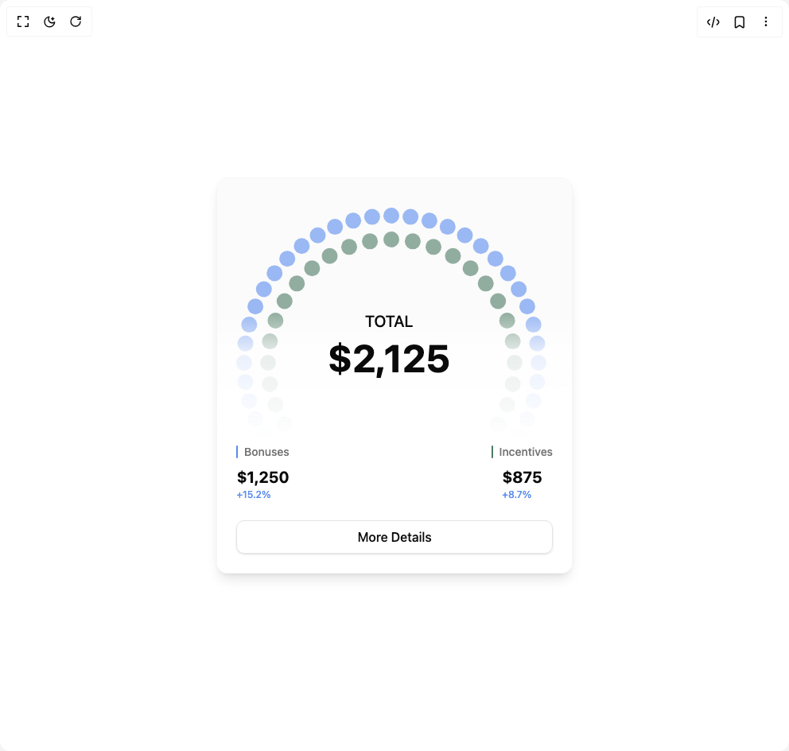

# Build Animated Dashboard Card in BuilderStudio

> Build this component in our Agentic IDE: [BuilderStudio](https://builderstudio.dev).
>
> Join the BuilderStudio community on [Discord](https://discord.gg/QdWeSGCqfe) and [Reddit](https://reddit.com/r/builderstudio).



## Component

- Author group: `isaiahbjork`
- Component: `animated-dashboard-card`
- Variant: `default`
- Rendered HTML snapshot: [`rendered.html`](rendered.html)

## BuilderStudio prompt

You are implementing a React component based on a component reference.

## Component identity

- Author: isaiahbjork
- Component slug: animated-dashboard-card
- Demo slug: default
- Title: animated-dashboard-card
- Description: 

## Goal

Recreate this component in a React + TypeScript + Tailwind CSS project. Preserve the visual layout, spacing, colors, border radius, shadows, interaction behavior, animation behavior, responsive behavior, and dark mode behavior shown in the rendered demo.

## Implementation requirements

- Use React and TypeScript.
- Use Tailwind CSS classes whenever possible.
- Keep the component self-contained unless the source files require helper components.
- If the source uses CSS variables, custom CSS, animations, or keyframes, include them.
- If the source uses external packages, list and use the required packages.
- Preserve accessibility attributes, button semantics, links, keyboard behavior, and ARIA attributes when visible in the source.
- Do not replace the component with a simplified placeholder.
- Return complete production-ready code.

## Dependencies

No reference metadata available.

## Rendered DOM snapshot

This is the rendered demo HTML extracted from the live preview. Use it to verify structure, class names, visible content, and layout.

```html
<div id="root"><div class="w-screen min-h-screen flex justify-center items-center"><div class="w-screen min-h-screen flex justify-center items-center"><div class="w-full max-w-md" style="opacity: 1; transform: none;"><div class="bg-muted/20 border-border/30 border rounded-xl overflow-hidden shadow-lg"><div class="relative pl-4 pr-8 pb-4 pt-8 overflow-hidden"><div class="absolute inset-0 bg-muted/20 backdrop-blur-[2px] rounded-lg"></div><div class="relative w-[28rem] h-[28rem] mx-auto"><svg class="w-full h-full" viewBox="0 0 448 448"><circle cx="388" cy="200" r="10" fill="currentColor" opacity="0.6" style="color: rgb(90, 140, 239); transform: none; transform-origin: 50% 50%; transform-box: fill-box;"></circle><circle cx="386.417" cy="224.147" r="10" fill="currentColor" opacity="0.6" style="color: rgb(90, 140, 239); transform: none; transform-origin: 50% 50%; transform-box: fill-box;"></circle><circle cx="381.696" cy="247.882" r="10" fill="currentColor" opacity="0.6" style="color: rgb(90, 140, 239); transform: none; transform-origin: 50% 50%; transform-box: fill-box;"></circle><circle cx="373.918" cy="270.796" r="10" fill="currentColor" opacity="0.6" style="color: rgb(90, 140, 239); transform: none; transform-origin: 50% 50%; transform-box: fill-box;"></circle><circle cx="363.215" cy="292.5" r="10" fill="currentColor" opacity="0.6" style="color: rgb(90, 140, 239); transform: none; transform-origin: 50% 50%; transform-box: fill-box;"></circle><circle cx="349.77" cy="312.621" r="10" fill="currentColor" opacity="0.6" style="color: rgb(90, 140, 239); transform: none; transform-origin: 50% 50%; transform-box: fill-box;"></circle><circle cx="333.815" cy="330.815" r="10" fill="currentColor" opacity="0.6" style="color: rgb(90, 140, 239); transform: none; transform-origin: 50% 50%; transform-box: fill-box;"></circle><circle cx="315.621" cy="346.77" r="10" fill="currentColor" opacity="0.6" style="color: rgb(90, 140, 239); transform: none; transform-origin: 50% 50%; transform-box: fill-box;"></circle><circle cx="295.5" cy="360.215" r="10" fill="currentColor" opacity="0.6" style="color: rgb(90, 140, 239); transform: none; transform-origin: 50% 50%; transform-box: fill-box;"></circle><circle cx="273.796" cy="370.918" r="10" fill="currentColor" opacity="0.6" style="color: rgb(90, 140, 239); transform: none; transform-origin: 50% 50%; transform-box: fill-box;"></circle><circle cx="250.882" cy="378.696" r="10" fill="currentColor" opacity="0.6" style="color: rgb(90, 140, 239); transform: none; transform-origin: 50% 50%; transform-box: fill-box;"></circle><circle cx="227.147" cy="383.417" r="10" fill="currentColor" opacity="0.6" style="color: rgb(90, 140, 239); transform: none; transform-origin: 50% 50%; transform-box: fill-box;"></circle><circle cx="203" cy="385" r="10" fill="currentColor" opacity="0.6" style="color: rgb(90, 140, 239); transform: none; transform-origin: 50% 50%; transform-box: fill-box;"></circle><circle cx="178.853" cy="383.417" r="10" fill="currentColor" opacity="0.6" style="color: rgb(90, 140, 239); transform: none; transform-origin: 50% 50%; transform-box: fill-box;"></circle><circle cx="155.118" cy="378.696" r="10" fill="currentColor" opacity="0.6" style="color: rgb(90, 140, 239); transform: none; transform-origin: 50% 50%; transform-box: fill-box;"></circle><circle cx="132.204" cy="370.918" r="10" fill="currentColor" opacity="0.6" style="color: rgb(90, 140, 239); transform: none; transform-origin: 50% 50%; transform-box: fill-box;"></circle><circle cx="110.5" cy="360.215" r="10" fill="currentColor" opacity="0.6" style="color: rgb(90, 140, 239); transform: none; transform-origin: 50% 50%; transform-box: fill-box;"></circle><circle cx="90.379" cy="346.77" r="10" fill="currentColor" opacity="0.6" style="color: rgb(90, 140, 239); transform: none; transform-origin: 50% 50%; transform-box: fill-box;"></circle><circle cx="72.185" cy="330.815" r="10" fill="currentColor" opacity="0.6" style="color: rgb(90, 140, 239); transform: none; transform-origin: 50% 50%; transform-box: fill-box;"></circle><circle cx="56.23" cy="312.621" r="10" fill="currentColor" opacity="0.6" style="color: rgb(90, 140, 239); transform: none; transform-origin: 50% 50%; transform-box: fill-box;"></circle><circle cx="42.785" cy="292.5" r="10" fill="currentColor" opacity="0.6" style="color: rgb(90, 140, 239); transform: none; transform-origin: 50% 50%; transform-box: fill-box;"></circle><circle cx="32.082" cy="270.796" r="10" fill="currentColor" opacity="0.6" style="color: rgb(90, 140, 239); transform: none; transform-origin: 50% 50%; transform-box: fill-box;"></circle><circle cx="24.304" cy="247.882" r="10" fill="currentColor" opacity="0.6" style="color: rgb(90, 140, 239); transform: none; transform-origin: 50% 50%; transform-box: fill-box;"></circle><circle cx="19.583" cy="224.147" r="10" fill="currentColor" opacity="0.6" style="color: rgb(90, 140, 239); transform: none; transform-origin: 50% 50%; transform-box: fill-box;"></circle><circle cx="18" cy="200" r="10" fill="currentColor" opacity="0.6" style="color: rgb(90, 140, 239); transform: none; transform-origin: 50% 50%; transform-box: fill-box;"></circle><circle cx="19.583" cy="175.853" r="10" fill="currentColor" opacity="0.6" style="color: rgb(90, 140, 239); transform: none; transform-origin: 50% 50%; transform-box: fill-box;"></circle><circle cx="24.304" cy="152.118" r="10" fill="currentColor" opacity="0.6" style="color: rgb(90, 140, 239); transform: none; transform-origin: 50% 50%; transform-box: fill-box;"></circle><circle cx="32.082" cy="129.204" r="10" fill="currentColor" opacity="0.6" style="color: rgb(90, 140, 239); transform: none; transform-origin: 50% 50%; transform-box: fill-box;"></circle><circle cx="42.785" cy="107.5" r="10" fill="currentColor" opacity="0.6" style="color: rgb(90, 140, 239); transform: none; transform-origin: 50% 50%; transform-box: fill-box;"></circle><circle cx="56.23" cy="87.379" r="10" fill="currentColor" opacity="0.6" style="color: rgb(90, 140, 239); transform: none; transform-origin: 50% 50%; transform-box: fill-box;"></circle><circle cx="72.185" cy="69.185" r="10" fill="currentColor" opacity="0.6" style="color: rgb(90, 140, 239); transform: none; transform-origin: 50% 50%; transform-box: fill-box;"></circle><circle cx="90.379" cy="53.23" r="10" fill="currentColor" opacity="0.6" style="color: rgb(90, 140, 239); transform: none; transform-origin: 50% 50%; transform-box: fill-box;"></circle><circle cx="110.5" cy="39.785" r="10" fill="currentColor" opacity="0.6" style="color: rgb(90, 140, 239); transform: none; transform-origin: 50% 50%; transform-box: fill-box;"></circle><circle cx="132.204" cy="29.082" r="10" fill="currentColor" opacity="0.6" style="color: rgb(90, 140, 239); transform: none; transform-origin: 50% 50%; transform-box: fill-box;"></circle><circle cx="155.118" cy="21.304" r="10" fill="currentColor" opacity="0.6" style="color: rgb(90, 140, 239); transform: none; transform-origin: 50% 50%; transform-box: fill-box;"></circle><circle cx="178.853" cy="16.583" r="10" fill="currentColor" opacity="0.6" style="color: rgb(90, 140, 239); transform: none; transform-origin: 50% 50%; transform-box: fill-box;"></circle><circle cx="203" cy="15" r="10" fill="currentColor" opacity="0.6" style="color: rgb(90, 140, 239); transform: none; transform-origin: 50% 50%; transform-box: fill-box;"></circle><circle cx="227.147" cy="16.583" r="10" fill="currentColor" opacity="0.6" style="color: rgb(90, 140, 239); transform: none; transform-origin: 50% 50%; transform-box: fill-box;"></circle><circle cx="250.882" cy="21.304" r="10" fill="currentColor" opacity="0.6" style="color: rgb(90, 140, 239); transform: none; transform-origin: 50% 50%; transform-box: fill-box;"></circle><circle cx="273.796" cy="29.082" r="10" fill="currentColor" opacity="0.6" style="color: rgb(90, 140, 239); transform: none; transform-origin: 50% 50%; transform-box: fill-box;"></circle><circle cx="295.5" cy="39.785" r="10" fill="currentColor" opacity="0.6" style="color: rgb(90, 140, 239); transform: none; transform-origin: 50% 50%; transform-box: fill-box;"></circle><circle cx="315.621" cy="53.23" r="10" fill="currentColor" opacity="0.6" style="color: rgb(90, 140, 239); transform: none; transform-origin: 50% 50%; transform-box: fill-box;"></circle><circle cx="333.815" cy="69.185" r="10" fill="currentColor" opacity="0.6" style="color: rgb(90, 140, 239); transform: none; transform-origin: 50% 50%; transform-box: fill-box;"></circle><circle cx="349.77" cy="87.379" r="10" fill="currentColor" opacity="0.6" style="color: rgb(90, 140, 239); transform: none; transform-origin: 50% 50%; transform-box: fill-box;"></circle><circle cx="363.215" cy="107.5" r="10" fill="currentColor" opacity="0.6" style="color: rgb(90, 140, 239); transform: none; transform-origin: 50% 50%; transform-box: fill-box;"></circle><circle cx="373.918" cy="129.204" r="10" fill="currentColor" opacity="0.6" style="color: rgb(90, 140, 239); transform: none; transform-origin: 50% 50%; transform-box: fill-box;"></circle><circle cx="381.696" cy="152.118" r="10" fill="currentColor" opacity="0.6" style="color: rgb(90, 140, 239); transform: none; transform-origin: 50% 50%; transform-box: fill-box;"></circle><circle cx="386.417" cy="175.853" r="10" fill="currentColor" opacity="0.6" style="color: rgb(90, 140, 239); transform: none; transform-origin: 50% 50%; transform-box: fill-box;"></circle><circle cx="358" cy="200" r="10" fill="currentColor" opacity="0.6" style="color: rgb(75, 122, 99); transform: none; transform-origin: 50% 50%; transform-box: fill-box;"></circle><circle cx="355.645" cy="226.915" r="10" fill="currentColor" opacity="0.6" style="color: rgb(75, 122, 99); transform: none; transform-origin: 50% 50%; transform-box: fill-box;"></circle><circle cx="348.652" cy="253.013" r="10" fill="currentColor" opacity="0.6" style="color: rgb(75, 122, 99); transform: none; transform-origin: 50% 50%; transform-box: fill-box;"></circle><circle cx="337.234" cy="277.5" r="10" fill="currentColor" opacity="0.6" style="color: rgb(75, 122, 99); transform: none; transform-origin: 50% 50%; transform-box: fill-box;"></circle><circle cx="321.737" cy="299.632" r="10" fill="currentColor" opacity="0.6" style="color: rgb(75, 122, 99); transform: none; transform-origin: 50% 50%; transform-box: fill-box;"></circle><circle cx="302.632" cy="318.737" r="10" fill="currentColor" opacity="0.6" style="color: rgb(75, 122, 99); transform: none; transform-origin: 50% 50%; transform-box: fill-box;"></circle><circle cx="280.5" cy="334.234" r="10" fill="currentColor" opacity="0.6" style="color: rgb(75, 122, 99); transform: none; transform-origin: 50% 50%; transform-box: fill-box;"></circle><circle cx="256.013" cy="345.652" r="10" fill="currentColor" opacity="0.6" style="color: rgb(75, 122, 99); transform: none; transform-origin: 50% 50%; transform-box: fill-box;"></circle><circle cx="229.915" cy="352.645" r="10" fill="currentColor" opacity="0.6" style="color: rgb(75, 122, 99); transform: none; transform-origin: 50% 50%; transform-box: fill-box;"></circle><circle cx="203" cy="355" r="10" fill="currentColor" opacity="0.6" style="color: rgb(75, 122, 99); transform: none; transform-origin: 50% 50%; transform-box: fill-box;"></circle><circle cx="176.085" cy="352.645" r="10" fill="currentColor" opacity="0.6" style="color: rgb(75, 122, 99); transform: none; transform-origin: 50% 50%; transform-box: fill-box;"></circle><circle cx="149.987" cy="345.652" r="10" fill="currentColor" opacity="0.6" style="color: rgb(75, 122, 99); transform: none; transform-origin: 50% 50%; transform-box: fill-box;"></circle><circle cx="125.5" cy="334.234" r="10" fill="currentColor" opacity="0.6" style="color: rgb(75, 122, 99); transform: none; transform-origin: 50% 50%; transform-box: fill-box;"></circle><circle cx="103.368" cy="318.737" r="10" fill="currentColor" opacity="0.6" style="color: rgb(75, 122, 99); transform: none; transform-origin: 50% 50%; transform-box: fill-box;"></circle><circle cx="84.263" cy="299.632" r="10" fill="currentColor" opacity="0.6" style="color: rgb(75, 122, 99); transform: none; transform-origin: 50% 50%; transform-box: fill-box;"></circle><circle cx="68.766" cy="277.5" r="10" fill="currentColor" opacity="0.6" style="color: rgb(75, 122, 99); transform: none; transform-origin: 50% 50%; transform-box: fill-box;"></circle><circle cx="57.348" cy="253.013" r="10" fill="currentColor" opacity="0.6" style="color: rgb(75, 122, 99); transform: none; transform-origin: 50% 50%; transform-box: fill-box;"></circle><circle cx="50.355" cy="226.915" r="10" fill="currentColor" opacity="0.6" style="color: rgb(75, 122, 99); transform: none; transform-origin: 50% 50%; transform-box: fill-box;"></circle><circle cx="48" cy="200" r="10" fill="currentColor" opacity="0.6" style="color: rgb(75, 122, 99); transform: none; transform-origin: 50% 50%; transform-box: fill-box;"></circle><circle cx="50.355" cy="173.085" r="10" fill="currentColor" opacity="0.6" style="color: rgb(75, 122, 99); transform: none; transform-origin: 50% 50%; transform-box: fill-box;"></circle><circle cx="57.348" cy="146.987" r="10" fill="currentColor" opacity="0.6" style="color: rgb(75, 122, 99); transform: none; transform-origin: 50% 50%; transform-box: fill-box;"></circle><circle cx="68.766" cy="122.5" r="10" fill="currentColor" opacity="0.6" style="color: rgb(75, 122, 99); transform: none; transform-origin: 50% 50%; transform-box: fill-box;"></circle><circle cx="84.263" cy="100.368" r="10" fill="currentColor" opacity="0.6" style="color: rgb(75, 122, 99); transform: none; transform-origin: 50% 50%; transform-box: fill-box;"></circle><circle cx="103.368" cy="81.263" r="10" fill="currentColor" opacity="0.6" style="color: rgb(75, 122, 99); transform: none; transform-origin: 50% 50%; transform-box: fill-box;"></circle><circle cx="125.5" cy="65.766" r="10" fill="currentColor" opacity="0.6" style="color: rgb(75, 122, 99); transform: none; transform-origin: 50% 50%; transform-box: fill-box;"></circle><circle cx="149.987" cy="54.348" r="10" fill="currentColor" opacity="0.6" style="color: rgb(75, 122, 99); transform: none; transform-origin: 50% 50%; transform-box: fill-box;"></circle><circle cx="176.085" cy="47.355" r="10" fill="currentColor" opacity="0.6" style="color: rgb(75, 122, 99); transform: none; transform-origin: 50% 50%; transform-box: fill-box;"></circle><circle cx="203" cy="45" r="10" fill="currentColor" opacity="0.6" style="color: rgb(75, 122, 99); transform: none; transform-origin: 50% 50%; transform-box: fill-box;"></circle><circle cx="229.915" cy="47.355" r="10" fill="currentColor" opacity="0.6" style="color: rgb(75, 122, 99); transform: none; transform-origin: 50% 50%; transform-box: fill-box;"></circle><circle cx="256.013" cy="54.348" r="10" fill="currentColor" opacity="0.6" style="color: rgb(75, 122, 99); transform: none; transform-origin: 50% 50%; transform-box: fill-box;"></circle><circle cx="280.5" cy="65.766" r="10" fill="currentColor" opacity="0.6" style="color: rgb(75, 122, 99); transform: none; transform-origin: 50% 50%; transform-box: fill-box;"></circle><circle cx="302.632" cy="81.263" r="10" fill="currentColor" opacity="0.6" style="color: rgb(75, 122, 99); transform: none; transform-origin: 50% 50%; transform-box: fill-box;"></circle><circle cx="321.737" cy="100.368" r="10" fill="currentColor" opacity="0.6" style="color: rgb(75, 122, 99); transform: none; transform-origin: 50% 50%; transform-box: fill-box;"></circle><circle cx="337.234" cy="122.5" r="10" fill="currentColor" opacity="0.6" style="color: rgb(75, 122, 99); transform: none; transform-origin: 50% 50%; transform-box: fill-box;"></circle><circle cx="348.652" cy="146.987" r="10" fill="currentColor" opacity="0.6" style="color: rgb(75, 122, 99); transform: none; transform-origin: 50% 50%; transform-box: fill-box;"></circle><circle cx="355.645" cy="173.085" r="10" fill="currentColor" opacity="0.6" style="color: rgb(75, 122, 99); transform: none; transform-origin: 50% 50%; transform-box: fill-box;"></circle></svg><div class="absolute inset-0 flex items-center justify-center pointer-events-none -mt-24 -ml-12"><div class="text-center" style="z-index: 20;"><div class="text-xl font-medium text-foreground mb-2" style="opacity: 1; transform: none;">TOTAL</div><div class="text-5xl font-bold text-foreground" style="opacity: 1; filter: blur(0px); transform: none;">$2,125</div></div></div></div><div class="absolute -inset-4 pointer-events-none rounded-xl" style="background: linear-gradient(to bottom, transparent 0%, transparent 35%, rgb(from var(--card) r g b / 0.8) 45%, rgb(from var(--card) r g b / 0.9) 55%, rgb(from var(--card) r g b / 1) 65%); z-index: 5;"></div><div class="absolute bottom-0 left-0 right-0 px-6 pb-2 pt-4" style="z-index: 10;"><div class="flex items-start justify-between mb-4"><div class="flex flex-col items-center gap-2"><div class="flex items-center gap-2"><div class="w-0.5 h-4 rounded-full" style="background-color: rgb(90, 140, 239); opacity: 1; transform: none;"></div><div class="text-sm font-medium text-muted-foreground" style="opacity: 1; transform: none;">Bonuses</div></div><div class="flex flex-col"><div class="text-xl font-bold text-foreground text-left" style="opacity: 1; transform: none;">$1,250</div><div class="text-xs font-medium text-left" style="color: rgb(90, 140, 239); opacity: 1; transform: none;">+15.2%</div></div></div><div class="flex flex-col items-center gap-2 mb-2"><div class="flex items-center gap-2"><div class="w-0.5 h-4 rounded-full" style="background-color: rgb(75, 122, 99); opacity: 1; transform: none;"></div><div class="text-sm font-medium text-muted-foreground" style="opacity: 1; transform: none;">Incentives</div></div><div class="flex flex-col"><div class="text-xl font-bold text-foreground text-left" style="opacity: 1; transform: none;">$875</div><div class="text-xs font-medium text-left" style="color: rgb(90, 140, 239); opacity: 1; transform: none;">+8.7%</div></div></div></div><button class="w-full mb-4 bg-transparent border border-border hover:bg-muted/80 text-foreground px-4 py-2 rounded-lg font-medium shadow-sm" tabindex="0" style="opacity: 1; transform: none;">More Details</button></div></div></div></div></div></div></div>
```

## Reference source files

No reference source files were available.
