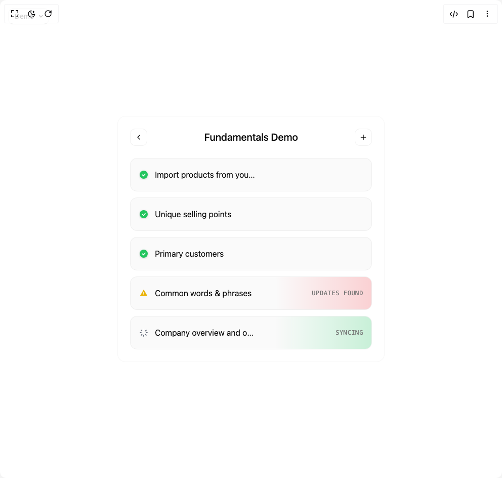

# Build Card Status List in BuilderStudio

> Build this component in our Agentic IDE: [BuilderStudio](https://builderstudio.dev).
>
> Join the BuilderStudio community on [Discord](https://discord.gg/QdWeSGCqfe) and [Reddit](https://reddit.com/r/builderstudio).



## Component

- Author group: `isaiahbjork`
- Component: `card-status-list`
- Variant: `default`
- Rendered HTML snapshot: [`rendered.html`](rendered.html)

## BuilderStudio prompt

You are implementing a React component based on a component reference.

## Component identity

- Author: isaiahbjork
- Component slug: card-status-list
- Demo slug: default
- Title: card-status-list
- Description: 

## Goal

Recreate this component in a React + TypeScript + Tailwind CSS project. Preserve the visual layout, spacing, colors, border radius, shadows, interaction behavior, animation behavior, responsive behavior, and dark mode behavior shown in the rendered demo.

## Implementation requirements

- Use React and TypeScript.
- Use Tailwind CSS classes whenever possible.
- Keep the component self-contained unless the source files require helper components.
- If the source uses CSS variables, custom CSS, animations, or keyframes, include them.
- If the source uses external packages, list and use the required packages.
- Preserve accessibility attributes, button semantics, links, keyboard behavior, and ARIA attributes when visible in the source.
- Do not replace the component with a simplified placeholder.
- Return complete production-ready code.

## Dependencies

No reference metadata available.

## Rendered DOM snapshot

This is the rendered demo HTML extracted from the live preview. Use it to verify structure, class names, visible content, and layout.

```html
<div id="root"><div class="fixed top-4 left-4 z-10"><select class="appearance-none h-8 max-w-[200px] text-sm leading-tight rounded-lg pl-3 pr-7 py-0 border bg-background focus:outline-none focus:ring-0"><option value="default_Demo">Demo</option></select><div class="absolute top-1/2 transform -translate-y-1/2 right-2 pointer-events-none"><svg class="w-4 h-4 fill-current" viewBox="0 0 20 20"><path d="M5.516 7.548c.436-.446 1.043-.48 1.576 0L10 10.405l2.908-2.857c.533-.48 1.14-.446 1.576 0 .436.445.408 1.197 0 1.615l-3.734 3.705c-.533.534-1.39.534-1.923 0l-3.734-3.705c-.408-.418-.436-1.17 0-1.615z"></path></svg></div></div><div class="w-screen min-h-screen flex justify-center items-center"><div class="min-h-screen w-full flex items-center justify-center bg-background"><div class="w-full mx-auto p-6 max-w-xl"><div class="border border-border/30 rounded-2xl p-6 bg-card"><div class="flex items-center justify-between mb-6"><button class="p-2 rounded-lg bg-card cursor-pointer border border-border/50 hover:bg-accent transition-colors" tabindex="0"><svg xmlns="http://www.w3.org/2000/svg" width="24" height="24" viewBox="0 0 24 24" fill="none" stroke="currentColor" stroke-width="2" stroke-linecap="round" stroke-linejoin="round" class="lucide lucide-chevron-left w-4 h-4" aria-hidden="true"><path d="m15 18-6-6 6-6"></path></svg></button><h1 class="text-xl font-medium text-foreground">Fundamentals Demo</h1><button class="p-2 rounded-lg bg-card cursor-pointer border border-border/50 hover:bg-accent transition-colors" tabindex="0"><svg xmlns="http://www.w3.org/2000/svg" width="24" height="24" viewBox="0 0 24 24" fill="none" stroke="currentColor" stroke-width="2" stroke-linecap="round" stroke-linejoin="round" class="lucide lucide-plus w-4 h-4" aria-hidden="true"><path d="M5 12h14"></path><path d="M12 5v14"></path></svg></button></div><div class="space-y-3"><div class="relative cursor-pointer" style="opacity: 1; transform: none;"><div class="relative bg-muted/50 border border-border/50 rounded-xl p-4 overflow-hidden" style="transform: none;"><div class="relative flex items-center justify-between"><div class="flex items-center gap-3"><div class="w-5 h-5 flex items-center justify-center overflow-hidden"><div style="opacity: 1; transform: none;"><svg width="16" height="16" viewBox="0 0 16 16" class="drop-shadow-sm"><circle cx="8" cy="8" r="8" fill="#22c55e"></circle><path d="M5 8l2.5 2.5 3.5-4" stroke="white" stroke-width="1.5" fill="none" stroke-linecap="round" stroke-linejoin="round"></path></svg></div></div><span class="text-foreground truncate max-w-[200px]">Import products from your store</span></div><div class="flex items-center min-w-0 h-8"></div></div></div></div><div class="relative cursor-pointer" style="opacity: 1; transform: none;"><div class="relative bg-muted/50 border border-border/50 rounded-xl p-4 overflow-hidden" style="transform: none;"><div class="relative flex items-center justify-between"><div class="flex items-center gap-3"><div class="w-5 h-5 flex items-center justify-center overflow-hidden"><div style="opacity: 1; transform: none;"><svg width="16" height="16" viewBox="0 0 16 16" class="drop-shadow-sm"><circle cx="8" cy="8" r="8" fill="#22c55e"></circle><path d="M5 8l2.5 2.5 3.5-4" stroke="white" stroke-width="1.5" fill="none" stroke-linecap="round" stroke-linejoin="round"></path></svg></div></div><span class="text-foreground truncate max-w-[200px]">Unique selling points</span></div><div class="flex items-center min-w-0 h-8"></div></div></div></div><div class="relative cursor-pointer" style="opacity: 1; transform: none;"><div class="relative bg-muted/50 border border-border/50 rounded-xl p-4 overflow-hidden" style="transform: none;"><div class="relative flex items-center justify-between"><div class="flex items-center gap-3"><div class="w-5 h-5 flex items-center justify-center overflow-hidden"><div style="opacity: 1; transform: none;"><svg width="16" height="16" viewBox="0 0 16 16" class="drop-shadow-sm"><circle cx="8" cy="8" r="8" fill="#22c55e"></circle><path d="M5 8l2.5 2.5 3.5-4" stroke="white" stroke-width="1.5" fill="none" stroke-linecap="round" stroke-linejoin="round"></path></svg></div></div><span class="text-foreground truncate max-w-[200px]">Primary customers</span></div><div class="flex items-center min-w-0 h-8"></div></div></div></div><div class="relative cursor-pointer" style="opacity: 1; transform: none;"><div class="relative bg-muted/50 border border-border/50 rounded-xl p-4 overflow-hidden"><div class="absolute inset-0 bg-gradient-to-l from-red-500/20 to-transparent pointer-events-none" style="background-size: 40% 100%; background-position: right center; background-repeat: no-repeat;"></div><div class="relative flex items-center justify-between"><div class="flex items-center gap-3"><div class="w-5 h-5 flex items-center justify-center overflow-hidden"><div style="opacity: 1; transform: none;"><svg width="16" height="16" viewBox="0 0 16 16"><path d="M8 1.5L14.5 13H1.5L8 1.5Z" fill="#eab308" stroke="#eab308" stroke-width="1" stroke-linejoin="round"></path><path d="M8 6v3M8 11h0" stroke="white" stroke-width="1.5" stroke-linecap="round"></path></svg></div></div><span class="text-foreground truncate max-w-[200px]">Common words &amp; phrases</span></div><div class="flex items-center min-w-0 h-8"><span class="text-xs font-mono font-medium text-muted-foreground tracking-wider whitespace-nowrap" style="opacity: 1;">UPDATES FOUND</span></div></div></div></div><div class="relative cursor-pointer" style="opacity: 1; transform: none;"><div class="relative bg-muted/50 border border-border/50 rounded-xl p-4 overflow-hidden"><div class="absolute inset-0 bg-gradient-to-l from-green-500/20 to-transparent pointer-events-none" style="background-size: 40% 100%; background-position: right center; background-repeat: no-repeat;"></div><div class="relative flex items-center justify-between"><div class="flex items-center gap-3"><div class="w-5 h-5 flex items-center justify-center overflow-hidden"><div style="opacity: 1; transform: none;"><svg width="16" height="16" viewBox="0 0 16 16"><line x1="8" y1="2.9000000000000004" x2="8" y2="1.0999999999999996" stroke="#ffffff" stroke-width="2" stroke-linecap="round"></line><line x1="11.606244584051392" y1="4.393755415948608" x2="12.879036790187179" y2="3.120963209812822" stroke="#6b7280" stroke-width="2" stroke-linecap="round"></line><line x1="13.1" y1="8" x2="14.9" y2="8" stroke="#6b7280" stroke-width="2" stroke-linecap="round"></line><line x1="11.606244584051392" y1="11.606244584051392" x2="12.879036790187179" y2="12.879036790187179" stroke="#6b7280" stroke-width="2" stroke-linecap="round"></line><line x1="8" y1="13.1" x2="8" y2="14.9" stroke="#6b7280" stroke-width="2" stroke-linecap="round"></line><line x1="4.393755415948608" y1="11.606244584051392" x2="3.120963209812822" y2="12.879036790187179" stroke="#6b7280" stroke-width="2" stroke-linecap="round"></line><line x1="2.9000000000000004" y1="8" x2="1.0999999999999996" y2="8" stroke="#6b7280" stroke-width="2" stroke-linecap="round"></line><line x1="4.393755415948608" y1="4.393755415948608" x2="3.120963209812821" y2="3.120963209812822" stroke="#6b7280" stroke-width="2" stroke-linecap="round"></line></svg></div></div><span class="text-foreground truncate max-w-[200px]">Company overview and offer details</span></div><div class="flex items-center min-w-0 h-8"><span class="text-xs font-mono font-medium text-muted-foreground tracking-wider whitespace-nowrap" style="opacity: 1;">SYNCING</span></div></div></div></div></div></div></div></div></div></div>
```

## Reference source files

No reference source files were available.
