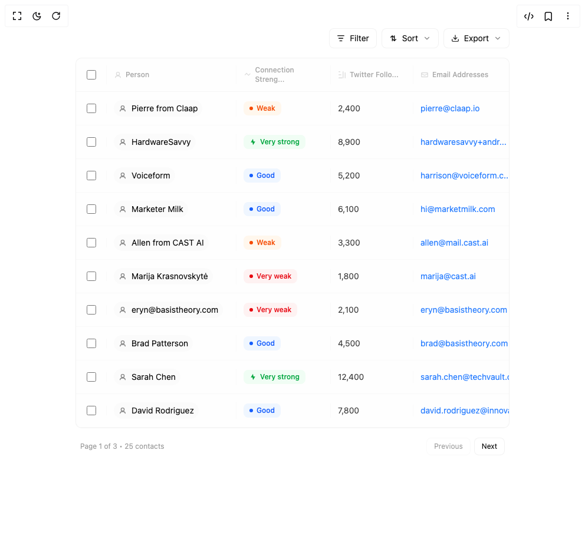

# Build Contacts Table With Modal in BuilderStudio

> Build this component in our Agentic IDE: [BuilderStudio](https://builderstudio.dev).
>
> Join the BuilderStudio community on [Discord](https://discord.gg/QdWeSGCqfe) and [Reddit](https://reddit.com/r/builderstudio).



## Component

- Author group: `isaiahbjork`
- Component: `contacts-table-with-modal`
- Variant: `default`
- Rendered HTML snapshot: [`rendered.html`](rendered.html)

## BuilderStudio prompt

You are implementing a React component based on a component reference.

## Component identity

- Author: isaiahbjork
- Component slug: contacts-table-with-modal
- Demo slug: default
- Title: contacts-table-with-modal
- Description: 

## Goal

Recreate this component in a React + TypeScript + Tailwind CSS project. Preserve the visual layout, spacing, colors, border radius, shadows, interaction behavior, animation behavior, responsive behavior, and dark mode behavior shown in the rendered demo.

## Implementation requirements

- Use React and TypeScript.
- Use Tailwind CSS classes whenever possible.
- Keep the component self-contained unless the source files require helper components.
- If the source uses CSS variables, custom CSS, animations, or keyframes, include them.
- If the source uses external packages, list and use the required packages.
- Preserve accessibility attributes, button semantics, links, keyboard behavior, and ARIA attributes when visible in the source.
- Do not replace the component with a simplified placeholder.
- Return complete production-ready code.

## Dependencies

No reference metadata available.

## Rendered DOM snapshot

This is the rendered demo HTML extracted from the live preview. Use it to verify structure, class names, visible content, and layout.

```html
<div id="root"><div class="w-screen min-h-screen flex justify-center items-center"><div class="w-screen min-h-screen flex justify-center items-center"><div class="min-h-screen bg-background py-6 md:py-12"><div class="container mx-auto px-2 sm:px-4"><div class="mb-8 md:mb-12"><div class="w-full max-w-7xl mx-auto "><div class="mb-4 flex flex-col sm:flex-row sm:items-center sm:justify-between gap-3"><div class="flex items-center gap-2"></div><div class="flex items-center gap-2 flex-wrap"><div class="relative"><button class="px-3 py-1.5 bg-background border border-border/50 text-foreground text-sm hover:bg-muted/30 transition-colors flex items-center gap-2 rounded-md "><svg width="14" height="14" viewBox="0 0 16 16" fill="none"><path d="M2 3H14M4 8H12M6 13H10" stroke="currentColor" stroke-width="1.5" stroke-linecap="round"></path></svg>Filter</button></div><div class="relative"><button class="px-3 py-1.5 bg-background border border-border/50 text-foreground text-sm hover:bg-muted/30 transition-colors flex items-center gap-2 rounded-md"><svg width="14" height="14" viewBox="0 0 16 16" fill="none"><path d="M3 6L6 3L9 6M6 3V13M13 10L10 13L7 10M10 13V3" stroke="currentColor" stroke-width="1.5" stroke-linecap="round" stroke-linejoin="round"></path></svg>Sort <svg xmlns="http://www.w3.org/2000/svg" width="14" height="14" viewBox="0 0 24 24" fill="none" stroke="currentColor" stroke-width="2" stroke-linecap="round" stroke-linejoin="round" class="lucide lucide-chevron-down opacity-50" aria-hidden="true"><path d="m6 9 6 6 6-6"></path></svg></button></div><div class="relative"><button class="px-3 py-1.5 bg-background border border-border/50 text-foreground text-sm hover:bg-muted/30 transition-colors flex items-center gap-2 rounded-md"><svg xmlns="http://www.w3.org/2000/svg" width="14" height="14" viewBox="0 0 24 24" fill="none" stroke="currentColor" stroke-width="2" stroke-linecap="round" stroke-linejoin="round" class="lucide lucide-download" aria-hidden="true"><path d="M21 15v4a2 2 0 0 1-2 2H5a2 2 0 0 1-2-2v-4"></path><polyline points="7 10 12 15 17 10"></polyline><line x1="12" x2="12" y1="15" y2="3"></line></svg>Export<svg xmlns="http://www.w3.org/2000/svg" width="14" height="14" viewBox="0 0 24 24" fill="none" stroke="currentColor" stroke-width="2" stroke-linecap="round" stroke-linejoin="round" class="lucide lucide-chevron-down opacity-50" aria-hidden="true"><path d="m6 9 6 6 6-6"></path></svg></button></div></div></div><div class="bg-background border border-border/50 overflow-hidden rounded-lg relative"><div class="overflow-x-auto"><div class="min-w-[1100px]"><div class="px-3 py-3 text-xs font-medium text-muted-foreground/60 bg-muted/5 border-b border-border/30 text-left" style="display: grid; grid-template-columns: 40px 220px 160px 140px 200px 1fr 40px; column-gap: 0px;"><div class="flex items-center justify-center border-r border-border/20 pr-3"><input class="w-4 h-4 rounded border-border/40 cursor-pointer" type="checkbox" style="accent-color: rgb(161, 161, 170);"></div><div class="flex items-center gap-1.5 border-r border-border/20 px-3"><svg width="14" height="14" viewBox="0 0 16 16" fill="none" class="opacity-40"><circle cx="8" cy="6" r="3" stroke="currentColor" stroke-width="1.5" fill="none"></circle><path d="M3 14C3 11.5 5 10 8 10C11 10 13 11.5 13 14" stroke="currentColor" stroke-width="1.5"></path></svg><span>Person</span></div><div class="flex items-center gap-1.5 border-r border-border/20 px-3"><svg width="14" height="14" viewBox="0 0 16 16" fill="none" class="opacity-40"><path d="M3 8L6 5L10 9L13 6" stroke="currentColor" stroke-width="1.5" stroke-linecap="round"></path></svg><span>Connection Streng...</span></div><div class="flex items-center gap-1.5 border-r border-border/20 px-3"><svg width="14" height="14" viewBox="0 0 16 16" fill="none" class="opacity-40"><path d="M2 2H4M2 8H6M2 14H8M10 2V14M14 4V14" stroke="currentColor" stroke-width="1.5" stroke-linecap="round"></path></svg><span>Twitter Follo...</span></div><div class="flex items-center gap-1.5 border-r border-border/20 px-3"><svg width="14" height="14" viewBox="0 0 16 16" fill="none" class="opacity-40"><rect x="2" y="4" width="12" height="8" rx="1" stroke="currentColor" stroke-width="1.5" fill="none"></rect><path d="M2 6L8 9L14 6" stroke="currentColor" stroke-width="1.5"></path></svg><span>Email Addresses</span></div><div class="flex items-center gap-1.5 border-r border-border/20 px-3"><svg width="14" height="14" viewBox="0 0 16 16" fill="none" class="opacity-40"><path d="M3 3H13M3 8H13M3 13H9" stroke="currentColor" stroke-width="1.5" stroke-linecap="round"></path></svg><span>Description</span></div><div class="flex items-center justify-center px-3"><svg width="14" height="14" viewBox="0 0 16 16" fill="none" class="opacity-30"><circle cx="8" cy="8" r="1" fill="currentColor"></circle><circle cx="13" cy="8" r="1" fill="currentColor"></circle><circle cx="3" cy="8" r="1" fill="currentColor"></circle></svg></div></div><div><div style="opacity: 1; filter: blur(0px); transform: none;"><div class="px-3 py-3.5 group relative transition-all duration-150 border-b border-border/20 bg-muted/5 hover:bg-muted/20" style="display: grid; grid-template-columns: 40px 220px 160px 140px 200px 1fr 40px; column-gap: 0px; align-items: center;"><div class="flex items-center justify-center border-r border-border/20 pr-3"><input class="w-4 h-4 rounded border-border/40 cursor-pointer" type="checkbox" style="accent-color: rgb(161, 161, 170);"></div><div class="flex items-center gap-2 min-w-0 border-r border-border/20 px-3"><div class="inline-flex items-center gap-2 px-2 py-1 bg-muted/30 rounded-full"><svg width="14" height="14" viewBox="0 0 16 16" fill="none" class="opacity-50 flex-shrink-0"><circle cx="8" cy="6" r="3" stroke="currentColor" stroke-width="1.5" fill="none"></circle><path d="M3 14C3 11.5 5 10 8 10C11 10 13 11.5 13 14" stroke="currentColor" stroke-width="1.5"></path></svg><div class="min-w-0"><div class="text-sm text-foreground truncate">Pierre from Claap</div></div></div></div><div class="flex items-center border-r border-border/20 px-3"><div class="inline-flex items-center gap-1.5 px-2.5 py-1 text-xs font-medium bg-orange-50 text-orange-600 rounded-md"><div class="w-1.5 h-1.5 rounded-full bg-orange-600"></div>Weak</div></div><div class="flex items-center border-r border-border/20 px-3"><span class="text-sm text-foreground/80">2,400</span></div><div class="flex items-center min-w-0 border-r border-border/20 px-3"><a href="mailto:pierre@claap.io" class="text-sm text-blue-500 hover:text-blue-600 truncate">pierre@claap.io</a></div><div class="flex items-center min-w-0 border-r border-border/20 px-3"><span class="text-sm text-muted-foreground/80 truncate">Tech entrepreneur and investor</span></div><div class="flex items-center justify-center px-3"><button class="opacity-0 group-hover:opacity-60 hover:opacity-100 transition-opacity cursor-pointer"><svg width="14" height="14" viewBox="0 0 16 16" fill="none"><circle cx="8" cy="3" r="1.5" fill="currentColor"></circle><circle cx="8" cy="8" r="1.5" fill="currentColor"></circle><circle cx="8" cy="13" r="1.5" fill="currentColor"></circle></svg></button></div></div></div><div style="opacity: 1; filter: blur(0px); transform: none;"><div class="px-3 py-3.5 group relative transition-all duration-150 border-b border-border/20 bg-muted/5 hover:bg-muted/20" style="display: grid; grid-template-columns: 40px 220px 160px 140px 200px 1fr 40px; column-gap: 0px; align-items: center;"><div class="flex items-center justify-center border-r border-border/20 pr-3"><input class="w-4 h-4 rounded border-border/40 cursor-pointer" type="checkbox" style="accent-color: rgb(161, 161, 170);"></div><div class="flex items-center gap-2 min-w-0 border-r border-border/20 px-3"><div class="inline-flex items-center gap-2 px-2 py-1 bg-muted/30 rounded-full"><svg width="14" height="14" viewBox="0 0 16 16" fill="none" class="opacity-50 flex-shrink-0"><circle cx="8" cy="6" r="3" stroke="currentColor" stroke-width="1.5" fill="none"></circle><path d="M3 14C3 11.5 5 10 8 10C11 10 13 11.5 13 14" stroke="currentColor" stroke-width="1.5"></path></svg><div class="min-w-0"><div class="text-sm text-foreground truncate">HardwareSavvy</div></div></div></div><div class="flex items-center border-r border-border/20 px-3"><div class="inline-flex items-center gap-1.5 px-2.5 py-1 text-xs font-medium bg-green-50 text-green-600 rounded-md"><svg width="12" height="12" viewBox="0 0 16 16" fill="currentColor"><path d="M8 1L3 9H7L8 15L13 7H9L8 1Z"></path></svg>Very strong</div></div><div class="flex items-center border-r border-border/20 px-3"><span class="text-sm text-foreground/80">8,900</span></div><div class="flex items-center min-w-0 border-r border-border/20 px-3"><a href="mailto:hardwaresavvy+andr..." class="text-sm text-blue-500 hover:text-blue-600 truncate">hardwaresavvy+andr...</a></div><div class="flex items-center min-w-0 border-r border-border/20 px-3"><span class="text-sm text-muted-foreground/80 truncate">Hardware specialist</span></div><div class="flex items-center justify-center px-3"><button class="opacity-0 group-hover:opacity-60 hover:opacity-100 transition-opacity cursor-pointer"><svg width="14" height="14" viewBox="0 0 16 16" fill="none"><circle cx="8" cy="3" r="1.5" fill="currentColor"></circle><circle cx="8" cy="8" r="1.5" fill="currentColor"></circle><circle cx="8" cy="13" r="1.5" fill="currentColor"></circle></svg></button></div></div></div><div style="opacity: 1; filter: blur(0px); transform: none;"><div class="px-3 py-3.5 group relative transition-all duration-150 border-b border-border/20 bg-muted/5 hover:bg-muted/20" style="display: grid; grid-template-columns: 40px 220px 160px 140px 200px 1fr 40px; column-gap: 0px; align-items: center;"><div class="flex items-center justify-center border-r border-border/20 pr-3"><input class="w-4 h-4 rounded border-border/40 cursor-pointer" type="checkbox" style="accent-color: rgb(161, 161, 170);"></div><div class="flex items-center gap-2 min-w-0 border-r border-border/20 px-3"><div class="inline-flex items-center gap-2 px-2 py-1 bg-muted/30 rounded-full"><svg width="14" height="14" viewBox="0 0 16 16" fill="none" class="opacity-50 flex-shrink-0"><circle cx="8" cy="6" r="3" stroke="currentColor" stroke-width="1.5" fill="none"></circle><path d="M3 14C3 11.5 5 10 8 10C11 10 13 11.5 13 14" stroke="currentColor" stroke-width="1.5"></path></svg><div class="min-w-0"><div class="text-sm text-foreground truncate">Voiceform</div></div></div></div><div class="flex items-center border-r border-border/20 px-3"><div class="inline-flex items-center gap-1.5 px-2.5 py-1 text-xs font-medium bg-blue-50 text-blue-600 rounded-md"><div class="w-1.5 h-1.5 rounded-full bg-blue-600"></div>Good</div></div><div class="flex items-center border-r border-border/20 px-3"><span class="text-sm text-foreground/80">5,200</span></div><div class="flex items-center min-w-0 border-r border-border/20 px-3"><a href="mailto:harrison@voiceform.c..." class="text-sm text-blue-500 hover:text-blue-600 truncate">harrison@voiceform.c...</a></div><div class="flex items-center min-w-0 border-r border-border/20 px-3"><span class="text-sm text-muted-foreground/80 truncate">Voice technology expert</span></div><div class="flex items-center justify-center px-3"><button class="opacity-0 group-hover:opacity-60 hover:opacity-100 transition-opacity cursor-pointer"><svg width="14" height="14" viewBox="0 0 16 16" fill="none"><circle cx="8" cy="3" r="1.5" fill="currentColor"></circle><circle cx="8" cy="8" r="1.5" fill="currentColor"></circle><circle cx="8" cy="13" r="1.5" fill="currentColor"></circle></svg></button></div></div></div><div style="opacity: 1; filter: blur(0px); transform: none;"><div class="px-3 py-3.5 group relative transition-all duration-150 border-b border-border/20 bg-muted/5 hover:bg-muted/20" style="display: grid; grid-template-columns: 40px 220px 160px 140px 200px 1fr 40px; column-gap: 0px; align-items: center;"><div class="flex items-center justify-center border-r border-border/20 pr-3"><input class="w-4 h-4 rounded border-border/40 cursor-pointer" type="checkbox" style="accent-color: rgb(161, 161, 170);"></div><div class="flex items-center gap-2 min-w-0 border-r border-border/20 px-3"><div class="inline-flex items-center gap-2 px-2 py-1 bg-muted/30 rounded-full"><svg width="14" height="14" viewBox="0 0 16 16" fill="none" class="opacity-50 flex-shrink-0"><circle cx="8" cy="6" r="3" stroke="currentColor" stroke-width="1.5" fill="none"></circle><path d="M3 14C3 11.5 5 10 8 10C11 10 13 11.5 13 14" stroke="currentColor" stroke-width="1.5"></path></svg><div class="min-w-0"><div class="text-sm text-foreground truncate">Marketer Milk</div></div></div></div><div class="flex items-center border-r border-border/20 px-3"><div class="inline-flex items-center gap-1.5 px-2.5 py-1 text-xs font-medium bg-blue-50 text-blue-600 rounded-md"><div class="w-1.5 h-1.5 rounded-full bg-blue-600"></div>Good</div></div><div class="flex items-center border-r border-border/20 px-3"><span class="text-sm text-foreground/80">6,100</span></div><div class="flex items-center min-w-0 border-r border-border/20 px-3"><a href="mailto:hi@marketmilk.com" class="text-sm text-blue-500 hover:text-blue-600 truncate">hi@marketmilk.com</a></div><div class="flex items-center min-w-0 border-r border-border/20 px-3"><span class="text-sm text-muted-foreground/80 truncate">Marketing strategist</span></div><div class="flex items-center justify-center px-3"><button class="opacity-0 group-hover:opacity-60 hover:opacity-100 transition-opacity cursor-pointer"><svg width="14" height="14" viewBox="0 0 16 16" fill="none"><circle cx="8" cy="3" r="1.5" fill="currentColor"></circle><circle cx="8" cy="8" r="1.5" fill="currentColor"></circle><circle cx="8" cy="13" r="1.5" fill="currentColor"></circle></svg></button></div></div></div><div style="opacity: 1; filter: blur(0px); transform: none;"><div class="px-3 py-3.5 group relative transition-all duration-150 border-b border-border/20 bg-muted/5 hover:bg-muted/20" style="display: grid; grid-template-columns: 40px 220px 160px 140px 200px 1fr 40px; column-gap: 0px; align-items: center;"><div class="flex items-center justify-center border-r border-border/20 pr-3"><input class="w-4 h-4 rounded border-border/40 cursor-pointer" type="checkbox" style="accent-color: rgb(161, 161, 170);"></div><div class="flex items-center gap-2 min-w-0 border-r border-border/20 px-3"><div class="inline-flex items-center gap-2 px-2 py-1 bg-muted/30 rounded-full"><svg width="14" height="14" viewBox="0 0 16 16" fill="none" class="opacity-50 flex-shrink-0"><circle cx="8" cy="6" r="3" stroke="currentColor" stroke-width="1.5" fill="none"></circle><path d="M3 14C3 11.5 5 10 8 10C11 10 13 11.5 13 14" stroke="currentColor" stroke-width="1.5"></path></svg><div class="min-w-0"><div class="text-sm text-foreground truncate">Allen from CAST AI</div></div></div></div><div class="flex items-center border-r border-border/20 px-3"><div class="inline-flex items-center gap-1.5 px-2.5 py-1 text-xs font-medium bg-orange-50 text-orange-600 rounded-md"><div class="w-1.5 h-1.5 rounded-full bg-orange-600"></div>Weak</div></div><div class="flex items-center border-r border-border/20 px-3"><span class="text-sm text-foreground/80">3,300</span></div><div class="flex items-center min-w-0 border-r border-border/20 px-3"><a href="mailto:allen@mail.cast.ai" class="text-sm text-blue-500 hover:text-blue-600 truncate">allen@mail.cast.ai</a></div><div class="flex items-center min-w-0 border-r border-border/20 px-3"><span class="text-sm text-muted-foreground/80 truncate">AI infrastructure lead</span></div><div class="flex items-center justify-center px-3"><button class="opacity-0 group-hover:opacity-60 hover:opacity-100 transition-opacity cursor-pointer"><svg width="14" height="14" viewBox="0 0 16 16" fill="none"><circle cx="8" cy="3" r="1.5" fill="currentColor"></circle><circle cx="8" cy="8" r="1.5" fill="currentColor"></circle><circle cx="8" cy="13" r="1.5" fill="currentColor"></circle></svg></button></div></div></div><div style="opacity: 1; filter: blur(0px); transform: none;"><div class="px-3 py-3.5 group relative transition-all duration-150 border-b border-border/20 bg-muted/5 hover:bg-muted/20" style="display: grid; grid-template-columns: 40px 220px 160px 140px 200px 1fr 40px; column-gap: 0px; align-items: center;"><div class="flex items-center justify-center border-r border-border/20 pr-3"><input class="w-4 h-4 rounded border-border/40 cursor-pointer" type="checkbox" style="accent-color: rgb(161, 161, 170);"></div><div class="flex items-center gap-2 min-w-0 border-r border-border/20 px-3"><div class="inline-flex items-center gap-2 px-2 py-1 bg-muted/30 rounded-full"><svg width="14" height="14" viewBox="0 0 16 16" fill="none" class="opacity-50 flex-shrink-0"><circle cx="8" cy="6" r="3" stroke="currentColor" stroke-width="1.5" fill="none"></circle><path d="M3 14C3 11.5 5 10 8 10C11 10 13 11.5 13 14" stroke="currentColor" stroke-width="1.5"></path></svg><div class="min-w-0"><div class="text-sm text-foreground truncate">Marija Krasnovskytė</div></div></div></div><div class="flex items-center border-r border-border/20 px-3"><div class="inline-flex items-center gap-1.5 px-2.5 py-1 text-xs font-medium bg-red-50 text-red-600 rounded-md"><div class="w-1.5 h-1.5 rounded-full bg-red-600"></div>Very weak</div></div><div class="flex items-center border-r border-border/20 px-3"><span class="text-sm text-foreground/80">1,800</span></div><div class="flex items-center min-w-0 border-r border-border/20 px-3"><a href="mailto:marija@cast.ai" class="text-sm text-blue-500 hover:text-blue-600 truncate">marija@cast.ai</a></div><div class="flex items-center min-w-0 border-r border-border/20 px-3"><span class="text-sm text-muted-foreground/80 truncate">Technical advisor</span></div><div class="flex items-center justify-center px-3"><button class="opacity-0 group-hover:opacity-60 hover:opacity-100 transition-opacity cursor-pointer"><svg width="14" height="14" viewBox="0 0 16 16" fill="none"><circle cx="8" cy="3" r="1.5" fill="currentColor"></circle><circle cx="8" cy="8" r="1.5" fill="currentColor"></circle><circle cx="8" cy="13" r="1.5" fill="currentColor"></circle></svg></button></div></div></div><div style="opacity: 1; filter: blur(0px); transform: none;"><div class="px-3 py-3.5 group relative transition-all duration-150 border-b border-border/20 bg-muted/5 hover:bg-muted/20" style="display: grid; grid-template-columns: 40px 220px 160px 140px 200px 1fr 40px; column-gap: 0px; align-items: center;"><div class="flex items-center justify-center border-r border-border/20 pr-3"><input class="w-4 h-4 rounded border-border/40 cursor-pointer" type="checkbox" style="accent-color: rgb(161, 161, 170);"></div><div class="flex items-center gap-2 min-w-0 border-r border-border/20 px-3"><div class="inline-flex items-center gap-2 px-2 py-1 bg-muted/30 rounded-full"><svg width="14" height="14" viewBox="0 0 16 16" fill="none" class="opacity-50 flex-shrink-0"><circle cx="8" cy="6" r="3" stroke="currentColor" stroke-width="1.5" fill="none"></circle><path d="M3 14C3 11.5 5 10 8 10C11 10 13 11.5 13 14" stroke="currentColor" stroke-width="1.5"></path></svg><div class="min-w-0"><div class="text-sm text-foreground truncate">eryn@basistheory.com</div></div></div></div><div class="flex items-center border-r border-border/20 px-3"><div class="inline-flex items-center gap-1.5 px-2.5 py-1 text-xs font-medium bg-red-50 text-red-600 rounded-md"><div class="w-1.5 h-1.5 rounded-full bg-red-600"></div>Very weak</div></div><div class="flex items-center border-r border-border/20 px-3"><span class="text-sm text-foreground/80">2,100</span></div><div class="flex items-center min-w-0 border-r border-border/20 px-3"><a href="mailto:eryn@basistheory.com" class="text-sm text-blue-500 hover:text-blue-600 truncate">eryn@basistheory.com</a></div><div class="flex items-center min-w-0 border-r border-border/20 px-3"><span class="text-sm text-muted-foreground/80 truncate">Security specialist</span></div><div class="flex items-center justify-center px-3"><button class="opacity-0 group-hover:opacity-60 hover:opacity-100 transition-opacity cursor-pointer"><svg width="14" height="14" viewBox="0 0 16 16" fill="none"><circle cx="8" cy="3" r="1.5" fill="currentColor"></circle><circle cx="8" cy="8" r="1.5" fill="currentColor"></circle><circle cx="8" cy="13" r="1.5" fill="currentColor"></circle></svg></button></div></div></div><div style="opacity: 1; filter: blur(0px); transform: none;"><div class="px-3 py-3.5 group relative transition-all duration-150 border-b border-border/20 bg-muted/5 hover:bg-muted/20" style="display: grid; grid-template-columns: 40px 220px 160px 140px 200px 1fr 40px; column-gap: 0px; align-items: center;"><div class="flex items-center justify-center border-r border-border/20 pr-3"><input class="w-4 h-4 rounded border-border/40 cursor-pointer" type="checkbox" style="accent-color: rgb(161, 161, 170);"></div><div class="flex items-center gap-2 min-w-0 border-r border-border/20 px-3"><div class="inline-flex items-center gap-2 px-2 py-1 bg-muted/30 rounded-full"><svg width="14" height="14" viewBox="0 0 16 16" fill="none" class="opacity-50 flex-shrink-0"><circle cx="8" cy="6" r="3" stroke="currentColor" stroke-width="1.5" fill="none"></circle><path d="M3 14C3 11.5 5 10 8 10C11 10 13 11.5 13 14" stroke="currentColor" stroke-width="1.5"></path></svg><div class="min-w-0"><div class="text-sm text-foreground truncate">Brad Patterson</div></div></div></div><div class="flex items-center border-r border-border/20 px-3"><div class="inline-flex items-center gap-1.5 px-2.5 py-1 text-xs font-medium bg-blue-50 text-blue-600 rounded-md"><div class="w-1.5 h-1.5 rounded-full bg-blue-600"></div>Good</div></div><div class="flex items-center border-r border-border/20 px-3"><span class="text-sm text-foreground/80">4,500</span></div><div class="flex items-center min-w-0 border-r border-border/20 px-3"><a href="mailto:brad@basistheory.com" class="text-sm text-blue-500 hover:text-blue-600 truncate">brad@basistheory.com</a></div><div class="flex items-center min-w-0 border-r border-border/20 px-3"><span class="text-sm text-muted-foreground/80 truncate">Product manager</span></div><div class="flex items-center justify-center px-3"><button class="opacity-0 group-hover:opacity-60 hover:opacity-100 transition-opacity cursor-pointer"><svg width="14" height="14" viewBox="0 0 16 16" fill="none"><circle cx="8" cy="3" r="1.5" fill="currentColor"></circle><circle cx="8" cy="8" r="1.5" fill="currentColor"></circle><circle cx="8" cy="13" r="1.5" fill="currentColor"></circle></svg></button></div></div></div><div style="opacity: 1; filter: blur(0px); transform: none;"><div class="px-3 py-3.5 group relative transition-all duration-150 border-b border-border/20 bg-muted/5 hover:bg-muted/20" style="display: grid; grid-template-columns: 40px 220px 160px 140px 200px 1fr 40px; column-gap: 0px; align-items: center;"><div class="flex items-center justify-center border-r border-border/20 pr-3"><input class="w-4 h-4 rounded border-border/40 cursor-pointer" type="checkbox" style="accent-color: rgb(161, 161, 170);"></div><div class="flex items-center gap-2 min-w-0 border-r border-border/20 px-3"><div class="inline-flex items-center gap-2 px-2 py-1 bg-muted/30 rounded-full"><svg width="14" height="14" viewBox="0 0 16 16" fill="none" class="opacity-50 flex-shrink-0"><circle cx="8" cy="6" r="3" stroke="currentColor" stroke-width="1.5" fill="none"></circle><path d="M3 14C3 11.5 5 10 8 10C11 10 13 11.5 13 14" stroke="currentColor" stroke-width="1.5"></path></svg><div class="min-w-0"><div class="text-sm text-foreground truncate">Sarah Chen</div></div></div></div><div class="flex items-center border-r border-border/20 px-3"><div class="inline-flex items-center gap-1.5 px-2.5 py-1 text-xs font-medium bg-green-50 text-green-600 rounded-md"><svg width="12" height="12" viewBox="0 0 16 16" fill="currentColor"><path d="M8 1L3 9H7L8 15L13 7H9L8 1Z"></path></svg>Very strong</div></div><div class="flex items-center border-r border-border/20 px-3"><span class="text-sm text-foreground/80">12,400</span></div><div class="flex items-center min-w-0 border-r border-border/20 px-3"><a href="mailto:sarah.chen@techvault.com" class="text-sm text-blue-500 hover:text-blue-600 truncate">sarah.chen@techvault.com</a></div><div class="flex items-center min-w-0 border-r border-border/20 px-3"><span class="text-sm text-muted-foreground/80 truncate">CEO and founder</span></div><div class="flex items-center justify-center px-3"><button class="opacity-0 group-hover:opacity-60 hover:opacity-100 transition-opacity cursor-pointer"><svg width="14" height="14" viewBox="0 0 16 16" fill="none"><circle cx="8" cy="3" r="1.5" fill="currentColor"></circle><circle cx="8" cy="8" r="1.5" fill="currentColor"></circle><circle cx="8" cy="13" r="1.5" fill="currentColor"></circle></svg></button></div></div></div><div style="opacity: 1; filter: blur(0px); transform: none;"><div class="px-3 py-3.5 group relative transition-all duration-150 border-b border-border/20 bg-muted/5 hover:bg-muted/20" style="display: grid; grid-template-columns: 40px 220px 160px 140px 200px 1fr 40px; column-gap: 0px; align-items: center;"><div class="flex items-center justify-center border-r border-border/20 pr-3"><input class="w-4 h-4 rounded border-border/40 cursor-pointer" type="checkbox" style="accent-color: rgb(161, 161, 170);"></div><div class="flex items-center gap-2 min-w-0 border-r border-border/20 px-3"><div class="inline-flex items-center gap-2 px-2 py-1 bg-muted/30 rounded-full"><svg width="14" height="14" viewBox="0 0 16 16" fill="none" class="opacity-50 flex-shrink-0"><circle cx="8" cy="6" r="3" stroke="currentColor" stroke-width="1.5" fill="none"></circle><path d="M3 14C3 11.5 5 10 8 10C11 10 13 11.5 13 14" stroke="currentColor" stroke-width="1.5"></path></svg><div class="min-w-0"><div class="text-sm text-foreground truncate">David Rodriguez</div></div></div></div><div class="flex items-center border-r border-border/20 px-3"><div class="inline-flex items-center gap-1.5 px-2.5 py-1 text-xs font-medium bg-blue-50 text-blue-600 rounded-md"><div class="w-1.5 h-1.5 rounded-full bg-blue-600"></div>Good</div></div><div class="flex items-center border-r border-border/20 px-3"><span class="text-sm text-foreground/80">7,800</span></div><div class="flex items-center min-w-0 border-r border-border/20 px-3"><a href="mailto:david.rodriguez@innovate.io" class="text-sm text-blue-500 hover:text-blue-600 truncate">david.rodriguez@innovate.io</a></div><div class="flex items-center min-w-0 border-r border-border/20 px-3"><span class="text-sm text-muted-foreground/80 truncate">Lead developer</span></div><div class="flex items-center justify-center px-3"><button class="opacity-0 group-hover:opacity-60 hover:opacity-100 transition-opacity cursor-pointer"><svg width="14" height="14" viewBox="0 0 16 16" fill="none"><circle cx="8" cy="3" r="1.5" fill="currentColor"></circle><circle cx="8" cy="8" r="1.5" fill="currentColor"></circle><circle cx="8" cy="13" r="1.5" fill="currentColor"></circle></svg></button></div></div></div></div></div></div></div><div class="mt-4 flex items-center justify-between px-2"><div class="text-xs text-muted-foreground/70">Page 1 of 3 • 25 contacts</div><div class="flex gap-1.5"><button disabled="" class="px-3 py-1.5 bg-background border border-border/50 text-foreground text-xs hover:bg-muted/30 disabled:opacity-40 disabled:cursor-not-allowed transition-colors rounded-md">Previous</button><button class="px-3 py-1.5 bg-background border border-border/50 text-foreground text-xs hover:bg-muted/30 disabled:opacity-40 disabled:cursor-not-allowed transition-colors rounded-md">Next</button></div></div></div></div></div></div></div></div></div>
```

## Reference source files

No reference source files were available.
