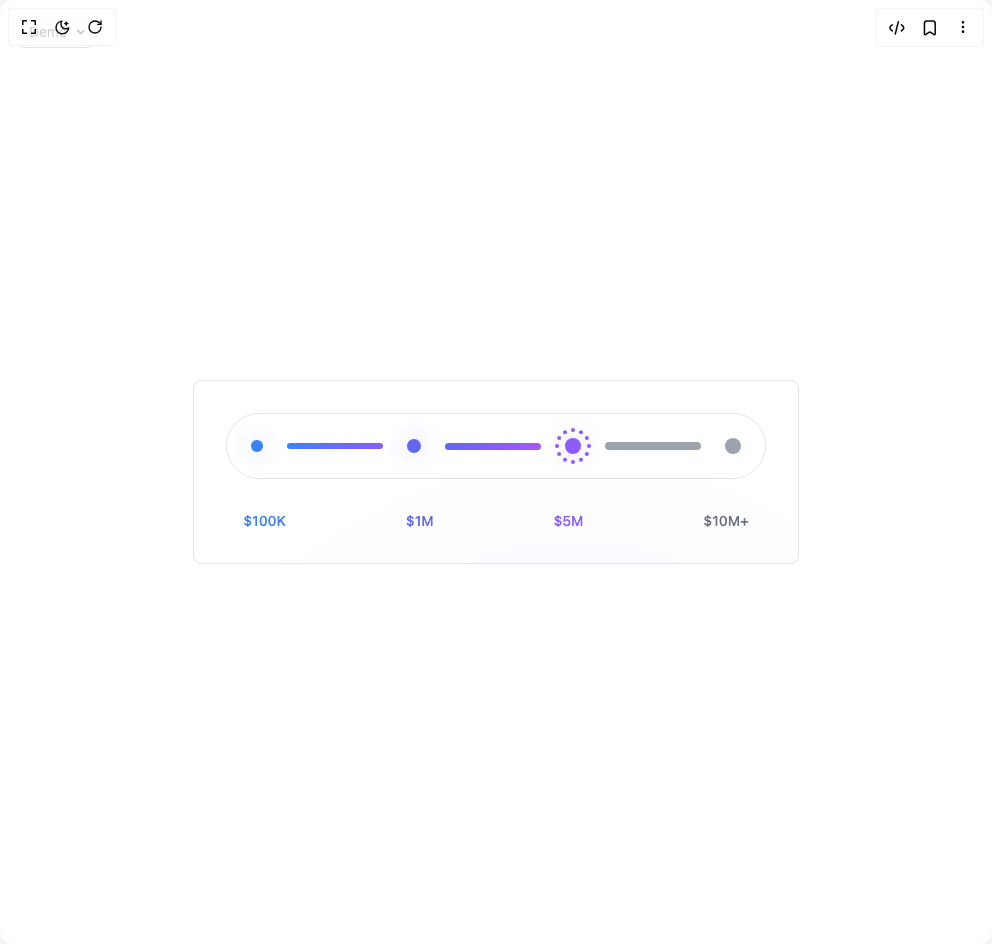

# Build Gradient Selector Card in BuilderStudio

> Build this component in our Agentic IDE: [BuilderStudio](https://builderstudio.dev).
>
> Join the BuilderStudio community on [Discord](https://discord.gg/QdWeSGCqfe) and [Reddit](https://reddit.com/r/builderstudio).



## Component

- Author group: `isaiahbjork`
- Component: `gradient-selector-card`
- Variant: `default`
- Rendered HTML snapshot: [`rendered.html`](rendered.html)

## BuilderStudio prompt

You are implementing a React component based on a component reference.

## Component identity

- Author: isaiahbjork
- Component slug: gradient-selector-card
- Demo slug: default
- Title: gradient-selector-card
- Description: 

## Goal

Recreate this component in a React + TypeScript + Tailwind CSS project. Preserve the visual layout, spacing, colors, border radius, shadows, interaction behavior, animation behavior, responsive behavior, and dark mode behavior shown in the rendered demo.

## Implementation requirements

- Use React and TypeScript.
- Use Tailwind CSS classes whenever possible.
- Keep the component self-contained unless the source files require helper components.
- If the source uses CSS variables, custom CSS, animations, or keyframes, include them.
- If the source uses external packages, list and use the required packages.
- Preserve accessibility attributes, button semantics, links, keyboard behavior, and ARIA attributes when visible in the source.
- Do not replace the component with a simplified placeholder.
- Return complete production-ready code.

## Dependencies

No reference metadata available.

## Rendered DOM snapshot

This is the rendered demo HTML extracted from the live preview. Use it to verify structure, class names, visible content, and layout.

```html
<div id="root"><div class="fixed top-4 left-4 z-10"><select class="appearance-none h-8 max-w-[200px] text-sm leading-tight rounded-lg pl-3 pr-7 py-0 border bg-background focus:outline-none focus:ring-0"><option value="default_Demo">Demo</option></select><div class="absolute top-1/2 transform -translate-y-1/2 right-2 pointer-events-none"><svg class="w-4 h-4 fill-current" viewBox="0 0 20 20"><path d="M5.516 7.548c.436-.446 1.043-.48 1.576 0L10 10.405l2.908-2.857c.533-.48 1.14-.446 1.576 0 .436.445.408 1.197 0 1.615l-3.734 3.705c-.533.534-1.39.534-1.923 0l-3.734-3.705c-.408-.418-.436-1.17 0-1.615z"></path></svg></div></div><div class="w-screen min-h-screen flex justify-center items-center"><div class="min-h-screen flex items-center justify-center bg-background"><div class="relative flex flex-col items-center gap-8 p-8 border border-border rounded-md overflow-hidden bg-background w-full max-w-3xl"><div class="absolute inset-0 pointer-events-none z-0" style="background: radial-gradient(circle at 380px 506px, rgba(139, 92, 246, 0.094) 0%, rgba(139, 92, 246, 0.063) 30%, transparent 70%);"></div><div class="relative z-10 flex items-center gap-6 border border-border bg-background rounded-full p-6"><div class="flex items-center gap-6"><div class="relative cursor-pointer transition-all duration-200 hover:scale-110 w-3 h-3 rounded-full border-2 border-transparent" style="background-color: rgb(59, 130, 246); box-shadow: rgba(59, 130, 246, 0.25) 0px 0px 20px, rgba(59, 130, 246, 0.125) 0px 0px 40px;"></div><div class="w-24 rounded-full transition-all duration-300 h-1.5" style="background: linear-gradient(to right, rgb(59, 130, 246), rgb(139, 92, 246));"></div></div><div class="flex items-center gap-6"><div class="relative cursor-pointer transition-all duration-200 hover:scale-110 w-3.5 h-3.5 rounded-full border-2 border-transparent" style="background-color: rgb(99, 102, 241); box-shadow: rgba(99, 102, 241, 0.25) 0px 0px 20px, rgba(99, 102, 241, 0.125) 0px 0px 40px;"></div><div class="w-24 rounded-full transition-all duration-300 h-1.75" style="background: linear-gradient(to right, rgb(99, 102, 241), rgb(168, 85, 247));"></div></div><div class="flex items-center gap-6"><div class="relative cursor-pointer transition-all duration-200 hover:scale-110 w-4 h-4 rounded-full border-2 border-transparent" style="background-color: rgb(139, 92, 246); box-shadow: rgba(139, 92, 246, 0.25) 0px 0px 20px, rgba(139, 92, 246, 0.125) 0px 0px 40px;"><div class="absolute w-1 h-1 rounded-full" style="background-color: rgb(139, 92, 246); left: 50%; top: 50%; opacity: 1; transform: translateX(14px) translateY(-2px);"></div><div class="absolute w-1 h-1 rounded-full" style="background-color: rgb(139, 92, 246); left: 50%; top: 50%; opacity: 1; transform: translateX(11.8564px) translateY(6px);"></div><div class="absolute w-1 h-1 rounded-full" style="background-color: rgb(139, 92, 246); left: 50%; top: 50%; opacity: 1; transform: translateX(6px) translateY(11.8564px);"></div><div class="absolute w-1 h-1 rounded-full" style="background-color: rgb(139, 92, 246); left: 50%; top: 50%; opacity: 1; transform: translateX(-2px) translateY(14px);"></div><div class="absolute w-1 h-1 rounded-full" style="background-color: rgb(139, 92, 246); left: 50%; top: 50%; opacity: 1; transform: translateX(-10px) translateY(11.8564px);"></div><div class="absolute w-1 h-1 rounded-full" style="background-color: rgb(139, 92, 246); left: 50%; top: 50%; opacity: 1; transform: translateX(-15.8564px) translateY(6px);"></div><div class="absolute w-1 h-1 rounded-full" style="background-color: rgb(139, 92, 246); left: 50%; top: 50%; opacity: 1; transform: translateX(-18px) translateY(-2px);"></div><div class="absolute w-1 h-1 rounded-full" style="background-color: rgb(139, 92, 246); left: 50%; top: 50%; opacity: 1; transform: translateX(-15.8564px) translateY(-10px);"></div><div class="absolute w-1 h-1 rounded-full" style="background-color: rgb(139, 92, 246); left: 50%; top: 50%; opacity: 1; transform: translateX(-10px) translateY(-15.8564px);"></div><div class="absolute w-1 h-1 rounded-full" style="background-color: rgb(139, 92, 246); left: 50%; top: 50%; opacity: 1; transform: translateX(-2px) translateY(-18px);"></div><div class="absolute w-1 h-1 rounded-full" style="background-color: rgb(139, 92, 246); left: 50%; top: 50%; opacity: 1; transform: translateX(6px) translateY(-15.8564px);"></div><div class="absolute w-1 h-1 rounded-full" style="background-color: rgb(139, 92, 246); left: 50%; top: 50%; opacity: 1; transform: translateX(11.8564px) translateY(-10px);"></div></div><div class="w-24 rounded-full transition-all duration-300 h-2" style="background: rgb(156, 163, 175);"></div></div><div class="flex items-center gap-6"><div class="relative cursor-pointer transition-all duration-200 hover:scale-110 w-4 h-4 rounded-full border-2 border-transparent" style="background-color: rgb(156, 163, 175); box-shadow: none;"></div></div></div><div class="relative z-10 flex items-center gap-4"><div class="flex items-center gap-2"><span class="text-sm font-medium transition-colors duration-200 cursor-pointer text-gray-900" style="color: rgb(59, 130, 246);">$100K</span><div class="w-24"></div></div><div class="flex items-center gap-2"><span class="text-sm font-medium transition-colors duration-200 cursor-pointer text-gray-900" style="color: rgb(99, 102, 241);">$1M</span><div class="w-24"></div></div><div class="flex items-center gap-2"><span class="text-sm font-medium transition-colors duration-200 cursor-pointer text-gray-900" style="color: rgb(139, 92, 246);">$5M</span><div class="w-24"></div></div><div class="flex items-center gap-2"><span class="text-sm font-medium transition-colors duration-200 cursor-pointer text-gray-500">$10M+</span></div></div></div></div></div></div>
```

## Reference source files

No reference source files were available.
