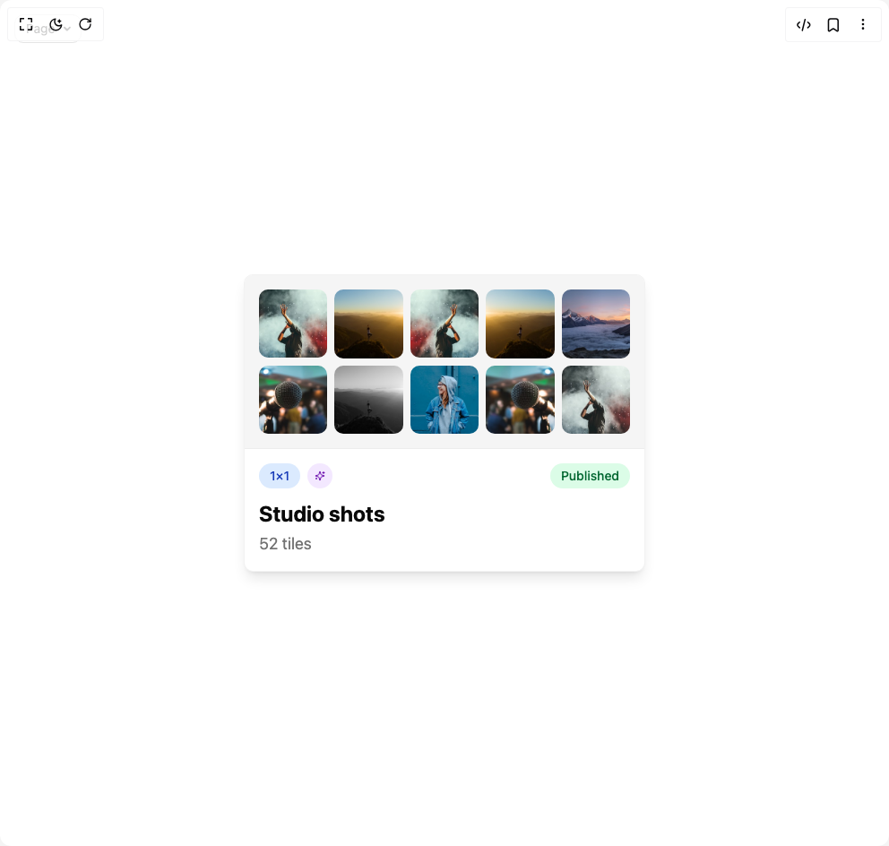

# Build Hover Detail Card in BuilderStudio

> Build this component in our Agentic IDE: [BuilderStudio](https://builderstudio.dev).
>
> Join the BuilderStudio community on [Discord](https://discord.gg/QdWeSGCqfe) and [Reddit](https://reddit.com/r/builderstudio).



## Component

- Author group: `isaiahbjork`
- Component: `hover-detail-card`
- Variant: `default`
- Rendered HTML snapshot: [`rendered.html`](rendered.html)

## BuilderStudio prompt

You are implementing a React component based on a component reference.

## Component identity

- Author: isaiahbjork
- Component slug: hover-detail-card
- Demo slug: default
- Title: hover-detail-card
- Description: 

## Goal

Recreate this component in a React + TypeScript + Tailwind CSS project. Preserve the visual layout, spacing, colors, border radius, shadows, interaction behavior, animation behavior, responsive behavior, and dark mode behavior shown in the rendered demo.

## Implementation requirements

- Use React and TypeScript.
- Use Tailwind CSS classes whenever possible.
- Keep the component self-contained unless the source files require helper components.
- If the source uses CSS variables, custom CSS, animations, or keyframes, include them.
- If the source uses external packages, list and use the required packages.
- Preserve accessibility attributes, button semantics, links, keyboard behavior, and ARIA attributes when visible in the source.
- Do not replace the component with a simplified placeholder.
- Return complete production-ready code.

## Dependencies

No reference metadata available.

## Rendered DOM snapshot

This is the rendered demo HTML extracted from the live preview. Use it to verify structure, class names, visible content, and layout.

```html
<div id="root"><div class="fixed top-4 left-4 z-10"><select class="appearance-none h-8 max-w-[200px] text-sm leading-tight rounded-lg pl-3 pr-7 py-0 border bg-background focus:outline-none focus:ring-0"><option value="default_Page">Page</option></select><div class="absolute top-1/2 transform -translate-y-1/2 right-2 pointer-events-none"><svg class="w-4 h-4 fill-current" viewBox="0 0 20 20"><path d="M5.516 7.548c.436-.446 1.043-.48 1.576 0L10 10.405l2.908-2.857c.533-.48 1.14-.446 1.576 0 .436.445.408 1.197 0 1.615l-3.734 3.705c-.533.534-1.39.534-1.923 0l-3.734-3.705c-.408-.418-.436-1.17 0-1.615z"></path></svg></div></div><div class="w-screen min-h-screen flex justify-center items-center"><div class="min-h-screen p-4 bg-background flex items-center justify-center"><div class="w-full max-w-md" style="opacity: 1; transform: none;"><div class="bg-card border border-border/50 rounded-lg overflow-hidden shadow-lg hover:shadow-xl transition-shadow duration-300" style="opacity: 1; filter: blur(0px); transform: none;"><div class="bg-muted p-4 border-b border-border/50 relative" style="opacity: 1; filter: blur(0px); transform: none;"><div class="grid grid-cols-5 gap-2 relative"><div class="relative aspect-square overflow-hidden rounded-lg" style="opacity: 1; transform: none;"></div><div class="relative aspect-square overflow-hidden rounded-lg" style="opacity: 1; transform: none;"></div><div class="relative aspect-square overflow-hidden rounded-lg" style="opacity: 1; transform: none;"></div><div class="relative aspect-square overflow-hidden rounded-lg" style="opacity: 1; transform: none;"></div><div class="relative aspect-square overflow-hidden rounded-lg" style="opacity: 1; transform: none;"></div><div class="relative aspect-square overflow-hidden rounded-lg" style="opacity: 1; transform: none;"></div><div class="relative aspect-square overflow-hidden rounded-lg" style="opacity: 1; transform: none;"></div><div class="relative aspect-square overflow-hidden rounded-lg" style="opacity: 1; transform: none;"></div><div class="relative aspect-square overflow-hidden rounded-lg" style="opacity: 1; transform: none;"></div><div class="relative aspect-square overflow-hidden rounded-lg" style="opacity: 1; transform: none;"></div></div></div><div class="p-4" style="opacity: 1;"><div class="flex items-center justify-between mb-3" style="opacity: 1; filter: blur(0px); transform: none;"><div class="flex items-center gap-2" style="opacity: 1;"><div class="bg-blue-100 text-blue-800 px-3 py-1 rounded-full text-sm font-medium" style="opacity: 1; filter: blur(0px); transform: none;">1×1</div><div class="bg-purple-100 text-purple-800 p-2 rounded-full" style="opacity: 1; filter: blur(0px); transform: none;"><svg xmlns="http://www.w3.org/2000/svg" width="24" height="24" viewBox="0 0 24 24" fill="none" stroke="currentColor" stroke-width="2" stroke-linecap="round" stroke-linejoin="round" class="lucide lucide-sparkles w-3 h-3" aria-hidden="true"><path d="M9.937 15.5A2 2 0 0 0 8.5 14.063l-6.135-1.582a.5.5 0 0 1 0-.962L8.5 9.936A2 2 0 0 0 9.937 8.5l1.582-6.135a.5.5 0 0 1 .963 0L14.063 8.5A2 2 0 0 0 15.5 9.937l6.135 1.581a.5.5 0 0 1 0 .964L15.5 14.063a2 2 0 0 0-1.437 1.437l-1.582 6.135a.5.5 0 0 1-.963 0z"></path><path d="M20 3v4"></path><path d="M22 5h-4"></path><path d="M4 17v2"></path><path d="M5 18H3"></path></svg></div></div><div class="bg-green-100 text-green-800 px-3 py-1 rounded-full text-sm font-medium" style="opacity: 1; filter: blur(0px); transform: none;">Published</div></div><div style="opacity: 1;"><h3 class="text-2xl font-bold text-foreground mb-1" style="opacity: 1; filter: blur(0px); transform: none;">Studio shots</h3><p class="text-muted-foreground text-lg" style="opacity: 1; filter: blur(0px); transform: none;">52 tiles</p></div></div></div></div></div></div></div>
```

## Reference source files

No reference source files were available.
