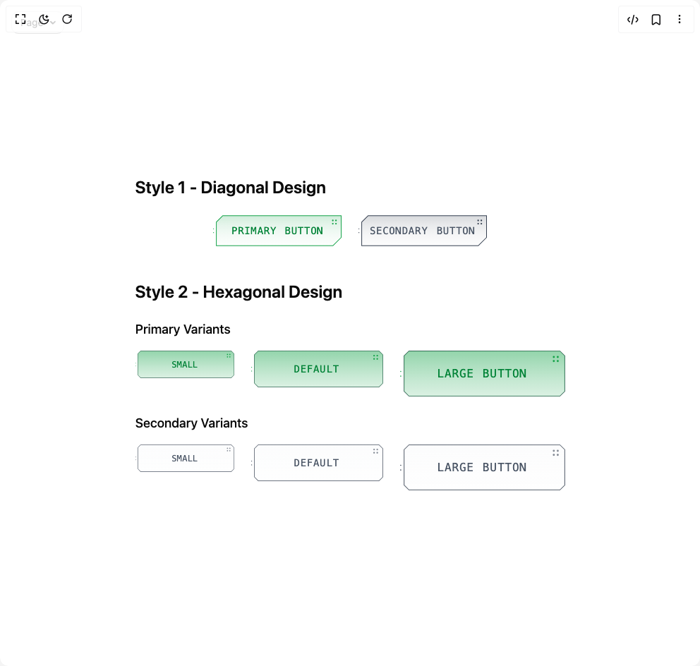

# Build Hud Button in BuilderStudio

> Build this component in our Agentic IDE: [BuilderStudio](https://builderstudio.dev).
>
> Join the BuilderStudio community on [Discord](https://discord.gg/QdWeSGCqfe) and [Reddit](https://reddit.com/r/builderstudio).



## Component

- Author group: `isaiahbjork`
- Component: `hud-button`
- Variant: `default`
- Rendered HTML snapshot: [`rendered.html`](rendered.html)

## BuilderStudio prompt

You are implementing a React component based on a component reference.

## Component identity

- Author: isaiahbjork
- Component slug: hud-button
- Demo slug: default
- Title: hud-button
- Description: 

## Goal

Recreate this component in a React + TypeScript + Tailwind CSS project. Preserve the visual layout, spacing, colors, border radius, shadows, interaction behavior, animation behavior, responsive behavior, and dark mode behavior shown in the rendered demo.

## Implementation requirements

- Use React and TypeScript.
- Use Tailwind CSS classes whenever possible.
- Keep the component self-contained unless the source files require helper components.
- If the source uses CSS variables, custom CSS, animations, or keyframes, include them.
- If the source uses external packages, list and use the required packages.
- Preserve accessibility attributes, button semantics, links, keyboard behavior, and ARIA attributes when visible in the source.
- Do not replace the component with a simplified placeholder.
- Return complete production-ready code.

## Dependencies

No reference metadata available.

## Rendered DOM snapshot

This is the rendered demo HTML extracted from the live preview. Use it to verify structure, class names, visible content, and layout.

```html
<div id="root"><div class="fixed top-4 left-4 z-10"><select class="appearance-none h-8 max-w-[200px] text-sm leading-tight rounded-lg pl-3 pr-7 py-0 border bg-background focus:outline-none focus:ring-0"><option value="default_Page">Page</option></select><div class="absolute top-1/2 transform -translate-y-1/2 right-2 pointer-events-none"><svg class="w-4 h-4 fill-current" viewBox="0 0 20 20"><path d="M5.516 7.548c.436-.446 1.043-.48 1.576 0L10 10.405l2.908-2.857c.533-.48 1.14-.446 1.576 0 .436.445.408 1.197 0 1.615l-3.734 3.705c-.533.534-1.39.534-1.923 0l-3.734-3.705c-.408-.418-.436-1.17 0-1.615z"></path></svg></div></div><div class="w-screen min-h-screen flex justify-center items-center"><div class="min-h-screen p-8 bg-background flex items-center justify-center"><div class="max-w-6xl w-full space-y-12" style="opacity: 1;"><div class="space-y-6" style="opacity: 1; transform: none;"><h2 class="text-2xl font-semibold text-foreground">Style 1 - Diagonal Design</h2><div class="flex flex-wrap gap-6 justify-center"><button class="relative cursor-pointer transform-gpu" tabindex="0" style="width: 182px; height: 44px; perspective: 1000px; opacity: 1; filter: blur(0px); transform: none;"><div class="absolute inset-0 rounded-lg" style="background: radial-gradient(circle, rgba(22, 163, 74, 0.2) 0%, transparent 70%); filter: blur(10px); opacity: 0; transform: scale(0.8);"></div><div class="absolute inset-0 overflow-hidden rounded-lg"><div class="absolute inset-0" style="background: linear-gradient(90deg, transparent, rgba(255, 255, 255, 0.2), transparent); width: 30%; height: 100%; opacity: 0; transform: translateX(100%);"></div></div><div class="relative cursor-pointer h-full w-full" style="transform-style: preserve-3d;"><svg xmlns="http://www.w3.org/2000/svg" width="182.288" height="43.721" viewBox="0 0 182.288 43.721" class="w-full h-full"><defs><linearGradient id="gradient-«r0»" x1="93.198" y1="-53.343" x2="93.198" y2="68.841" gradientUnits="userSpaceOnUse"><stop offset="0" stop-color="#16a34a"></stop><stop offset="0.005" stop-color="#16a34a" stop-opacity="0.986"></stop><stop offset="0.085" stop-color="#16a34a" stop-opacity="0.781"></stop><stop offset="0.17" stop-color="#16a34a" stop-opacity="0.596"></stop><stop offset="0.258" stop-color="#16a34a" stop-opacity="0.436"></stop><stop offset="0.351" stop-color="#16a34a" stop-opacity="0.301"></stop><stop offset="0.449" stop-color="#16a34a" stop-opacity="0.191"></stop><stop offset="0.554" stop-color="#16a34a" stop-opacity="0.106"></stop><stop offset="0.669" stop-color="#16a34a" stop-opacity="0.046"></stop><stop offset="0.804" stop-color="#16a34a" stop-opacity="0.011"></stop><stop offset="1" stop-color="#16a34a" stop-opacity="0"></stop></linearGradient></defs><g><g><path d="M181.788.5H13.7L4.609,9.593V43.221H170.048l11.74-11.74Z" fill="url(#gradient-«r0»)" opacity="1" pathLength="1" stroke-dashoffset="0px" stroke-dasharray="1px 1px"></path><path d="M170.256,43.721H4.108V9.386L13.494,0H182.288V31.688Zm-165.148-1H169.842l11.446-11.447V1H13.908l-8.8,8.8Z" fill="#16a34a" opacity="1" pathLength="1" stroke-dashoffset="0px" stroke-dasharray="1px 1px"></path><g><circle cx="169.908" cy="7.326" r="1.161" fill="#16a34a" opacity="1" filter="blur(0px)" style="transform: none; transform-origin: 50% 50%; transform-box: fill-box;"></circle><circle cx="169.908" cy="11.908" r="1.161" fill="#16a34a" opacity="1" filter="blur(0px)" style="transform: none; transform-origin: 50% 50%; transform-box: fill-box;"></circle><circle cx="174.373" cy="7.326" r="1.161" fill="#16a34a" opacity="1" filter="blur(0px)" style="transform: none; transform-origin: 50% 50%; transform-box: fill-box;"></circle><circle cx="174.373" cy="11.908" r="1.161" fill="#16a34a" opacity="1" filter="blur(0px)" style="transform: none; transform-origin: 50% 50%; transform-box: fill-box;"></circle></g></g><g><circle cx="0.621" cy="19.214" r="0.621" fill="#16a34a" opacity="1" filter="blur(0px)" style="transform: none; transform-origin: 50% 50%; transform-box: fill-box;"></circle><circle cx="0.621" cy="24.506" r="0.621" fill="#16a34a" opacity="1" filter="blur(0px)" style="transform: none; transform-origin: 50% 50%; transform-box: fill-box;"></circle></g></g></svg><div class="absolute inset-0 flex items-center justify-center"><div style="opacity: 1; transform: none;"><div class="flex scale-100 cursor-default overflow-hidden py-2"><span class="font-mono cursor-pointer text-sm tracking-wider text-green-700" style="opacity: 1; transform: none;">P</span><span class="font-mono cursor-pointer text-sm tracking-wider text-green-700" style="opacity: 1; transform: none;">R</span><span class="font-mono cursor-pointer text-sm tracking-wider text-green-700" style="opacity: 1; transform: none;">I</span><span class="font-mono cursor-pointer text-sm tracking-wider text-green-700" style="opacity: 1; transform: none;">M</span><span class="font-mono cursor-pointer text-sm tracking-wider text-green-700" style="opacity: 1; transform: none;">A</span><span class="font-mono cursor-pointer text-sm tracking-wider text-green-700" style="opacity: 1; transform: none;">R</span><span class="font-mono cursor-pointer text-sm tracking-wider text-green-700" style="opacity: 1; transform: none;">Y</span><span class="font-mono w-3 cursor-pointer text-sm tracking-wider text-green-700" style="opacity: 1; transform: none;"> </span><span class="font-mono cursor-pointer text-sm tracking-wider text-green-700" style="opacity: 1; transform: none;">B</span><span class="font-mono cursor-pointer text-sm tracking-wider text-green-700" style="opacity: 1; transform: none;">U</span><span class="font-mono cursor-pointer text-sm tracking-wider text-green-700" style="opacity: 1; transform: none;">T</span><span class="font-mono cursor-pointer text-sm tracking-wider text-green-700" style="opacity: 1; transform: none;">T</span><span class="font-mono cursor-pointer text-sm tracking-wider text-green-700" style="opacity: 1; transform: none;">O</span><span class="font-mono cursor-pointer text-sm tracking-wider text-green-700" style="opacity: 1; transform: none;">N</span></div></div></div></div></button><button class="relative cursor-pointer transform-gpu" tabindex="0" style="width: 182px; height: 44px; perspective: 1000px; opacity: 1; filter: blur(0px); transform: none;"><div class="absolute inset-0 rounded-lg" style="background: radial-gradient(circle, rgba(55, 65, 81, 0.1) 0%, transparent 70%); filter: blur(10px); opacity: 0; transform: scale(0.8);"></div><div class="relative cursor-pointer h-full w-full" style="transform-style: preserve-3d;"><svg xmlns="http://www.w3.org/2000/svg" width="182.288" height="43.721" viewBox="0 0 182.288 43.721" class="w-full h-full"><defs><linearGradient id="gradient-«rf»" x1="93.198" y1="-53.343" x2="93.198" y2="68.841" gradientUnits="userSpaceOnUse"><stop offset="0" stop-color="#374151"></stop><stop offset="0.005" stop-color="#374151" stop-opacity="0.986"></stop><stop offset="0.085" stop-color="#374151" stop-opacity="0.781"></stop><stop offset="0.17" stop-color="#374151" stop-opacity="0.596"></stop><stop offset="0.258" stop-color="#374151" stop-opacity="0.436"></stop><stop offset="0.351" stop-color="#374151" stop-opacity="0.301"></stop><stop offset="0.449" stop-color="#374151" stop-opacity="0.191"></stop><stop offset="0.554" stop-color="#374151" stop-opacity="0.106"></stop><stop offset="0.669" stop-color="#374151" stop-opacity="0.046"></stop><stop offset="0.804" stop-color="#374151" stop-opacity="0.011"></stop><stop offset="1" stop-color="#374151" stop-opacity="0"></stop></linearGradient></defs><g><g><path d="M181.788.5H13.7L4.609,9.593V43.221H170.048l11.74-11.74Z" fill="url(#gradient-«rf»)" opacity="1" pathLength="1" stroke-dashoffset="0px" stroke-dasharray="1px 1px"></path><path d="M170.256,43.721H4.108V9.386L13.494,0H182.288V31.688Zm-165.148-1H169.842l11.446-11.447V1H13.908l-8.8,8.8Z" fill="#374151" opacity="1" pathLength="1" stroke-dashoffset="0px" stroke-dasharray="1px 1px"></path><g><circle cx="169.908" cy="7.326" r="1.161" fill="#374151" opacity="1" filter="blur(0px)" style="transform: none; transform-origin: 50% 50%; transform-box: fill-box;"></circle><circle cx="169.908" cy="11.908" r="1.161" fill="#374151" opacity="1" filter="blur(0px)" style="transform: none; transform-origin: 50% 50%; transform-box: fill-box;"></circle><circle cx="174.373" cy="7.326" r="1.161" fill="#374151" opacity="1" filter="blur(0px)" style="transform: none; transform-origin: 50% 50%; transform-box: fill-box;"></circle><circle cx="174.373" cy="11.908" r="1.161" fill="#374151" opacity="1" filter="blur(0px)" style="transform: none; transform-origin: 50% 50%; transform-box: fill-box;"></circle></g></g><g><circle cx="0.621" cy="19.214" r="0.621" fill="#374151" opacity="1" filter="blur(0px)" style="transform: none; transform-origin: 50% 50%; transform-box: fill-box;"></circle><circle cx="0.621" cy="24.506" r="0.621" fill="#374151" opacity="1" filter="blur(0px)" style="transform: none; transform-origin: 50% 50%; transform-box: fill-box;"></circle></g></g></svg><div class="absolute inset-0 flex items-center justify-center"><div style="opacity: 1; transform: none;"><div class="flex scale-100 cursor-default overflow-hidden py-2"><span class="font-mono cursor-pointer text-sm tracking-wider text-gray-600" style="opacity: 1; transform: none;">S</span><span class="font-mono cursor-pointer text-sm tracking-wider text-gray-600" style="opacity: 1; transform: none;">E</span><span class="font-mono cursor-pointer text-sm tracking-wider text-gray-600" style="opacity: 1; transform: none;">C</span><span class="font-mono cursor-pointer text-sm tracking-wider text-gray-600" style="opacity: 1; transform: none;">O</span><span class="font-mono cursor-pointer text-sm tracking-wider text-gray-600" style="opacity: 1; transform: none;">N</span><span class="font-mono cursor-pointer text-sm tracking-wider text-gray-600" style="opacity: 1; transform: none;">D</span><span class="font-mono cursor-pointer text-sm tracking-wider text-gray-600" style="opacity: 1; transform: none;">A</span><span class="font-mono cursor-pointer text-sm tracking-wider text-gray-600" style="opacity: 1; transform: none;">R</span><span class="font-mono cursor-pointer text-sm tracking-wider text-gray-600" style="opacity: 1; transform: none;">Y</span><span class="font-mono w-3 cursor-pointer text-sm tracking-wider text-gray-600" style="opacity: 1; transform: none;"> </span><span class="font-mono cursor-pointer text-sm tracking-wider text-gray-600" style="opacity: 1; transform: none;">B</span><span class="font-mono cursor-pointer text-sm tracking-wider text-gray-600" style="opacity: 1; transform: none;">U</span><span class="font-mono cursor-pointer text-sm tracking-wider text-gray-600" style="opacity: 1; transform: none;">T</span><span class="font-mono cursor-pointer text-sm tracking-wider text-gray-600" style="opacity: 1; transform: none;">T</span><span class="font-mono cursor-pointer text-sm tracking-wider text-gray-600" style="opacity: 1; transform: none;">O</span><span class="font-mono cursor-pointer text-sm tracking-wider text-gray-600" style="opacity: 1; transform: none;">N</span></div></div></div></div></button></div></div><div class="space-y-6" style="opacity: 1; transform: none;"><h2 class="text-2xl font-semibold text-foreground">Style 2 - Hexagonal Design</h2><div class="space-y-4"><h3 class="text-lg font-medium text-foreground">Primary Variants</h3><div class="flex flex-wrap gap-6 justify-center"><button class="relative cursor-pointer transform-gpu" tabindex="0" style="width: 140px; height: 39px; perspective: 1000px; opacity: 1; filter: blur(0px); transform: none;"><div class="absolute inset-0 rounded-lg" style="background: radial-gradient(circle, rgba(22, 163, 74, 0.2) 0%, transparent 70%); filter: blur(10px); opacity: 0; transform: scale(0.8);"></div><div class="absolute inset-0 overflow-hidden rounded-lg"><div class="absolute inset-0" style="background: linear-gradient(90deg, transparent, rgba(255, 255, 255, 0.2), transparent); width: 30%; height: 100%; opacity: 0; transform: translateX(100%);"></div></div><div class="relative cursor-pointer h-full w-full" style="transform-style: preserve-3d;"><svg width="140px" height="39px" viewBox="0 0 187 52" fill="none" xmlns="http://www.w3.org/2000/svg" class="w-full h-full"><defs><linearGradient id="gradient1-«r10»" x1="94.9995" y1="-62.017" x2="94.9995" y2="80.9853" gradientUnits="userSpaceOnUse"><stop stop-color="#16a34a" stop-opacity="0.95"></stop><stop offset="0.005" stop-color="#16a34a" stop-opacity="0.92"></stop><stop offset="0.085" stop-color="#16a34a" stop-opacity="0.85"></stop><stop offset="0.17" stop-color="#16a34a" stop-opacity="0.75"></stop><stop offset="0.258" stop-color="#16a34a" stop-opacity="0.65"></stop><stop offset="0.351" stop-color="#16a34a" stop-opacity="0.55"></stop><stop offset="0.449" stop-color="#16a34a" stop-opacity="0.45"></stop><stop offset="0.554" stop-color="#16a34a" stop-opacity="0.35"></stop><stop offset="0.669" stop-color="#16a34a" stop-opacity="0.25"></stop><stop offset="0.804" stop-color="#16a34a" stop-opacity="0.15"></stop><stop offset="1" stop-color="#16a34a" stop-opacity="0"></stop></linearGradient><linearGradient id="gradient2-«r10»" x1="95.4995" y1="-65.5377" x2="95.4995" y2="83.1847" gradientUnits="userSpaceOnUse"><stop stop-color="#16a34a" stop-opacity="0.8"></stop><stop offset="0.005" stop-color="#16a34a" stop-opacity="0.75"></stop><stop offset="0.085" stop-color="#16a34a" stop-opacity="0.65"></stop><stop offset="0.17" stop-color="#16a34a" stop-opacity="0.55"></stop><stop offset="0.258" stop-color="#16a34a" stop-opacity="0.45"></stop><stop offset="0.351" stop-color="#16a34a" stop-opacity="0.35"></stop><stop offset="0.449" stop-color="#16a34a" stop-opacity="0.25"></stop><stop offset="0.554" stop-color="#16a34a" stop-opacity="0.18"></stop><stop offset="0.669" stop-color="#16a34a" stop-opacity="0.12"></stop><stop offset="0.804" stop-color="#16a34a" stop-opacity="0.06"></stop><stop offset="1" stop-color="#16a34a" stop-opacity="0"></stop></linearGradient></defs><circle cx="174.161" cy="7.161" r="1.161" fill="#16a34a" opacity="1" filter="blur(0px)" style="transform: none; transform-origin: 50% 50%; transform-box: fill-box;"></circle><circle cx="174.161" cy="11.739" r="1.161" fill="#16a34a" opacity="1" filter="blur(0px)" style="transform: none; transform-origin: 50% 50%; transform-box: fill-box;"></circle><circle cx="178.63" cy="7.161" r="1.161" fill="#16a34a" opacity="1" filter="blur(0px)" style="transform: none; transform-origin: 50% 50%; transform-box: fill-box;"></circle><circle cx="178.63" cy="11.739" r="1.161" fill="#16a34a" opacity="1" filter="blur(0px)" style="transform: none; transform-origin: 50% 50%; transform-box: fill-box;"></circle><path d="M4.5 6L10 0.5H181L186.5 6V46L181 51.5H10L4.5 45.7834V6Z" fill="url(#gradient1-«r10»)" stroke="#16a34a" stroke-width="0.5" opacity="1" pathLength="1" stroke-dashoffset="0px" stroke-dasharray="1px 1px"></path><circle cx="0.621" cy="23.621" r="0.621" fill="#16a34a" opacity="1" filter="blur(0px)" style="transform: none; transform-origin: 50% 50%; transform-box: fill-box;"></circle><circle cx="0.621" cy="28.91" r="0.621" fill="#16a34a" opacity="1" filter="blur(0px)" style="transform: none; transform-origin: 50% 50%; transform-box: fill-box;"></circle><path d="M181.07 52H9.9311L4 46.1001V5.8994L9.9311 0H181.07L187 5.8994V46.1001L181.07 52ZM10.1235 51.5332H180.876L186.531 45.9069V6.09266L180.876 0.466799L10 0.5L4.5 6L4.46916 45.9069L10.1235 51.5332Z" fill="#374151" opacity="1" pathLength="1" stroke-dashoffset="0px" stroke-dasharray="1px 1px"></path><path d="M181.07 52H9.9311L4 46.1001V5.8994L9.9311 0H181.07L187 5.8994V46.1001L181.07 52ZM10.1235 51.5332H180.876L186.531 45.9069V6.09266L180.876 0.466799L10 0.5L4.5 6L4.46916 45.9069L10.1235 51.5332Z" fill="url(#gradient2-«r10»)" opacity="1" pathLength="1" stroke-dashoffset="0px" stroke-dasharray="1px 1px"></path></svg><div class="absolute inset-0 flex items-center justify-center"><div style="opacity: 1; transform: none;"><div class="flex scale-100 cursor-default overflow-hidden py-2"><span class="font-mono cursor-pointer text-xs tracking-wide text-green-700" style="opacity: 1; transform: none;">S</span><span class="font-mono cursor-pointer text-xs tracking-wide text-green-700" style="opacity: 1; transform: none;">M</span><span class="font-mono cursor-pointer text-xs tracking-wide text-green-700" style="opacity: 1; transform: none;">A</span><span class="font-mono cursor-pointer text-xs tracking-wide text-green-700" style="opacity: 1; transform: none;">L</span><span class="font-mono cursor-pointer text-xs tracking-wide text-green-700" style="opacity: 1; transform: none;">L</span></div></div></div></div></button><button class="relative cursor-pointer transform-gpu" tabindex="0" style="width: 187px; height: 52px; perspective: 1000px; opacity: 1; filter: blur(0px); transform: none;"><div class="absolute inset-0 rounded-lg" style="background: radial-gradient(circle, rgba(22, 163, 74, 0.2) 0%, transparent 70%); filter: blur(10px); opacity: 0; transform: scale(0.8);"></div><div class="absolute inset-0 overflow-hidden rounded-lg"><div class="absolute inset-0" style="background: linear-gradient(90deg, transparent, rgba(255, 255, 255, 0.2), transparent); width: 30%; height: 100%; opacity: 0; transform: translateX(100%);"></div></div><div class="relative cursor-pointer h-full w-full" style="transform-style: preserve-3d;"><svg width="187px" height="52px" viewBox="0 0 187 52" fill="none" xmlns="http://www.w3.org/2000/svg" class="w-full h-full"><defs><linearGradient id="gradient1-«r16»" x1="94.9995" y1="-62.017" x2="94.9995" y2="80.9853" gradientUnits="userSpaceOnUse"><stop stop-color="#16a34a" stop-opacity="0.95"></stop><stop offset="0.005" stop-color="#16a34a" stop-opacity="0.92"></stop><stop offset="0.085" stop-color="#16a34a" stop-opacity="0.85"></stop><stop offset="0.17" stop-color="#16a34a" stop-opacity="0.75"></stop><stop offset="0.258" stop-color="#16a34a" stop-opacity="0.65"></stop><stop offset="0.351" stop-color="#16a34a" stop-opacity="0.55"></stop><stop offset="0.449" stop-color="#16a34a" stop-opacity="0.45"></stop><stop offset="0.554" stop-color="#16a34a" stop-opacity="0.35"></stop><stop offset="0.669" stop-color="#16a34a" stop-opacity="0.25"></stop><stop offset="0.804" stop-color="#16a34a" stop-opacity="0.15"></stop><stop offset="1" stop-color="#16a34a" stop-opacity="0"></stop></linearGradient><linearGradient id="gradient2-«r16»" x1="95.4995" y1="-65.5377" x2="95.4995" y2="83.1847" gradientUnits="userSpaceOnUse"><stop stop-color="#16a34a" stop-opacity="0.8"></stop><stop offset="0.005" stop-color="#16a34a" stop-opacity="0.75"></stop><stop offset="0.085" stop-color="#16a34a" stop-opacity="0.65"></stop><stop offset="0.17" stop-color="#16a34a" stop-opacity="0.55"></stop><stop offset="0.258" stop-color="#16a34a" stop-opacity="0.45"></stop><stop offset="0.351" stop-color="#16a34a" stop-opacity="0.35"></stop><stop offset="0.449" stop-color="#16a34a" stop-opacity="0.25"></stop><stop offset="0.554" stop-color="#16a34a" stop-opacity="0.18"></stop><stop offset="0.669" stop-color="#16a34a" stop-opacity="0.12"></stop><stop offset="0.804" stop-color="#16a34a" stop-opacity="0.06"></stop><stop offset="1" stop-color="#16a34a" stop-opacity="0"></stop></linearGradient></defs><circle cx="174.161" cy="7.161" r="1.161" fill="#16a34a" opacity="1" filter="blur(0px)" style="transform: none; transform-origin: 50% 50%; transform-box: fill-box;"></circle><circle cx="174.161" cy="11.739" r="1.161" fill="#16a34a" opacity="1" filter="blur(0px)" style="transform: none; transform-origin: 50% 50%; transform-box: fill-box;"></circle><circle cx="178.63" cy="7.161" r="1.161" fill="#16a34a" opacity="1" filter="blur(0px)" style="transform: none; transform-origin: 50% 50%; transform-box: fill-box;"></circle><circle cx="178.63" cy="11.739" r="1.161" fill="#16a34a" opacity="1" filter="blur(0px)" style="transform: none; transform-origin: 50% 50%; transform-box: fill-box;"></circle><path d="M4.5 6L10 0.5H181L186.5 6V46L181 51.5H10L4.5 45.7834V6Z" fill="url(#gradient1-«r16»)" stroke="#16a34a" stroke-width="0.5" opacity="1" pathLength="1" stroke-dashoffset="0px" stroke-dasharray="1px 1px"></path><circle cx="0.621" cy="23.621" r="0.621" fill="#16a34a" opacity="1" filter="blur(0px)" style="transform: none; transform-origin: 50% 50%; transform-box: fill-box;"></circle><circle cx="0.621" cy="28.91" r="0.621" fill="#16a34a" opacity="1" filter="blur(0px)" style="transform: none; transform-origin: 50% 50%; transform-box: fill-box;"></circle><path d="M181.07 52H9.9311L4 46.1001V5.8994L9.9311 0H181.07L187 5.8994V46.1001L181.07 52ZM10.1235 51.5332H180.876L186.531 45.9069V6.09266L180.876 0.466799L10 0.5L4.5 6L4.46916 45.9069L10.1235 51.5332Z" fill="#374151" opacity="1" pathLength="1" stroke-dashoffset="0px" stroke-dasharray="1px 1px"></path><path d="M181.07 52H9.9311L4 46.1001V5.8994L9.9311 0H181.07L187 5.8994V46.1001L181.07 52ZM10.1235 51.5332H180.876L186.531 45.9069V6.09266L180.876 0.466799L10 0.5L4.5 6L4.46916 45.9069L10.1235 51.5332Z" fill="url(#gradient2-«r16»)" opacity="1" pathLength="1" stroke-dashoffset="0px" stroke-dasharray="1px 1px"></path></svg><div class="absolute inset-0 flex items-center justify-center"><div style="opacity: 1; transform: none;"><div class="flex scale-100 cursor-default overflow-hidden py-2"><span class="font-mono cursor-pointer text-sm tracking-wider text-green-700" style="opacity: 1; transform: none;">D</span><span class="font-mono cursor-pointer text-sm tracking-wider text-green-700" style="opacity: 1; transform: none;">E</span><span class="font-mono cursor-pointer text-sm tracking-wider text-green-700" style="opacity: 1; transform: none;">F</span><span class="font-mono cursor-pointer text-sm tracking-wider text-green-700" style="opacity: 1; transform: none;">A</span><span class="font-mono cursor-pointer text-sm tracking-wider text-green-700" style="opacity: 1; transform: none;">U</span><span class="font-mono cursor-pointer text-sm tracking-wider text-green-700" style="opacity: 1; transform: none;">L</span><span class="font-mono cursor-pointer text-sm tracking-wider text-green-700" style="opacity: 1; transform: none;">T</span></div></div></div></div></button><button class="relative cursor-pointer transform-gpu" tabindex="0" style="width: 234px; height: 65px; perspective: 1000px; opacity: 1; filter: blur(0px); transform: none;"><div class="absolute inset-0 rounded-lg" style="background: radial-gradient(circle, rgba(22, 163, 74, 0.2) 0%, transparent 70%); filter: blur(10px); opacity: 0; transform: scale(0.8);"></div><div class="absolute inset-0 overflow-hidden rounded-lg"><div class="absolute inset-0" style="background: linear-gradient(90deg, transparent, rgba(255, 255, 255, 0.2), transparent); width: 30%; height: 100%; opacity: 0; transform: translateX(100%);"></div></div><div class="relative cursor-pointer h-full w-full" style="transform-style: preserve-3d;"><svg width="234px" height="65px" viewBox="0 0 187 52" fill="none" xmlns="http://www.w3.org/2000/svg" class="w-full h-full"><defs><linearGradient id="gradient1-«r1e»" x1="94.9995" y1="-62.017" x2="94.9995" y2="80.9853" gradientUnits="userSpaceOnUse"><stop stop-color="#16a34a" stop-opacity="0.95"></stop><stop offset="0.005" stop-color="#16a34a" stop-opacity="0.92"></stop><stop offset="0.085" stop-color="#16a34a" stop-opacity="0.85"></stop><stop offset="0.17" stop-color="#16a34a" stop-opacity="0.75"></stop><stop offset="0.258" stop-color="#16a34a" stop-opacity="0.65"></stop><stop offset="0.351" stop-color="#16a34a" stop-opacity="0.55"></stop><stop offset="0.449" stop-color="#16a34a" stop-opacity="0.45"></stop><stop offset="0.554" stop-color="#16a34a" stop-opacity="0.35"></stop><stop offset="0.669" stop-color="#16a34a" stop-opacity="0.25"></stop><stop offset="0.804" stop-color="#16a34a" stop-opacity="0.15"></stop><stop offset="1" stop-color="#16a34a" stop-opacity="0"></stop></linearGradient><linearGradient id="gradient2-«r1e»" x1="95.4995" y1="-65.5377" x2="95.4995" y2="83.1847" gradientUnits="userSpaceOnUse"><stop stop-color="#16a34a" stop-opacity="0.8"></stop><stop offset="0.005" stop-color="#16a34a" stop-opacity="0.75"></stop><stop offset="0.085" stop-color="#16a34a" stop-opacity="0.65"></stop><stop offset="0.17" stop-color="#16a34a" stop-opacity="0.55"></stop><stop offset="0.258" stop-color="#16a34a" stop-opacity="0.45"></stop><stop offset="0.351" stop-color="#16a34a" stop-opacity="0.35"></stop><stop offset="0.449" stop-color="#16a34a" stop-opacity="0.25"></stop><stop offset="0.554" stop-color="#16a34a" stop-opacity="0.18"></stop><stop offset="0.669" stop-color="#16a34a" stop-opacity="0.12"></stop><stop offset="0.804" stop-color="#16a34a" stop-opacity="0.06"></stop><stop offset="1" stop-color="#16a34a" stop-opacity="0"></stop></linearGradient></defs><circle cx="174.161" cy="7.161" r="1.161" fill="#16a34a" opacity="1" filter="blur(0px)" style="transform: none; transform-origin: 50% 50%; transform-box: fill-box;"></circle><circle cx="174.161" cy="11.739" r="1.161" fill="#16a34a" opacity="1" filter="blur(0px)" style="transform: none; transform-origin: 50% 50%; transform-box: fill-box;"></circle><circle cx="178.63" cy="7.161" r="1.161" fill="#16a34a" opacity="1" filter="blur(0px)" style="transform: none; transform-origin: 50% 50%; transform-box: fill-box;"></circle><circle cx="178.63" cy="11.739" r="1.161" fill="#16a34a" opacity="1" filter="blur(0px)" style="transform: none; transform-origin: 50% 50%; transform-box: fill-box;"></circle><path d="M4.5 6L10 0.5H181L186.5 6V46L181 51.5H10L4.5 45.7834V6Z" fill="url(#gradient1-«r1e»)" stroke="#16a34a" stroke-width="0.5" opacity="1" pathLength="1" stroke-dashoffset="0px" stroke-dasharray="1px 1px"></path><circle cx="0.621" cy="23.621" r="0.621" fill="#16a34a" opacity="1" filter="blur(0px)" style="transform: none; transform-origin: 50% 50%; transform-box: fill-box;"></circle><circle cx="0.621" cy="28.91" r="0.621" fill="#16a34a" opacity="1" filter="blur(0px)" style="transform: none; transform-origin: 50% 50%; transform-box: fill-box;"></circle><path d="M181.07 52H9.9311L4 46.1001V5.8994L9.9311 0H181.07L187 5.8994V46.1001L181.07 52ZM10.1235 51.5332H180.876L186.531 45.9069V6.09266L180.876 0.466799L10 0.5L4.5 6L4.46916 45.9069L10.1235 51.5332Z" fill="#374151" opacity="1" pathLength="1" stroke-dashoffset="0px" stroke-dasharray="1px 1px"></path><path d="M181.07 52H9.9311L4 46.1001V5.8994L9.9311 0H181.07L187 5.8994V46.1001L181.07 52ZM10.1235 51.5332H180.876L186.531 45.9069V6.09266L180.876 0.466799L10 0.5L4.5 6L4.46916 45.9069L10.1235 51.5332Z" fill="url(#gradient2-«r1e»)" opacity="1" pathLength="1" stroke-dashoffset="0px" stroke-dasharray="1px 1px"></path></svg><div class="absolute inset-0 flex items-center justify-center"><div style="opacity: 1; transform: none;"><div class="flex scale-100 cursor-default overflow-hidden py-2"><span class="font-mono cursor-pointer text-base tracking-wider text-green-700" style="opacity: 1; transform: none;">L</span><span class="font-mono cursor-pointer text-base tracking-wider text-green-700" style="opacity: 1; transform: none;">A</span><span class="font-mono cursor-pointer text-base tracking-wider text-green-700" style="opacity: 1; transform: none;">R</span><span class="font-mono cursor-pointer text-base tracking-wider text-green-700" style="opacity: 1; transform: none;">G</span><span class="font-mono cursor-pointer text-base tracking-wider text-green-700" style="opacity: 1; transform: none;">E</span><span class="font-mono w-3 cursor-pointer text-base tracking-wider text-green-700" style="opacity: 1; transform: none;"> </span><span class="font-mono cursor-pointer text-base tracking-wider text-green-700" style="opacity: 1; transform: none;">B</span><span class="font-mono cursor-pointer text-base tracking-wider text-green-700" style="opacity: 1; transform: none;">U</span><span class="font-mono cursor-pointer text-base tracking-wider text-green-700" style="opacity: 1; transform: none;">T</span><span class="font-mono cursor-pointer text-base tracking-wider text-green-700" style="opacity: 1; transform: none;">T</span><span class="font-mono cursor-pointer text-base tracking-wider text-green-700" style="opacity: 1; transform: none;">O</span><span class="font-mono cursor-pointer text-base tracking-wider text-green-700" style="opacity: 1; transform: none;">N</span></div></div></div></div></button></div></div><div class="space-y-4"><h3 class="text-lg font-medium text-foreground">Secondary Variants</h3><div class="flex flex-wrap gap-6 justify-center"><button class="relative cursor-pointer transform-gpu" tabindex="0" style="width: 140px; height: 39px; perspective: 1000px; opacity: 1; filter: blur(0px); transform: none;"><div class="absolute inset-0 rounded-lg" style="background: radial-gradient(circle, rgba(55, 65, 81, 0.1) 0%, transparent 70%); filter: blur(10px); opacity: 0; transform: scale(0.8);"></div><div class="relative cursor-pointer h-full w-full" style="transform-style: preserve-3d;"><svg width="140px" height="39px" viewBox="0 0 187 52" fill="none" xmlns="http://www.w3.org/2000/svg" class="w-full h-full"><defs><linearGradient id="gradient1-«r1r»" x1="94.9995" y1="-62.017" x2="94.9995" y2="80.9853" gradientUnits="userSpaceOnUse"><stop stop-color="#f8f9fa" stop-opacity="0.95"></stop><stop offset="0.005" stop-color="#f8f9fa" stop-opacity="0.92"></stop><stop offset="0.085" stop-color="#f8f9fa" stop-opacity="0.85"></stop><stop offset="0.17" stop-color="#f8f9fa" stop-opacity="0.75"></stop><stop offset="0.258" stop-color="#f8f9fa" stop-opacity="0.65"></stop><stop offset="0.351" stop-color="#f8f9fa" stop-opacity="0.55"></stop><stop offset="0.449" stop-color="#f8f9fa" stop-opacity="0.45"></stop><stop offset="0.554" stop-color="#f8f9fa" stop-opacity="0.35"></stop><stop offset="0.669" stop-color="#f8f9fa" stop-opacity="0.25"></stop><stop offset="0.804" stop-color="#f8f9fa" stop-opacity="0.15"></stop><stop offset="1" stop-color="#f8f9fa" stop-opacity="0"></stop></linearGradient><linearGradient id="gradient2-«r1r»" x1="95.4995" y1="-65.5377" x2="95.4995" y2="83.1847" gradientUnits="userSpaceOnUse"><stop stop-color="#e5e7eb" stop-opacity="0.8"></stop><stop offset="0.005" stop-color="#e5e7eb" stop-opacity="0.75"></stop><stop offset="0.085" stop-color="#e5e7eb" stop-opacity="0.65"></stop><stop offset="0.17" stop-color="#e5e7eb" stop-opacity="0.55"></stop><stop offset="0.258" stop-color="#e5e7eb" stop-opacity="0.45"></stop><stop offset="0.351" stop-color="#e5e7eb" stop-opacity="0.35"></stop><stop offset="0.449" stop-color="#e5e7eb" stop-opacity="0.25"></stop><stop offset="0.554" stop-color="#e5e7eb" stop-opacity="0.18"></stop><stop offset="0.669" stop-color="#e5e7eb" stop-opacity="0.12"></stop><stop offset="0.804" stop-color="#e5e7eb" stop-opacity="0.06"></stop><stop offset="1" stop-color="#e5e7eb" stop-opacity="0"></stop></linearGradient></defs><circle cx="174.161" cy="7.161" r="1.161" fill="#374151" opacity="1" filter="blur(0px)" style="transform: none; transform-origin: 50% 50%; transform-box: fill-box;"></circle><circle cx="174.161" cy="11.739" r="1.161" fill="#374151" opacity="1" filter="blur(0px)" style="transform: none; transform-origin: 50% 50%; transform-box: fill-box;"></circle><circle cx="178.63" cy="7.161" r="1.161" fill="#374151" opacity="1" filter="blur(0px)" style="transform: none; transform-origin: 50% 50%; transform-box: fill-box;"></circle><circle cx="178.63" cy="11.739" r="1.161" fill="#374151" opacity="1" filter="blur(0px)" style="transform: none; transform-origin: 50% 50%; transform-box: fill-box;"></circle><path d="M4.5 6L10 0.5H181L186.5 6V46L181 51.5H10L4.5 45.7834V6Z" fill="url(#gradient1-«r1r»)" stroke="#374151" stroke-width="0.5" opacity="1" pathLength="1" stroke-dashoffset="0px" stroke-dasharray="1px 1px"></path><circle cx="0.621" cy="23.621" r="0.621" fill="#374151" opacity="1" filter="blur(0px)" style="transform: none; transform-origin: 50% 50%; transform-box: fill-box;"></circle><circle cx="0.621" cy="28.91" r="0.621" fill="#374151" opacity="1" filter="blur(0px)" style="transform: none; transform-origin: 50% 50%; transform-box: fill-box;"></circle><path d="M181.07 52H9.9311L4 46.1001V5.8994L9.9311 0H181.07L187 5.8994V46.1001L181.07 52ZM10.1235 51.5332H180.876L186.531 45.9069V6.09266L180.876 0.466799L10 0.5L4.5 6L4.46916 45.9069L10.1235 51.5332Z" fill="#374151" opacity="1" pathLength="1" stroke-dashoffset="0px" stroke-dasharray="1px 1px"></path><path d="M181.07 52H9.9311L4 46.1001V5.8994L9.9311 0H181.07L187 5.8994V46.1001L181.07 52ZM10.1235 51.5332H180.876L186.531 45.9069V6.09266L180.876 0.466799L10 0.5L4.5 6L4.46916 45.9069L10.1235 51.5332Z" fill="url(#gradient2-«r1r»)" opacity="1" pathLength="1" stroke-dashoffset="0px" stroke-dasharray="1px 1px"></path></svg><div class="absolute inset-0 flex items-center justify-center"><div style="opacity: 1; transform: none;"><div class="flex scale-100 cursor-default overflow-hidden py-2"><span class="font-mono cursor-pointer text-xs tracking-wide text-gray-600" style="opacity: 1; transform: none;">S</span><span class="font-mono cursor-pointer text-xs tracking-wide text-gray-600" style="opacity: 1; transform: none;">M</span><span class="font-mono cursor-pointer text-xs tracking-wide text-gray-600" style="opacity: 1; transform: none;">A</span><span class="font-mono cursor-pointer text-xs tracking-wide text-gray-600" style="opacity: 1; transform: none;">L</span><span class="font-mono cursor-pointer text-xs tracking-wide text-gray-600" style="opacity: 1; transform: none;">L</span></div></div></div></div></button><button class="relative cursor-pointer transform-gpu" tabindex="0" style="width: 187px; height: 52px; perspective: 1000px; opacity: 1; filter: blur(0px); transform: none;"><div class="absolute inset-0 rounded-lg" style="background: radial-gradient(circle, rgba(55, 65, 81, 0.1) 0%, transparent 70%); filter: blur(10px); opacity: 0; transform: scale(0.8);"></div><div class="relative cursor-pointer h-full w-full" style="transform-style: preserve-3d;"><svg width="187px" height="52px" viewBox="0 0 187 52" fill="none" xmlns="http://www.w3.org/2000/svg" class="w-full h-full"><defs><linearGradient id="gradient1-«r21»" x1="94.9995" y1="-62.017" x2="94.9995" y2="80.9853" gradientUnits="userSpaceOnUse"><stop stop-color="#f8f9fa" stop-opacity="0.95"></stop><stop offset="0.005" stop-color="#f8f9fa" stop-opacity="0.92"></stop><stop offset="0.085" stop-color="#f8f9fa" stop-opacity="0.85"></stop><stop offset="0.17" stop-color="#f8f9fa" stop-opacity="0.75"></stop><stop offset="0.258" stop-color="#f8f9fa" stop-opacity="0.65"></stop><stop offset="0.351" stop-color="#f8f9fa" stop-opacity="0.55"></stop><stop offset="0.449" stop-color="#f8f9fa" stop-opacity="0.45"></stop><stop offset="0.554" stop-color="#f8f9fa" stop-opacity="0.35"></stop><stop offset="0.669" stop-color="#f8f9fa" stop-opacity="0.25"></stop><stop offset="0.804" stop-color="#f8f9fa" stop-opacity="0.15"></stop><stop offset="1" stop-color="#f8f9fa" stop-opacity="0"></stop></linearGradient><linearGradient id="gradient2-«r21»" x1="95.4995" y1="-65.5377" x2="95.4995" y2="83.1847" gradientUnits="userSpaceOnUse"><stop stop-color="#e5e7eb" stop-opacity="0.8"></stop><stop offset="0.005" stop-color="#e5e7eb" stop-opacity="0.75"></stop><stop offset="0.085" stop-color="#e5e7eb" stop-opacity="0.65"></stop><stop offset="0.17" stop-color="#e5e7eb" stop-opacity="0.55"></stop><stop offset="0.258" stop-color="#e5e7eb" stop-opacity="0.45"></stop><stop offset="0.351" stop-color="#e5e7eb" stop-opacity="0.35"></stop><stop offset="0.449" stop-color="#e5e7eb" stop-opacity="0.25"></stop><stop offset="0.554" stop-color="#e5e7eb" stop-opacity="0.18"></stop><stop offset="0.669" stop-color="#e5e7eb" stop-opacity="0.12"></stop><stop offset="0.804" stop-color="#e5e7eb" stop-opacity="0.06"></stop><stop offset="1" stop-color="#e5e7eb" stop-opacity="0"></stop></linearGradient></defs><circle cx="174.161" cy="7.161" r="1.161" fill="#374151" opacity="1" filter="blur(0px)" style="transform: none; transform-origin: 50% 50%; transform-box: fill-box;"></circle><circle cx="174.161" cy="11.739" r="1.161" fill="#374151" opacity="1" filter="blur(0px)" style="transform: none; transform-origin: 50% 50%; transform-box: fill-box;"></circle><circle cx="178.63" cy="7.161" r="1.161" fill="#374151" opacity="1" filter="blur(0px)" style="transform: none; transform-origin: 50% 50%; transform-box: fill-box;"></circle><circle cx="178.63" cy="11.739" r="1.161" fill="#374151" opacity="1" filter="blur(0px)" style="transform: none; transform-origin: 50% 50%; transform-box: fill-box;"></circle><path d="M4.5 6L10 0.5H181L186.5 6V46L181 51.5H10L4.5 45.7834V6Z" fill="url(#gradient1-«r21»)" stroke="#374151" stroke-width="0.5" opacity="1" pathLength="1" stroke-dashoffset="0px" stroke-dasharray="1px 1px"></path><circle cx="0.621" cy="23.621" r="0.621" fill="#374151" opacity="1" filter="blur(0px)" style="transform: none; transform-origin: 50% 50%; transform-box: fill-box;"></circle><circle cx="0.621" cy="28.91" r="0.621" fill="#374151" opacity="1" filter="blur(0px)" style="transform: none; transform-origin: 50% 50%; transform-box: fill-box;"></circle><path d="M181.07 52H9.9311L4 46.1001V5.8994L9.9311 0H181.07L187 5.8994V46.1001L181.07 52ZM10.1235 51.5332H180.876L186.531 45.9069V6.09266L180.876 0.466799L10 0.5L4.5 6L4.46916 45.9069L10.1235 51.5332Z" fill="#374151" opacity="1" pathLength="1" stroke-dashoffset="0px" stroke-dasharray="1px 1px"></path><path d="M181.07 52H9.9311L4 46.1001V5.8994L9.9311 0H181.07L187 5.8994V46.1001L181.07 52ZM10.1235 51.5332H180.876L186.531 45.9069V6.09266L180.876 0.466799L10 0.5L4.5 6L4.46916 45.9069L10.1235 51.5332Z" fill="url(#gradient2-«r21»)" opacity="1" pathLength="1" stroke-dashoffset="0px" stroke-dasharray="1px 1px"></path></svg><div class="absolute inset-0 flex items-center justify-center"><div style="opacity: 1; transform: none;"><div class="flex scale-100 cursor-default overflow-hidden py-2"><span class="font-mono cursor-pointer text-sm tracking-wider text-gray-600" style="opacity: 1; transform: none;">D</span><span class="font-mono cursor-pointer text-sm tracking-wider text-gray-600" style="opacity: 1; transform: none;">E</span><span class="font-mono cursor-pointer text-sm tracking-wider text-gray-600" style="opacity: 1; transform: none;">F</span><span class="font-mono cursor-pointer text-sm tracking-wider text-gray-600" style="opacity: 1; transform: none;">A</span><span class="font-mono cursor-pointer text-sm tracking-wider text-gray-600" style="opacity: 1; transform: none;">U</span><span class="font-mono cursor-pointer text-sm tracking-wider text-gray-600" style="opacity: 1; transform: none;">L</span><span class="font-mono cursor-pointer text-sm tracking-wider text-gray-600" style="opacity: 1; transform: none;">T</span></div></div></div></div></button><button class="relative cursor-pointer transform-gpu" tabindex="0" style="width: 234px; height: 65px; perspective: 1000px; opacity: 1; filter: blur(0px); transform: none;"><div class="absolute inset-0 rounded-lg" style="background: radial-gradient(circle, rgba(55, 65, 81, 0.1) 0%, transparent 70%); filter: blur(10px); opacity: 0; transform: scale(0.8);"></div><div class="relative cursor-pointer h-full w-full" style="transform-style: preserve-3d;"><svg width="234px" height="65px" viewBox="0 0 187 52" fill="none" xmlns="http://www.w3.org/2000/svg" class="w-full h-full"><defs><linearGradient id="gradient1-«r29»" x1="94.9995" y1="-62.017" x2="94.9995" y2="80.9853" gradientUnits="userSpaceOnUse"><stop stop-color="#f8f9fa" stop-opacity="0.95"></stop><stop offset="0.005" stop-color="#f8f9fa" stop-opacity="0.92"></stop><stop offset="0.085" stop-color="#f8f9fa" stop-opacity="0.85"></stop><stop offset="0.17" stop-color="#f8f9fa" stop-opacity="0.75"></stop><stop offset="0.258" stop-color="#f8f9fa" stop-opacity="0.65"></stop><stop offset="0.351" stop-color="#f8f9fa" stop-opacity="0.55"></stop><stop offset="0.449" stop-color="#f8f9fa" stop-opacity="0.45"></stop><stop offset="0.554" stop-color="#f8f9fa" stop-opacity="0.35"></stop><stop offset="0.669" stop-color="#f8f9fa" stop-opacity="0.25"></stop><stop offset="0.804" stop-color="#f8f9fa" stop-opacity="0.15"></stop><stop offset="1" stop-color="#f8f9fa" stop-opacity="0"></stop></linearGradient><linearGradient id="gradient2-«r29»" x1="95.4995" y1="-65.5377" x2="95.4995" y2="83.1847" gradientUnits="userSpaceOnUse"><stop stop-color="#e5e7eb" stop-opacity="0.8"></stop><stop offset="0.005" stop-color="#e5e7eb" stop-opacity="0.75"></stop><stop offset="0.085" stop-color="#e5e7eb" stop-opacity="0.65"></stop><stop offset="0.17" stop-color="#e5e7eb" stop-opacity="0.55"></stop><stop offset="0.258" stop-color="#e5e7eb" stop-opacity="0.45"></stop><stop offset="0.351" stop-color="#e5e7eb" stop-opacity="0.35"></stop><stop offset="0.449" stop-color="#e5e7eb" stop-opacity="0.25"></stop><stop offset="0.554" stop-color="#e5e7eb" stop-opacity="0.18"></stop><stop offset="0.669" stop-color="#e5e7eb" stop-opacity="0.12"></stop><stop offset="0.804" stop-color="#e5e7eb" stop-opacity="0.06"></stop><stop offset="1" stop-color="#e5e7eb" stop-opacity="0"></stop></linearGradient></defs><circle cx="174.161" cy="7.161" r="1.161" fill="#374151" opacity="1" filter="blur(0px)" style="transform: none; transform-origin: 50% 50%; transform-box: fill-box;"></circle><circle cx="174.161" cy="11.739" r="1.161" fill="#374151" opacity="1" filter="blur(0px)" style="transform: none; transform-origin: 50% 50%; transform-box: fill-box;"></circle><circle cx="178.63" cy="7.161" r="1.161" fill="#374151" opacity="1" filter="blur(0px)" style="transform: none; transform-origin: 50% 50%; transform-box: fill-box;"></circle><circle cx="178.63" cy="11.739" r="1.161" fill="#374151" opacity="1" filter="blur(0px)" style="transform: none; transform-origin: 50% 50%; transform-box: fill-box;"></circle><path d="M4.5 6L10 0.5H181L186.5 6V46L181 51.5H10L4.5 45.7834V6Z" fill="url(#gradient1-«r29»)" stroke="#374151" stroke-width="0.5" opacity="1" pathLength="1" stroke-dashoffset="0px" stroke-dasharray="1px 1px"></path><circle cx="0.621" cy="23.621" r="0.621" fill="#374151" opacity="1" filter="blur(0px)" style="transform: none; transform-origin: 50% 50%; transform-box: fill-box;"></circle><circle cx="0.621" cy="28.91" r="0.621" fill="#374151" opacity="1" filter="blur(0px)" style="transform: none; transform-origin: 50% 50%; transform-box: fill-box;"></circle><path d="M181.07 52H9.9311L4 46.1001V5.8994L9.9311 0H181.07L187 5.8994V46.1001L181.07 52ZM10.1235 51.5332H180.876L186.531 45.9069V6.09266L180.876 0.466799L10 0.5L4.5 6L4.46916 45.9069L10.1235 51.5332Z" fill="#374151" opacity="1" pathLength="1" stroke-dashoffset="0px" stroke-dasharray="1px 1px"></path><path d="M181.07 52H9.9311L4 46.1001V5.8994L9.9311 0H181.07L187 5.8994V46.1001L181.07 52ZM10.1235 51.5332H180.876L186.531 45.9069V6.09266L180.876 0.466799L10 0.5L4.5 6L4.46916 45.9069L10.1235 51.5332Z" fill="url(#gradient2-«r29»)" opacity="1" pathLength="1" stroke-dashoffset="0px" stroke-dasharray="1px 1px"></path></svg><div class="absolute inset-0 flex items-center justify-center"><div style="opacity: 1; transform: none;"><div class="flex scale-100 cursor-default overflow-hidden py-2"><span class="font-mono cursor-pointer text-base tracking-wider text-gray-600" style="opacity: 1; transform: none;">L</span><span class="font-mono cursor-pointer text-base tracking-wider text-gray-600" style="opacity: 1; transform: none;">A</span><span class="font-mono cursor-pointer text-base tracking-wider text-gray-600" style="opacity: 1; transform: none;">R</span><span class="font-mono cursor-pointer text-base tracking-wider text-gray-600" style="opacity: 1; transform: none;">G</span><span class="font-mono cursor-pointer text-base tracking-wider text-gray-600" style="opacity: 1; transform: none;">E</span><span class="font-mono w-3 cursor-pointer text-base tracking-wider text-gray-600" style="opacity: 1; transform: none;"> </span><span class="font-mono cursor-pointer text-base tracking-wider text-gray-600" style="opacity: 1; transform: none;">B</span><span class="font-mono cursor-pointer text-base tracking-wider text-gray-600" style="opacity: 1; transform: none;">U</span><span class="font-mono cursor-pointer text-base tracking-wider text-gray-600" style="opacity: 1; transform: none;">T</span><span class="font-mono cursor-pointer text-base tracking-wider text-gray-600" style="opacity: 1; transform: none;">T</span><span class="font-mono cursor-pointer text-base tracking-wider text-gray-600" style="opacity: 1; transform: none;">O</span><span class="font-mono cursor-pointer text-base tracking-wider text-gray-600" style="opacity: 1; transform: none;">N</span></div></div></div></div></button></div></div></div></div></div></div></div>
```

## Reference source files

No reference source files were available.
