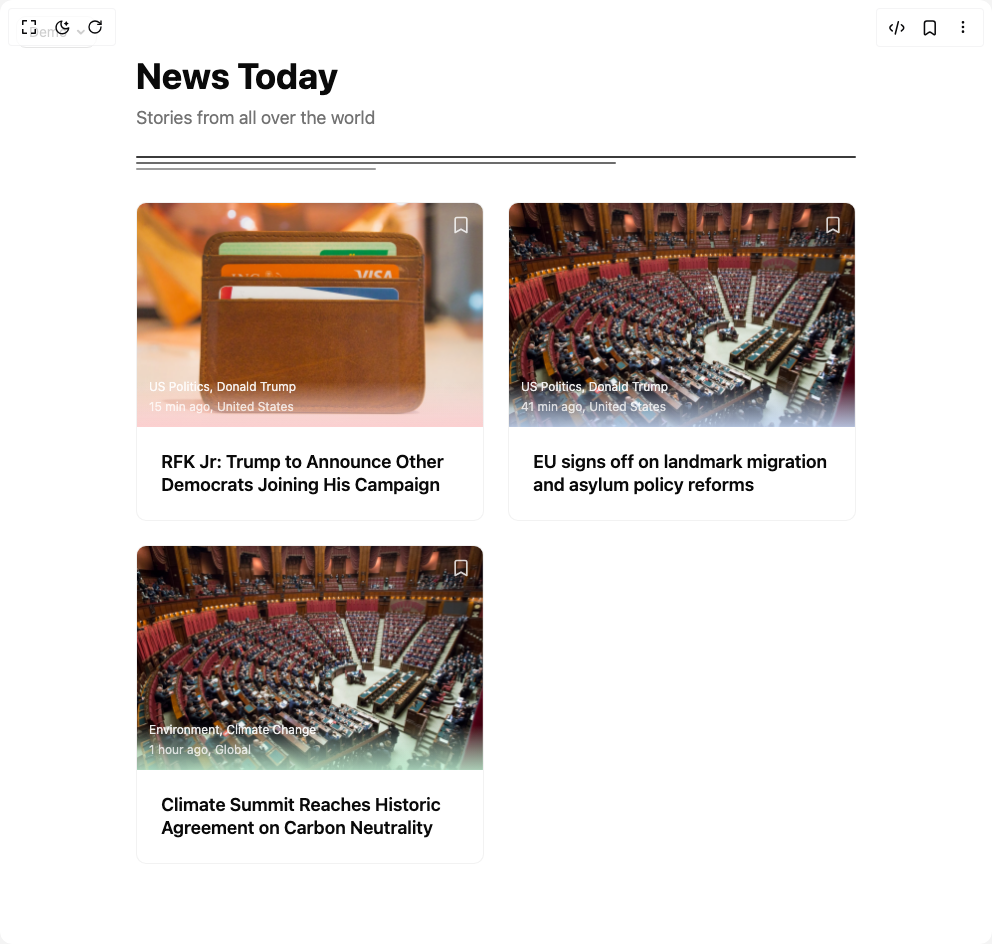

# Build News Cards in BuilderStudio

> Build this component in our Agentic IDE: [BuilderStudio](https://builderstudio.dev).
>
> Join the BuilderStudio community on [Discord](https://discord.gg/QdWeSGCqfe) and [Reddit](https://reddit.com/r/builderstudio).



## Component

- Author group: `isaiahbjork`
- Component: `news-cards`
- Variant: `default`
- Rendered HTML snapshot: [`rendered.html`](rendered.html)

## BuilderStudio prompt

You are implementing a React component based on a component reference.

## Component identity

- Author: isaiahbjork
- Component slug: news-cards
- Demo slug: default
- Title: news-cards
- Description: 

## Goal

Recreate this component in a React + TypeScript + Tailwind CSS project. Preserve the visual layout, spacing, colors, border radius, shadows, interaction behavior, animation behavior, responsive behavior, and dark mode behavior shown in the rendered demo.

## Implementation requirements

- Use React and TypeScript.
- Use Tailwind CSS classes whenever possible.
- Keep the component self-contained unless the source files require helper components.
- If the source uses CSS variables, custom CSS, animations, or keyframes, include them.
- If the source uses external packages, list and use the required packages.
- Preserve accessibility attributes, button semantics, links, keyboard behavior, and ARIA attributes when visible in the source.
- Do not replace the component with a simplified placeholder.
- Return complete production-ready code.

## Dependencies

No reference metadata available.

## Rendered DOM snapshot

This is the rendered demo HTML extracted from the live preview. Use it to verify structure, class names, visible content, and layout.

```html
<div id="root"><div class="fixed top-4 left-4 z-10"><select class="appearance-none h-8 max-w-[200px] text-sm leading-tight rounded-lg pl-3 pr-7 py-0 border bg-background focus:outline-none focus:ring-0"><option value="default_Demo">Demo</option></select><div class="absolute top-1/2 transform -translate-y-1/2 right-2 pointer-events-none"><svg class="w-4 h-4 fill-current" viewBox="0 0 20 20"><path d="M5.516 7.548c.436-.446 1.043-.48 1.576 0L10 10.405l2.908-2.857c.533-.48 1.14-.446 1.576 0 .436.445.408 1.197 0 1.615l-3.734 3.705c-.533.534-1.39.534-1.923 0l-3.734-3.705c-.408-.418-.436-1.17 0-1.615z"></path></svg></div></div><div class="w-screen min-h-screen flex justify-center items-center"><div class="min-h-screen bg-background text-foreground"><div class="container mx-auto py-8"><div class="w-full max-w-6xl mx-auto p-6 bg-background text-foreground" style="opacity: 1;"><div class="mb-8" style="opacity: 1; filter: blur(0px); transform: none;"><h1 class="text-4xl font-bold mb-2">News Today</h1><p class="text-muted-foreground text-lg">Stories from all over the world</p><div class="mt-6 space-y-1" style="opacity: 1;"><div class="h-0.5 rounded-full bg-foreground/80" style="opacity: 1; width: 100%; transform: none;"></div><div class="h-0.5 rounded-full bg-foreground/60" style="opacity: 1; width: 66.6667%; transform: none;"></div><div class="h-0.5 rounded-full bg-foreground/40" style="opacity: 1; width: 33.3333%; transform: none;"></div></div></div><div class="grid grid-cols-1 md:grid-cols-2 xl:grid-cols-3 gap-6 lg:gap-8" style="opacity: 1;"><article class="bg-card border border-border/50 rounded-lg overflow-hidden transition-all duration-300 cursor-pointer group" style="opacity: 1; filter: blur(0px); transform: none; transform-origin: 50% 50% 0px;"><div class="relative h-56 overflow-hidden bg-muted" style="transform: none; transform-origin: 50% 50% 0px;"><div class="absolute inset-x-0 bottom-0 h-1/5 bg-gradient-to-t from-background/80 to-transparent"></div><div class="absolute inset-x-0 bottom-0 h-1/5 bg-gradient-to-t from-red-500/20 to-orange-500/20 to-transparent"></div><div class="absolute top-3 right-3" tabindex="0" style="opacity: 1; transform: none;"><svg xmlns="http://www.w3.org/2000/svg" width="24" height="24" viewBox="0 0 24 24" fill="none" stroke="currentColor" stroke-width="2" stroke-linecap="round" stroke-linejoin="round" class="lucide lucide-bookmark w-5 h-5 transition-colors cursor-pointer text-white/80 hover:text-white" aria-hidden="true"><path d="m19 21-7-4-7 4V5a2 2 0 0 1 2-2h10a2 2 0 0 1 2 2v16z"></path></svg></div><div class="absolute bottom-3 left-3 text-white" style="opacity: 1; transform: none;"><div class="text-xs mb-1 opacity-90">US Politics, Donald Trump</div><div class="text-xs opacity-75">15 min ago, United States</div></div></div><div class="p-6" style="transform: none; transform-origin: 50% 50% 0px;"><h3 class="font-semibold text-lg leading-tight line-clamp-3 group-hover:text-primary transition-colors" style="transform: none; transform-origin: 50% 50% 0px;">RFK Jr: Trump to Announce Other Democrats Joining His Campaign</h3></div></article><article class="bg-card border border-border/50 rounded-lg overflow-hidden transition-all duration-300 cursor-pointer group" style="opacity: 1; filter: blur(0px); transform: none; transform-origin: 50% 50% 0px;"><div class="relative h-56 overflow-hidden bg-muted" style="transform: none; transform-origin: 50% 50% 0px;"><div class="absolute inset-x-0 bottom-0 h-1/5 bg-gradient-to-t from-background/80 to-transparent"></div><div class="absolute inset-x-0 bottom-0 h-1/5 bg-gradient-to-t from-blue-500/20 to-purple-500/20 to-transparent"></div><div class="absolute top-3 right-3" tabindex="0" style="opacity: 1; transform: none;"><svg xmlns="http://www.w3.org/2000/svg" width="24" height="24" viewBox="0 0 24 24" fill="none" stroke="currentColor" stroke-width="2" stroke-linecap="round" stroke-linejoin="round" class="lucide lucide-bookmark w-5 h-5 transition-colors cursor-pointer text-white/80 hover:text-white" aria-hidden="true"><path d="m19 21-7-4-7 4V5a2 2 0 0 1 2-2h10a2 2 0 0 1 2 2v16z"></path></svg></div><div class="absolute bottom-3 left-3 text-white" style="opacity: 1; transform: none;"><div class="text-xs mb-1 opacity-90">US Politics, Donald Trump</div><div class="text-xs opacity-75">41 min ago, United States</div></div></div><div class="p-6" style="transform: none; transform-origin: 50% 50% 0px;"><h3 class="font-semibold text-lg leading-tight line-clamp-3 group-hover:text-primary transition-colors" style="transform: none; transform-origin: 50% 50% 0px;">EU signs off on landmark migration and asylum policy reforms</h3></div></article><article class="bg-card border border-border/50 rounded-lg overflow-hidden transition-all duration-300 cursor-pointer group" style="opacity: 1; filter: blur(0px); transform: none; transform-origin: 50% 50% 0px;"><div class="relative h-56 overflow-hidden bg-muted" style="transform: none; transform-origin: 50% 50% 0px;"><div class="absolute inset-x-0 bottom-0 h-1/5 bg-gradient-to-t from-background/80 to-transparent"></div><div class="absolute inset-x-0 bottom-0 h-1/5 bg-gradient-to-t from-green-500/20 to-emerald-500/20 to-transparent"></div><div class="absolute top-3 right-3" tabindex="0" style="opacity: 1; transform: none;"><svg xmlns="http://www.w3.org/2000/svg" width="24" height="24" viewBox="0 0 24 24" fill="none" stroke="currentColor" stroke-width="2" stroke-linecap="round" stroke-linejoin="round" class="lucide lucide-bookmark w-5 h-5 transition-colors cursor-pointer text-white/80 hover:text-white" aria-hidden="true"><path d="m19 21-7-4-7 4V5a2 2 0 0 1 2-2h10a2 2 0 0 1 2 2v16z"></path></svg></div><div class="absolute bottom-3 left-3 text-white" style="opacity: 1; transform: none;"><div class="text-xs mb-1 opacity-90">Environment, Climate Change</div><div class="text-xs opacity-75">1 hour ago, Global</div></div></div><div class="p-6" style="transform: none; transform-origin: 50% 50% 0px;"><h3 class="font-semibold text-lg leading-tight line-clamp-3 group-hover:text-primary transition-colors" style="transform: none; transform-origin: 50% 50% 0px;">Climate Summit Reaches Historic Agreement on Carbon Neutrality</h3></div></article></div></div></div></div></div></div>
```

## Reference source files

No reference source files were available.
