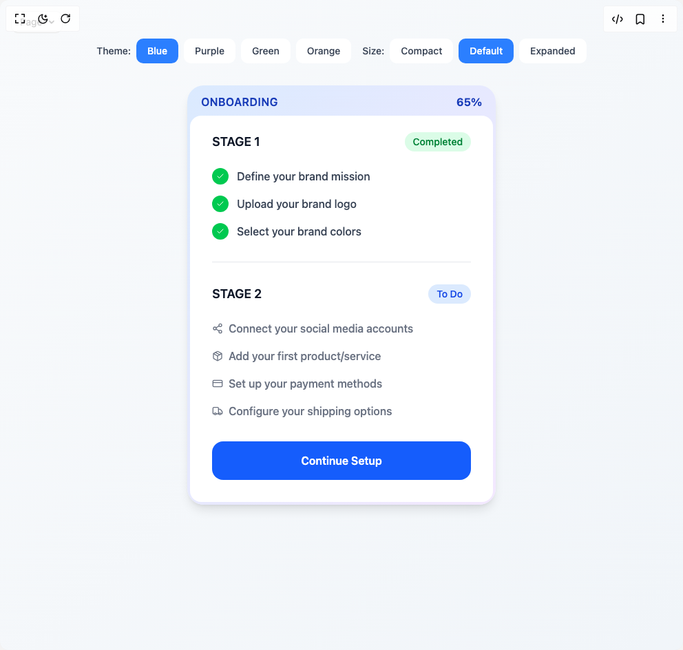

# Build Onboarding Stages in BuilderStudio

> Build this component in our Agentic IDE: [BuilderStudio](https://builderstudio.dev).
>
> Join the BuilderStudio community on [Discord](https://discord.gg/QdWeSGCqfe) and [Reddit](https://reddit.com/r/builderstudio).



## Component

- Author group: `isaiahbjork`
- Component: `onboarding-stages`
- Variant: `default`
- Rendered HTML snapshot: [`rendered.html`](rendered.html)

## BuilderStudio prompt

You are implementing a React component based on a component reference.

## Component identity

- Author: isaiahbjork
- Component slug: onboarding-stages
- Demo slug: default
- Title: onboarding-stages
- Description: 

## Goal

Recreate this component in a React + TypeScript + Tailwind CSS project. Preserve the visual layout, spacing, colors, border radius, shadows, interaction behavior, animation behavior, responsive behavior, and dark mode behavior shown in the rendered demo.

## Implementation requirements

- Use React and TypeScript.
- Use Tailwind CSS classes whenever possible.
- Keep the component self-contained unless the source files require helper components.
- If the source uses CSS variables, custom CSS, animations, or keyframes, include them.
- If the source uses external packages, list and use the required packages.
- Preserve accessibility attributes, button semantics, links, keyboard behavior, and ARIA attributes when visible in the source.
- Do not replace the component with a simplified placeholder.
- Return complete production-ready code.

## Dependencies

No reference metadata available.

## Rendered DOM snapshot

This is the rendered demo HTML extracted from the live preview. Use it to verify structure, class names, visible content, and layout.

```html
<div id="root"><div class="fixed top-4 left-4 z-10"><select class="appearance-none h-8 max-w-[200px] text-sm leading-tight rounded-lg pl-3 pr-7 py-0 border bg-background focus:outline-none focus:ring-0"><option value="default_Page">Page</option></select><div class="absolute top-1/2 transform -translate-y-1/2 right-2 pointer-events-none"><svg class="w-4 h-4 fill-current" viewBox="0 0 20 20"><path d="M5.516 7.548c.436-.446 1.043-.48 1.576 0L10 10.405l2.908-2.857c.533-.48 1.14-.446 1.576 0 .436.445.408 1.197 0 1.615l-3.734 3.705c-.533.534-1.39.534-1.923 0l-3.734-3.705c-.408-.418-.436-1.17 0-1.615z"></path></svg></div></div><div class="w-screen min-h-screen flex justify-center items-center"><div class="min-h-screen w-full bg-gradient-to-br from-slate-50 to-slate-100 p-4"><div class="max-w-6xl mx-auto"><div class="flex flex-wrap gap-4 justify-center mt-10 mb-8"><div class="flex gap-2"><span class="text-sm font-medium text-gray-700 self-center">Theme:</span><button class="px-4 py-2 rounded-lg text-sm font-medium transition-colors bg-blue-500 text-white">Blue</button><button class="px-4 py-2 rounded-lg text-sm font-medium transition-colors bg-white text-gray-700 hover:bg-gray-50">Purple</button><button class="px-4 py-2 rounded-lg text-sm font-medium transition-colors bg-white text-gray-700 hover:bg-gray-50">Green</button><button class="px-4 py-2 rounded-lg text-sm font-medium transition-colors bg-white text-gray-700 hover:bg-gray-50">Orange</button></div><div class="flex gap-2"><span class="text-sm font-medium text-gray-700 self-center">Size:</span><button class="px-4 py-2 rounded-lg text-sm font-medium transition-colors bg-white text-gray-700 hover:bg-gray-50">Compact</button><button class="px-4 py-2 rounded-lg text-sm font-medium transition-colors bg-blue-500 text-white">Default</button><button class="px-4 py-2 rounded-lg text-sm font-medium transition-colors bg-white text-gray-700 hover:bg-gray-50">Expanded</button></div></div><div class="flex items-center justify-center"><div class="relative max-w-md w-full" style="opacity: 1; transform: none;"><div class="p-1 bg-gradient-to-br from-blue-100 to-purple-100 rounded-3xl shadow-lg"><div class="flex items-center justify-between px-4 py-2" style="opacity: 1; transform: none;"><h1 class="text-md font-semibold tracking-wide text-blue-800">ONBOARDING</h1><div class="text-md font-bold text-blue-800" style="opacity: 1; transform: none;">65%</div></div><div class="bg-white rounded-2xl overflow-hidden" style="opacity: 1; filter: blur(0px); transform: none;"><div class="p-8 pt-6"><div class="mb-8" style="opacity: 1;"><div class="flex items-center justify-between mb-6" style="opacity: 1; filter: blur(0px); transform: none;"><h2 class="text-lg font-semibold text-gray-900">STAGE 1</h2><span class="px-3 py-1 text-sm font-medium rounded-full bg-green-100 text-green-700">Completed</span></div><div class="space-y-4" style="opacity: 1;"><div class="flex items-center space-x-3" style="opacity: 1; filter: blur(0px); transform: none;"><div class="flex items-center justify-center w-6 h-6 rounded-full bg-green-500 text-white" style="opacity: 1; transform: none;"><svg xmlns="http://www.w3.org/2000/svg" width="24" height="24" viewBox="0 0 24 24" fill="none" stroke="currentColor" stroke-width="2" stroke-linecap="round" stroke-linejoin="round" class="lucide lucide-check w-3 h-3" aria-hidden="true"><path d="M20 6 9 17l-5-5"></path></svg></div><span class="font-medium text-gray-700">Define your brand mission</span></div><div class="flex items-center space-x-3" style="opacity: 1; filter: blur(0px); transform: none;"><div class="flex items-center justify-center w-6 h-6 rounded-full bg-green-500 text-white" style="opacity: 1; transform: none;"><svg xmlns="http://www.w3.org/2000/svg" width="24" height="24" viewBox="0 0 24 24" fill="none" stroke="currentColor" stroke-width="2" stroke-linecap="round" stroke-linejoin="round" class="lucide lucide-check w-3 h-3" aria-hidden="true"><path d="M20 6 9 17l-5-5"></path></svg></div><span class="font-medium text-gray-700">Upload your brand logo</span></div><div class="flex items-center space-x-3" style="opacity: 1; filter: blur(0px); transform: none;"><div class="flex items-center justify-center w-6 h-6 rounded-full bg-green-500 text-white" style="opacity: 1; transform: none;"><svg xmlns="http://www.w3.org/2000/svg" width="24" height="24" viewBox="0 0 24 24" fill="none" stroke="currentColor" stroke-width="2" stroke-linecap="round" stroke-linejoin="round" class="lucide lucide-check w-3 h-3" aria-hidden="true"><path d="M20 6 9 17l-5-5"></path></svg></div><span class="font-medium text-gray-700">Select your brand colors</span></div></div></div><div class="h-px mb-8 bg-gray-200" style="opacity: 1; filter: blur(0px); transform: none;"></div><div class="mb-8" style="opacity: 1;"><div class="flex items-center justify-between mb-6" style="opacity: 1; filter: blur(0px); transform: none;"><h2 class="text-lg font-semibold text-gray-900">STAGE 2</h2><span class="px-3 py-1 text-sm font-medium rounded-full bg-blue-100 text-blue-700">To Do</span></div><div class="space-y-4" style="opacity: 1;"><div class="flex items-center space-x-3" style="opacity: 1; filter: blur(0px); transform: none;"><div class="mr-2 text-gray-500" style="opacity: 1; transform: none;"><svg xmlns="http://www.w3.org/2000/svg" width="24" height="24" viewBox="0 0 24 24" fill="none" stroke="currentColor" stroke-width="2" stroke-linecap="round" stroke-linejoin="round" class="lucide lucide-share2 lucide-share-2 w-4 h-4" aria-hidden="true"><circle cx="18" cy="5" r="3"></circle><circle cx="6" cy="12" r="3"></circle><circle cx="18" cy="19" r="3"></circle><line x1="8.59" x2="15.42" y1="13.51" y2="17.49"></line><line x1="15.41" x2="8.59" y1="6.51" y2="10.49"></line></svg></div><span class="font-medium text-gray-500">Connect your social media accounts</span></div><div class="flex items-center space-x-3" style="opacity: 1; filter: blur(0px); transform: none;"><div class="mr-2 text-gray-500" style="opacity: 1; transform: none;"><svg xmlns="http://www.w3.org/2000/svg" width="24" height="24" viewBox="0 0 24 24" fill="none" stroke="currentColor" stroke-width="2" stroke-linecap="round" stroke-linejoin="round" class="lucide lucide-package w-4 h-4" aria-hidden="true"><path d="M11 21.73a2 2 0 0 0 2 0l7-4A2 2 0 0 0 21 16V8a2 2 0 0 0-1-1.73l-7-4a2 2 0 0 0-2 0l-7 4A2 2 0 0 0 3 8v8a2 2 0 0 0 1 1.73z"></path><path d="M12 22V12"></path><polyline points="3.29 7 12 12 20.71 7"></polyline><path d="m7.5 4.27 9 5.15"></path></svg></div><span class="font-medium text-gray-500">Add your first product/service</span></div><div class="flex items-center space-x-3" style="opacity: 1; filter: blur(0px); transform: none;"><div class="mr-2 text-gray-500" style="opacity: 1; transform: none;"><svg xmlns="http://www.w3.org/2000/svg" width="24" height="24" viewBox="0 0 24 24" fill="none" stroke="currentColor" stroke-width="2" stroke-linecap="round" stroke-linejoin="round" class="lucide lucide-credit-card w-4 h-4" aria-hidden="true"><rect width="20" height="14" x="2" y="5" rx="2"></rect><line x1="2" x2="22" y1="10" y2="10"></line></svg></div><span class="font-medium text-gray-500">Set up your payment methods</span></div><div class="flex items-center space-x-3" style="opacity: 1; filter: blur(0px); transform: none;"><div class="mr-2 text-gray-500" style="opacity: 1; transform: none;"><svg xmlns="http://www.w3.org/2000/svg" width="24" height="24" viewBox="0 0 24 24" fill="none" stroke="currentColor" stroke-width="2" stroke-linecap="round" stroke-linejoin="round" class="lucide lucide-truck w-4 h-4" aria-hidden="true"><path d="M14 18V6a2 2 0 0 0-2-2H4a2 2 0 0 0-2 2v11a1 1 0 0 0 1 1h2"></path><path d="M15 18H9"></path><path d="M19 18h2a1 1 0 0 0 1-1v-3.65a1 1 0 0 0-.22-.624l-3.48-4.35A1 1 0 0 0 17.52 8H14"></path><circle cx="17" cy="18" r="2"></circle><circle cx="7" cy="18" r="2"></circle></svg></div><span class="font-medium text-gray-500">Configure your shipping options</span></div></div></div><button class="w-full cursor-pointer font-semibold py-4 px-6 rounded-2xl transition-all duration-200 bg-blue-600 hover:bg-blue-700 text-white transform-gpu" tabindex="0" style="opacity: 1; transform: none;">Continue Setup</button></div></div></div></div></div></div></div></div></div>
```

## Reference source files

No reference source files were available.
