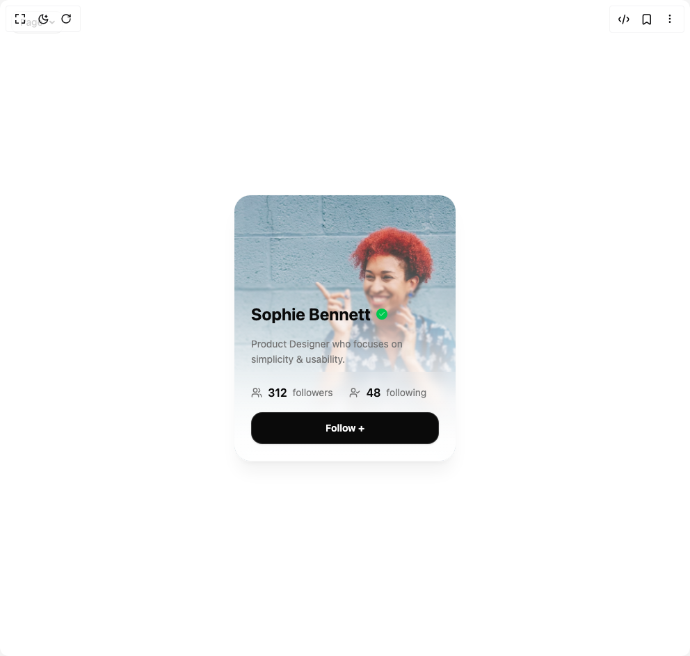

# Build Profile Card in BuilderStudio

> Build this component in our Agentic IDE: [BuilderStudio](https://builderstudio.dev).
>
> Join the BuilderStudio community on [Discord](https://discord.gg/QdWeSGCqfe) and [Reddit](https://reddit.com/r/builderstudio).



## Component

- Author group: `isaiahbjork`
- Component: `profile-card`
- Variant: `default`
- Rendered HTML snapshot: [`rendered.html`](rendered.html)

## BuilderStudio prompt

You are implementing a React component based on a component reference.

## Component identity

- Author: isaiahbjork
- Component slug: profile-card
- Demo slug: default
- Title: profile-card
- Description: 

## Goal

Recreate this component in a React + TypeScript + Tailwind CSS project. Preserve the visual layout, spacing, colors, border radius, shadows, interaction behavior, animation behavior, responsive behavior, and dark mode behavior shown in the rendered demo.

## Implementation requirements

- Use React and TypeScript.
- Use Tailwind CSS classes whenever possible.
- Keep the component self-contained unless the source files require helper components.
- If the source uses CSS variables, custom CSS, animations, or keyframes, include them.
- If the source uses external packages, list and use the required packages.
- Preserve accessibility attributes, button semantics, links, keyboard behavior, and ARIA attributes when visible in the source.
- Do not replace the component with a simplified placeholder.
- Return complete production-ready code.

## Dependencies

No reference metadata available.

## Rendered DOM snapshot

This is the rendered demo HTML extracted from the live preview. Use it to verify structure, class names, visible content, and layout.

```html
<div id="root"><div class="fixed top-4 left-4 z-10"><select class="appearance-none h-8 max-w-[200px] text-sm leading-tight rounded-lg pl-3 pr-7 py-0 border bg-background focus:outline-none focus:ring-0"><option value="default_Page">Page</option></select><div class="absolute top-1/2 transform -translate-y-1/2 right-2 pointer-events-none"><svg class="w-4 h-4 fill-current" viewBox="0 0 20 20"><path d="M5.516 7.548c.436-.446 1.043-.48 1.576 0L10 10.405l2.908-2.857c.533-.48 1.14-.446 1.576 0 .436.445.408 1.197 0 1.615l-3.734 3.705c-.533.534-1.39.534-1.923 0l-3.734-3.705c-.408-.418-.436-1.17 0-1.615z"></path></svg></div></div><div class="w-screen min-h-screen flex justify-center items-center"><div class="min-h-screen p-8 bg-background flex items-center justify-center"><div data-slot="profile-hover-card" class="relative w-80 h-96 rounded-3xl border border-border/20 text-card-foreground overflow-hidden shadow-xl shadow-black/5 cursor-pointer group backdrop-blur-sm dark:shadow-black/20" style="filter: blur(0px); transform: none;"><div class="absolute inset-0 bg-gradient-to-t from-background/95 via-background/40 via-background/20 via-background/10 to-transparent"></div><div class="absolute bottom-0 left-0 right-0 h-64 bg-gradient-to-t from-background/90 via-background/60 via-background/30 via-background/15 via-background/8 to-transparent backdrop-blur-[1px]"></div><div class="absolute bottom-0 left-0 right-0 h-32 bg-gradient-to-t from-background/85 via-background/40 to-transparent backdrop-blur-sm"></div><div class="absolute bottom-0 left-0 right-0 p-6 space-y-4" style="opacity: 1; filter: blur(0px); transform: none;"><div class="flex items-center gap-2" style="opacity: 1; filter: blur(0px); transform: none;"><h2 class="text-2xl font-bold text-foreground"><span class="inline-block" style="opacity: 1; transform: none;">S</span><span class="inline-block" style="opacity: 1; transform: none;">o</span><span class="inline-block" style="opacity: 1; transform: none;">p</span><span class="inline-block" style="opacity: 1; transform: none;">h</span><span class="inline-block" style="opacity: 1; transform: none;">i</span><span class="inline-block" style="opacity: 1; transform: none;">e</span><span class="inline-block" style="opacity: 1; transform: none;">&nbsp;</span><span class="inline-block" style="opacity: 1; transform: none;">B</span><span class="inline-block" style="opacity: 1; transform: none;">e</span><span class="inline-block" style="opacity: 1; transform: none;">n</span><span class="inline-block" style="opacity: 1; transform: none;">n</span><span class="inline-block" style="opacity: 1; transform: none;">e</span><span class="inline-block" style="opacity: 1; transform: none;">t</span><span class="inline-block" style="opacity: 1; transform: none;">t</span></h2><div class="flex items-center justify-center w-4 h-4 rounded-full bg-green-500 text-white" style="opacity: 1; filter: blur(0px); transform: none;"><svg xmlns="http://www.w3.org/2000/svg" width="24" height="24" viewBox="0 0 24 24" fill="none" stroke="currentColor" stroke-width="2" stroke-linecap="round" stroke-linejoin="round" class="lucide lucide-check w-2.5 h-2.5" aria-hidden="true"><path d="M20 6 9 17l-5-5"></path></svg></div></div><p class="text-muted-foreground text-sm leading-relaxed" style="opacity: 1; filter: blur(0px); transform: none;">Product Designer who focuses on simplicity &amp; usability.</p><div class="flex items-center gap-6 pt-2" style="opacity: 1; filter: blur(0px); transform: none;"><div class="flex items-center gap-2 text-muted-foreground"><svg xmlns="http://www.w3.org/2000/svg" width="24" height="24" viewBox="0 0 24 24" fill="none" stroke="currentColor" stroke-width="2" stroke-linecap="round" stroke-linejoin="round" class="lucide lucide-users w-4 h-4" aria-hidden="true"><path d="M16 21v-2a4 4 0 0 0-4-4H6a4 4 0 0 0-4 4v2"></path><circle cx="9" cy="7" r="4"></circle><path d="M22 21v-2a4 4 0 0 0-3-3.87"></path><path d="M16 3.13a4 4 0 0 1 0 7.75"></path></svg><span class="font-semibold text-foreground">312</span><span class="text-sm">followers</span></div><div class="flex items-center gap-2 text-muted-foreground"><svg xmlns="http://www.w3.org/2000/svg" width="24" height="24" viewBox="0 0 24 24" fill="none" stroke="currentColor" stroke-width="2" stroke-linecap="round" stroke-linejoin="round" class="lucide lucide-user-check w-4 h-4" aria-hidden="true"><path d="M16 21v-2a4 4 0 0 0-4-4H6a4 4 0 0 0-4 4v2"></path><circle cx="9" cy="7" r="4"></circle><polyline points="16 11 18 13 22 9"></polyline></svg><span class="font-semibold text-foreground">48</span><span class="text-sm">following</span></div></div><button class="w-full cursor-pointer py-3 px-4 rounded-2xl font-semibold text-sm transition-all duration-200 border border-border/20 shadow-sm bg-foreground text-background hover:bg-foreground/90 transform-gpu" tabindex="0" style="opacity: 1; filter: blur(0px); transform: none;">Follow +</button></div></div></div></div></div>
```

## Reference source files

No reference source files were available.
