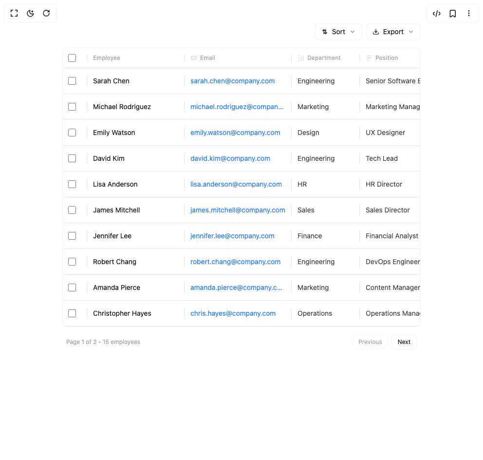

# Build Resizable Table in BuilderStudio

> Build this component in our Agentic IDE: [BuilderStudio](https://builderstudio.dev).
>
> Join the BuilderStudio community on [Discord](https://discord.gg/QdWeSGCqfe) and [Reddit](https://reddit.com/r/builderstudio).



## Component

- Author group: `isaiahbjork`
- Component: `resizable-table`
- Variant: `default`
- Rendered HTML snapshot: [`rendered.html`](rendered.html)

## BuilderStudio prompt

You are implementing a React component based on a component reference.

## Component identity

- Author: isaiahbjork
- Component slug: resizable-table
- Demo slug: default
- Title: resizable-table
- Description: 

## Goal

Recreate this component in a React + TypeScript + Tailwind CSS project. Preserve the visual layout, spacing, colors, border radius, shadows, interaction behavior, animation behavior, responsive behavior, and dark mode behavior shown in the rendered demo.

## Implementation requirements

- Use React and TypeScript.
- Use Tailwind CSS classes whenever possible.
- Keep the component self-contained unless the source files require helper components.
- If the source uses CSS variables, custom CSS, animations, or keyframes, include them.
- If the source uses external packages, list and use the required packages.
- Preserve accessibility attributes, button semantics, links, keyboard behavior, and ARIA attributes when visible in the source.
- Do not replace the component with a simplified placeholder.
- Return complete production-ready code.

## Dependencies

No reference metadata available.

## Rendered DOM snapshot

This is the rendered demo HTML extracted from the live preview. Use it to verify structure, class names, visible content, and layout.

```html
<div id="root"><div class="w-screen min-h-screen flex justify-center items-center"><div class="w-screen min-h-screen flex justify-center items-center"><div class="min-h-screen bg-background py-6 md:py-12"><div class="container mx-auto px-2 sm:px-4"><div class="mb-8 md:mb-12"><div class="w-full max-w-7xl mx-auto "><div class="mb-4 flex flex-col sm:flex-row sm:items-center sm:justify-between gap-3"><div class="flex items-center gap-2"></div><div class="flex items-center gap-2 flex-wrap"><div class="relative"><button class="px-3 py-1.5 bg-background border border-border/50 text-foreground text-sm hover:bg-muted/30 transition-colors flex items-center gap-2 rounded-md"><svg width="14" height="14" viewBox="0 0 16 16" fill="none"><path d="M3 6L6 3L9 6M6 3V13M13 10L10 13L7 10M10 13V3" stroke="currentColor" stroke-width="1.5" stroke-linecap="round" stroke-linejoin="round"></path></svg>Sort <svg xmlns="http://www.w3.org/2000/svg" width="14" height="14" viewBox="0 0 24 24" fill="none" stroke="currentColor" stroke-width="2" stroke-linecap="round" stroke-linejoin="round" class="lucide lucide-chevron-down opacity-50" aria-hidden="true"><path d="m6 9 6 6 6-6"></path></svg></button></div><div class="relative"><button class="px-3 py-1.5 bg-background border border-border/50 text-foreground text-sm hover:bg-muted/30 transition-colors flex items-center gap-2 rounded-md"><svg xmlns="http://www.w3.org/2000/svg" width="14" height="14" viewBox="0 0 24 24" fill="none" stroke="currentColor" stroke-width="2" stroke-linecap="round" stroke-linejoin="round" class="lucide lucide-download" aria-hidden="true"><path d="M21 15v4a2 2 0 0 1-2 2H5a2 2 0 0 1-2-2v-4"></path><polyline points="7 10 12 15 17 10"></polyline><line x1="12" x2="12" y1="15" y2="3"></line></svg>Export<svg xmlns="http://www.w3.org/2000/svg" width="14" height="14" viewBox="0 0 24 24" fill="none" stroke="currentColor" stroke-width="2" stroke-linecap="round" stroke-linejoin="round" class="lucide lucide-chevron-down opacity-50" aria-hidden="true"><path d="m6 9 6 6 6-6"></path></svg></button></div></div></div><div class="bg-background border border-border/50 overflow-hidden rounded-lg relative"><div class="overflow-x-auto"><div class="min-w-[1200px]"><div class="flex py-3 text-xs font-medium text-muted-foreground/60 bg-muted/5 border-b border-border"><div class="flex items-center justify-center border-r border-border pr-3" style="width: 50px;"><input class="w-4 h-4 rounded border-border/40 cursor-pointer" type="checkbox" style="accent-color: rgb(161, 161, 170);"></div><div class="flex items-center border-r border-border px-3 relative react-resizable" style="width: 200px;"><span>Employee</span><div class="absolute right-0 top-0 bottom-0 w-1 hover:w-1.5 cursor-col-resize bg-transparent hover:bg-primary/40 transition-all"></div></div><div class="flex items-center gap-1.5 border-r border-border px-3 relative react-resizable" style="width: 220px;"><svg width="14" height="14" viewBox="0 0 16 16" fill="none" class="opacity-40"><rect x="2" y="4" width="12" height="8" rx="1" stroke="currentColor" stroke-width="1.5" fill="none"></rect><path d="M2 6L8 9L14 6" stroke="currentColor" stroke-width="1.5"></path></svg><span>Email</span><div class="absolute right-0 top-0 bottom-0 w-1 hover:w-1.5 cursor-col-resize bg-transparent hover:bg-primary/40 transition-all"></div></div><div class="flex items-center gap-1.5 border-r border-border px-3 relative react-resizable" style="width: 140px;"><svg width="14" height="14" viewBox="0 0 16 16" fill="none" class="opacity-40"><path d="M2 2H4M2 8H6M2 14H8M10 2V14M14 4V14" stroke="currentColor" stroke-width="1.5" stroke-linecap="round"></path></svg><span>Department</span><div class="absolute right-0 top-0 bottom-0 w-1 hover:w-1.5 cursor-col-resize bg-transparent hover:bg-primary/40 transition-all"></div></div><div class="flex items-center gap-1.5 border-r border-border px-3 relative react-resizable" style="width: 180px;"><svg width="14" height="14" viewBox="0 0 16 16" fill="none" class="opacity-40"><path d="M3 3H13M3 8H13M3 13H9" stroke="currentColor" stroke-width="1.5" stroke-linecap="round"></path></svg><span>Position</span><div class="absolute right-0 top-0 bottom-0 w-1 hover:w-1.5 cursor-col-resize bg-transparent hover:bg-primary/40 transition-all"></div></div><div class="flex items-center gap-1.5 border-r border-border px-3 relative react-resizable" style="width: 120px;"><svg width="14" height="14" viewBox="0 0 16 16" fill="none" class="opacity-40"><path d="M8 1L3 9H7L8 15L13 7H9L8 1Z" stroke="currentColor" stroke-width="1.5" stroke-linecap="round"></path></svg><span>Salary</span><div class="absolute right-0 top-0 bottom-0 w-1 hover:w-1.5 cursor-col-resize bg-transparent hover:bg-primary/40 transition-all"></div></div><div class="flex items-center gap-1.5 border-r border-border px-3 relative react-resizable" style="width: 120px;"><svg width="14" height="14" viewBox="0 0 16 16" fill="none" class="opacity-40"><rect x="2" y="3" width="12" height="10" rx="1" stroke="currentColor" stroke-width="1.5" fill="none"></rect><path d="M6 1V3M10 1V3" stroke="currentColor" stroke-width="1.5" stroke-linecap="round"></path></svg><span>Hire Date</span><div class="absolute right-0 top-0 bottom-0 w-1 hover:w-1.5 cursor-col-resize bg-transparent hover:bg-primary/40 transition-all"></div></div><div class="flex items-center gap-1.5 px-3" style="width: 100px;"><svg width="14" height="14" viewBox="0 0 16 16" fill="none" class="opacity-40"><circle cx="8" cy="8" r="2" stroke="currentColor" stroke-width="1.5" fill="none"></circle><path d="M8 4V8L10 10" stroke="currentColor" stroke-width="1.5" stroke-linecap="round"></path></svg><span>Status</span></div></div><div><div style="opacity: 1; filter: blur(0px); transform: none;"><div class="py-3.5 group relative transition-all duration-150 border-b border-border flex bg-muted/5 hover:bg-muted/20"><div class="flex items-center justify-center border-r border-border pr-3" style="width: 50px;"><input class="w-4 h-4 rounded border-border/40 cursor-pointer" type="checkbox" style="accent-color: rgb(161, 161, 170);"></div><div class="flex items-center min-w-0 border-r border-border px-3" style="width: 200px;"><span class="text-sm text-foreground truncate">Sarah Chen</span></div><div class="flex items-center min-w-0 border-r border-border px-3" style="width: 220px;"><a href="mailto:sarah.chen@company.com" class="text-sm text-blue-500 hover:text-blue-600 truncate">sarah.chen@company.com</a></div><div class="flex items-center border-r border-border px-3" style="width: 140px;"><span class="text-sm text-foreground/80 truncate">Engineering</span></div><div class="flex items-center min-w-0 border-r border-border px-3" style="width: 180px;"><span class="text-sm text-foreground/80 truncate">Senior Software Engineer</span></div><div class="flex items-center border-r border-border px-3" style="width: 120px;"><span class="text-sm font-semibold text-foreground/90">$125,000</span></div><div class="flex items-center border-r border-border px-3" style="width: 120px;"><span class="text-sm text-foreground/80">Mar 15, 2022</span></div><div class="flex items-center px-3" style="width: 100px;"><div class="inline-flex items-center gap-1.5 px-2.5 py-1 text-xs font-medium whitespace-nowrap bg-green-50 text-green-600 rounded-md"><div class="w-1.5 h-1.5 rounded-full bg-green-600"></div>Active</div></div></div></div><div style="opacity: 1; filter: blur(0px); transform: none;"><div class="py-3.5 group relative transition-all duration-150 border-b border-border flex bg-muted/5 hover:bg-muted/20"><div class="flex items-center justify-center border-r border-border pr-3" style="width: 50px;"><input class="w-4 h-4 rounded border-border/40 cursor-pointer" type="checkbox" style="accent-color: rgb(161, 161, 170);"></div><div class="flex items-center min-w-0 border-r border-border px-3" style="width: 200px;"><span class="text-sm text-foreground truncate">Michael Rodriguez</span></div><div class="flex items-center min-w-0 border-r border-border px-3" style="width: 220px;"><a href="mailto:michael.rodriguez@company.com" class="text-sm text-blue-500 hover:text-blue-600 truncate">michael.rodriguez@company.com</a></div><div class="flex items-center border-r border-border px-3" style="width: 140px;"><span class="text-sm text-foreground/80 truncate">Marketing</span></div><div class="flex items-center min-w-0 border-r border-border px-3" style="width: 180px;"><span class="text-sm text-foreground/80 truncate">Marketing Manager</span></div><div class="flex items-center border-r border-border px-3" style="width: 120px;"><span class="text-sm font-semibold text-foreground/90">$95,000</span></div><div class="flex items-center border-r border-border px-3" style="width: 120px;"><span class="text-sm text-foreground/80">Aug 22, 2021</span></div><div class="flex items-center px-3" style="width: 100px;"><div class="inline-flex items-center gap-1.5 px-2.5 py-1 text-xs font-medium whitespace-nowrap bg-green-50 text-green-600 rounded-md"><div class="w-1.5 h-1.5 rounded-full bg-green-600"></div>Active</div></div></div></div><div style="opacity: 1; filter: blur(0px); transform: none;"><div class="py-3.5 group relative transition-all duration-150 border-b border-border flex bg-muted/5 hover:bg-muted/20"><div class="flex items-center justify-center border-r border-border pr-3" style="width: 50px;"><input class="w-4 h-4 rounded border-border/40 cursor-pointer" type="checkbox" style="accent-color: rgb(161, 161, 170);"></div><div class="flex items-center min-w-0 border-r border-border px-3" style="width: 200px;"><span class="text-sm text-foreground truncate">Emily Watson</span></div><div class="flex items-center min-w-0 border-r border-border px-3" style="width: 220px;"><a href="mailto:emily.watson@company.com" class="text-sm text-blue-500 hover:text-blue-600 truncate">emily.watson@company.com</a></div><div class="flex items-center border-r border-border px-3" style="width: 140px;"><span class="text-sm text-foreground/80 truncate">Design</span></div><div class="flex items-center min-w-0 border-r border-border px-3" style="width: 180px;"><span class="text-sm text-foreground/80 truncate">UX Designer</span></div><div class="flex items-center border-r border-border px-3" style="width: 120px;"><span class="text-sm font-semibold text-foreground/90">$88,000</span></div><div class="flex items-center border-r border-border px-3" style="width: 120px;"><span class="text-sm text-foreground/80">Jan 10, 2023</span></div><div class="flex items-center px-3" style="width: 100px;"><div class="inline-flex items-center gap-1.5 px-2.5 py-1 text-xs font-medium whitespace-nowrap bg-green-50 text-green-600 rounded-md"><div class="w-1.5 h-1.5 rounded-full bg-green-600"></div>Active</div></div></div></div><div style="opacity: 1; filter: blur(0px); transform: none;"><div class="py-3.5 group relative transition-all duration-150 border-b border-border flex bg-muted/5 hover:bg-muted/20"><div class="flex items-center justify-center border-r border-border pr-3" style="width: 50px;"><input class="w-4 h-4 rounded border-border/40 cursor-pointer" type="checkbox" style="accent-color: rgb(161, 161, 170);"></div><div class="flex items-center min-w-0 border-r border-border px-3" style="width: 200px;"><span class="text-sm text-foreground truncate">David Kim</span></div><div class="flex items-center min-w-0 border-r border-border px-3" style="width: 220px;"><a href="mailto:david.kim@company.com" class="text-sm text-blue-500 hover:text-blue-600 truncate">david.kim@company.com</a></div><div class="flex items-center border-r border-border px-3" style="width: 140px;"><span class="text-sm text-foreground/80 truncate">Engineering</span></div><div class="flex items-center min-w-0 border-r border-border px-3" style="width: 180px;"><span class="text-sm text-foreground/80 truncate">Tech Lead</span></div><div class="flex items-center border-r border-border px-3" style="width: 120px;"><span class="text-sm font-semibold text-foreground/90">$145,000</span></div><div class="flex items-center border-r border-border px-3" style="width: 120px;"><span class="text-sm text-foreground/80">Nov 5, 2020</span></div><div class="flex items-center px-3" style="width: 100px;"><div class="inline-flex items-center gap-1.5 px-2.5 py-1 text-xs font-medium whitespace-nowrap bg-green-50 text-green-600 rounded-md"><div class="w-1.5 h-1.5 rounded-full bg-green-600"></div>Active</div></div></div></div><div style="opacity: 1; filter: blur(0px); transform: none;"><div class="py-3.5 group relative transition-all duration-150 border-b border-border flex bg-muted/5 hover:bg-muted/20"><div class="flex items-center justify-center border-r border-border pr-3" style="width: 50px;"><input class="w-4 h-4 rounded border-border/40 cursor-pointer" type="checkbox" style="accent-color: rgb(161, 161, 170);"></div><div class="flex items-center min-w-0 border-r border-border px-3" style="width: 200px;"><span class="text-sm text-foreground truncate">Lisa Anderson</span></div><div class="flex items-center min-w-0 border-r border-border px-3" style="width: 220px;"><a href="mailto:lisa.anderson@company.com" class="text-sm text-blue-500 hover:text-blue-600 truncate">lisa.anderson@company.com</a></div><div class="flex items-center border-r border-border px-3" style="width: 140px;"><span class="text-sm text-foreground/80 truncate">HR</span></div><div class="flex items-center min-w-0 border-r border-border px-3" style="width: 180px;"><span class="text-sm text-foreground/80 truncate">HR Director</span></div><div class="flex items-center border-r border-border px-3" style="width: 120px;"><span class="text-sm font-semibold text-foreground/90">$110,000</span></div><div class="flex items-center border-r border-border px-3" style="width: 120px;"><span class="text-sm text-foreground/80">Jun 12, 2019</span></div><div class="flex items-center px-3" style="width: 100px;"><div class="inline-flex items-center gap-1.5 px-2.5 py-1 text-xs font-medium whitespace-nowrap bg-yellow-50 text-yellow-600 rounded-md"><div class="w-1.5 h-1.5 rounded-full bg-yellow-600"></div>On leave</div></div></div></div><div style="opacity: 1; filter: blur(0px); transform: none;"><div class="py-3.5 group relative transition-all duration-150 border-b border-border flex bg-muted/5 hover:bg-muted/20"><div class="flex items-center justify-center border-r border-border pr-3" style="width: 50px;"><input class="w-4 h-4 rounded border-border/40 cursor-pointer" type="checkbox" style="accent-color: rgb(161, 161, 170);"></div><div class="flex items-center min-w-0 border-r border-border px-3" style="width: 200px;"><span class="text-sm text-foreground truncate">James Mitchell</span></div><div class="flex items-center min-w-0 border-r border-border px-3" style="width: 220px;"><a href="mailto:james.mitchell@company.com" class="text-sm text-blue-500 hover:text-blue-600 truncate">james.mitchell@company.com</a></div><div class="flex items-center border-r border-border px-3" style="width: 140px;"><span class="text-sm text-foreground/80 truncate">Sales</span></div><div class="flex items-center min-w-0 border-r border-border px-3" style="width: 180px;"><span class="text-sm text-foreground/80 truncate">Sales Director</span></div><div class="flex items-center border-r border-border px-3" style="width: 120px;"><span class="text-sm font-semibold text-foreground/90">$130,000</span></div><div class="flex items-center border-r border-border px-3" style="width: 120px;"><span class="text-sm text-foreground/80">Feb 28, 2021</span></div><div class="flex items-center px-3" style="width: 100px;"><div class="inline-flex items-center gap-1.5 px-2.5 py-1 text-xs font-medium whitespace-nowrap bg-green-50 text-green-600 rounded-md"><div class="w-1.5 h-1.5 rounded-full bg-green-600"></div>Active</div></div></div></div><div style="opacity: 1; filter: blur(0px); transform: none;"><div class="py-3.5 group relative transition-all duration-150 border-b border-border flex bg-muted/5 hover:bg-muted/20"><div class="flex items-center justify-center border-r border-border pr-3" style="width: 50px;"><input class="w-4 h-4 rounded border-border/40 cursor-pointer" type="checkbox" style="accent-color: rgb(161, 161, 170);"></div><div class="flex items-center min-w-0 border-r border-border px-3" style="width: 200px;"><span class="text-sm text-foreground truncate">Jennifer Lee</span></div><div class="flex items-center min-w-0 border-r border-border px-3" style="width: 220px;"><a href="mailto:jennifer.lee@company.com" class="text-sm text-blue-500 hover:text-blue-600 truncate">jennifer.lee@company.com</a></div><div class="flex items-center border-r border-border px-3" style="width: 140px;"><span class="text-sm text-foreground/80 truncate">Finance</span></div><div class="flex items-center min-w-0 border-r border-border px-3" style="width: 180px;"><span class="text-sm text-foreground/80 truncate">Financial Analyst</span></div><div class="flex items-center border-r border-border px-3" style="width: 120px;"><span class="text-sm font-semibold text-foreground/90">$75,000</span></div><div class="flex items-center border-r border-border px-3" style="width: 120px;"><span class="text-sm text-foreground/80">Apr 18, 2023</span></div><div class="flex items-center px-3" style="width: 100px;"><div class="inline-flex items-center gap-1.5 px-2.5 py-1 text-xs font-medium whitespace-nowrap bg-green-50 text-green-600 rounded-md"><div class="w-1.5 h-1.5 rounded-full bg-green-600"></div>Active</div></div></div></div><div style="opacity: 1; filter: blur(0px); transform: none;"><div class="py-3.5 group relative transition-all duration-150 border-b border-border flex bg-muted/5 hover:bg-muted/20"><div class="flex items-center justify-center border-r border-border pr-3" style="width: 50px;"><input class="w-4 h-4 rounded border-border/40 cursor-pointer" type="checkbox" style="accent-color: rgb(161, 161, 170);"></div><div class="flex items-center min-w-0 border-r border-border px-3" style="width: 200px;"><span class="text-sm text-foreground truncate">Robert Chang</span></div><div class="flex items-center min-w-0 border-r border-border px-3" style="width: 220px;"><a href="mailto:robert.chang@company.com" class="text-sm text-blue-500 hover:text-blue-600 truncate">robert.chang@company.com</a></div><div class="flex items-center border-r border-border px-3" style="width: 140px;"><span class="text-sm text-foreground/80 truncate">Engineering</span></div><div class="flex items-center min-w-0 border-r border-border px-3" style="width: 180px;"><span class="text-sm text-foreground/80 truncate">DevOps Engineer</span></div><div class="flex items-center border-r border-border px-3" style="width: 120px;"><span class="text-sm font-semibold text-foreground/90">$105,000</span></div><div class="flex items-center border-r border-border px-3" style="width: 120px;"><span class="text-sm text-foreground/80">Sep 14, 2022</span></div><div class="flex items-center px-3" style="width: 100px;"><div class="inline-flex items-center gap-1.5 px-2.5 py-1 text-xs font-medium whitespace-nowrap bg-green-50 text-green-600 rounded-md"><div class="w-1.5 h-1.5 rounded-full bg-green-600"></div>Active</div></div></div></div><div style="opacity: 1; filter: blur(0px); transform: none;"><div class="py-3.5 group relative transition-all duration-150 border-b border-border flex bg-muted/5 hover:bg-muted/20"><div class="flex items-center justify-center border-r border-border pr-3" style="width: 50px;"><input class="w-4 h-4 rounded border-border/40 cursor-pointer" type="checkbox" style="accent-color: rgb(161, 161, 170);"></div><div class="flex items-center min-w-0 border-r border-border px-3" style="width: 200px;"><span class="text-sm text-foreground truncate">Amanda Pierce</span></div><div class="flex items-center min-w-0 border-r border-border px-3" style="width: 220px;"><a href="mailto:amanda.pierce@company.com" class="text-sm text-blue-500 hover:text-blue-600 truncate">amanda.pierce@company.com</a></div><div class="flex items-center border-r border-border px-3" style="width: 140px;"><span class="text-sm text-foreground/80 truncate">Marketing</span></div><div class="flex items-center min-w-0 border-r border-border px-3" style="width: 180px;"><span class="text-sm text-foreground/80 truncate">Content Manager</span></div><div class="flex items-center border-r border-border px-3" style="width: 120px;"><span class="text-sm font-semibold text-foreground/90">$72,000</span></div><div class="flex items-center border-r border-border px-3" style="width: 120px;"><span class="text-sm text-foreground/80">Jul 3, 2023</span></div><div class="flex items-center px-3" style="width: 100px;"><div class="inline-flex items-center gap-1.5 px-2.5 py-1 text-xs font-medium whitespace-nowrap bg-red-50 text-red-600 rounded-md"><div class="w-1.5 h-1.5 rounded-full bg-red-600"></div>Inactive</div></div></div></div><div style="opacity: 1; filter: blur(0px); transform: none;"><div class="py-3.5 group relative transition-all duration-150 border-b border-border flex bg-muted/5 hover:bg-muted/20"><div class="flex items-center justify-center border-r border-border pr-3" style="width: 50px;"><input class="w-4 h-4 rounded border-border/40 cursor-pointer" type="checkbox" style="accent-color: rgb(161, 161, 170);"></div><div class="flex items-center min-w-0 border-r border-border px-3" style="width: 200px;"><span class="text-sm text-foreground truncate">Christopher Hayes</span></div><div class="flex items-center min-w-0 border-r border-border px-3" style="width: 220px;"><a href="mailto:chris.hayes@company.com" class="text-sm text-blue-500 hover:text-blue-600 truncate">chris.hayes@company.com</a></div><div class="flex items-center border-r border-border px-3" style="width: 140px;"><span class="text-sm text-foreground/80 truncate">Operations</span></div><div class="flex items-center min-w-0 border-r border-border px-3" style="width: 180px;"><span class="text-sm text-foreground/80 truncate">Operations Manager</span></div><div class="flex items-center border-r border-border px-3" style="width: 120px;"><span class="text-sm font-semibold text-foreground/90">$98,000</span></div><div class="flex items-center border-r border-border px-3" style="width: 120px;"><span class="text-sm text-foreground/80">Dec 1, 2021</span></div><div class="flex items-center px-3" style="width: 100px;"><div class="inline-flex items-center gap-1.5 px-2.5 py-1 text-xs font-medium whitespace-nowrap bg-green-50 text-green-600 rounded-md"><div class="w-1.5 h-1.5 rounded-full bg-green-600"></div>Active</div></div></div></div></div></div></div></div><div class="mt-4 flex items-center justify-between px-2"><div class="text-xs text-muted-foreground/70">Page 1 of 2 • 15 employees</div><div class="flex gap-1.5"><button disabled="" class="px-3 py-1.5 bg-background border border-border/50 text-foreground text-xs hover:bg-muted/30 disabled:opacity-40 disabled:cursor-not-allowed transition-colors rounded-md">Previous</button><button class="px-3 py-1.5 bg-background border border-border/50 text-foreground text-xs hover:bg-muted/30 disabled:opacity-40 disabled:cursor-not-allowed transition-colors rounded-md">Next</button></div></div></div></div></div></div></div></div></div>
```

## Reference source files

No reference source files were available.
