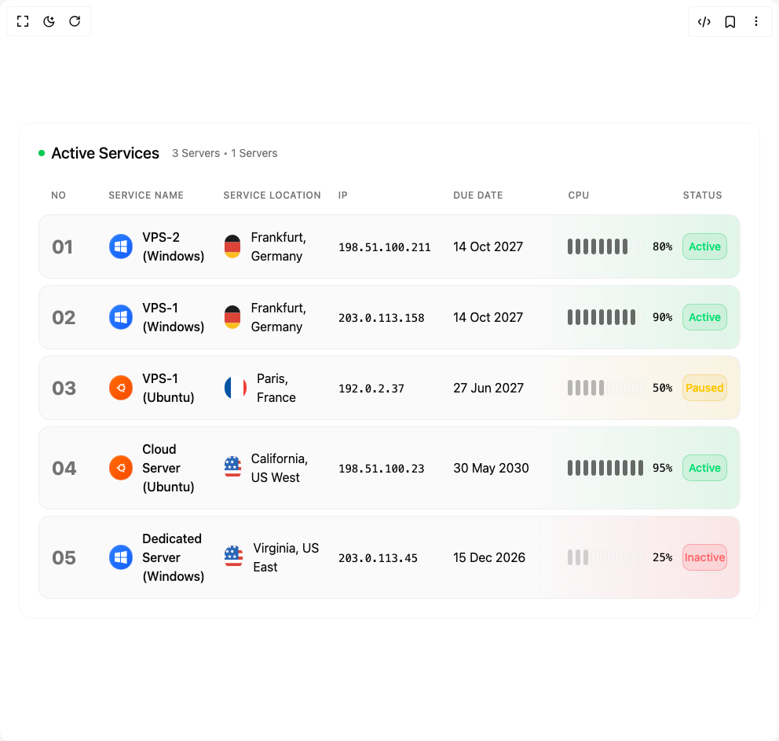

# Build Server Management Table in BuilderStudio

> Build this component in our Agentic IDE: [BuilderStudio](https://builderstudio.dev).
>
> Join the BuilderStudio community on [Discord](https://discord.gg/QdWeSGCqfe) and [Reddit](https://reddit.com/r/builderstudio).



## Component

- Author group: `isaiahbjork`
- Component: `server-management-table`
- Variant: `default`
- Rendered HTML snapshot: [`rendered.html`](rendered.html)

## BuilderStudio prompt

You are implementing a React component based on a component reference.

## Component identity

- Author: isaiahbjork
- Component slug: server-management-table
- Demo slug: default
- Title: server-management-table
- Description: 

## Goal

Recreate this component in a React + TypeScript + Tailwind CSS project. Preserve the visual layout, spacing, colors, border radius, shadows, interaction behavior, animation behavior, responsive behavior, and dark mode behavior shown in the rendered demo.

## Implementation requirements

- Use React and TypeScript.
- Use Tailwind CSS classes whenever possible.
- Keep the component self-contained unless the source files require helper components.
- If the source uses CSS variables, custom CSS, animations, or keyframes, include them.
- If the source uses external packages, list and use the required packages.
- Preserve accessibility attributes, button semantics, links, keyboard behavior, and ARIA attributes when visible in the source.
- Do not replace the component with a simplified placeholder.
- Return complete production-ready code.

## Dependencies

No reference metadata available.

## Rendered DOM snapshot

This is the rendered demo HTML extracted from the live preview. Use it to verify structure, class names, visible content, and layout.

```html
<div id="root"><div class="w-screen min-h-screen flex justify-center items-center"><div class="w-screen min-h-screen flex justify-center items-center"><div class="w-full max-w-7xl mx-auto p-6 "><div class="relative border border-border/30 rounded-2xl p-6 bg-card"><div class="flex items-center justify-between mb-6"><div class="flex items-center gap-4"><div class="flex items-center gap-2"><div class="w-2 h-2 rounded-full bg-green-500 animate-pulse"></div><h1 class="text-xl font-medium text-foreground">Active Services</h1></div><div class="text-sm text-muted-foreground">3 Servers • 1 Servers</div></div></div><div class="space-y-2"><div class="grid grid-cols-12 gap-4 px-4 py-2 text-xs font-medium text-muted-foreground uppercase tracking-wider"><div class="col-span-1">No</div><div class="col-span-2">Service Name</div><div class="col-span-2">Service Location</div><div class="col-span-2">IP</div><div class="col-span-2">Due Date</div><div class="col-span-2">CPU</div><div class="col-span-1">Status</div></div><div class="relative cursor-pointer" style="opacity: 1; filter: blur(0px); transform: none;"><div class="relative bg-muted/50 border border-border/50 rounded-xl p-4 overflow-hidden"><div class="absolute inset-0 bg-gradient-to-l from-green-500/10 to-transparent pointer-events-none" style="background-size: 30% 100%; background-position: right center; background-repeat: no-repeat;"></div><div class="relative grid grid-cols-12 gap-4 items-center"><div class="col-span-1"><span class="text-2xl font-bold text-muted-foreground">01</span></div><div class="col-span-2 flex items-center gap-3"><div class="w-8 h-8 rounded-full bg-gradient-to-br from-blue-500 to-blue-600 flex items-center justify-center p-1.5 border border-border/30"><svg width="16" height="16" viewBox="0 0 32 32" fill="none"><path class="fill-white" d="M30,15H17c-0.6,0-1-0.4-1-1V3.3c0-0.5,0.4-0.9,0.8-1l13-2.3c0.3,0,0.6,0,0.8,0.2C30.9,0.4,31,0.7,31,1v13 C31,14.6,30.6,15,30,15z"></path><path class="fill-white" d="M13,15H1c-0.6,0-1-0.4-1-1V6c0-0.5,0.4-0.9,0.8-1l12-2c0.3,0,0.6,0,0.8,0.2C13.9,3.4,14,3.7,14,4v10 C14,14.6,13.6,15,13,15z"></path><path class="fill-white" d="M30,32c-0.1,0-0.1,0-0.2,0l-13-2.3c-0.5-0.1-0.8-0.5-0.8-1V18c0-0.6,0.4-1,1-1h13c0.6,0,1,0.4,1,1v13 c0,0.3-0.1,0.6-0.4,0.8C30.5,31.9,30.2,32,30,32z"></path><path class="fill-white" d="M13,29c-0.1,0-0.1,0-0.2,0l-12-2C0.4,26.9,0,26.5,0,26v-8c0-0.6,0.4-1,1-1h12c0.6,0,1,0.4,1,1v10 c0,0.3-0.1,0.6-0.4,0.8C13.5,28.9,13.2,29,13,29z"></path></svg></div><span class="text-foreground font-medium">VPS-2 (Windows)</span></div><div class="col-span-2 flex items-center gap-3"><div class="w-8 h-8 rounded-full overflow-hidden border border-border/30 flex items-center justify-center"><div class="w-full h-full"><svg width="32" height="32" viewBox="0 0 130 120" fill="none" class="scale-125"><rect fill="#1E1D1D" width="130" height="39"></rect><rect y="39" fill="#DC4437" width="130" height="42"></rect><rect y="81" fill="#FCBE1F" width="130" height="39"></rect></svg></div></div><span class="text-foreground">Frankfurt, Germany</span></div><div class="col-span-2"><span class="text-foreground font-mono text-sm">198.51.100.211</span></div><div class="col-span-2"><span class="text-foreground">14 Oct 2027</span></div><div class="col-span-2"><div class="flex items-center gap-3"><div class="flex gap-1"><div class="w-1.5 h-5 rounded-full transition-all duration-500 bg-foreground/60"></div><div class="w-1.5 h-5 rounded-full transition-all duration-500 bg-foreground/60"></div><div class="w-1.5 h-5 rounded-full transition-all duration-500 bg-foreground/60"></div><div class="w-1.5 h-5 rounded-full transition-all duration-500 bg-foreground/60"></div><div class="w-1.5 h-5 rounded-full transition-all duration-500 bg-foreground/60"></div><div class="w-1.5 h-5 rounded-full transition-all duration-500 bg-foreground/60"></div><div class="w-1.5 h-5 rounded-full transition-all duration-500 bg-foreground/60"></div><div class="w-1.5 h-5 rounded-full transition-all duration-500 bg-foreground/60"></div><div class="w-1.5 h-5 rounded-full transition-all duration-500 bg-muted/40 border border-border/30"></div><div class="w-1.5 h-5 rounded-full transition-all duration-500 bg-muted/40 border border-border/30"></div></div><span class="text-sm font-mono text-foreground font-medium min-w-[3rem]">80%</span></div></div><div class="col-span-1"><div class="px-3 py-1.5 rounded-lg bg-green-500/10 border border-green-500/30 flex items-center justify-center"><span class="text-green-400 text-sm font-medium">Active</span></div></div></div></div></div><div class="relative cursor-pointer" style="opacity: 1; filter: blur(0px); transform: none;"><div class="relative bg-muted/50 border border-border/50 rounded-xl p-4 overflow-hidden"><div class="absolute inset-0 bg-gradient-to-l from-green-500/10 to-transparent pointer-events-none" style="background-size: 30% 100%; background-position: right center; background-repeat: no-repeat;"></div><div class="relative grid grid-cols-12 gap-4 items-center"><div class="col-span-1"><span class="text-2xl font-bold text-muted-foreground">02</span></div><div class="col-span-2 flex items-center gap-3"><div class="w-8 h-8 rounded-full bg-gradient-to-br from-blue-500 to-blue-600 flex items-center justify-center p-1.5 border border-border/30"><svg width="16" height="16" viewBox="0 0 32 32" fill="none"><path class="fill-white" d="M30,15H17c-0.6,0-1-0.4-1-1V3.3c0-0.5,0.4-0.9,0.8-1l13-2.3c0.3,0,0.6,0,0.8,0.2C30.9,0.4,31,0.7,31,1v13 C31,14.6,30.6,15,30,15z"></path><path class="fill-white" d="M13,15H1c-0.6,0-1-0.4-1-1V6c0-0.5,0.4-0.9,0.8-1l12-2c0.3,0,0.6,0,0.8,0.2C13.9,3.4,14,3.7,14,4v10 C14,14.6,13.6,15,13,15z"></path><path class="fill-white" d="M30,32c-0.1,0-0.1,0-0.2,0l-13-2.3c-0.5-0.1-0.8-0.5-0.8-1V18c0-0.6,0.4-1,1-1h13c0.6,0,1,0.4,1,1v13 c0,0.3-0.1,0.6-0.4,0.8C30.5,31.9,30.2,32,30,32z"></path><path class="fill-white" d="M13,29c-0.1,0-0.1,0-0.2,0l-12-2C0.4,26.9,0,26.5,0,26v-8c0-0.6,0.4-1,1-1h12c0.6,0,1,0.4,1,1v10 c0,0.3-0.1,0.6-0.4,0.8C13.5,28.9,13.2,29,13,29z"></path></svg></div><span class="text-foreground font-medium">VPS-1 (Windows)</span></div><div class="col-span-2 flex items-center gap-3"><div class="w-8 h-8 rounded-full overflow-hidden border border-border/30 flex items-center justify-center"><div class="w-full h-full"><svg width="32" height="32" viewBox="0 0 130 120" fill="none" class="scale-125"><rect fill="#1E1D1D" width="130" height="39"></rect><rect y="39" fill="#DC4437" width="130" height="42"></rect><rect y="81" fill="#FCBE1F" width="130" height="39"></rect></svg></div></div><span class="text-foreground">Frankfurt, Germany</span></div><div class="col-span-2"><span class="text-foreground font-mono text-sm">203.0.113.158</span></div><div class="col-span-2"><span class="text-foreground">14 Oct 2027</span></div><div class="col-span-2"><div class="flex items-center gap-3"><div class="flex gap-1"><div class="w-1.5 h-5 rounded-full transition-all duration-500 bg-foreground/60"></div><div class="w-1.5 h-5 rounded-full transition-all duration-500 bg-foreground/60"></div><div class="w-1.5 h-5 rounded-full transition-all duration-500 bg-foreground/60"></div><div class="w-1.5 h-5 rounded-full transition-all duration-500 bg-foreground/60"></div><div class="w-1.5 h-5 rounded-full transition-all duration-500 bg-foreground/60"></div><div class="w-1.5 h-5 rounded-full transition-all duration-500 bg-foreground/60"></div><div class="w-1.5 h-5 rounded-full transition-all duration-500 bg-foreground/60"></div><div class="w-1.5 h-5 rounded-full transition-all duration-500 bg-foreground/60"></div><div class="w-1.5 h-5 rounded-full transition-all duration-500 bg-foreground/60"></div><div class="w-1.5 h-5 rounded-full transition-all duration-500 bg-muted/40 border border-border/30"></div></div><span class="text-sm font-mono text-foreground font-medium min-w-[3rem]">90%</span></div></div><div class="col-span-1"><div class="px-3 py-1.5 rounded-lg bg-green-500/10 border border-green-500/30 flex items-center justify-center"><span class="text-green-400 text-sm font-medium">Active</span></div></div></div></div></div><div class="relative cursor-pointer" style="opacity: 1; filter: blur(0px); transform: none;"><div class="relative bg-muted/50 border border-border/50 rounded-xl p-4 overflow-hidden"><div class="absolute inset-0 bg-gradient-to-l from-yellow-500/10 to-transparent pointer-events-none" style="background-size: 30% 100%; background-position: right center; background-repeat: no-repeat;"></div><div class="relative grid grid-cols-12 gap-4 items-center"><div class="col-span-1"><span class="text-2xl font-bold text-muted-foreground">03</span></div><div class="col-span-2 flex items-center gap-3"><div class="w-8 h-8 rounded-full bg-gradient-to-br from-orange-500 to-orange-600 flex items-center justify-center p-1.5 border border-border/30"><svg width="16" height="16" viewBox="-5 0 32 32" fill="white"><path d="M16.469 9.375c-1.063-0.594-1.406-1.938-0.813-3 0.406-0.719 1.156-1.094 1.906-1.094 0.375 0 0.75 0.094 1.094 0.281 1.063 0.625 1.406 1.969 0.813 3-0.406 0.719-1.156 1.094-1.906 1.094-0.375 0-0.75-0.094-1.094-0.281zM21.938 15.594h-3.625c-0.125-1.688-0.969-3.188-2.25-4.156-0.219-0.156-0.438-0.313-0.688-0.469-0.813-0.438-1.75-0.688-2.75-0.688-1.031 0-1.969 0.25-2.813 0.719l-2-3.031c1.406-0.844 3.031-1.313 4.813-1.313 0.688 0 1.375 0.063 2.063 0.219-0.25 1.219 0.281 2.5 1.406 3.156 0.438 0.25 0.938 0.375 1.469 0.375 0.719 0 1.406-0.25 1.938-0.719 1.438 1.563 2.344 3.625 2.438 5.906zM7.125 8.438l2 3.031c-1.25 0.969-2.094 2.438-2.188 4.125-0.031 0.125-0.031 0.25-0.031 0.406 0 0.125 0 0.281 0.031 0.406 0.125 1.781 1.063 3.313 2.438 4.281l-1.906 3.094c-1.813-1.188-3.188-3-3.813-5.125 0.875-0.5 1.5-1.469 1.5-2.563s-0.625-2.094-1.563-2.594c0.594-2.063 1.844-3.844 3.531-5.063zM2.188 13.906c1.219 0 2.219 0.969 2.219 2.188s-1 2.219-2.219 2.219-2.188-1-2.188-2.219 0.969-2.188 2.188-2.188zM8.188 24.219l1.906-3.125c0.75 0.375 1.625 0.594 2.531 0.594 1 0 1.938-0.25 2.781-0.719 0.25-0.125 0.469-0.281 0.688-0.469 1.25-0.938 2.094-2.406 2.219-4.094h3.625c-0.094 2.375-1.094 4.531-2.656 6.125-0.469-0.344-1.063-0.531-1.656-0.531-0.531 0-1.031 0.125-1.469 0.375-1 0.594-1.531 1.656-1.469 2.719-0.688 0.156-1.375 0.25-2.063 0.25-1.625 0-3.125-0.406-4.438-1.125zM17.625 22.75c0.75 0 1.5 0.375 1.906 1.094 0.594 1.063 0.219 2.438-0.813 3.031-0.344 0.188-0.719 0.281-1.094 0.281-0.781 0-1.5-0.375-1.906-1.094-0.625-1.063-0.25-2.406 0.813-3.031 0.344-0.188 0.719-0.281 1.094-0.281z"></path></svg></div><span class="text-foreground font-medium">VPS-1 (Ubuntu)</span></div><div class="col-span-2 flex items-center gap-3"><div class="w-8 h-8 rounded-full overflow-hidden border border-border/30 flex items-center justify-center"><div class="w-full h-full"><svg width="32" height="32" viewBox="0 0 90 60" fill="none" class="scale-150"><rect width="30" height="60" fill="#0055A4"></rect><rect x="30" width="30" height="60" fill="#FFFFFF"></rect><rect x="60" width="30" height="60" fill="#EF4135"></rect></svg></div></div><span class="text-foreground">Paris, France</span></div><div class="col-span-2"><span class="text-foreground font-mono text-sm">192.0.2.37</span></div><div class="col-span-2"><span class="text-foreground">27 Jun 2027</span></div><div class="col-span-2"><div class="flex items-center gap-3"><div class="flex gap-1"><div class="w-1.5 h-5 rounded-full transition-all duration-500 bg-muted-foreground/50"></div><div class="w-1.5 h-5 rounded-full transition-all duration-500 bg-muted-foreground/50"></div><div class="w-1.5 h-5 rounded-full transition-all duration-500 bg-muted-foreground/50"></div><div class="w-1.5 h-5 rounded-full transition-all duration-500 bg-muted-foreground/50"></div><div class="w-1.5 h-5 rounded-full transition-all duration-500 bg-muted-foreground/50"></div><div class="w-1.5 h-5 rounded-full transition-all duration-500 bg-muted/40 border border-border/30"></div><div class="w-1.5 h-5 rounded-full transition-all duration-500 bg-muted/40 border border-border/30"></div><div class="w-1.5 h-5 rounded-full transition-all duration-500 bg-muted/40 border border-border/30"></div><div class="w-1.5 h-5 rounded-full transition-all duration-500 bg-muted/40 border border-border/30"></div><div class="w-1.5 h-5 rounded-full transition-all duration-500 bg-muted/40 border border-border/30"></div></div><span class="text-sm font-mono text-foreground font-medium min-w-[3rem]">50%</span></div></div><div class="col-span-1"><div class="px-3 py-1.5 rounded-lg bg-yellow-500/10 border border-yellow-500/30 flex items-center justify-center"><span class="text-yellow-400 text-sm font-medium">Paused</span></div></div></div></div></div><div class="relative cursor-pointer" style="opacity: 1; filter: blur(0px); transform: none;"><div class="relative bg-muted/50 border border-border/50 rounded-xl p-4 overflow-hidden"><div class="absolute inset-0 bg-gradient-to-l from-green-500/10 to-transparent pointer-events-none" style="background-size: 30% 100%; background-position: right center; background-repeat: no-repeat;"></div><div class="relative grid grid-cols-12 gap-4 items-center"><div class="col-span-1"><span class="text-2xl font-bold text-muted-foreground">04</span></div><div class="col-span-2 flex items-center gap-3"><div class="w-8 h-8 rounded-full bg-gradient-to-br from-orange-500 to-orange-600 flex items-center justify-center p-1.5 border border-border/30"><svg width="16" height="16" viewBox="-5 0 32 32" fill="white"><path d="M16.469 9.375c-1.063-0.594-1.406-1.938-0.813-3 0.406-0.719 1.156-1.094 1.906-1.094 0.375 0 0.75 0.094 1.094 0.281 1.063 0.625 1.406 1.969 0.813 3-0.406 0.719-1.156 1.094-1.906 1.094-0.375 0-0.75-0.094-1.094-0.281zM21.938 15.594h-3.625c-0.125-1.688-0.969-3.188-2.25-4.156-0.219-0.156-0.438-0.313-0.688-0.469-0.813-0.438-1.75-0.688-2.75-0.688-1.031 0-1.969 0.25-2.813 0.719l-2-3.031c1.406-0.844 3.031-1.313 4.813-1.313 0.688 0 1.375 0.063 2.063 0.219-0.25 1.219 0.281 2.5 1.406 3.156 0.438 0.25 0.938 0.375 1.469 0.375 0.719 0 1.406-0.25 1.938-0.719 1.438 1.563 2.344 3.625 2.438 5.906zM7.125 8.438l2 3.031c-1.25 0.969-2.094 2.438-2.188 4.125-0.031 0.125-0.031 0.25-0.031 0.406 0 0.125 0 0.281 0.031 0.406 0.125 1.781 1.063 3.313 2.438 4.281l-1.906 3.094c-1.813-1.188-3.188-3-3.813-5.125 0.875-0.5 1.5-1.469 1.5-2.563s-0.625-2.094-1.563-2.594c0.594-2.063 1.844-3.844 3.531-5.063zM2.188 13.906c1.219 0 2.219 0.969 2.219 2.188s-1 2.219-2.219 2.219-2.188-1-2.188-2.219 0.969-2.188 2.188-2.188zM8.188 24.219l1.906-3.125c0.75 0.375 1.625 0.594 2.531 0.594 1 0 1.938-0.25 2.781-0.719 0.25-0.125 0.469-0.281 0.688-0.469 1.25-0.938 2.094-2.406 2.219-4.094h3.625c-0.094 2.375-1.094 4.531-2.656 6.125-0.469-0.344-1.063-0.531-1.656-0.531-0.531 0-1.031 0.125-1.469 0.375-1 0.594-1.531 1.656-1.469 2.719-0.688 0.156-1.375 0.25-2.063 0.25-1.625 0-3.125-0.406-4.438-1.125zM17.625 22.75c0.75 0 1.5 0.375 1.906 1.094 0.594 1.063 0.219 2.438-0.813 3.031-0.344 0.188-0.719 0.281-1.094 0.281-0.781 0-1.5-0.375-1.906-1.094-0.625-1.063-0.25-2.406 0.813-3.031 0.344-0.188 0.719-0.281 1.094-0.281z"></path></svg></div><span class="text-foreground font-medium">Cloud Server (Ubuntu)</span></div><div class="col-span-2 flex items-center gap-3"><div class="w-8 h-8 rounded-full overflow-hidden border border-border/30 flex items-center justify-center"><div class="w-full h-full"><svg width="32" height="32" viewBox="0 0 130 120" fill="none" class="scale-125"><rect y="0" fill="#DC4437" width="130" height="13.3"></rect><rect y="26.7" fill="#DC4437" width="130" height="13.3"></rect><rect y="80" fill="#DC4437" width="130" height="13.3"></rect><rect y="106.7" fill="#DC4437" width="130" height="13.3"></rect><rect y="53.3" fill="#DC4437" width="130" height="13.3"></rect><rect y="13.3" fill="#FFFFFF" width="130" height="13.3"></rect><rect y="40" fill="#FFFFFF" width="130" height="13.3"></rect><rect y="93.3" fill="#FFFFFF" width="130" height="13.3"></rect><rect y="66.7" fill="#FFFFFF" width="130" height="13.3"></rect><rect y="0" fill="#2A66B7" width="70" height="66.7"></rect><polygon fill="#FFFFFF" points="13.5,4 15.8,8.9 21,9.7 17.2,13.6 18.1,19 13.5,16.4 8.9,19 9.8,13.6 6,9.7 11.2,8.9"></polygon><polygon fill="#FFFFFF" points="34,4 36.3,8.9 41.5,9.7 37.8,13.6 38.6,19 34,16.4 29.4,19 30.2,13.6 26.5,9.7 31.7,8.9"></polygon><polygon fill="#FFFFFF" points="54.5,4 56.8,8.9 62,9.7 58.2,13.6 59.1,19 54.5,16.4 49.9,19 50.8,13.6 47,9.7 52.2,8.9"></polygon><polygon fill="#FFFFFF" points="24,24 26.3,28.9 31.5,29.7 27.8,33.6 28.6,39 24,36.4 19.4,39 20.2,33.6 16.5,29.7 21.7,28.9"></polygon><polygon fill="#FFFFFF" points="44.5,24 46.8,28.9 52,29.7 48.2,33.6 49.1,39 44.5,36.4 39.9,39 40.8,33.6 37,29.7 42.2,28.9"></polygon><polygon fill="#FFFFFF" points="13.5,45.2 15.8,50.1 21,50.9 17.2,54.7 18.1,60.2 13.5,57.6 8.9,60.2 9.8,54.7 6,50.9 11.2,50.1"></polygon><polygon fill="#FFFFFF" points="34,45.2 36.3,50.1 41.5,50.9 37.8,54.7 38.6,60.2 34,57.6 29.4,60.2 30.2,54.7 26.5,50.9 31.7,50.1"></polygon><polygon fill="#FFFFFF" points="54.5,45.2 56.8,50.1 62,50.9 58.2,54.7 59.1,60.2 54.5,57.6 49.9,60.2 50.8,54.7 47,50.9 52.2,50.1"></polygon></svg></div></div><span class="text-foreground">California, US West</span></div><div class="col-span-2"><span class="text-foreground font-mono text-sm">198.51.100.23</span></div><div class="col-span-2"><span class="text-foreground">30 May 2030</span></div><div class="col-span-2"><div class="flex items-center gap-3"><div class="flex gap-1"><div class="w-1.5 h-5 rounded-full transition-all duration-500 bg-foreground/60"></div><div class="w-1.5 h-5 rounded-full transition-all duration-500 bg-foreground/60"></div><div class="w-1.5 h-5 rounded-full transition-all duration-500 bg-foreground/60"></div><div class="w-1.5 h-5 rounded-full transition-all duration-500 bg-foreground/60"></div><div class="w-1.5 h-5 rounded-full transition-all duration-500 bg-foreground/60"></div><div class="w-1.5 h-5 rounded-full transition-all duration-500 bg-foreground/60"></div><div class="w-1.5 h-5 rounded-full transition-all duration-500 bg-foreground/60"></div><div class="w-1.5 h-5 rounded-full transition-all duration-500 bg-foreground/60"></div><div class="w-1.5 h-5 rounded-full transition-all duration-500 bg-foreground/60"></div><div class="w-1.5 h-5 rounded-full transition-all duration-500 bg-foreground/60"></div></div><span class="text-sm font-mono text-foreground font-medium min-w-[3rem]">95%</span></div></div><div class="col-span-1"><div class="px-3 py-1.5 rounded-lg bg-green-500/10 border border-green-500/30 flex items-center justify-center"><span class="text-green-400 text-sm font-medium">Active</span></div></div></div></div></div><div class="relative cursor-pointer" style="opacity: 1; filter: blur(0px); transform: none;"><div class="relative bg-muted/50 border border-border/50 rounded-xl p-4 overflow-hidden"><div class="absolute inset-0 bg-gradient-to-l from-red-500/10 to-transparent pointer-events-none" style="background-size: 30% 100%; background-position: right center; background-repeat: no-repeat;"></div><div class="relative grid grid-cols-12 gap-4 items-center"><div class="col-span-1"><span class="text-2xl font-bold text-muted-foreground">05</span></div><div class="col-span-2 flex items-center gap-3"><div class="w-8 h-8 rounded-full bg-gradient-to-br from-blue-500 to-blue-600 flex items-center justify-center p-1.5 border border-border/30"><svg width="16" height="16" viewBox="0 0 32 32" fill="none"><path class="fill-white" d="M30,15H17c-0.6,0-1-0.4-1-1V3.3c0-0.5,0.4-0.9,0.8-1l13-2.3c0.3,0,0.6,0,0.8,0.2C30.9,0.4,31,0.7,31,1v13 C31,14.6,30.6,15,30,15z"></path><path class="fill-white" d="M13,15H1c-0.6,0-1-0.4-1-1V6c0-0.5,0.4-0.9,0.8-1l12-2c0.3,0,0.6,0,0.8,0.2C13.9,3.4,14,3.7,14,4v10 C14,14.6,13.6,15,13,15z"></path><path class="fill-white" d="M30,32c-0.1,0-0.1,0-0.2,0l-13-2.3c-0.5-0.1-0.8-0.5-0.8-1V18c0-0.6,0.4-1,1-1h13c0.6,0,1,0.4,1,1v13 c0,0.3-0.1,0.6-0.4,0.8C30.5,31.9,30.2,32,30,32z"></path><path class="fill-white" d="M13,29c-0.1,0-0.1,0-0.2,0l-12-2C0.4,26.9,0,26.5,0,26v-8c0-0.6,0.4-1,1-1h12c0.6,0,1,0.4,1,1v10 c0,0.3-0.1,0.6-0.4,0.8C13.5,28.9,13.2,29,13,29z"></path></svg></div><span class="text-foreground font-medium">Dedicated Server (Windows)</span></div><div class="col-span-2 flex items-center gap-3"><div class="w-8 h-8 rounded-full overflow-hidden border border-border/30 flex items-center justify-center"><div class="w-full h-full"><svg width="32" height="32" viewBox="0 0 130 120" fill="none" class="scale-125"><rect y="0" fill="#DC4437" width="130" height="13.3"></rect><rect y="26.7" fill="#DC4437" width="130" height="13.3"></rect><rect y="80" fill="#DC4437" width="130" height="13.3"></rect><rect y="106.7" fill="#DC4437" width="130" height="13.3"></rect><rect y="53.3" fill="#DC4437" width="130" height="13.3"></rect><rect y="13.3" fill="#FFFFFF" width="130" height="13.3"></rect><rect y="40" fill="#FFFFFF" width="130" height="13.3"></rect><rect y="93.3" fill="#FFFFFF" width="130" height="13.3"></rect><rect y="66.7" fill="#FFFFFF" width="130" height="13.3"></rect><rect y="0" fill="#2A66B7" width="70" height="66.7"></rect><polygon fill="#FFFFFF" points="13.5,4 15.8,8.9 21,9.7 17.2,13.6 18.1,19 13.5,16.4 8.9,19 9.8,13.6 6,9.7 11.2,8.9"></polygon><polygon fill="#FFFFFF" points="34,4 36.3,8.9 41.5,9.7 37.8,13.6 38.6,19 34,16.4 29.4,19 30.2,13.6 26.5,9.7 31.7,8.9"></polygon><polygon fill="#FFFFFF" points="54.5,4 56.8,8.9 62,9.7 58.2,13.6 59.1,19 54.5,16.4 49.9,19 50.8,13.6 47,9.7 52.2,8.9"></polygon><polygon fill="#FFFFFF" points="24,24 26.3,28.9 31.5,29.7 27.8,33.6 28.6,39 24,36.4 19.4,39 20.2,33.6 16.5,29.7 21.7,28.9"></polygon><polygon fill="#FFFFFF" points="44.5,24 46.8,28.9 52,29.7 48.2,33.6 49.1,39 44.5,36.4 39.9,39 40.8,33.6 37,29.7 42.2,28.9"></polygon><polygon fill="#FFFFFF" points="13.5,45.2 15.8,50.1 21,50.9 17.2,54.7 18.1,60.2 13.5,57.6 8.9,60.2 9.8,54.7 6,50.9 11.2,50.1"></polygon><polygon fill="#FFFFFF" points="34,45.2 36.3,50.1 41.5,50.9 37.8,54.7 38.6,60.2 34,57.6 29.4,60.2 30.2,54.7 26.5,50.9 31.7,50.1"></polygon><polygon fill="#FFFFFF" points="54.5,45.2 56.8,50.1 62,50.9 58.2,54.7 59.1,60.2 54.5,57.6 49.9,60.2 50.8,54.7 47,50.9 52.2,50.1"></polygon></svg></div></div><span class="text-foreground">Virginia, US East</span></div><div class="col-span-2"><span class="text-foreground font-mono text-sm">203.0.113.45</span></div><div class="col-span-2"><span class="text-foreground">15 Dec 2026</span></div><div class="col-span-2"><div class="flex items-center gap-3"><div class="flex gap-1"><div class="w-1.5 h-5 rounded-full transition-all duration-500 bg-muted-foreground/30"></div><div class="w-1.5 h-5 rounded-full transition-all duration-500 bg-muted-foreground/30"></div><div class="w-1.5 h-5 rounded-full transition-all duration-500 bg-muted-foreground/30"></div><div class="w-1.5 h-5 rounded-full transition-all duration-500 bg-muted/40 border border-border/30"></div><div class="w-1.5 h-5 rounded-full transition-all duration-500 bg-muted/40 border border-border/30"></div><div class="w-1.5 h-5 rounded-full transition-all duration-500 bg-muted/40 border border-border/30"></div><div class="w-1.5 h-5 rounded-full transition-all duration-500 bg-muted/40 border border-border/30"></div><div class="w-1.5 h-5 rounded-full transition-all duration-500 bg-muted/40 border border-border/30"></div><div class="w-1.5 h-5 rounded-full transition-all duration-500 bg-muted/40 border border-border/30"></div><div class="w-1.5 h-5 rounded-full transition-all duration-500 bg-muted/40 border border-border/30"></div></div><span class="text-sm font-mono text-foreground font-medium min-w-[3rem]">25%</span></div></div><div class="col-span-1"><div class="px-3 py-1.5 rounded-lg bg-red-500/10 border border-red-500/30 flex items-center justify-center"><span class="text-red-400 text-sm font-medium">Inactive</span></div></div></div></div></div></div></div></div></div></div></div>
```

## Reference source files

No reference source files were available.
