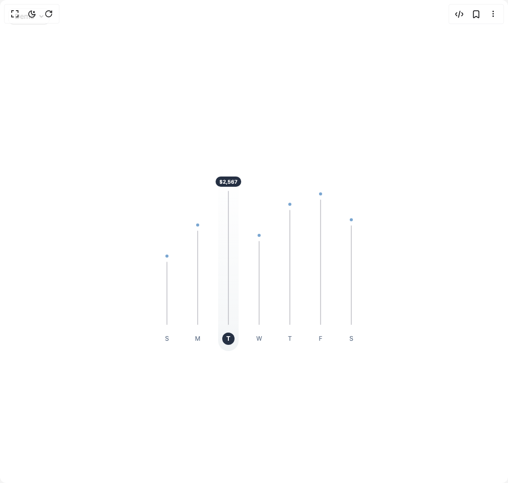

# Build Weekly Kpi Chart in BuilderStudio

> Build this component in our Agentic IDE: [BuilderStudio](https://builderstudio.dev).
>
> Join the BuilderStudio community on [Discord](https://discord.gg/QdWeSGCqfe) and [Reddit](https://reddit.com/r/builderstudio).



## Component

- Author group: `isaiahbjork`
- Component: `weekly-kpi-chart`
- Variant: `default`
- Rendered HTML snapshot: [`rendered.html`](rendered.html)

## BuilderStudio prompt

You are implementing a React component based on a component reference.

## Component identity

- Author: isaiahbjork
- Component slug: weekly-kpi-chart
- Demo slug: default
- Title: weekly-kpi-chart
- Description: 

## Goal

Recreate this component in a React + TypeScript + Tailwind CSS project. Preserve the visual layout, spacing, colors, border radius, shadows, interaction behavior, animation behavior, responsive behavior, and dark mode behavior shown in the rendered demo.

## Implementation requirements

- Use React and TypeScript.
- Use Tailwind CSS classes whenever possible.
- Keep the component self-contained unless the source files require helper components.
- If the source uses CSS variables, custom CSS, animations, or keyframes, include them.
- If the source uses external packages, list and use the required packages.
- Preserve accessibility attributes, button semantics, links, keyboard behavior, and ARIA attributes when visible in the source.
- Do not replace the component with a simplified placeholder.
- Return complete production-ready code.

## Dependencies

No reference metadata available.

## Rendered DOM snapshot

This is the rendered demo HTML extracted from the live preview. Use it to verify structure, class names, visible content, and layout.

```html
<div id="root"><div class="fixed top-4 left-4 z-10"><select class="appearance-none h-8 max-w-[200px] text-sm leading-tight rounded-lg pl-3 pr-7 py-0 border bg-background focus:outline-none focus:ring-0"><option value="default_Demo">Demo</option></select><div class="absolute top-1/2 transform -translate-y-1/2 right-2 pointer-events-none"><svg class="w-4 h-4 fill-current" viewBox="0 0 20 20"><path d="M5.516 7.548c.436-.446 1.043-.48 1.576 0L10 10.405l2.908-2.857c.533-.48 1.14-.446 1.576 0 .436.445.408 1.197 0 1.615l-3.734 3.705c-.533.534-1.39.534-1.923 0l-3.734-3.705c-.408-.418-.436-1.17 0-1.615z"></path></svg></div></div><div class="w-screen min-h-screen flex justify-center items-center"><div class="w-full max-w-lg mx-auto items-center justify-center"><div class="relative p-4 bg-white rounded-lg mt-10"><div class="absolute" style="left: 186px; top: 40px; width: 40px; height: 360px; background: linear-gradient(to top, rgba(206, 215, 221, 0.314), rgba(206, 215, 221, 0.19) 15%, rgba(255, 255, 255, 0)); border-radius: 20px; pointer-events: none; z-index: 1; transform-origin: center bottom; opacity: 1; transform: none;"></div><svg width="500" height="380" viewBox="0 0 500 380" style="position: relative; z-index: 2;"><g><rect x="45" y="0" width="50" height="380" fill="transparent" style="cursor: pointer;"></rect><line x1="70" y1="332" x2="70" y2="210.45734320218153" stroke="#9f9fa980" stroke-width="2" stroke-linecap="round" opacity="1" pathLength="1" stroke-dashoffset="0px" stroke-dasharray="1px 1px" style="pointer-events: none;"></line><circle cx="70" cy="198.45734320218153" r="3" fill="#7AA6D1" opacity="1" style="pointer-events: none; transform: none; transform-origin: 50% 50%; transform-box: fill-box;"></circle><text x="70" y="361" text-anchor="middle" dominant-baseline="middle" font-size="12" font-weight="400" fill="#64748b" opacity="1" style="cursor: pointer;">S</text></g><g><rect x="105" y="0" width="50" height="380" fill="transparent" style="cursor: pointer;"></rect><line x1="130" y1="332" x2="130" y2="149.68601480327231" stroke="#9f9fa980" stroke-width="2" stroke-linecap="round" opacity="1" pathLength="1" stroke-dashoffset="0px" stroke-dasharray="1px 1px" style="pointer-events: none;"></line><circle cx="130" cy="137.68601480327231" r="3" fill="#7AA6D1" opacity="1" style="pointer-events: none; transform: none; transform-origin: 50% 50%; transform-box: fill-box;"></circle><text x="130" y="361" text-anchor="middle" dominant-baseline="middle" font-size="12" font-weight="400" fill="#64748b" opacity="1" style="cursor: pointer;">M</text></g><g><rect x="165" y="0" width="50" height="380" fill="transparent" style="cursor: pointer;"></rect><line x1="190" y1="332" x2="190" y2="72" stroke="#9f9fa980" stroke-width="2" stroke-linecap="round" opacity="1" pathLength="1" stroke-dashoffset="0px" stroke-dasharray="1px 1px" style="pointer-events: none;"></line><rect x="165" y="43" width="50" height="20" rx="10" ry="10" fill="#253043" opacity="1" style="pointer-events: none; transform: none; transform-origin: 50% 50%; transform-box: fill-box;"></rect><text x="190" y="57" text-anchor="middle" font-size="10" font-weight="600" fill="white" opacity="1" style="pointer-events: none;">$2,567</text><circle cx="190" cy="360" r="12" fill="#253043" opacity="1" style="pointer-events: none; transform: none; transform-origin: 50% 50%; transform-box: fill-box;"></circle><text x="190" y="361" text-anchor="middle" dominant-baseline="middle" font-size="12" font-weight="600" fill="white" opacity="1" style="cursor: pointer;">T</text></g><g><rect x="225" y="0" width="50" height="380" fill="transparent" style="cursor: pointer;"></rect><line x1="250" y1="332" x2="250" y2="169.94312426957538" stroke="#9f9fa980" stroke-width="2" stroke-linecap="round" opacity="1" pathLength="1" stroke-dashoffset="0px" stroke-dasharray="1px 1px" style="pointer-events: none;"></line><circle cx="250" cy="157.94312426957538" r="3" fill="#7AA6D1" opacity="1" style="pointer-events: none; transform: none; transform-origin: 50% 50%; transform-box: fill-box;"></circle><text x="250" y="361" text-anchor="middle" dominant-baseline="middle" font-size="12" font-weight="400" fill="#64748b" opacity="1" style="cursor: pointer;">W</text></g><g><rect x="285" y="0" width="50" height="380" fill="transparent" style="cursor: pointer;"></rect><line x1="310" y1="332" x2="310" y2="109.17179587066613" stroke="#9f9fa980" stroke-width="2" stroke-linecap="round" opacity="1" pathLength="1" stroke-dashoffset="0px" stroke-dasharray="1px 1px" style="pointer-events: none;"></line><circle cx="310" cy="97.17179587066613" r="3" fill="#7AA6D1" opacity="1" style="pointer-events: none; transform: none; transform-origin: 50% 50%; transform-box: fill-box;"></circle><text x="310" y="361" text-anchor="middle" dominant-baseline="middle" font-size="12" font-weight="400" fill="#64748b" opacity="1" style="cursor: pointer;">T</text></g><g><rect x="345" y="0" width="50" height="380" fill="transparent" style="cursor: pointer;"></rect><line x1="370" y1="332" x2="370" y2="88.91468640436307" stroke="#9f9fa980" stroke-width="2" stroke-linecap="round" opacity="1" pathLength="1" stroke-dashoffset="0px" stroke-dasharray="1px 1px" style="pointer-events: none;"></line><circle cx="370" cy="76.91468640436307" r="3" fill="#7AA6D1" opacity="1" style="pointer-events: none; transform: none; transform-origin: 50% 50%; transform-box: fill-box;"></circle><text x="370" y="361" text-anchor="middle" dominant-baseline="middle" font-size="12" font-weight="400" fill="#64748b" opacity="1" style="cursor: pointer;">F</text></g><g><rect x="405" y="0" width="50" height="380" fill="transparent" style="cursor: pointer;"></rect><line x1="430" y1="332" x2="430" y2="139.55746007012075" stroke="#9f9fa980" stroke-width="2" stroke-linecap="round" opacity="1" pathLength="1" stroke-dashoffset="0px" stroke-dasharray="1px 1px" style="pointer-events: none;"></line><circle cx="430" cy="127.55746007012075" r="3" fill="#7AA6D1" opacity="1" style="pointer-events: none; transform: none; transform-origin: 50% 50%; transform-box: fill-box;"></circle><text x="430" y="361" text-anchor="middle" dominant-baseline="middle" font-size="12" font-weight="400" fill="#64748b" opacity="1" style="cursor: pointer;">S</text></g></svg></div></div></div></div>
```

## Reference source files

No reference source files were available.
