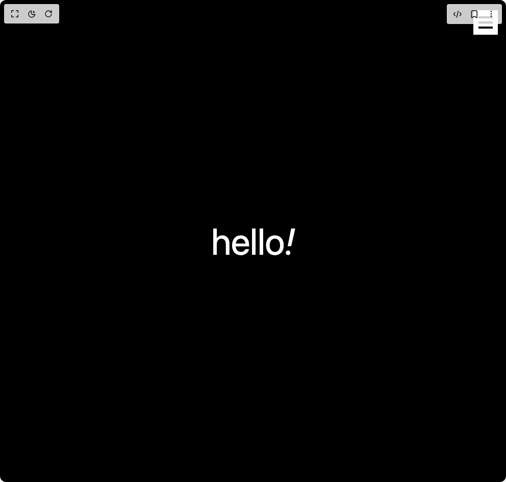

# Build Curved Menu in BuilderStudio

> Build this component in our Agentic IDE: [BuilderStudio](https://builderstudio.dev).
>
> Join the BuilderStudio community on [Discord](https://discord.gg/QdWeSGCqfe) and [Reddit](https://reddit.com/r/builderstudio).



## Component

- Author group: `ishamsu`
- Component: `curved-menu`
- Variant: `default`
- Rendered HTML snapshot: [`rendered.html`](rendered.html)

## BuilderStudio prompt

You are implementing a React component based on a component reference.

## Component identity

- Author: ishamsu
- Component slug: curved-menu
- Demo slug: default
- Title: curved-menu
- Description: 

## Goal

Recreate this component in a React + TypeScript + Tailwind CSS project. Preserve the visual layout, spacing, colors, border radius, shadows, interaction behavior, animation behavior, responsive behavior, and dark mode behavior shown in the rendered demo.

## Implementation requirements

- Use React and TypeScript.
- Use Tailwind CSS classes whenever possible.
- Keep the component self-contained unless the source files require helper components.
- If the source uses CSS variables, custom CSS, animations, or keyframes, include them.
- If the source uses external packages, list and use the required packages.
- Preserve accessibility attributes, button semantics, links, keyboard behavior, and ARIA attributes when visible in the source.
- Do not replace the component with a simplified placeholder.
- Return complete production-ready code.

## Dependencies

No reference metadata available.

## Rendered DOM snapshot

This is the rendered demo HTML extracted from the live preview. Use it to verify structure, class names, visible content, and layout.

```html
<div id="root"><div class="min-h-screen bg-black"><div class="relative"><div class="fixed -right-1 top-0 md:-right-1 m-5 z-50 w-12 h-12 rounded-none flex items-center justify-center cursor-pointer bg-white"><div class="relative w-8 h-6 flex flex-col justify-between items-center"><span class="block h-1 w-7 bg-black transition-transform duration-300 "></span><span class="block h-1 w-7 bg-black transition-opacity duration-300 "></span><span class="block h-1 w-7 bg-black transition-transform duration-300 "></span></div></div></div><div class="text-white h-screen text-7xl text-center flex justify-center items-center">hello<span class="italic">!</span></div></div></div>
```

## Reference source files

No reference source files were available.
