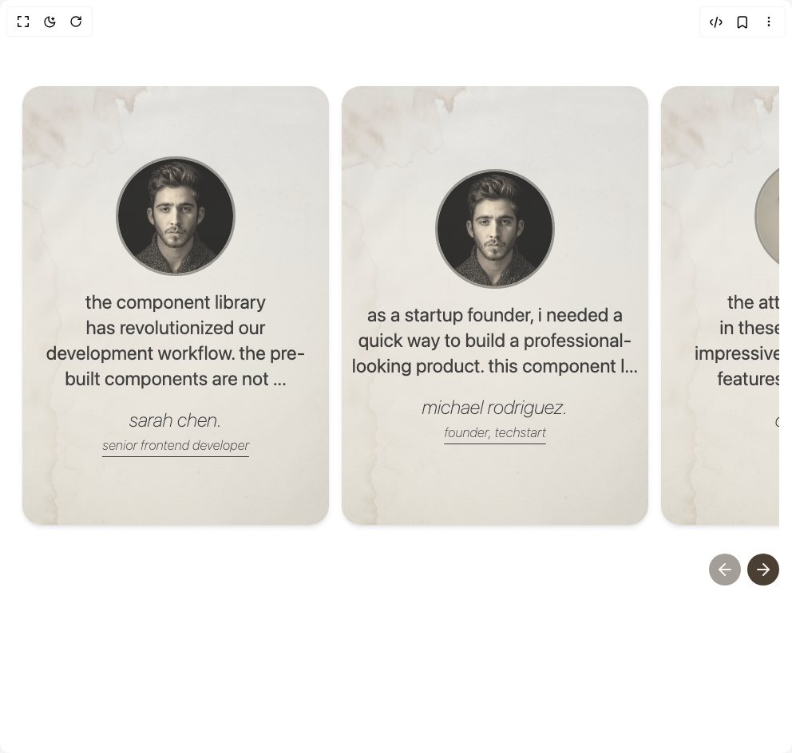

# Build Retro Testimonial in BuilderStudio

> Build this component in our Agentic IDE: [BuilderStudio](https://builderstudio.dev).
>
> Join the BuilderStudio community on [Discord](https://discord.gg/QdWeSGCqfe) and [Reddit](https://reddit.com/r/builderstudio).



## Component

- Author group: `ishamsu`
- Component: `retro-testimonial`
- Variant: `default`
- Rendered HTML snapshot: [`rendered.html`](rendered.html)

## BuilderStudio prompt

You are implementing a React component based on a component reference.

## Component identity

- Author: ishamsu
- Component slug: retro-testimonial
- Demo slug: default
- Title: retro-testimonial
- Description: 

## Goal

Recreate this component in a React + TypeScript + Tailwind CSS project. Preserve the visual layout, spacing, colors, border radius, shadows, interaction behavior, animation behavior, responsive behavior, and dark mode behavior shown in the rendered demo.

## Implementation requirements

- Use React and TypeScript.
- Use Tailwind CSS classes whenever possible.
- Keep the component self-contained unless the source files require helper components.
- If the source uses CSS variables, custom CSS, animations, or keyframes, include them.
- If the source uses external packages, list and use the required packages.
- Preserve accessibility attributes, button semantics, links, keyboard behavior, and ARIA attributes when visible in the source.
- Do not replace the component with a simplified placeholder.
- Return complete production-ready code.

## Dependencies

No reference metadata available.

## Rendered DOM snapshot

This is the rendered demo HTML extracted from the live preview. Use it to verify structure, class names, visible content, and layout.

```html
<div id="root"><div class="min-h-screen"><section class="py-12 bg-white"><div class="max-w-5xl mx-auto px-4"><div class="relative w-full mt-10"><div class="flex w-full overflow-x-scroll overscroll-x-auto scroll-smooth [scrollbar-width:none] py-5"><div class="absolute right-0 z-[1000] h-auto w-[5%] overflow-hidden bg-gradient-to-l"></div><div class="flex flex-row justify-start gap-4 pl-3 max-w-5xl mx-auto"><div class="last:pr-[5%] md:last:pr-[33%] rounded-3xl" style="opacity: 1; transform: none;"><button class=""><div class="rotate-0 rounded-3xl bg-gradient-to-b from-[#f2f0eb] to-[#fff9eb] h-[500px] md:h-[550px] w-80 md:w-96 overflow-hidden flex flex-col items-center justify-center relative z-10 shadow-md"><div class="absolute opacity-30" style="inset: -1px 0px 0px;"><div class="absolute inset-0"></div></div><div class="w-[90px] h-[90px] md:w-[150px] md:h-[150px] opacity-80 overflow-hidden rounded-[1000px] border-[3px] border-solid border-[rgba(59,59,59,0.6)] aspect-[1/1] flex-none saturate-[0.2] sepia-[0.46] relative"></div><p class="text-[rgba(31, 27, 29, 0.7)] text-2xl md:text-2xl font-normal text-center [text-wrap:balance] font-tiemposHeadline mt-4 lowercase px-3">The component library has revolutionized our development workflow. The pre-built components are not ...</p><p class="text-[rgba(31, 27, 29, 0.7)] text-xl md:text-2xl font-thin font-tiemposHeadline italic text-center mt-5 lowercase">Sarah Chen.</p><p class="text-[rgba(31, 27, 29, 0.7)] text-base md:text-base font-thin font-tiemposHeadline italic text-center mt-1 lowercase underline underline-offset-8 decoration-1">Senior Frontend Developer</p></div></button></div><div class="last:pr-[5%] md:last:pr-[33%] rounded-3xl" style="opacity: 1; transform: none;"><button class=""><div class="-rotate-0 rounded-3xl bg-gradient-to-b from-[#f2f0eb] to-[#fff9eb] h-[500px] md:h-[550px] w-80 md:w-96 overflow-hidden flex flex-col items-center justify-center relative z-10 shadow-md"><div class="absolute opacity-30" style="inset: -1px 0px 0px;"><div class="absolute inset-0"></div></div><div class="w-[90px] h-[90px] md:w-[150px] md:h-[150px] opacity-80 overflow-hidden rounded-[1000px] border-[3px] border-solid border-[rgba(59,59,59,0.6)] aspect-[1/1] flex-none saturate-[0.2] sepia-[0.46] relative"></div><p class="text-[rgba(31, 27, 29, 0.7)] text-2xl md:text-2xl font-normal text-center [text-wrap:balance] font-tiemposHeadline mt-4 lowercase px-3">As a startup founder, I needed a quick way to build a professional-looking product. This component l...</p><p class="text-[rgba(31, 27, 29, 0.7)] text-xl md:text-2xl font-thin font-tiemposHeadline italic text-center mt-5 lowercase">Michael Rodriguez.</p><p class="text-[rgba(31, 27, 29, 0.7)] text-base md:text-base font-thin font-tiemposHeadline italic text-center mt-1 lowercase underline underline-offset-8 decoration-1">Founder, TechStart</p></div></button></div><div class="last:pr-[5%] md:last:pr-[33%] rounded-3xl" style="opacity: 1; transform: none;"><button class=""><div class="rotate-0 rounded-3xl bg-gradient-to-b from-[#f2f0eb] to-[#fff9eb] h-[500px] md:h-[550px] w-80 md:w-96 overflow-hidden flex flex-col items-center justify-center relative z-10 shadow-md"><div class="absolute opacity-30" style="inset: -1px 0px 0px;"><div class="absolute inset-0"></div></div><div class="w-[90px] h-[90px] md:w-[150px] md:h-[150px] opacity-80 overflow-hidden rounded-[1000px] border-[3px] border-solid border-[rgba(59,59,59,0.6)] aspect-[1/1] flex-none saturate-[0.2] sepia-[0.46] relative"></div><p class="text-[rgba(31, 27, 29, 0.7)] text-2xl md:text-2xl font-normal text-center [text-wrap:balance] font-tiemposHeadline mt-4 lowercase px-3">The attention to detail in these components is impressive. From accessibility features to responsive...</p><p class="text-[rgba(31, 27, 29, 0.7)] text-xl md:text-2xl font-thin font-tiemposHeadline italic text-center mt-5 lowercase">David Kim.</p><p class="text-[rgba(31, 27, 29, 0.7)] text-base md:text-base font-thin font-tiemposHeadline italic text-center mt-1 lowercase underline underline-offset-8 decoration-1">UI/UX Lead</p></div></button></div><div class="last:pr-[5%] md:last:pr-[33%] rounded-3xl" style="opacity: 1; transform: none;"><button class=""><div class="-rotate-0 rounded-3xl bg-gradient-to-b from-[#f2f0eb] to-[#fff9eb] h-[500px] md:h-[550px] w-80 md:w-96 overflow-hidden flex flex-col items-center justify-center relative z-10 shadow-md"><div class="absolute opacity-30" style="inset: -1px 0px 0px;"><div class="absolute inset-0"></div></div><div class="w-[90px] h-[90px] md:w-[150px] md:h-[150px] opacity-80 overflow-hidden rounded-[1000px] border-[3px] border-solid border-[rgba(59,59,59,0.6)] aspect-[1/1] flex-none saturate-[0.2] sepia-[0.46] relative"></div><p class="text-[rgba(31, 27, 29, 0.7)] text-2xl md:text-2xl font-normal text-center [text-wrap:balance] font-tiemposHeadline mt-4 lowercase px-3">What sets this component library apart is its flexibility. We've been able to maintain consistency a...</p><p class="text-[rgba(31, 27, 29, 0.7)] text-xl md:text-2xl font-thin font-tiemposHeadline italic text-center mt-5 lowercase">Emily Thompson.</p><p class="text-[rgba(31, 27, 29, 0.7)] text-base md:text-base font-thin font-tiemposHeadline italic text-center mt-1 lowercase underline underline-offset-8 decoration-1">Product Designer</p></div></button></div><div class="last:pr-[5%] md:last:pr-[33%] rounded-3xl" style="opacity: 1; transform: none;"><button class=""><div class="rotate-0 rounded-3xl bg-gradient-to-b from-[#f2f0eb] to-[#fff9eb] h-[500px] md:h-[550px] w-80 md:w-96 overflow-hidden flex flex-col items-center justify-center relative z-10 shadow-md"><div class="absolute opacity-30" style="inset: -1px 0px 0px;"><div class="absolute inset-0"></div></div><div class="w-[90px] h-[90px] md:w-[150px] md:h-[150px] opacity-80 overflow-hidden rounded-[1000px] border-[3px] border-solid border-[rgba(59,59,59,0.6)] aspect-[1/1] flex-none saturate-[0.2] sepia-[0.46] relative"></div><p class="text-[rgba(31, 27, 29, 0.7)] text-2xl md:text-2xl font-normal text-center [text-wrap:balance] font-tiemposHeadline mt-4 lowercase px-3">The performance optimization in these components is outstanding. We've seen significant improvements...</p><p class="text-[rgba(31, 27, 29, 0.7)] text-xl md:text-2xl font-thin font-tiemposHeadline italic text-center mt-5 lowercase">James Wilson.</p><p class="text-[rgba(31, 27, 29, 0.7)] text-base md:text-base font-thin font-tiemposHeadline italic text-center mt-1 lowercase underline underline-offset-8 decoration-1">Performance Engineer</p></div></button></div><div class="last:pr-[5%] md:last:pr-[33%] rounded-3xl" style="opacity: 1; transform: none;"><button class=""><div class="-rotate-0 rounded-3xl bg-gradient-to-b from-[#f2f0eb] to-[#fff9eb] h-[500px] md:h-[550px] w-80 md:w-96 overflow-hidden flex flex-col items-center justify-center relative z-10 shadow-md"><div class="absolute opacity-30" style="inset: -1px 0px 0px;"><div class="absolute inset-0"></div></div><div class="w-[90px] h-[90px] md:w-[150px] md:h-[150px] opacity-80 overflow-hidden rounded-[1000px] border-[3px] border-solid border-[rgba(59,59,59,0.6)] aspect-[1/1] flex-none saturate-[0.2] sepia-[0.46] relative"></div><p class="text-[rgba(31, 27, 29, 0.7)] text-2xl md:text-2xl font-normal text-center [text-wrap:balance] font-tiemposHeadline mt-4 lowercase px-3">The community support and regular updates make this component library a reliable choice for our proj...</p><p class="text-[rgba(31, 27, 29, 0.7)] text-xl md:text-2xl font-thin font-tiemposHeadline italic text-center mt-5 lowercase">Sophia Martinez.</p><p class="text-[rgba(31, 27, 29, 0.7)] text-base md:text-base font-thin font-tiemposHeadline italic text-center mt-1 lowercase underline underline-offset-8 decoration-1">Full Stack Developer</p></div></button></div></div></div><div class="flex justify-end gap-2 mt-4"><button class="relative z-40 h-10 w-10 rounded-full bg-[#4b3f33] flex items-center justify-center disabled:opacity-50 hover:bg-[#4b3f33]/80 transition-colors duration-200" disabled=""><svg xmlns="http://www.w3.org/2000/svg" width="24" height="24" viewBox="0 0 24 24" fill="none" stroke="currentColor" stroke-width="2" stroke-linecap="round" stroke-linejoin="round" class="lucide lucide-arrow-left h-6 w-6 text-[#f2f0eb]" aria-hidden="true"><path d="m12 19-7-7 7-7"></path><path d="M19 12H5"></path></svg></button><button class="relative z-40 h-10 w-10 rounded-full bg-[#4b3f33] flex items-center justify-center disabled:opacity-50 hover:bg-[#4b3f33]/80 transition-colors duration-200"><svg xmlns="http://www.w3.org/2000/svg" width="24" height="24" viewBox="0 0 24 24" fill="none" stroke="currentColor" stroke-width="2" stroke-linecap="round" stroke-linejoin="round" class="lucide lucide-arrow-right h-6 w-6 text-[#f2f0eb]" aria-hidden="true"><path d="M5 12h14"></path><path d="m12 5 7 7-7 7"></path></svg></button></div></div></div></section></div></div>
```

## Reference source files

No reference source files were available.
