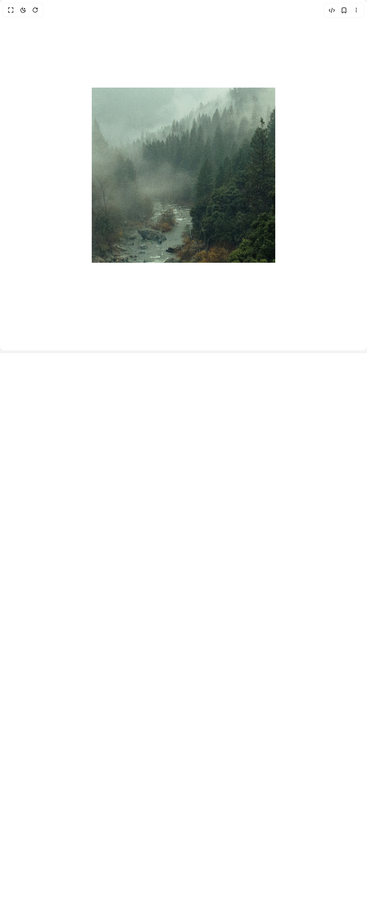

# Build Smooth Scroll Hero in BuilderStudio

> Build this component in our Agentic IDE: [BuilderStudio](https://builderstudio.dev).
>
> Join the BuilderStudio community on [Discord](https://discord.gg/QdWeSGCqfe) and [Reddit](https://reddit.com/r/builderstudio).



## Component

- Author group: `ishamsu`
- Component: `smooth-scroll-hero`
- Variant: `default`
- Rendered HTML snapshot: [`rendered.html`](rendered.html)

## BuilderStudio prompt

You are implementing a React component based on a component reference.

## Component identity

- Author: ishamsu
- Component slug: smooth-scroll-hero
- Demo slug: default
- Title: smooth-scroll-hero
- Description: 

## Goal

Recreate this component in a React + TypeScript + Tailwind CSS project. Preserve the visual layout, spacing, colors, border radius, shadows, interaction behavior, animation behavior, responsive behavior, and dark mode behavior shown in the rendered demo.

## Implementation requirements

- Use React and TypeScript.
- Use Tailwind CSS classes whenever possible.
- Keep the component self-contained unless the source files require helper components.
- If the source uses CSS variables, custom CSS, animations, or keyframes, include them.
- If the source uses external packages, list and use the required packages.
- Preserve accessibility attributes, button semantics, links, keyboard behavior, and ARIA attributes when visible in the source.
- Do not replace the component with a simplified placeholder.
- Return complete production-ready code.

## Dependencies

No reference metadata available.

## Rendered DOM snapshot

This is the rendered demo HTML extracted from the live preview. Use it to verify structure, class names, visible content, and layout.

```html
<div id="root"><div class="relative min-h-screen"><div class="relative w-full" style="height: calc(1500px + 100vh);"><div class="sticky top-0 h-screen w-full bg-black" style="will-change: transform, opacity; clip-path: polygon(25% 25%, 75% 25%, 75% 75%, 25% 75%);"><div class="absolute inset-0 md:hidden" style="background-image: url(&quot;https://images.unsplash.com/photo-1511207538754-e8555f2bc187?q=80&amp;w=2412&amp;auto=format&amp;fit=crop&amp;ixlib=rb-4.1.0&amp;ixid=M3wxMjA3fDB8MHxwaG90by1wYWdlfHx8fGVufDB8fHx8fA%3D%3D&quot;); background-position: center center; background-repeat: no-repeat; background-size: 170%;"></div><div class="absolute inset-0 hidden md:block" style="background-image: url(&quot;https://images.unsplash.com/photo-1511884642898-4c92249e20b6&quot;); background-position: center center; background-repeat: no-repeat; background-size: 170%;"></div></div></div></div></div>
```

## Reference source files

No reference source files were available.
