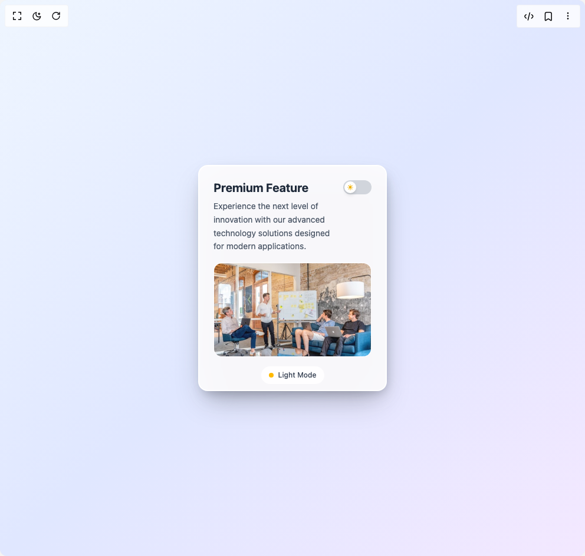

# Build 3d Image Card in BuilderStudio

> Build this component in our Agentic IDE: [BuilderStudio](https://builderstudio.dev).
>
> Join the BuilderStudio community on [Discord](https://discord.gg/QdWeSGCqfe) and [Reddit](https://reddit.com/r/builderstudio).



## Component

- Author group: `itsankitverma`
- Component: `3d-image-card`
- Variant: `default`
- Rendered HTML snapshot: [`rendered.html`](rendered.html)

## BuilderStudio prompt

You are implementing a React component based on a component reference.

## Component identity

- Author: itsankitverma
- Component slug: 3d-image-card
- Demo slug: default
- Title: 3d-image-card
- Description: 

## Goal

Recreate this component in a React + TypeScript + Tailwind CSS project. Preserve the visual layout, spacing, colors, border radius, shadows, interaction behavior, animation behavior, responsive behavior, and dark mode behavior shown in the rendered demo.

## Implementation requirements

- Use React and TypeScript.
- Use Tailwind CSS classes whenever possible.
- Keep the component self-contained unless the source files require helper components.
- If the source uses CSS variables, custom CSS, animations, or keyframes, include them.
- If the source uses external packages, list and use the required packages.
- Preserve accessibility attributes, button semantics, links, keyboard behavior, and ARIA attributes when visible in the source.
- Do not replace the component with a simplified placeholder.
- Return complete production-ready code.

## Dependencies

No reference metadata available.

## Rendered DOM snapshot

This is the rendered demo HTML extracted from the live preview. Use it to verify structure, class names, visible content, and layout.

```html
<div id="root"><div class="w-screen min-h-screen flex justify-center items-center"><div class="w-screen min-h-screen flex justify-center items-center"><div class="flex items-center justify-center min-h-screen p-8 transition-colors duration-500 w-full bg-gradient-to-br from-blue-50 via-indigo-100 to-purple-100"><div class="relative w-80 h-96 transform transition-all duration-500 hover:scale-105" style="transform-style: preserve-3d; perspective: 1000px;"><div class="relative w-full h-full rounded-2xl backdrop-blur-lg border-2 shadow-2xl transition-all duration-500 bg-white/90 border-white shadow-gray-400/40" style="backdrop-filter: blur(20px); box-shadow: rgba(0, 0, 0, 0.25) 0px 25px 50px -12px, rgba(255, 255, 255, 0.3) 0px 1px 0px inset;"><div class="relative z-10 p-6 h-full flex flex-col"><div class="flex items-start justify-between mb-4"><div class="flex-1 pr-4"><h2 class="text-xl font-bold mb-2 leading-tight transition-colors duration-500 text-gray-800">Premium Feature</h2><p class="text-sm leading-relaxed transition-colors duration-500 text-gray-600">Experience the next level of innovation with our advanced technology solutions designed for modern applications.</p></div><div class="flex-shrink-0"><button class="relative w-12 h-6 rounded-full transition-all duration-300 focus:outline-none focus:ring-2 focus:ring-offset-2 bg-gray-300 focus:ring-gray-400"><div class="absolute top-0.5 w-5 h-5 bg-white rounded-full shadow-md transition-all duration-300 flex items-center justify-center left-0.5"><svg class="w-3 h-3 text-yellow-500" fill="currentColor" viewBox="0 0 20 20"><path fill-rule="evenodd" d="M10 2a1 1 0 011 1v1a1 1 0 11-2 0V3a1 1 0 011-1zm4 8a4 4 0 11-8 0 4 4 0 018 0zm-.464 4.95l.707.707a1 1 0 001.414-1.414l-.707-.707a1 1 0 00-1.414 1.414zm2.12-10.607a1 1 0 010 1.414l-.706.707a1 1 0 11-1.414-1.414l.707-.707a1 1 0 011.414 0zM17 11a1 1 0 100-2h-1a1 1 0 100 2h1zm-7 4a1 1 0 011 1v1a1 1 0 11-2 0v-1a1 1 0 011-1zM5.05 6.464A1 1 0 106.465 5.05l-.708-.707a1 1 0 00-1.414 1.414l.707.707zm1.414 8.486l-.707.707a1 1 0 01-1.414-1.414l.707-.707a1 1 0 011.414 1.414zM4 11a1 1 0 100-2H3a1 1 0 000 2h1z" clip-rule="evenodd"></path></svg></div></button></div></div><div class="flex-1 flex items-center justify-center mb-4"><div class="relative w-full h-40 rounded-xl overflow-hidden transition-all duration-500 bg-white/20 border-white/30 border" style="backdrop-filter: blur(10px);"><div class="absolute inset-0 transition-all duration-500 bg-white/5"></div></div></div><div class="flex items-center justify-center"><div class="flex items-center space-x-2 px-3 py-1.5 rounded-full backdrop-blur-sm transition-all duration-500 bg-white/40 border border-white/50"><div class="w-2 h-2 rounded-full transition-all duration-500 bg-amber-400"></div><span class="text-xs font-medium transition-colors duration-500 text-gray-700">Light Mode</span></div></div></div></div><div class="absolute inset-0 rounded-2xl transform transition-all duration-500 -z-10 bg-gray-500/30" style="transform: translateZ(-20px) translateY(8px) translateX(4px) rotateY(2deg); filter: blur(8px);"></div><div class="absolute inset-0 rounded-2xl transform transition-all duration-500 -z-20 bg-gray-400/20" style="transform: translateZ(-40px) translateY(15px) translateX(8px) rotateY(4deg); filter: blur(15px);"></div></div></div></div></div></div>
```

## Reference source files

No reference source files were available.
