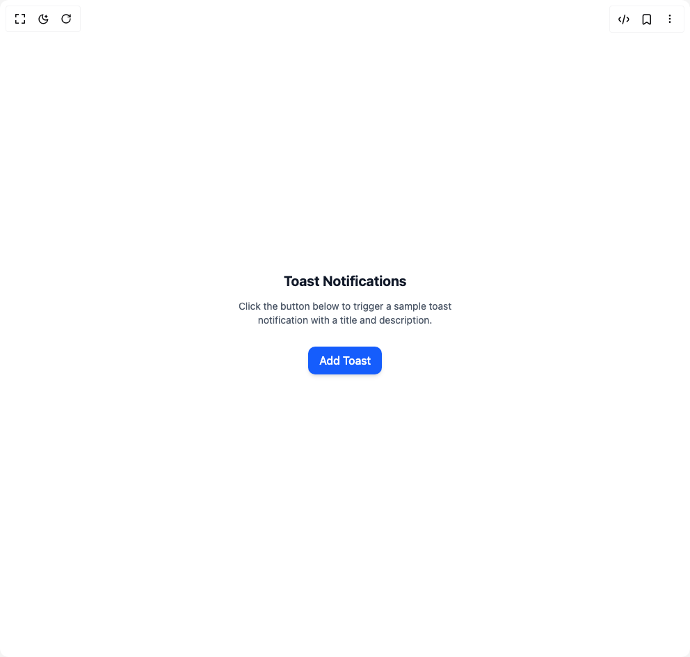

# Build Toast in BuilderStudio

> Build this component in our Agentic IDE: [BuilderStudio](https://builderstudio.dev).
>
> Join the BuilderStudio community on [Discord](https://discord.gg/QdWeSGCqfe) and [Reddit](https://reddit.com/r/builderstudio).



## Component

- Author group: `itsankitverma`
- Component: `toast`
- Variant: `default`
- Rendered HTML snapshot: [`rendered.html`](rendered.html)

## BuilderStudio prompt

You are implementing a React component based on a component reference.

## Component identity

- Author: itsankitverma
- Component slug: toast
- Demo slug: default
- Title: toast
- Description: 

## Goal

Recreate this component in a React + TypeScript + Tailwind CSS project. Preserve the visual layout, spacing, colors, border radius, shadows, interaction behavior, animation behavior, responsive behavior, and dark mode behavior shown in the rendered demo.

## Implementation requirements

- Use React and TypeScript.
- Use Tailwind CSS classes whenever possible.
- Keep the component self-contained unless the source files require helper components.
- If the source uses CSS variables, custom CSS, animations, or keyframes, include them.
- If the source uses external packages, list and use the required packages.
- Preserve accessibility attributes, button semantics, links, keyboard behavior, and ARIA attributes when visible in the source.
- Do not replace the component with a simplified placeholder.
- Return complete production-ready code.

## Dependencies

No reference metadata available.

## Rendered DOM snapshot

This is the rendered demo HTML extracted from the live preview. Use it to verify structure, class names, visible content, and layout.

```html
<div id="root"><div class="w-screen min-h-screen flex justify-center items-center"><div class="w-screen min-h-screen flex justify-center items-center"><div class="p-6 space-y-4 text-center"><div><h2 class="text-xl font-bold text-gray-900 dark:text-gray-100">Toast Notifications</h2><p class="text-sm text-gray-600 dark:text-gray-400 w-80 py-3">Click the button below to trigger a sample toast notification with a title and description.</p></div><button type="button" class="px-4 py-2 rounded-lg bg-blue-600 text-white font-medium shadow-md 
                   hover:bg-blue-700 dark:bg-blue-500 dark:hover:bg-blue-600 transition">Add Toast</button><div data-scope="toast" data-part="group" dir="ltr" tabindex="-1" aria-label="bottom-end Notifications alt+T" id="toast-group:bottom-end" data-placement="bottom-end" data-side="bottom" data-align="end" aria-live="polite" role="region" style="position: fixed; pointer-events: none; display: flex; flex-direction: column; --gap: 24px; --first-height: 0px; z-index: 2147483647; align-items: flex-end; bottom: max(env(safe-area-inset-bottom, 0px), 1rem); inset-inline-end: calc(env(safe-area-inset-right, 0px) + 1rem);"></div></div></div></div></div>
```

## Reference source files

No reference source files were available.
