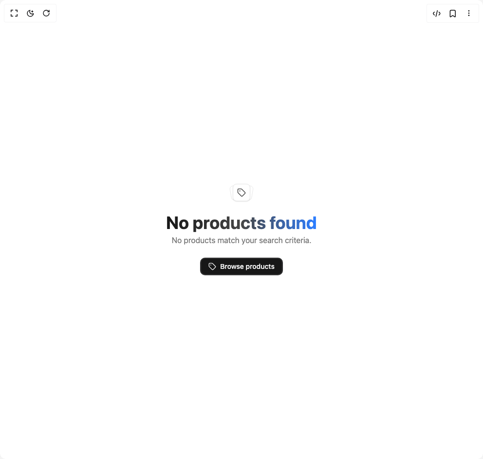

# Build Empty in BuilderStudio

> Build this component in our Agentic IDE: [BuilderStudio](https://builderstudio.dev).
>
> Join the BuilderStudio community on [Discord](https://discord.gg/QdWeSGCqfe) and [Reddit](https://reddit.com/r/builderstudio).



## Component

- Author group: `j1zuz`
- Component: `empty`
- Variant: `products`
- Rendered HTML snapshot: [`rendered.html`](rendered.html)

## BuilderStudio prompt

You are implementing a React component based on a component reference.

## Component identity

- Author: j1zuz
- Component slug: empty
- Demo slug: products
- Title: empty
- Description: 

## Goal

Recreate this component in a React + TypeScript + Tailwind CSS project. Preserve the visual layout, spacing, colors, border radius, shadows, interaction behavior, animation behavior, responsive behavior, and dark mode behavior shown in the rendered demo.

## Implementation requirements

- Use React and TypeScript.
- Use Tailwind CSS classes whenever possible.
- Keep the component self-contained unless the source files require helper components.
- If the source uses CSS variables, custom CSS, animations, or keyframes, include them.
- If the source uses external packages, list and use the required packages.
- Preserve accessibility attributes, button semantics, links, keyboard behavior, and ARIA attributes when visible in the source.
- Do not replace the component with a simplified placeholder.
- Return complete production-ready code.

## Dependencies

No reference metadata available.

## Rendered DOM snapshot

This is the rendered demo HTML extracted from the live preview. Use it to verify structure, class names, visible content, and layout.

```html
<div id="root"><div class="w-screen min-h-screen flex justify-center items-center"><div class="w-screen min-h-screen flex justify-center items-center"><div class="relative min-h-screen w-full overflow-hidden bg-background flex items-center justify-center px-6"><div data-slot="empty" class="flex min-w-0 flex-1 flex-col items-center justify-center gap-6 rounded-xl border-dashed p-6 text-center text-balance md:p-12"><div data-slot="empty-header" class="flex max-w-sm flex-col items-center text-center"><div data-slot="empty-media" data-variant="icon" class="relative mb-6"><div class="[&amp;_svg]:pointer-events-none [&amp;_svg]:shrink-0 flex size-9 shrink-0 items-center justify-center rounded-md border bg-card text-foreground shadow-black/5 before:pointer-events-none before:absolute before:inset-0 before:rounded-[calc(var(--radius-md)-1px)] before:shadow-[0_1px_--theme(--color-black/4%)] dark:before:shadow-[0_-1px_--theme(--color-white/8%)] [&amp;_svg:not([class*='size-'])]:size-4.5 pointer-events-none absolute bottom-px origin-bottom-left -translate-x-0.5 scale-84 -rotate-10 shadow-none" aria-hidden="true"></div><div class="[&amp;_svg]:pointer-events-none [&amp;_svg]:shrink-0 flex size-9 shrink-0 items-center justify-center rounded-md border bg-card text-foreground shadow-black/5 before:pointer-events-none before:absolute before:inset-0 before:rounded-[calc(var(--radius-md)-1px)] before:shadow-[0_1px_--theme(--color-black/4%)] dark:before:shadow-[0_-1px_--theme(--color-white/8%)] [&amp;_svg:not([class*='size-'])]:size-4.5 pointer-events-none absolute bottom-px origin-bottom-right translate-x-0.5 scale-84 rotate-10 shadow-none" aria-hidden="true"></div><div class="[&amp;_svg]:pointer-events-none [&amp;_svg]:shrink-0 relative flex size-9 shrink-0 items-center justify-center rounded-md border bg-card text-foreground shadow-sm shadow-black/5 before:pointer-events-none before:absolute before:inset-0 before:rounded-[calc(var(--radius-md)-1px)] before:shadow-[0_1px_--theme(--color-black/4%)] dark:before:shadow-[0_-1px_--theme(--color-white/8%)] [&amp;_svg:not([class*='size-'])]:size-4.5"><svg xmlns="http://www.w3.org/2000/svg" width="24" height="24" viewBox="0 0 24 24" fill="none" stroke="currentColor" stroke-width="2" stroke-linecap="round" stroke-linejoin="round" class="lucide lucide-tag h-16 w-16 text-primary/80" aria-hidden="true"><path d="M12.586 2.586A2 2 0 0 0 11.172 2H4a2 2 0 0 0-2 2v7.172a2 2 0 0 0 .586 1.414l8.704 8.704a2.426 2.426 0 0 0 3.42 0l6.58-6.58a2.426 2.426 0 0 0 0-3.42z"></path><circle cx="7.5" cy="7.5" r=".5" fill="currentColor"></circle></svg></div></div><div data-slot="empty-title" class="font-heading text-4xl font-bold bg-gradient-to-r from-primary via-primary/80 to-blue-500 bg-clip-text text-transparent">No products found</div><div data-slot="empty-description" class="[&amp;&gt;a]:underline [&amp;&gt;a]:underline-offset-4 [&amp;&gt;a:hover]:text-primary [[data-slot=empty-title]+&amp;]:mt-1 text-muted-foreground text-base max-w-md mx-auto">No products match your search criteria.</div></div><div data-slot="empty-content" class="flex w-full max-w-sm min-w-0 flex-col items-center gap-4 text-sm text-balance"><div class="flex flex-col items-center justify-center gap-3 sm:flex-row"><button class="inline-flex items-center justify-center whitespace-nowrap rounded-lg text-sm font-medium transition-colors outline-offset-2 focus-visible:outline-2 focus-visible:outline-ring/70 disabled:pointer-events-none disabled:opacity-50 [&amp;_svg]:pointer-events-none [&amp;_svg]:shrink-0 bg-primary text-primary-foreground shadow-sm shadow-black/5 hover:bg-primary/90 h-9 px-4 py-2 btn-default group"><svg xmlns="http://www.w3.org/2000/svg" width="24" height="24" viewBox="0 0 24 24" fill="none" stroke="currentColor" stroke-width="2" stroke-linecap="round" stroke-linejoin="round" class="lucide lucide-tag h-4 w-4 mr-2 transition-transform group-hover:rotate-6" aria-hidden="true"><path d="M12.586 2.586A2 2 0 0 0 11.172 2H4a2 2 0 0 0-2 2v7.172a2 2 0 0 0 .586 1.414l8.704 8.704a2.426 2.426 0 0 0 3.42 0l6.58-6.58a2.426 2.426 0 0 0 0-3.42z"></path><circle cx="7.5" cy="7.5" r=".5" fill="currentColor"></circle></svg>Browse products</button></div></div></div></div></div></div></div>
```

## Reference source files

No reference source files were available.
