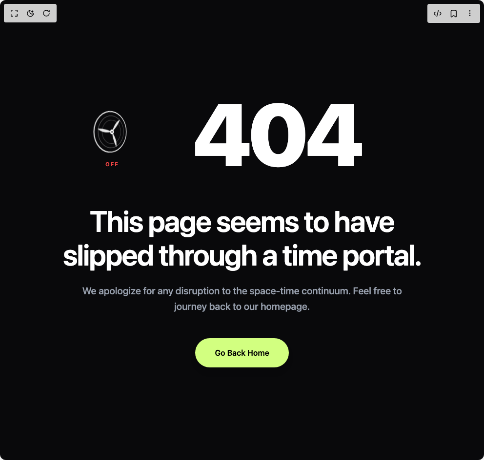

# Build Animated 404 Page in BuilderStudio

> Build this component in our Agentic IDE: [BuilderStudio](https://builderstudio.dev).
>
> Join the BuilderStudio community on [Discord](https://discord.gg/QdWeSGCqfe) and [Reddit](https://reddit.com/r/builderstudio).



## Component

- Author group: `jahirul07`
- Component: `animated-404-page`
- Variant: `default`
- Rendered HTML snapshot: [`rendered.html`](rendered.html)

## BuilderStudio prompt

You are implementing a React component based on a component reference.

## Component identity

- Author: jahirul07
- Component slug: animated-404-page
- Demo slug: default
- Title: animated-404-page
- Description: 

## Goal

Recreate this component in a React + TypeScript + Tailwind CSS project. Preserve the visual layout, spacing, colors, border radius, shadows, interaction behavior, animation behavior, responsive behavior, and dark mode behavior shown in the rendered demo.

## Implementation requirements

- Use React and TypeScript.
- Use Tailwind CSS classes whenever possible.
- Keep the component self-contained unless the source files require helper components.
- If the source uses CSS variables, custom CSS, animations, or keyframes, include them.
- If the source uses external packages, list and use the required packages.
- Preserve accessibility attributes, button semantics, links, keyboard behavior, and ARIA attributes when visible in the source.
- Do not replace the component with a simplified placeholder.
- Return complete production-ready code.

## Dependencies

No reference metadata available.

## Rendered DOM snapshot

This is the rendered demo HTML extracted from the live preview. Use it to verify structure, class names, visible content, and layout.

```html
<div id="root"><div class="w-screen min-h-screen flex justify-center items-center"><div class="w-screen min-h-screen flex justify-center items-center"><main class="relative flex h-screen w-full flex-col items-center justify-center overflow-hidden bg-[#09090b] px-6 py-24 text-center sm:py-32 lg:px-8"><div class="absolute inset-0 -z-10 flex items-center justify-center"><div class="h-[400px] w-[400px] rounded-full bg-[#a78bfa]/5 blur-[120px] sm:h-[600px] sm:w-[600px]"></div></div><div class="flex flex-col items-center max-w-4xl w-full z-10"><div class="flex flex-row items-center justify-center gap-4 sm:gap-8 w-full mb-8 scale-90 sm:scale-100"><div role="button" aria-label="Toggle fan" aria-pressed="false" tabindex="0" style="display: flex; flex-direction: column; align-items: center; gap: 4px; cursor: pointer; outline: none; flex-shrink: 0; user-select: none; touch-action: manipulation;"><svg viewBox="0 0 100 100" style="display: block; transform: perspective(220px) rotateY(38deg); width: clamp(56px, 11vw, 112px); height: clamp(56px, 11vw, 112px);"><circle cx="50" cy="50" r="38" fill="none" stroke="#ffffff" stroke-width="2" opacity="0.85"></circle><circle cx="50" cy="50" r="30" fill="none" stroke="#ffffff" stroke-width="1" opacity="0.35"></circle><circle cx="50" cy="50" r="22" fill="none" stroke="#ffffff" stroke-width="1" opacity="0.25"></circle><g style="transform-box: view-box; transform-origin: 50px 50px; will-change: transform; transform: rotate(0deg);"><path d="M50 50 C 56 34, 64 28, 70 26 C 66 34, 60 42, 50 50 Z" fill="#ffffff" opacity="0.9" transform="rotate(0 50 50)"></path><path d="M50 50 C 56 34, 64 28, 70 26 C 66 34, 60 42, 50 50 Z" fill="#ffffff" opacity="0.9" transform="rotate(120 50 50)"></path><path d="M50 50 C 56 34, 64 28, 70 26 C 66 34, 60 42, 50 50 Z" fill="#ffffff" opacity="0.9" transform="rotate(240 50 50)"></path></g><circle cx="50" cy="50" r="4.5" fill="#ffffff"></circle><circle cx="50" cy="50" r="1.6" fill="#09090b"></circle></svg><span style="font-family: ui-sans-serif, system-ui, -apple-system, &quot;Segoe UI&quot;, sans-serif; font-weight: 700; font-size: 11px; letter-spacing: 0.18em; color: rgb(239, 68, 68); opacity: 1; transition: color 0.4s, opacity 0.4s;">OFF</span></div><svg role="img" aria-label="404" viewBox="0 0 500 180" preserveAspectRatio="xMidYMid meet" style="width: min(65vw, 500px); height: auto; max-height: 70vh; overflow: visible; transform: skewX(0deg);"><defs><filter id="ripple-«r0»" x="-15%" y="-15%" width="130%" height="130%"><feTurbulence type="fractalNoise" baseFrequency="0.002 0.028" numOctaves="1" seed="4" result="noise"></feTurbulence><feDisplacementMap in="SourceGraphic" in2="noise" scale="0" xChannelSelector="R" yChannelSelector="G"></feDisplacementMap></filter></defs><g filter="url(#ripple-«r0»)" fill="#ffffff"><text x="250" y="150" text-anchor="middle" style="font-family: ui-sans-serif, system-ui, -apple-system, &quot;Segoe UI&quot;, sans-serif; font-weight: 900; font-size: 180px; letter-spacing: -0.04em; user-select: none;">404</text></g></svg></div><h1 class="mt-4 text-3xl font-semibold tracking-tight text-white sm:text-5xl md:text-6xl max-w-3xl leading-[1.15]">This page seems to have slipped through a time portal.</h1><p class="mt-6 text-base font-medium text-gray-400 sm:text-lg md:text-xl max-w-2xl leading-relaxed">We apologize for any disruption to the space-time continuum. Feel free to journey back to our homepage.</p><div class="mt-12 flex items-center justify-center w-full"><a href="/" class="inline-flex items-center justify-center rounded-full bg-[#d2ff80] px-10 py-4.5 text-sm sm:text-base font-semibold text-black shadow-lg hover:bg-[#c2f26d] active:scale-98 transition-all duration-200 cursor-pointer">Go Back Home</a></div></div></main></div></div></div>
```

## Reference source files

No reference source files were available.
