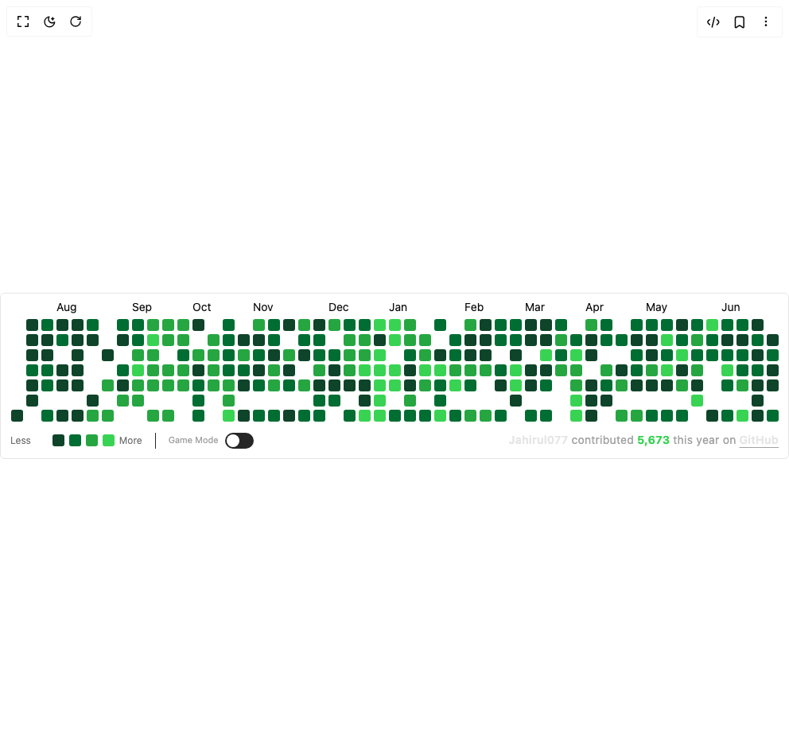

# Build Retro Space Shooter Git Hub Calendar in BuilderStudio

> Build this component in our Agentic IDE: [BuilderStudio](https://builderstudio.dev).
>
> Join the BuilderStudio community on [Discord](https://discord.gg/QdWeSGCqfe) and [Reddit](https://reddit.com/r/builderstudio).



## Component

- Author group: `jahirul07`
- Component: `retro-space-shooter-git-hub-calendar`
- Variant: `default`
- Rendered HTML snapshot: [`rendered.html`](rendered.html)

## BuilderStudio prompt

You are implementing a React component based on a component reference.

## Component identity

- Author: jahirul07
- Component slug: retro-space-shooter-git-hub-calendar
- Demo slug: default
- Title: retro-space-shooter-git-hub-calendar
- Description: 

## Goal

Recreate this component in a React + TypeScript + Tailwind CSS project. Preserve the visual layout, spacing, colors, border radius, shadows, interaction behavior, animation behavior, responsive behavior, and dark mode behavior shown in the rendered demo.

## Implementation requirements

- Use React and TypeScript.
- Use Tailwind CSS classes whenever possible.
- Keep the component self-contained unless the source files require helper components.
- If the source uses CSS variables, custom CSS, animations, or keyframes, include them.
- If the source uses external packages, list and use the required packages.
- Preserve accessibility attributes, button semantics, links, keyboard behavior, and ARIA attributes when visible in the source.
- Do not replace the component with a simplified placeholder.
- Return complete production-ready code.

## Dependencies

No reference metadata available.

## Rendered DOM snapshot

This is the rendered demo HTML extracted from the live preview. Use it to verify structure, class names, visible content, and layout.

```html
<div id="root"><div class="w-screen min-h-screen flex justify-center items-center"><div class="w-screen min-h-screen flex justify-center items-center"><div class="w-fit mx-auto overflow-x-hidden border rounded-sm transition-all duration-500"><div class="w-fit mx-auto max-w-full flex flex-col gap-3 p-3"><div class="relative overflow-x-auto transition-all duration-500" style="scrollbar-width: none;"><svg width="1003" height="149" viewBox="0 0 1003 149" class="overflow-visible"><text x="19" y="10" font-size="14" fill="#0a0a0a" font-family="inherit">Jul</text><text x="95" y="10" font-size="14" fill="#0a0a0a" font-family="inherit">Aug</text><text x="190" y="10" font-size="14" fill="#0a0a0a" font-family="inherit">Sep</text><text x="266" y="10" font-size="14" fill="#0a0a0a" font-family="inherit">Oct</text><text x="342" y="10" font-size="14" fill="#0a0a0a" font-family="inherit">Nov</text><text x="437" y="10" font-size="14" fill="#0a0a0a" font-family="inherit">Dec</text><text x="513" y="10" font-size="14" fill="#0a0a0a" font-family="inherit">Jan</text><text x="608" y="10" font-size="14" fill="#0a0a0a" font-family="inherit">Feb</text><text x="684" y="10" font-size="14" fill="#0a0a0a" font-family="inherit">Mar</text><text x="760" y="10" font-size="14" fill="#0a0a0a" font-family="inherit">Apr</text><text x="836" y="10" font-size="14" fill="#0a0a0a" font-family="inherit">May</text><text x="931" y="10" font-size="14" fill="#0a0a0a" font-family="inherit">Jun</text><rect x="0" y="20" width="15" height="15" rx="3" fill="#ffffff" style="transition: opacity 0.1s; opacity: 1; pointer-events: auto;"></rect><rect x="0" y="39" width="15" height="15" rx="3" fill="#ffffff" style="transition: opacity 0.1s; opacity: 1; pointer-events: auto;"></rect><rect x="0" y="58" width="15" height="15" rx="3" fill="#ffffff" style="transition: opacity 0.1s; opacity: 1; pointer-events: auto;"></rect><rect x="0" y="77" width="15" height="15" rx="3" fill="#ffffff" style="transition: opacity 0.1s; opacity: 1; pointer-events: auto;"></rect><rect x="0" y="96" width="15" height="15" rx="3" fill="#ffffff" style="transition: opacity 0.1s; opacity: 1; pointer-events: auto;"></rect><rect x="0" y="115" width="15" height="15" rx="3" fill="#ffffff" style="transition: opacity 0.1s; opacity: 1; pointer-events: auto;"></rect><rect id="cell-«r0»-2025-06-28" x="0" y="134" width="15" height="15" rx="3" fill="#006d32" style="transition: opacity 0.1s; opacity: 1; pointer-events: auto;"></rect><rect id="cell-«r0»-2025-06-29" x="19" y="20" width="15" height="15" rx="3" fill="#006d32" style="transition: opacity 0.1s; opacity: 1; pointer-events: auto;"></rect><rect id="cell-«r0»-2025-06-30" x="19" y="39" width="15" height="15" rx="3" fill="#006d32" style="transition: opacity 0.1s; opacity: 1; pointer-events: auto;"></rect><rect id="cell-«r0»-2025-07-01" x="19" y="58" width="15" height="15" rx="3" fill="#006d32" style="transition: opacity 0.1s; opacity: 1; pointer-events: auto;"></rect><rect id="cell-«r0»-2025-07-02" x="19" y="77" width="15" height="15" rx="3" fill="#006d32" style="transition: opacity 0.1s; opacity: 1; pointer-events: auto;"></rect><rect id="cell-«r0»-2025-07-03" x="19" y="96" width="15" height="15" rx="3" fill="#ffffff" style="transition: opacity 0.1s; opacity: 1; pointer-events: auto;"></rect><rect id="cell-«r0»-2025-07-04" x="19" y="115" width="15" height="15" rx="3" fill="#ffffff" style="transition: opacity 0.1s; opacity: 1; pointer-events: auto;"></rect><rect id="cell-«r0»-2025-07-05" x="19" y="134" width="15" height="15" rx="3" fill="#ffffff" style="transition: opacity 0.1s; opacity: 1; pointer-events: auto;"></rect><rect id="cell-«r0»-2025-07-06" x="38" y="20" width="15" height="15" rx="3" fill="#ffffff" style="transition: opacity 0.1s; opacity: 1; pointer-events: auto;"></rect><rect id="cell-«r0»-2025-07-07" x="38" y="39" width="15" height="15" rx="3" fill="#ffffff" style="transition: opacity 0.1s; opacity: 1; pointer-events: auto;"></rect><rect id="cell-«r0»-2025-07-08" x="38" y="58" width="15" height="15" rx="3" fill="#ffffff" style="transition: opacity 0.1s; opacity: 1; pointer-events: auto;"></rect><rect id="cell-«r0»-2025-07-09" x="38" y="77" width="15" height="15" rx="3" fill="#ffffff" style="transition: opacity 0.1s; opacity: 1; pointer-events: auto;"></rect><rect id="cell-«r0»-2025-07-10" x="38" y="96" width="15" height="15" rx="3" fill="#ffffff" style="transition: opacity 0.1s; opacity: 1; pointer-events: auto;"></rect><rect id="cell-«r0»-2025-07-11" x="38" y="115" width="15" height="15" rx="3" fill="#ffffff" style="transition: opacity 0.1s; opacity: 1; pointer-events: auto;"></rect><rect id="cell-«r0»-2025-07-12" x="38" y="134" width="15" height="15" rx="3" fill="#0e4429" style="transition: opacity 0.1s; opacity: 1; pointer-events: auto;"></rect><rect id="cell-«r0»-2025-07-13" x="57" y="20" width="15" height="15" rx="3" fill="#0e4429" style="transition: opacity 0.1s; opacity: 1; pointer-events: auto;"></rect><rect id="cell-«r0»-2025-07-14" x="57" y="39" width="15" height="15" rx="3" fill="#0e4429" style="transition: opacity 0.1s; opacity: 1; pointer-events: auto;"></rect><rect id="cell-«r0»-2025-07-15" x="57" y="58" width="15" height="15" rx="3" fill="#0e4429" style="transition: opacity 0.1s; opacity: 1; pointer-events: auto;"></rect><rect id="cell-«r0»-2025-07-16" x="57" y="77" width="15" height="15" rx="3" fill="#006d32" style="transition: opacity 0.1s; opacity: 1; pointer-events: auto;"></rect><rect id="cell-«r0»-2025-07-17" x="57" y="96" width="15" height="15" rx="3" fill="#0e4429" style="transition: opacity 0.1s; opacity: 1; pointer-events: auto;"></rect><rect id="cell-«r0»-2025-07-18" x="57" y="115" width="15" height="15" rx="3" fill="#0e4429" style="transition: opacity 0.1s; opacity: 1; pointer-events: auto;"></rect><rect id="cell-«r0»-2025-07-19" x="57" y="134" width="15" height="15" rx="3" fill="#ffffff" style="transition: opacity 0.1s; opacity: 1; pointer-events: auto;"></rect><rect id="cell-«r0»-2025-07-20" x="76" y="20" width="15" height="15" rx="3" fill="#006d32" style="transition: opacity 0.1s; opacity: 1; pointer-events: auto;"></rect><rect id="cell-«r0»-2025-07-21" x="76" y="39" width="15" height="15" rx="3" fill="#0e4429" style="transition: opacity 0.1s; opacity: 1; pointer-events: auto;"></rect><rect id="cell-«r0»-2025-07-22" x="76" y="58" width="15" height="15" rx="3" fill="#0e4429" style="transition: opacity 0.1s; opacity: 1; pointer-events: auto;"></rect><rect id="cell-«r0»-2025-07-23" x="76" y="77" width="15" height="15" rx="3" fill="#006d32" style="transition: opacity 0.1s; opacity: 1; pointer-events: auto;"></rect><rect id="cell-«r0»-2025-07-24" x="76" y="96" width="15" height="15" rx="3" fill="#006d32" style="transition: opacity 0.1s; opacity: 1; pointer-events: auto;"></rect><rect id="cell-«r0»-2025-07-25" x="76" y="115" width="15" height="15" rx="3" fill="#ffffff" style="transition: opacity 0.1s; opacity: 1; pointer-events: auto;"></rect><rect id="cell-«r0»-2025-07-26" x="76" y="134" width="15" height="15" rx="3" fill="#006d32" style="transition: opacity 0.1s; opacity: 1; pointer-events: auto;"></rect><rect id="cell-«r0»-2025-07-27" x="95" y="20" width="15" height="15" rx="3" fill="#0e4429" style="transition: opacity 0.1s; opacity: 1; pointer-events: auto;"></rect><rect id="cell-«r0»-2025-07-28" x="95" y="39" width="15" height="15" rx="3" fill="#006d32" style="transition: opacity 0.1s; opacity: 1; pointer-events: auto;"></rect><rect id="cell-«r0»-2025-07-29" x="95" y="58" width="15" height="15" rx="3" fill="#ffffff" style="transition: opacity 0.1s; opacity: 1; pointer-events: auto;"></rect><rect id="cell-«r0»-2025-07-30" x="95" y="77" width="15" height="15" rx="3" fill="#0e4429" style="transition: opacity 0.1s; opacity: 1; pointer-events: auto;"></rect><rect id="cell-«r0»-2025-07-31" x="95" y="96" width="15" height="15" rx="3" fill="#0e4429" style="transition: opacity 0.1s; opacity: 1; pointer-events: auto;"></rect><rect id="cell-«r0»-2025-08-01" x="95" y="115" width="15" height="15" rx="3" fill="#ffffff" style="transition: opacity 0.1s; opacity: 1; pointer-events: auto;"></rect><rect id="cell-«r0»-2025-08-02" x="95" y="134" width="15" height="15" rx="3" fill="#0e4429" style="transition: opacity 0.1s; opacity: 1; pointer-events: auto;"></rect><rect id="cell-«r0»-2025-08-03" x="114" y="20" width="15" height="15" rx="3" fill="#0e4429" style="transition: opacity 0.1s; opacity: 1; pointer-events: auto;"></rect><rect id="cell-«r0»-2025-08-04" x="114" y="39" width="15" height="15" rx="3" fill="#0e4429" style="transition: opacity 0.1s; opacity: 1; pointer-events: auto;"></rect><rect id="cell-«r0»-2025-08-05" x="114" y="58" width="15" height="15" rx="3" fill="#0e4429" style="transition: opacity 0.1s; opacity: 1; pointer-events: auto;"></rect><rect id="cell-«r0»-2025-08-06" x="114" y="77" width="15" height="15" rx="3" fill="#0e4429" style="transition: opacity 0.1s; opacity: 1; pointer-events: auto;"></rect><rect id="cell-«r0»-2025-08-07" x="114" y="96" width="15" height="15" rx="3" fill="#0e4429" style="transition: opacity 0.1s; opacity: 1; pointer-events: auto;"></rect><rect id="cell-«r0»-2025-08-08" x="114" y="115" width="15" height="15" rx="3" fill="#ffffff" style="transition: opacity 0.1s; opacity: 1; pointer-events: auto;"></rect><rect id="cell-«r0»-2025-08-09" x="114" y="134" width="15" height="15" rx="3" fill="#0e4429" style="transition: opacity 0.1s; opacity: 1; pointer-events: auto;"></rect><rect id="cell-«r0»-2025-08-10" x="133" y="20" width="15" height="15" rx="3" fill="#006d32" style="transition: opacity 0.1s; opacity: 1; pointer-events: auto;"></rect><rect id="cell-«r0»-2025-08-11" x="133" y="39" width="15" height="15" rx="3" fill="#0e4429" style="transition: opacity 0.1s; opacity: 1; pointer-events: auto;"></rect><rect id="cell-«r0»-2025-08-12" x="133" y="58" width="15" height="15" rx="3" fill="#ffffff" style="transition: opacity 0.1s; opacity: 1; pointer-events: auto;"></rect><rect id="cell-«r0»-2025-08-13" x="133" y="77" width="15" height="15" rx="3" fill="#ffffff" style="transition: opacity 0.1s; opacity: 1; pointer-events: auto;"></rect><rect id="cell-«r0»-2025-08-14" x="133" y="96" width="15" height="15" rx="3" fill="#ffffff" style="transition: opacity 0.1s; opacity: 1; pointer-events: auto;"></rect><rect id="cell-«r0»-2025-08-15" x="133" y="115" width="15" height="15" rx="3" fill="#0e4429" style="transition: opacity 0.1s; opacity: 1; pointer-events: auto;"></rect><rect id="cell-«r0»-2025-08-16" x="133" y="134" width="15" height="15" rx="3" fill="#26a641" style="transition: opacity 0.1s; opacity: 1; pointer-events: auto;"></rect><rect id="cell-«r0»-2025-08-17" x="152" y="20" width="15" height="15" rx="3" fill="#ffffff" style="transition: opacity 0.1s; opacity: 1; pointer-events: auto;"></rect><rect id="cell-«r0»-2025-08-18" x="152" y="39" width="15" height="15" rx="3" fill="#ffffff" style="transition: opacity 0.1s; opacity: 1; pointer-events: auto;"></rect><rect id="cell-«r0»-2025-08-19" x="152" y="58" width="15" height="15" rx="3" fill="#0e4429" style="transition: opacity 0.1s; opacity: 1; pointer-events: auto;"></rect><rect id="cell-«r0»-2025-08-20" x="152" y="77" width="15" height="15" rx="3" fill="#ffffff" style="transition: opacity 0.1s; opacity: 1; pointer-events: auto;"></rect><rect id="cell-«r0»-2025-08-21" x="152" y="96" width="15" height="15" rx="3" fill="#26a641" style="transition: opacity 0.1s; opacity: 1; pointer-events: auto;"></rect><rect id="cell-«r0»-2025-08-22" x="152" y="115" width="15" height="15" rx="3" fill="#ffffff" style="transition: opacity 0.1s; opacity: 1; pointer-events: auto;"></rect><rect id="cell-«r0»-2025-08-23" x="152" y="134" width="15" height="15" rx="3" fill="#26a641" style="transition: opacity 0.1s; opacity: 1; pointer-events: auto;"></rect><rect id="cell-«r0»-2025-08-24" x="171" y="20" width="15" height="15" rx="3" fill="#006d32" style="transition: opacity 0.1s; opacity: 1; pointer-events: auto;"></rect><rect id="cell-«r0»-2025-08-25" x="171" y="39" width="15" height="15" rx="3" fill="#0e4429" style="transition: opacity 0.1s; opacity: 1; pointer-events: auto;"></rect><rect id="cell-«r0»-2025-08-26" x="171" y="58" width="15" height="15" rx="3" fill="#ffffff" style="transition: opacity 0.1s; opacity: 1; pointer-events: auto;"></rect><rect id="cell-«r0»-2025-08-27" x="171" y="77" width="15" height="15" rx="3" fill="#006d32" style="transition: opacity 0.1s; opacity: 1; pointer-events: auto;"></rect><rect id="cell-«r0»-2025-08-28" x="171" y="96" width="15" height="15" rx="3" fill="#0e4429" style="transition: opacity 0.1s; opacity: 1; pointer-events: auto;"></rect><rect id="cell-«r0»-2025-08-29" x="171" y="115" width="15" height="15" rx="3" fill="#26a641" style="transition: opacity 0.1s; opacity: 1; pointer-events: auto;"></rect><rect id="cell-«r0»-2025-08-30" x="171" y="134" width="15" height="15" rx="3" fill="#ffffff" style="transition: opacity 0.1s; opacity: 1; pointer-events: auto;"></rect><rect id="cell-«r0»-2025-08-31" x="190" y="20" width="15" height="15" rx="3" fill="#006d32" style="transition: opacity 0.1s; opacity: 1; pointer-events: auto;"></rect><rect id="cell-«r0»-2025-09-01" x="190" y="39" width="15" height="15" rx="3" fill="#006d32" style="transition: opacity 0.1s; opacity: 1; pointer-events: auto;"></rect><rect id="cell-«r0»-2025-09-02" x="190" y="58" width="15" height="15" rx="3" fill="#26a641" style="transition: opacity 0.1s; opacity: 1; pointer-events: auto;"></rect><rect id="cell-«r0»-2025-09-03" x="190" y="77" width="15" height="15" rx="3" fill="#39d353" style="transition: opacity 0.1s; opacity: 1; pointer-events: auto;"></rect><rect id="cell-«r0»-2025-09-04" x="190" y="96" width="15" height="15" rx="3" fill="#26a641" style="transition: opacity 0.1s; opacity: 1; pointer-events: auto;"></rect><rect id="cell-«r0»-2025-09-05" x="190" y="115" width="15" height="15" rx="3" fill="#26a641" style="transition: opacity 0.1s; opacity: 1; pointer-events: auto;"></rect><rect id="cell-«r0»-2025-09-06" x="190" y="134" width="15" height="15" rx="3" fill="#ffffff" style="transition: opacity 0.1s; opacity: 1; pointer-events: auto;"></rect><rect id="cell-«r0»-2025-09-07" x="209" y="20" width="15" height="15" rx="3" fill="#26a641" style="transition: opacity 0.1s; opacity: 1; pointer-events: auto;"></rect><rect id="cell-«r0»-2025-09-08" x="209" y="39" width="15" height="15" rx="3" fill="#39d353" style="transition: opacity 0.1s; opacity: 1; pointer-events: auto;"></rect><rect id="cell-«r0»-2025-09-09" x="209" y="58" width="15" height="15" rx="3" fill="#26a641" style="transition: opacity 0.1s; opacity: 1; pointer-events: auto;"></rect><rect id="cell-«r0»-2025-09-10" x="209" y="77" width="15" height="15" rx="3" fill="#26a641" style="transition: opacity 0.1s; opacity: 1; pointer-events: auto;"></rect><rect id="cell-«r0»-2025-09-11" x="209" y="96" width="15" height="15" rx="3" fill="#26a641" style="transition: opacity 0.1s; opacity: 1; pointer-events: auto;"></rect><rect id="cell-«r0»-2025-09-12" x="209" y="115" width="15" height="15" rx="3" fill="#ffffff" style="transition: opacity 0.1s; opacity: 1; pointer-events: auto;"></rect><rect id="cell-«r0»-2025-09-13" x="209" y="134" width="15" height="15" rx="3" fill="#26a641" style="transition: opacity 0.1s; opacity: 1; pointer-events: auto;"></rect><rect id="cell-«r0»-2025-09-14" x="228" y="20" width="15" height="15" rx="3" fill="#26a641" style="transition: opacity 0.1s; opacity: 1; pointer-events: auto;"></rect><rect id="cell-«r0»-2025-09-15" x="228" y="39" width="15" height="15" rx="3" fill="#26a641" style="transition: opacity 0.1s; opacity: 1; pointer-events: auto;"></rect><rect id="cell-«r0»-2025-09-16" x="228" y="58" width="15" height="15" rx="3" fill="#ffffff" style="transition: opacity 0.1s; opacity: 1; pointer-events: auto;"></rect><rect id="cell-«r0»-2025-09-17" x="228" y="77" width="15" height="15" rx="3" fill="#26a641" style="transition: opacity 0.1s; opacity: 1; pointer-events: auto;"></rect><rect id="cell-«r0»-2025-09-18" x="228" y="96" width="15" height="15" rx="3" fill="#26a641" style="transition: opacity 0.1s; opacity: 1; pointer-events: auto;"></rect><rect id="cell-«r0»-2025-09-19" x="228" y="115" width="15" height="15" rx="3" fill="#ffffff" style="transition: opacity 0.1s; opacity: 1; pointer-events: auto;"></rect><rect id="cell-«r0»-2025-09-20" x="228" y="134" width="15" height="15" rx="3" fill="#26a641" style="transition: opacity 0.1s; opacity: 1; pointer-events: auto;"></rect><rect id="cell-«r0»-2025-09-21" x="247" y="20" width="15" height="15" rx="3" fill="#26a641" style="transition: opacity 0.1s; opacity: 1; pointer-events: auto;"></rect><rect id="cell-«r0»-2025-09-22" x="247" y="39" width="15" height="15" rx="3" fill="#26a641" style="transition: opacity 0.1s; opacity: 1; pointer-events: auto;"></rect><rect id="cell-«r0»-2025-09-23" x="247" y="58" width="15" height="15" rx="3" fill="#006d32" style="transition: opacity 0.1s; opacity: 1; pointer-events: auto;"></rect><rect id="cell-«r0»-2025-09-24" x="247" y="77" width="15" height="15" rx="3" fill="#26a641" style="transition: opacity 0.1s; opacity: 1; pointer-events: auto;"></rect><rect id="cell-«r0»-2025-09-25" x="247" y="96" width="15" height="15" rx="3" fill="#26a641" style="transition: opacity 0.1s; opacity: 1; pointer-events: auto;"></rect><rect id="cell-«r0»-2025-09-26" x="247" y="115" width="15" height="15" rx="3" fill="#ffffff" style="transition: opacity 0.1s; opacity: 1; pointer-events: auto;"></rect><rect id="cell-«r0»-2025-09-27" x="247" y="134" width="15" height="15" rx="3" fill="#ffffff" style="transition: opacity 0.1s; opacity: 1; pointer-events: auto;"></rect><rect id="cell-«r0»-2025-09-28" x="266" y="20" width="15" height="15" rx="3" fill="#0e4429" style="transition: opacity 0.1s; opacity: 1; pointer-events: auto;"></rect><rect id="cell-«r0»-2025-09-29" x="266" y="39" width="15" height="15" rx="3" fill="#ffffff" style="transition: opacity 0.1s; opacity: 1; pointer-events: auto;"></rect><rect id="cell-«r0»-2025-09-30" x="266" y="58" width="15" height="15" rx="3" fill="#26a641" style="transition: opacity 0.1s; opacity: 1; pointer-events: auto;"></rect><rect id="cell-«r0»-2025-10-01" x="266" y="77" width="15" height="15" rx="3" fill="#0e4429" style="transition: opacity 0.1s; opacity: 1; pointer-events: auto;"></rect><rect id="cell-«r0»-2025-10-02" x="266" y="96" width="15" height="15" rx="3" fill="#006d32" style="transition: opacity 0.1s; opacity: 1; pointer-events: auto;"></rect><rect id="cell-«r0»-2025-10-03" x="266" y="115" width="15" height="15" rx="3" fill="#006d32" style="transition: opacity 0.1s; opacity: 1; pointer-events: auto;"></rect><rect id="cell-«r0»-2025-10-04" x="266" y="134" width="15" height="15" rx="3" fill="#006d32" style="transition: opacity 0.1s; opacity: 1; pointer-events: auto;"></rect><rect id="cell-«r0»-2025-10-05" x="285" y="20" width="15" height="15" rx="3" fill="#ffffff" style="transition: opacity 0.1s; opacity: 1; pointer-events: auto;"></rect><rect id="cell-«r0»-2025-10-06" x="285" y="39" width="15" height="15" rx="3" fill="#26a641" style="transition: opacity 0.1s; opacity: 1; pointer-events: auto;"></rect><rect id="cell-«r0»-2025-10-07" x="285" y="58" width="15" height="15" rx="3" fill="#26a641" style="transition: opacity 0.1s; opacity: 1; pointer-events: auto;"></rect><rect id="cell-«r0»-2025-10-08" x="285" y="77" width="15" height="15" rx="3" fill="#26a641" style="transition: opacity 0.1s; opacity: 1; pointer-events: auto;"></rect><rect id="cell-«r0»-2025-10-09" x="285" y="96" width="15" height="15" rx="3" fill="#26a641" style="transition: opacity 0.1s; opacity: 1; pointer-events: auto;"></rect><rect id="cell-«r0»-2025-10-10" x="285" y="115" width="15" height="15" rx="3" fill="#ffffff" style="transition: opacity 0.1s; opacity: 1; pointer-events: auto;"></rect><rect id="cell-«r0»-2025-10-11" x="285" y="134" width="15" height="15" rx="3" fill="#ffffff" style="transition: opacity 0.1s; opacity: 1; pointer-events: auto;"></rect><rect id="cell-«r0»-2025-10-12" x="304" y="20" width="15" height="15" rx="3" fill="#006d32" style="transition: opacity 0.1s; opacity: 1; pointer-events: auto;"></rect><rect id="cell-«r0»-2025-10-13" x="304" y="39" width="15" height="15" rx="3" fill="#006d32" style="transition: opacity 0.1s; opacity: 1; pointer-events: auto;"></rect><rect id="cell-«r0»-2025-10-14" x="304" y="58" width="15" height="15" rx="3" fill="#006d32" style="transition: opacity 0.1s; opacity: 1; pointer-events: auto;"></rect><rect id="cell-«r0»-2025-10-15" x="304" y="77" width="15" height="15" rx="3" fill="#006d32" style="transition: opacity 0.1s; opacity: 1; pointer-events: auto;"></rect><rect id="cell-«r0»-2025-10-16" x="304" y="96" width="15" height="15" rx="3" fill="#26a641" style="transition: opacity 0.1s; opacity: 1; pointer-events: auto;"></rect><rect id="cell-«r0»-2025-10-17" x="304" y="115" width="15" height="15" rx="3" fill="#26a641" style="transition: opacity 0.1s; opacity: 1; pointer-events: auto;"></rect><rect id="cell-«r0»-2025-10-18" x="304" y="134" width="15" height="15" rx="3" fill="#39d353" style="transition: opacity 0.1s; opacity: 1; pointer-events: auto;"></rect><rect id="cell-«r0»-2025-10-19" x="323" y="20" width="15" height="15" rx="3" fill="#ffffff" style="transition: opacity 0.1s; opacity: 1; pointer-events: auto;"></rect><rect id="cell-«r0»-2025-10-20" x="323" y="39" width="15" height="15" rx="3" fill="#0e4429" style="transition: opacity 0.1s; opacity: 1; pointer-events: auto;"></rect><rect id="cell-«r0»-2025-10-21" x="323" y="58" width="15" height="15" rx="3" fill="#26a641" style="transition: opacity 0.1s; opacity: 1; pointer-events: auto;"></rect><rect id="cell-«r0»-2025-10-22" x="323" y="77" width="15" height="15" rx="3" fill="#006d32" style="transition: opacity 0.1s; opacity: 1; pointer-events: auto;"></rect><rect id="cell-«r0»-2025-10-23" x="323" y="96" width="15" height="15" rx="3" fill="#0e4429" style="transition: opacity 0.1s; opacity: 1; pointer-events: auto;"></rect><rect id="cell-«r0»-2025-10-24" x="323" y="115" width="15" height="15" rx="3" fill="#ffffff" style="transition: opacity 0.1s; opacity: 1; pointer-events: auto;"></rect><rect id="cell-«r0»-2025-10-25" x="323" y="134" width="15" height="15" rx="3" fill="#0e4429" style="transition: opacity 0.1s; opacity: 1; pointer-events: auto;"></rect><rect id="cell-«r0»-2025-10-26" x="342" y="20" width="15" height="15" rx="3" fill="#26a641" style="transition: opacity 0.1s; opacity: 1; pointer-events: auto;"></rect><rect id="cell-«r0»-2025-10-27" x="342" y="39" width="15" height="15" rx="3" fill="#0e4429" style="transition: opacity 0.1s; opacity: 1; pointer-events: auto;"></rect><rect id="cell-«r0»-2025-10-28" x="342" y="58" width="15" height="15" rx="3" fill="#006d32" style="transition: opacity 0.1s; opacity: 1; pointer-events: auto;"></rect><rect id="cell-«r0»-2025-10-29" x="342" y="77" width="15" height="15" rx="3" fill="#0e4429" style="transition: opacity 0.1s; opacity: 1; pointer-events: auto;"></rect><rect id="cell-«r0»-2025-10-30" x="342" y="96" width="15" height="15" rx="3" fill="#006d32" style="transition: opacity 0.1s; opacity: 1; pointer-events: auto;"></rect><rect id="cell-«r0»-2025-10-31" x="342" y="115" width="15" height="15" rx="3" fill="#ffffff" style="transition: opacity 0.1s; opacity: 1; pointer-events: auto;"></rect><rect id="cell-«r0»-2025-11-01" x="342" y="134" width="15" height="15" rx="3" fill="#006d32" style="transition: opacity 0.1s; opacity: 1; pointer-events: auto;"></rect><rect id="cell-«r0»-2025-11-02" x="361" y="20" width="15" height="15" rx="3" fill="#006d32" style="transition: opacity 0.1s; opacity: 1; pointer-events: auto;"></rect><rect id="cell-«r0»-2025-11-03" x="361" y="39" width="15" height="15" rx="3" fill="#006d32" style="transition: opacity 0.1s; opacity: 1; pointer-events: auto;"></rect><rect id="cell-«r0»-2025-11-04" x="361" y="58" width="15" height="15" rx="3" fill="#0e4429" style="transition: opacity 0.1s; opacity: 1; pointer-events: auto;"></rect><rect id="cell-«r0»-2025-11-05" x="361" y="77" width="15" height="15" rx="3" fill="#26a641" style="transition: opacity 0.1s; opacity: 1; pointer-events: auto;"></rect><rect id="cell-«r0»-2025-11-06" x="361" y="96" width="15" height="15" rx="3" fill="#26a641" style="transition: opacity 0.1s; opacity: 1; pointer-events: auto;"></rect><rect id="cell-«r0»-2025-11-07" x="361" y="115" width="15" height="15" rx="3" fill="#ffffff" style="transition: opacity 0.1s; opacity: 1; pointer-events: auto;"></rect><rect id="cell-«r0»-2025-11-08" x="361" y="134" width="15" height="15" rx="3" fill="#006d32" style="transition: opacity 0.1s; opacity: 1; pointer-events: auto;"></rect><rect id="cell-«r0»-2025-11-09" x="380" y="20" width="15" height="15" rx="3" fill="#0e4429" style="transition: opacity 0.1s; opacity: 1; pointer-events: auto;"></rect><rect id="cell-«r0»-2025-11-10" x="380" y="39" width="15" height="15" rx="3" fill="#ffffff" style="transition: opacity 0.1s; opacity: 1; pointer-events: auto;"></rect><rect id="cell-«r0»-2025-11-11" x="380" y="58" width="15" height="15" rx="3" fill="#26a641" style="transition: opacity 0.1s; opacity: 1; pointer-events: auto;"></rect><rect id="cell-«r0»-2025-11-12" x="380" y="77" width="15" height="15" rx="3" fill="#0e4429" style="transition: opacity 0.1s; opacity: 1; pointer-events: auto;"></rect><rect id="cell-«r0»-2025-11-13" x="380" y="96" width="15" height="15" rx="3" fill="#006d32" style="transition: opacity 0.1s; opacity: 1; pointer-events: auto;"></rect><rect id="cell-«r0»-2025-11-14" x="380" y="115" width="15" height="15" rx="3" fill="#ffffff" style="transition: opacity 0.1s; opacity: 1; pointer-events: auto;"></rect><rect id="cell-«r0»-2025-11-15" x="380" y="134" width="15" height="15" rx="3" fill="#0e4429" style="transition: opacity 0.1s; opacity: 1; pointer-events: auto;"></rect><rect id="cell-«r0»-2025-11-16" x="399" y="20" width="15" height="15" rx="3" fill="#26a641" style="transition: opacity 0.1s; opacity: 1; pointer-events: auto;"></rect><rect id="cell-«r0»-2025-11-17" x="399" y="39" width="15" height="15" rx="3" fill="#006d32" style="transition: opacity 0.1s; opacity: 1; pointer-events: auto;"></rect><rect id="cell-«r0»-2025-11-18" x="399" y="58" width="15" height="15" rx="3" fill="#0e4429" style="transition: opacity 0.1s; opacity: 1; pointer-events: auto;"></rect><rect id="cell-«r0»-2025-11-19" x="399" y="77" width="15" height="15" rx="3" fill="#ffffff" style="transition: opacity 0.1s; opacity: 1; pointer-events: auto;"></rect><rect id="cell-«r0»-2025-11-20" x="399" y="96" width="15" height="15" rx="3" fill="#26a641" style="transition: opacity 0.1s; opacity: 1; pointer-events: auto;"></rect><rect id="cell-«r0»-2025-11-21" x="399" y="115" width="15" height="15" rx="3" fill="#ffffff" style="transition: opacity 0.1s; opacity: 1; pointer-events: auto;"></rect><rect id="cell-«r0»-2025-11-22" x="399" y="134" width="15" height="15" rx="3" fill="#006d32" style="transition: opacity 0.1s; opacity: 1; pointer-events: auto;"></rect><rect id="cell-«r0»-2025-11-23" x="418" y="20" width="15" height="15" rx="3" fill="#0e4429" style="transition: opacity 0.1s; opacity: 1; pointer-events: auto;"></rect><rect id="cell-«r0»-2025-11-24" x="418" y="39" width="15" height="15" rx="3" fill="#006d32" style="transition: opacity 0.1s; opacity: 1; pointer-events: auto;"></rect><rect id="cell-«r0»-2025-11-25" x="418" y="58" width="15" height="15" rx="3" fill="#006d32" style="transition: opacity 0.1s; opacity: 1; pointer-events: auto;"></rect><rect id="cell-«r0»-2025-11-26" x="418" y="77" width="15" height="15" rx="3" fill="#26a641" style="transition: opacity 0.1s; opacity: 1; pointer-events: auto;"></rect><rect id="cell-«r0»-2025-11-27" x="418" y="96" width="15" height="15" rx="3" fill="#0e4429" style="transition: opacity 0.1s; opacity: 1; pointer-events: auto;"></rect><rect id="cell-«r0»-2025-11-28" x="418" y="115" width="15" height="15" rx="3" fill="#006d32" style="transition: opacity 0.1s; opacity: 1; pointer-events: auto;"></rect><rect id="cell-«r0»-2025-11-29" x="418" y="134" width="15" height="15" rx="3" fill="#006d32" style="transition: opacity 0.1s; opacity: 1; pointer-events: auto;"></rect><rect id="cell-«r0»-2025-11-30" x="437" y="20" width="15" height="15" rx="3" fill="#26a641" style="transition: opacity 0.1s; opacity: 1; pointer-events: auto;"></rect><rect id="cell-«r0»-2025-12-01" x="437" y="39" width="15" height="15" rx="3" fill="#ffffff" style="transition: opacity 0.1s; opacity: 1; pointer-events: auto;"></rect><rect id="cell-«r0»-2025-12-02" x="437" y="58" width="15" height="15" rx="3" fill="#006d32" style="transition: opacity 0.1s; opacity: 1; pointer-events: auto;"></rect><rect id="cell-«r0»-2025-12-03" x="437" y="77" width="15" height="15" rx="3" fill="#0e4429" style="transition: opacity 0.1s; opacity: 1; pointer-events: auto;"></rect><rect id="cell-«r0»-2025-12-04" x="437" y="96" width="15" height="15" rx="3" fill="#0e4429" style="transition: opacity 0.1s; opacity: 1; pointer-events: auto;"></rect><rect id="cell-«r0»-2025-12-05" x="437" y="115" width="15" height="15" rx="3" fill="#006d32" style="transition: opacity 0.1s; opacity: 1; pointer-events: auto;"></rect><rect id="cell-«r0»-2025-12-06" x="437" y="134" width="15" height="15" rx="3" fill="#ffffff" style="transition: opacity 0.1s; opacity: 1; pointer-events: auto;"></rect><rect id="cell-«r0»-2025-12-07" x="456" y="20" width="15" height="15" rx="3" fill="#006d32" style="transition: opacity 0.1s; opacity: 1; pointer-events: auto;"></rect><rect id="cell-«r0»-2025-12-08" x="456" y="39" width="15" height="15" rx="3" fill="#26a641" style="transition: opacity 0.1s; opacity: 1; pointer-events: auto;"></rect><rect id="cell-«r0»-2025-12-09" x="456" y="58" width="15" height="15" rx="3" fill="#26a641" style="transition: opacity 0.1s; opacity: 1; pointer-events: auto;"></rect><rect id="cell-«r0»-2025-12-10" x="456" y="77" width="15" height="15" rx="3" fill="#26a641" style="transition: opacity 0.1s; opacity: 1; pointer-events: auto;"></rect><rect id="cell-«r0»-2025-12-11" x="456" y="96" width="15" height="15" rx="3" fill="#0e4429" style="transition: opacity 0.1s; opacity: 1; pointer-events: auto;"></rect><rect id="cell-«r0»-2025-12-12" x="456" y="115" width="15" height="15" rx="3" fill="#ffffff" style="transition: opacity 0.1s; opacity: 1; pointer-events: auto;"></rect><rect id="cell-«r0»-2025-12-13" x="456" y="134" width="15" height="15" rx="3" fill="#006d32" style="transition: opacity 0.1s; opacity: 1; pointer-events: auto;"></rect><rect id="cell-«r0»-2025-12-14" x="475" y="20" width="15" height="15" rx="3" fill="#006d32" style="transition: opacity 0.1s; opacity: 1; pointer-events: auto;"></rect><rect id="cell-«r0»-2025-12-15" x="475" y="39" width="15" height="15" rx="3" fill="#26a641" style="transition: opacity 0.1s; opacity: 1; pointer-events: auto;"></rect><rect id="cell-«r0»-2025-12-16" x="475" y="58" width="15" height="15" rx="3" fill="#26a641" style="transition: opacity 0.1s; opacity: 1; pointer-events: auto;"></rect><rect id="cell-«r0»-2025-12-17" x="475" y="77" width="15" height="15" rx="3" fill="#39d353" style="transition: opacity 0.1s; opacity: 1; pointer-events: auto;"></rect><rect id="cell-«r0»-2025-12-18" x="475" y="96" width="15" height="15" rx="3" fill="#0e4429" style="transition: opacity 0.1s; opacity: 1; pointer-events: auto;"></rect><rect id="cell-«r0»-2025-12-19" x="475" y="115" width="15" height="15" rx="3" fill="#0e4429" style="transition: opacity 0.1s; opacity: 1; pointer-events: auto;"></rect><rect id="cell-«r0»-2025-12-20" x="475" y="134" width="15" height="15" rx="3" fill="#39d353" style="transition: opacity 0.1s; opacity: 1; pointer-events: auto;"></rect><rect id="cell-«r0»-2025-12-21" x="494" y="20" width="15" height="15" rx="3" fill="#39d353" style="transition: opacity 0.1s; opacity: 1; pointer-events: auto;"></rect><rect id="cell-«r0»-2025-12-22" x="494" y="39" width="15" height="15" rx="3" fill="#0e4429" style="transition: opacity 0.1s; opacity: 1; pointer-events: auto;"></rect><rect id="cell-«r0»-2025-12-23" x="494" y="58" width="15" height="15" rx="3" fill="#39d353" style="transition: opacity 0.1s; opacity: 1; pointer-events: auto;"></rect><rect id="cell-«r0»-2025-12-24" x="494" y="77" width="15" height="15" rx="3" fill="#39d353" style="transition: opacity 0.1s; opacity: 1; pointer-events: auto;"></rect><rect id="cell-«r0»-2025-12-25" x="494" y="96" width="15" height="15" rx="3" fill="#39d353" style="transition: opacity 0.1s; opacity: 1; pointer-events: auto;"></rect><rect id="cell-«r0»-2025-12-26" x="494" y="115" width="15" height="15" rx="3" fill="#39d353" style="transition: opacity 0.1s; opacity: 1; pointer-events: auto;"></rect><rect id="cell-«r0»-2025-12-27" x="494" y="134" width="15" height="15" rx="3" fill="#39d353" style="transition: opacity 0.1s; opacity: 1; pointer-events: auto;"></rect><rect id="cell-«r0»-2025-12-28" x="513" y="20" width="15" height="15" rx="3" fill="#39d353" style="transition: opacity 0.1s; opacity: 1; pointer-events: auto;"></rect><rect id="cell-«r0»-2025-12-29" x="513" y="39" width="15" height="15" rx="3" fill="#39d353" style="transition: opacity 0.1s; opacity: 1; pointer-events: auto;"></rect><rect id="cell-«r0»-2025-12-30" x="513" y="58" width="15" height="15" rx="3" fill="#ffffff" style="transition: opacity 0.1s; opacity: 1; pointer-events: auto;"></rect><rect id="cell-«r0»-2025-12-31" x="513" y="77" width="15" height="15" rx="3" fill="#39d353" style="transition: opacity 0.1s; opacity: 1; pointer-events: auto;"></rect><rect id="cell-«r0»-2026-01-01" x="513" y="96" width="15" height="15" rx="3" fill="#39d353" style="transition: opacity 0.1s; opacity: 1; pointer-events: auto;"></rect><rect id="cell-«r0»-2026-01-02" x="513" y="115" width="15" height="15" rx="3" fill="#ffffff" style="transition: opacity 0.1s; opacity: 1; pointer-events: auto;"></rect><rect id="cell-«r0»-2026-01-03" x="513" y="134" width="15" height="15" rx="3" fill="#006d32" style="transition: opacity 0.1s; opacity: 1; pointer-events: auto;"></rect><rect id="cell-«r0»-2026-01-04" x="532" y="20" width="15" height="15" rx="3" fill="#26a641" style="transition: opacity 0.1s; opacity: 1; pointer-events: auto;"></rect><rect id="cell-«r0»-2026-01-05" x="532" y="39" width="15" height="15" rx="3" fill="#26a641" style="transition: opacity 0.1s; opacity: 1; pointer-events: auto;"></rect><rect id="cell-«r0»-2026-01-06" x="532" y="58" width="15" height="15" rx="3" fill="#006d32" style="transition: opacity 0.1s; opacity: 1; pointer-events: auto;"></rect><rect id="cell-«r0»-2026-01-07" x="532" y="77" width="15" height="15" rx="3" fill="#0e4429" style="transition: opacity 0.1s; opacity: 1; pointer-events: auto;"></rect><rect id="cell-«r0»-2026-01-08" x="532" y="96" width="15" height="15" rx="3" fill="#0e4429" style="transition: opacity 0.1s; opacity: 1; pointer-events: auto;"></rect><rect id="cell-«r0»-2026-01-09" x="532" y="115" width="15" height="15" rx="3" fill="#26a641" style="transition: opacity 0.1s; opacity: 1; pointer-events: auto;"></rect><rect id="cell-«r0»-2026-01-10" x="532" y="134" width="15" height="15" rx="3" fill="#006d32" style="transition: opacity 0.1s; opacity: 1; pointer-events: auto;"></rect><rect id="cell-«r0»-2026-01-11" x="551" y="20" width="15" height="15" rx="3" fill="#ffffff" style="transition: opacity 0.1s; opacity: 1; pointer-events: auto;"></rect><rect id="cell-«r0»-2026-01-12" x="551" y="39" width="15" height="15" rx="3" fill="#26a641" style="transition: opacity 0.1s; opacity: 1; pointer-events: auto;"></rect><rect id="cell-«r0»-2026-01-13" x="551" y="58" width="15" height="15" rx="3" fill="#26a641" style="transition: opacity 0.1s; opacity: 1; pointer-events: auto;"></rect><rect id="cell-«r0»-2026-01-14" x="551" y="77" width="15" height="15" rx="3" fill="#39d353" style="transition: opacity 0.1s; opacity: 1; pointer-events: auto;"></rect><rect id="cell-«r0»-2026-01-15" x="551" y="96" width="15" height="15" rx="3" fill="#26a641" style="transition: opacity 0.1s; opacity: 1; pointer-events: auto;"></rect><rect id="cell-«r0»-2026-01-16" x="551" y="115" width="15" height="15" rx="3" fill="#ffffff" style="transition: opacity 0.1s; opacity: 1; pointer-events: auto;"></rect><rect id="cell-«r0»-2026-01-17" x="551" y="134" width="15" height="15" rx="3" fill="#006d32" style="transition: opacity 0.1s; opacity: 1; pointer-events: auto;"></rect><rect id="cell-«r0»-2026-01-18" x="570" y="20" width="15" height="15" rx="3" fill="#006d32" style="transition: opacity 0.1s; opacity: 1; pointer-events: auto;"></rect><rect id="cell-«r0»-2026-01-19" x="570" y="39" width="15" height="15" rx="3" fill="#ffffff" style="transition: opacity 0.1s; opacity: 1; pointer-events: auto;"></rect><rect id="cell-«r0»-2026-01-20" x="570" y="58" width="15" height="15" rx="3" fill="#0e4429" style="transition: opacity 0.1s; opacity: 1; pointer-events: auto;"></rect><rect id="cell-«r0»-2026-01-21" x="570" y="77" width="15" height="15" rx="3" fill="#39d353" style="transition: opacity 0.1s; opacity: 1; pointer-events: auto;"></rect><rect id="cell-«r0»-2026-01-22" x="570" y="96" width="15" height="15" rx="3" fill="#006d32" style="transition: opacity 0.1s; opacity: 1; pointer-events: auto;"></rect><rect id="cell-«r0»-2026-01-23" x="570" y="115" width="15" height="15" rx="3" fill="#006d32" style="transition: opacity 0.1s; opacity: 1; pointer-events: auto;"></rect><rect id="cell-«r0»-2026-01-24" x="570" y="134" width="15" height="15" rx="3" fill="#39d353" style="transition: opacity 0.1s; opacity: 1; pointer-events: auto;"></rect><rect id="cell-«r0»-2026-01-25" x="589" y="20" width="15" height="15" rx="3" fill="#ffffff" style="transition: opacity 0.1s; opacity: 1; pointer-events: auto;"></rect><rect id="cell-«r0»-2026-01-26" x="589" y="39" width="15" height="15" rx="3" fill="#006d32" style="transition: opacity 0.1s; opacity: 1; pointer-events: auto;"></rect><rect id="cell-«r0»-2026-01-27" x="589" y="58" width="15" height="15" rx="3" fill="#006d32" style="transition: opacity 0.1s; opacity: 1; pointer-events: auto;"></rect><rect id="cell-«r0»-2026-01-28" x="589" y="77" width="15" height="15" rx="3" fill="#26a641" style="transition: opacity 0.1s; opacity: 1; pointer-events: auto;"></rect><rect id="cell-«r0»-2026-01-29" x="589" y="96" width="15" height="15" rx="3" fill="#39d353" style="transition: opacity 0.1s; opacity: 1; pointer-events: auto;"></rect><rect id="cell-«r0»-2026-01-30" x="589" y="115" width="15" height="15" rx="3" fill="#ffffff" style="transition: opacity 0.1s; opacity: 1; pointer-events: auto;"></rect><rect id="cell-«r0»-2026-01-31" x="589" y="134" width="15" height="15" rx="3" fill="#006d32" style="transition: opacity 0.1s; opacity: 1; pointer-events: auto;"></rect><rect id="cell-«r0»-2026-02-01" x="608" y="20" width="15" height="15" rx="3" fill="#26a641" style="transition: opacity 0.1s; opacity: 1; pointer-events: auto;"></rect><rect id="cell-«r0»-2026-02-02" x="608" y="39" width="15" height="15" rx="3" fill="#0e4429" style="transition: opacity 0.1s; opacity: 1; pointer-events: auto;"></rect><rect id="cell-«r0»-2026-02-03" x="608" y="58" width="15" height="15" rx="3" fill="#0e4429" style="transition: opacity 0.1s; opacity: 1; pointer-events: auto;"></rect><rect id="cell-«r0»-2026-02-04" x="608" y="77" width="15" height="15" rx="3" fill="#26a641" style="transition: opacity 0.1s; opacity: 1; pointer-events: auto;"></rect><rect id="cell-«r0»-2026-02-05" x="608" y="96" width="15" height="15" rx="3" fill="#006d32" style="transition: opacity 0.1s; opacity: 1; pointer-events: auto;"></rect><rect id="cell-«r0»-2026-02-06" x="608" y="115" width="15" height="15" rx="3" fill="#ffffff" style="transition: opacity 0.1s; opacity: 1; pointer-events: auto;"></rect><rect id="cell-«r0»-2026-02-07" x="608" y="134" width="15" height="15" rx="3" fill="#26a641" style="transition: opacity 0.1s; opacity: 1; pointer-events: auto;"></rect><rect id="cell-«r0»-2026-02-08" x="627" y="20" width="15" height="15" rx="3" fill="#0e4429" style="transition: opacity 0.1s; opacity: 1; pointer-events: auto;"></rect><rect id="cell-«r0»-2026-02-09" x="627" y="39" width="15" height="15" rx="3" fill="#0e4429" style="transition: opacity 0.1s; opacity: 1; pointer-events: auto;"></rect><rect id="cell-«r0»-2026-02-10" x="627" y="58" width="15" height="15" rx="3" fill="#0e4429" style="transition: opacity 0.1s; opacity: 1; pointer-events: auto;"></rect><rect id="cell-«r0»-2026-02-11" x="627" y="77" width="15" height="15" rx="3" fill="#26a641" style="transition: opacity 0.1s; opacity: 1; pointer-events: auto;"></rect><rect id="cell-«r0»-2026-02-12" x="627" y="96" width="15" height="15" rx="3" fill="#ffffff" style="transition: opacity 0.1s; opacity: 1; pointer-events: auto;"></rect><rect id="cell-«r0»-2026-02-13" x="627" y="115" width="15" height="15" rx="3" fill="#ffffff" style="transition: opacity 0.1s; opacity: 1; pointer-events: auto;"></rect><rect id="cell-«r0»-2026-02-14" x="627" y="134" width="15" height="15" rx="3" fill="#26a641" style="transition: opacity 0.1s; opacity: 1; pointer-events: auto;"></rect><rect id="cell-«r0»-2026-02-15" x="646" y="20" width="15" height="15" rx="3" fill="#006d32" style="transition: opacity 0.1s; opacity: 1; pointer-events: auto;"></rect><rect id="cell-«r0»-2026-02-16" x="646" y="39" width="15" height="15" rx="3" fill="#006d32" style="transition: opacity 0.1s; opacity: 1; pointer-events: auto;"></rect><rect id="cell-«r0»-2026-02-17" x="646" y="58" width="15" height="15" rx="3" fill="#ffffff" style="transition: opacity 0.1s; opacity: 1; pointer-events: auto;"></rect><rect id="cell-«r0»-2026-02-18" x="646" y="77" width="15" height="15" rx="3" fill="#006d32" style="transition: opacity 0.1s; opacity: 1; pointer-events: auto;"></rect><rect id="cell-«r0»-2026-02-19" x="646" y="96" width="15" height="15" rx="3" fill="#0e4429" style="transition: opacity 0.1s; opacity: 1; pointer-events: auto;"></rect><rect id="cell-«r0»-2026-02-20" x="646" y="115" width="15" height="15" rx="3" fill="#ffffff" style="transition: opacity 0.1s; opacity: 1; pointer-events: auto;"></rect><rect id="cell-«r0»-2026-02-21" x="646" y="134" width="15" height="15" rx="3" fill="#006d32" style="transition: opacity 0.1s; opacity: 1; pointer-events: auto;"></rect><rect id="cell-«r0»-2026-02-22" x="665" y="20" width="15" height="15" rx="3" fill="#006d32" style="transition: opacity 0.1s; opacity: 1; pointer-events: auto;"></rect><rect id="cell-«r0»-2026-02-23" x="665" y="39" width="15" height="15" rx="3" fill="#006d32" style="transition: opacity 0.1s; opacity: 1; pointer-events: auto;"></rect><rect id="cell-«r0»-2026-02-24" x="665" y="58" width="15" height="15" rx="3" fill="#0e4429" style="transition: opacity 0.1s; opacity: 1; pointer-events: auto;"></rect><rect id="cell-«r0»-2026-02-25" x="665" y="77" width="15" height="15" rx="3" fill="#39d353" style="transition: opacity 0.1s; opacity: 1; pointer-events: auto;"></rect><rect id="cell-«r0»-2026-02-26" x="665" y="96" width="15" height="15" rx="3" fill="#39d353" style="transition: opacity 0.1s; opacity: 1; pointer-events: auto;"></rect><rect id="cell-«r0»-2026-02-27" x="665" y="115" width="15" height="15" rx="3" fill="#0e4429" style="transition: opacity 0.1s; opacity: 1; pointer-events: auto;"></rect><rect id="cell-«r0»-2026-02-28" x="665" y="134" width="15" height="15" rx="3" fill="#ffffff" style="transition: opacity 0.1s; opacity: 1; pointer-events: auto;"></rect><rect id="cell-«r0»-2026-03-01" x="684" y="20" width="15" height="15" rx="3" fill="#0e4429" style="transition: opacity 0.1s; opacity: 1; pointer-events: auto;"></rect><rect id="cell-«r0»-2026-03-02" x="684" y="39" width="15" height="15" rx="3" fill="#0e4429" style="transition: opacity 0.1s; opacity: 1; pointer-events: auto;"></rect><rect id="cell-«r0»-2026-03-03" x="684" y="58" width="15" height="15" rx="3" fill="#ffffff" style="transition: opacity 0.1s; opacity: 1; pointer-events: auto;"></rect><rect id="cell-«r0»-2026-03-04" x="684" y="77" width="15" height="15" rx="3" fill="#0e4429" style="transition: opacity 0.1s; opacity: 1; pointer-events: auto;"></rect><rect id="cell-«r0»-2026-03-05" x="684" y="96" width="15" height="15" rx="3" fill="#0e4429" style="transition: opacity 0.1s; opacity: 1; pointer-events: auto;"></rect><rect id="cell-«r0»-2026-03-06" x="684" y="115" width="15" height="15" rx="3" fill="#ffffff" style="transition: opacity 0.1s; opacity: 1; pointer-events: auto;"></rect><rect id="cell-«r0»-2026-03-07" x="684" y="134" width="15" height="15" rx="3" fill="#006d32" style="transition: opacity 0.1s; opacity: 1; pointer-events: auto;"></rect><rect id="cell-«r0»-2026-03-08" x="703" y="20" width="15" height="15" rx="3" fill="#0e4429" style="transition: opacity 0.1s; opacity: 1; pointer-events: auto;"></rect><rect id="cell-«r0»-2026-03-09" x="703" y="39" width="15" height="15" rx="3" fill="#0e4429" style="transition: opacity 0.1s; opacity: 1; pointer-events: auto;"></rect><rect id="cell-«r0»-2026-03-10" x="703" y="58" width="15" height="15" rx="3" fill="#39d353" style="transition: opacity 0.1s; opacity: 1; pointer-events: auto;"></rect><rect id="cell-«r0»-2026-03-11" x="703" y="77" width="15" height="15" rx="3" fill="#0e4429" style="transition: opacity 0.1s; opacity: 1; pointer-events: auto;"></rect><rect id="cell-«r0»-2026-03-12" x="703" y="96" width="15" height="15" rx="3" fill="#006d32" style="transition: opacity 0.1s; opacity: 1; pointer-events: auto;"></rect><rect id="cell-«r0»-2026-03-13" x="703" y="115" width="15" height="15" rx="3" fill="#ffffff" style="transition: opacity 0.1s; opacity: 1; pointer-events: auto;"></rect><rect id="cell-«r0»-2026-03-14" x="703" y="134" width="15" height="15" rx="3" fill="#006d32" style="transition: opacity 0.1s; opacity: 1; pointer-events: auto;"></rect><rect id="cell-«r0»-2026-03-15" x="722" y="20" width="15" height="15" rx="3" fill="#006d32" style="transition: opacity 0.1s; opacity: 1; pointer-events: auto;"></rect><rect id="cell-«r0»-2026-03-16" x="722" y="39" width="15" height="15" rx="3" fill="#26a641" style="transition: opacity 0.1s; opacity: 1; pointer-events: auto;"></rect><rect id="cell-«r0»-2026-03-17" x="722" y="58" width="15" height="15" rx="3" fill="#006d32" style="transition: opacity 0.1s; opacity: 1; pointer-events: auto;"></rect><rect id="cell-«r0»-2026-03-18" x="722" y="77" width="15" height="15" rx="3" fill="#26a641" style="transition: opacity 0.1s; opacity: 1; pointer-events: auto;"></rect><rect id="cell-«r0»-2026-03-19" x="722" y="96" width="15" height="15" rx="3" fill="#ffffff" style="transition: opacity 0.1s; opacity: 1; pointer-events: auto;"></rect><rect id="cell-«r0»-2026-03-20" x="722" y="115" width="15" height="15" rx="3" fill="#ffffff" style="transition: opacity 0.1s; opacity: 1; pointer-events: auto;"></rect><rect id="cell-«r0»-2026-03-21" x="722" y="134" width="15" height="15" rx="3" fill="#ffffff" style="transition: opacity 0.1s; opacity: 1; pointer-events: auto;"></rect><rect id="cell-«r0»-2026-03-22" x="741" y="20" width="15" height="15" rx="3" fill="#ffffff" style="transition: opacity 0.1s; opacity: 1; pointer-events: auto;"></rect><rect id="cell-«r0»-2026-03-23" x="741" y="39" width="15" height="15" rx="3" fill="#006d32" style="transition: opacity 0.1s; opacity: 1; pointer-events: auto;"></rect><rect id="cell-«r0»-2026-03-24" x="741" y="58" width="15" height="15" rx="3" fill="#39d353" style="transition: opacity 0.1s; opacity: 1; pointer-events: auto;"></rect><rect id="cell-«r0»-2026-03-25" x="741" y="77" width="15" height="15" rx="3" fill="#26a641" style="transition: opacity 0.1s; opacity: 1; pointer-events: auto;"></rect><rect id="cell-«r0»-2026-03-26" x="741" y="96" width="15" height="15" rx="3" fill="#26a641" style="transition: opacity 0.1s; opacity: 1; pointer-events: auto;"></rect><rect id="cell-«r0»-2026-03-27" x="741" y="115" width="15" height="15" rx="3" fill="#39d353" style="transition: opacity 0.1s; opacity: 1; pointer-events: auto;"></rect><rect id="cell-«r0»-2026-03-28" x="741" y="134" width="15" height="15" rx="3" fill="#39d353" style="transition: opacity 0.1s; opacity: 1; pointer-events: auto;"></rect><rect id="cell-«r0»-2026-03-29" x="760" y="20" width="15" height="15" rx="3" fill="#26a641" style="transition: opacity 0.1s; opacity: 1; pointer-events: auto;"></rect><rect id="cell-«r0»-2026-03-30" x="760" y="39" width="15" height="15" rx="3" fill="#0e4429" style="transition: opacity 0.1s; opacity: 1; pointer-events: auto;"></rect><rect id="cell-«r0»-2026-03-31" x="760" y="58" width="15" height="15" rx="3" fill="#0e4429" style="transition: opacity 0.1s; opacity: 1; pointer-events: auto;"></rect><rect id="cell-«r0»-2026-04-01" x="760" y="77" width="15" height="15" rx="3" fill="#ffffff" style="transition: opacity 0.1s; opacity: 1; pointer-events: auto;"></rect><rect id="cell-«r0»-2026-04-02" x="760" y="96" width="15" height="15" rx="3" fill="#0e4429" style="transition: opacity 0.1s; opacity: 1; pointer-events: auto;"></rect><rect id="cell-«r0»-2026-04-03" x="760" y="115" width="15" height="15" rx="3" fill="#0e4429" style="transition: opacity 0.1s; opacity: 1; pointer-events: auto;"></rect><rect id="cell-«r0»-2026-04-04" x="760" y="134" width="15" height="15" rx="3" fill="#0e4429" style="transition: opacity 0.1s; opacity: 1; pointer-events: auto;"></rect><rect id="cell-«r0»-2026-04-05" x="779" y="20" width="15" height="15" rx="3" fill="#006d32" style="transition: opacity 0.1s; opacity: 1; pointer-events: auto;"></rect><rect id="cell-«r0»-2026-04-06" x="779" y="39" width="15" height="15" rx="3" fill="#006d32" style="transition: opacity 0.1s; opacity: 1; pointer-events: auto;"></rect><rect id="cell-«r0»-2026-04-07" x="779" y="58" width="15" height="15" rx="3" fill="#ffffff" style="transition: opacity 0.1s; opacity: 1; pointer-events: auto;"></rect><rect id="cell-«r0»-2026-04-08" x="779" y="77" width="15" height="15" rx="3" fill="#26a641" style="transition: opacity 0.1s; opacity: 1; pointer-events: auto;"></rect><rect id="cell-«r0»-2026-04-09" x="779" y="96" width="15" height="15" rx="3" fill="#006d32" style="transition: opacity 0.1s; opacity: 1; pointer-events: auto;"></rect><rect id="cell-«r0»-2026-04-10" x="779" y="115" width="15" height="15" rx="3" fill="#0e4429" style="transition: opacity 0.1s; opacity: 1; pointer-events: auto;"></rect><rect id="cell-«r0»-2026-04-11" x="779" y="134" width="15" height="15" rx="3" fill="#ffffff" style="transition: opacity 0.1s; opacity: 1; pointer-events: auto;"></rect><rect id="cell-«r0»-2026-04-12" x="798" y="20" width="15" height="15" rx="3" fill="#ffffff" style="transition: opacity 0.1s; opacity: 1; pointer-events: auto;"></rect><rect id="cell-«r0»-2026-04-13" x="798" y="39" width="15" height="15" rx="3" fill="#006d32" style="transition: opacity 0.1s; opacity: 1; pointer-events: auto;"></rect><rect id="cell-«r0»-2026-04-14" x="798" y="58" width="15" height="15" rx="3" fill="#ffffff" style="transition: opacity 0.1s; opacity: 1; pointer-events: auto;"></rect><rect id="cell-«r0»-2026-04-15" x="798" y="77" width="15" height="15" rx="3" fill="#0e4429" style="transition: opacity 0.1s; opacity: 1; pointer-events: auto;"></rect><rect id="cell-«r0»-2026-04-16" x="798" y="96" width="15" height="15" rx="3" fill="#26a641" style="transition: opacity 0.1s; opacity: 1; pointer-events: auto;"></rect><rect id="cell-«r0»-2026-04-17" x="798" y="115" width="15" height="15" rx="3" fill="#ffffff" style="transition: opacity 0.1s; opacity: 1; pointer-events: auto;"></rect><rect id="cell-«r0»-2026-04-18" x="798" y="134" width="15" height="15" rx="3" fill="#26a641" style="transition: opacity 0.1s; opacity: 1; pointer-events: auto;"></rect><rect id="cell-«r0»-2026-04-19" x="817" y="20" width="15" height="15" rx="3" fill="#006d32" style="transition: opacity 0.1s; opacity: 1; pointer-events: auto;"></rect><rect id="cell-«r0»-2026-04-20" x="817" y="39" width="15" height="15" rx="3" fill="#0e4429" style="transition: opacity 0.1s; opacity: 1; pointer-events: auto;"></rect><rect id="cell-«r0»-2026-04-21" x="817" y="58" width="15" height="15" rx="3" fill="#006d32" style="transition: opacity 0.1s; opacity: 1; pointer-events: auto;"></rect><rect id="cell-«r0»-2026-04-22" x="817" y="77" width="15" height="15" rx="3" fill="#006d32" style="transition: opacity 0.1s; opacity: 1; pointer-events: auto;"></rect><rect id="cell-«r0»-2026-04-23" x="817" y="96" width="15" height="15" rx="3" fill="#0e4429" style="transition: opacity 0.1s; opacity: 1; pointer-events: auto;"></rect><rect id="cell-«r0»-2026-04-24" x="817" y="115" width="15" height="15" rx="3" fill="#ffffff" style="transition: opacity 0.1s; opacity: 1; pointer-events: auto;"></rect><rect id="cell-«r0»-2026-04-25" x="817" y="134" width="15" height="15" rx="3" fill="#26a641" style="transition: opacity 0.1s; opacity: 1; pointer-events: auto;"></rect><rect id="cell-«r0»-2026-04-26" x="836" y="20" width="15" height="15" rx="3" fill="#006d32" style="transition: opacity 0.1s; opacity: 1; pointer-events: auto;"></rect><rect id="cell-«r0»-2026-04-27" x="836" y="39" width="15" height="15" rx="3" fill="#0e4429" style="transition: opacity 0.1s; opacity: 1; pointer-events: auto;"></rect><rect id="cell-«r0»-2026-04-28" x="836" y="58" width="15" height="15" rx="3" fill="#0e4429" style="transition: opacity 0.1s; opacity: 1; pointer-events: auto;"></rect><rect id="cell-«r0»-2026-04-29" x="836" y="77" width="15" height="15" rx="3" fill="#26a641" style="transition: opacity 0.1s; opacity: 1; pointer-events: auto;"></rect><rect id="cell-«r0»-2026-04-30" x="836" y="96" width="15" height="15" rx="3" fill="#0e4429" style="transition: opacity 0.1s; opacity: 1; pointer-events: auto;"></rect><rect id="cell-«r0»-2026-05-01" x="836" y="115" width="15" height="15" rx="3" fill="#ffffff" style="transition: opacity 0.1s; opacity: 1; pointer-events: auto;"></rect><rect id="cell-«r0»-2026-05-02" x="836" y="134" width="15" height="15" rx="3" fill="#006d32" style="transition: opacity 0.1s; opacity: 1; pointer-events: auto;"></rect><rect id="cell-«r0»-2026-05-03" x="855" y="20" width="15" height="15" rx="3" fill="#006d32" style="transition: opacity 0.1s; opacity: 1; pointer-events: auto;"></rect><rect id="cell-«r0»-2026-05-04" x="855" y="39" width="15" height="15" rx="3" fill="#39d353" style="transition: opacity 0.1s; opacity: 1; pointer-events: auto;"></rect><rect id="cell-«r0»-2026-05-05" x="855" y="58" width="15" height="15" rx="3" fill="#006d32" style="transition: opacity 0.1s; opacity: 1; pointer-events: auto;"></rect><rect id="cell-«r0»-2026-05-06" x="855" y="77" width="15" height="15" rx="3" fill="#39d353" style="transition: opacity 0.1s; opacity: 1; pointer-events: auto;"></rect><rect id="cell-«r0»-2026-05-07" x="855" y="96" width="15" height="15" rx="3" fill="#0e4429" style="transition: opacity 0.1s; opacity: 1; pointer-events: auto;"></rect><rect id="cell-«r0»-2026-05-08" x="855" y="115" width="15" height="15" rx="3" fill="#ffffff" style="transition: opacity 0.1s; opacity: 1; pointer-events: auto;"></rect><rect id="cell-«r0»-2026-05-09" x="855" y="134" width="15" height="15" rx="3" fill="#006d32" style="transition: opacity 0.1s; opacity: 1; pointer-events: auto;"></rect><rect id="cell-«r0»-2026-05-10" x="874" y="20" width="15" height="15" rx="3" fill="#0e4429" style="transition: opacity 0.1s; opacity: 1; pointer-events: auto;"></rect><rect id="cell-«r0»-2026-05-11" x="874" y="39" width="15" height="15" rx="3" fill="#006d32" style="transition: opacity 0.1s; opacity: 1; pointer-events: auto;"></rect><rect id="cell-«r0»-2026-05-12" x="874" y="58" width="15" height="15" rx="3" fill="#39d353" style="transition: opacity 0.1s; opacity: 1; pointer-events: auto;"></rect><rect id="cell-«r0»-2026-05-13" x="874" y="77" width="15" height="15" rx="3" fill="#0e4429" style="transition: opacity 0.1s; opacity: 1; pointer-events: auto;"></rect><rect id="cell-«r0»-2026-05-14" x="874" y="96" width="15" height="15" rx="3" fill="#26a641" style="transition: opacity 0.1s; opacity: 1; pointer-events: auto;"></rect><rect id="cell-«r0»-2026-05-15" x="874" y="115" width="15" height="15" rx="3" fill="#ffffff" style="transition: opacity 0.1s; opacity: 1; pointer-events: auto;"></rect><rect id="cell-«r0»-2026-05-16" x="874" y="134" width="15" height="15" rx="3" fill="#006d32" style="transition: opacity 0.1s; opacity: 1; pointer-events: auto;"></rect><rect id="cell-«r0»-2026-05-17" x="893" y="20" width="15" height="15" rx="3" fill="#006d32" style="transition: opacity 0.1s; opacity: 1; pointer-events: auto;"></rect><rect id="cell-«r0»-2026-05-18" x="893" y="39" width="15" height="15" rx="3" fill="#26a641" style="transition: opacity 0.1s; opacity: 1; pointer-events: auto;"></rect><rect id="cell-«r0»-2026-05-19" x="893" y="58" width="15" height="15" rx="3" fill="#006d32" style="transition: opacity 0.1s; opacity: 1; pointer-events: auto;"></rect><rect id="cell-«r0»-2026-05-20" x="893" y="77" width="15" height="15" rx="3" fill="#26a641" style="transition: opacity 0.1s; opacity: 1; pointer-events: auto;"></rect><rect id="cell-«r0»-2026-05-21" x="893" y="96" width="15" height="15" rx="3" fill="#0e4429" style="transition: opacity 0.1s; opacity: 1; pointer-events: auto;"></rect><rect id="cell-«r0»-2026-05-22" x="893" y="115" width="15" height="15" rx="3" fill="#39d353" style="transition: opacity 0.1s; opacity: 1; pointer-events: auto;"></rect><rect id="cell-«r0»-2026-05-23" x="893" y="134" width="15" height="15" rx="3" fill="#ffffff" style="transition: opacity 0.1s; opacity: 1; pointer-events: auto;"></rect><rect id="cell-«r0»-2026-05-24" x="912" y="20" width="15" height="15" rx="3" fill="#39d353" style="transition: opacity 0.1s; opacity: 1; pointer-events: auto;"></rect><rect id="cell-«r0»-2026-05-25" x="912" y="39" width="15" height="15" rx="3" fill="#006d32" style="transition: opacity 0.1s; opacity: 1; pointer-events: auto;"></rect><rect id="cell-«r0»-2026-05-26" x="912" y="58" width="15" height="15" rx="3" fill="#006d32" style="transition: opacity 0.1s; opacity: 1; pointer-events: auto;"></rect><rect id="cell-«r0»-2026-05-27" x="912" y="77" width="15" height="15" rx="3" fill="#ffffff" style="transition: opacity 0.1s; opacity: 1; pointer-events: auto;"></rect><rect id="cell-«r0»-2026-05-28" x="912" y="96" width="15" height="15" rx="3" fill="#ffffff" style="transition: opacity 0.1s; opacity: 1; pointer-events: auto;"></rect><rect id="cell-«r0»-2026-05-29" x="912" y="115" width="15" height="15" rx="3" fill="#ffffff" style="transition: opacity 0.1s; opacity: 1; pointer-events: auto;"></rect><rect id="cell-«r0»-2026-05-30" x="912" y="134" width="15" height="15" rx="3" fill="#0e4429" style="transition: opacity 0.1s; opacity: 1; pointer-events: auto;"></rect><rect id="cell-«r0»-2026-05-31" x="931" y="20" width="15" height="15" rx="3" fill="#006d32" style="transition: opacity 0.1s; opacity: 1; pointer-events: auto;"></rect><rect id="cell-«r0»-2026-06-01" x="931" y="39" width="15" height="15" rx="3" fill="#0e4429" style="transition: opacity 0.1s; opacity: 1; pointer-events: auto;"></rect><rect id="cell-«r0»-2026-06-02" x="931" y="58" width="15" height="15" rx="3" fill="#006d32" style="transition: opacity 0.1s; opacity: 1; pointer-events: auto;"></rect><rect id="cell-«r0»-2026-06-03" x="931" y="77" width="15" height="15" rx="3" fill="#39d353" style="transition: opacity 0.1s; opacity: 1; pointer-events: auto;"></rect><rect id="cell-«r0»-2026-06-04" x="931" y="96" width="15" height="15" rx="3" fill="#006d32" style="transition: opacity 0.1s; opacity: 1; pointer-events: auto;"></rect><rect id="cell-«r0»-2026-06-05" x="931" y="115" width="15" height="15" rx="3" fill="#ffffff" style="transition: opacity 0.1s; opacity: 1; pointer-events: auto;"></rect><rect id="cell-«r0»-2026-06-06" x="931" y="134" width="15" height="15" rx="3" fill="#006d32" style="transition: opacity 0.1s; opacity: 1; pointer-events: auto;"></rect><rect id="cell-«r0»-2026-06-07" x="950" y="20" width="15" height="15" rx="3" fill="#006d32" style="transition: opacity 0.1s; opacity: 1; pointer-events: auto;"></rect><rect id="cell

[TRUNCATED: original length 65088 characters]
```

## Reference source files

No reference source files were available.
