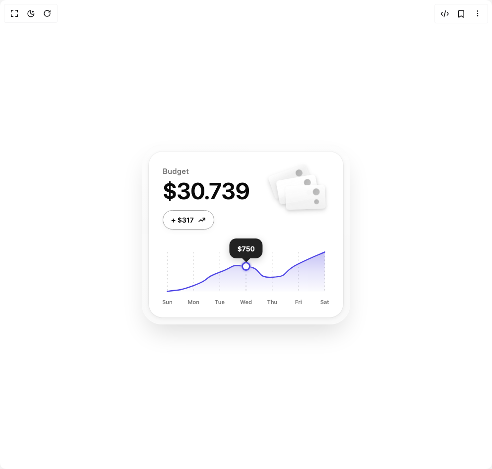

# Build Analytics Bento in BuilderStudio

> Build this component in our Agentic IDE: [BuilderStudio](https://builderstudio.dev).
>
> Join the BuilderStudio community on [Discord](https://discord.gg/QdWeSGCqfe) and [Reddit](https://reddit.com/r/builderstudio).



## Component

- Author group: `jatin-yadav05`
- Component: `analytics-bento`
- Variant: `default`
- Rendered HTML snapshot: [`rendered.html`](rendered.html)

## BuilderStudio prompt

You are implementing a React component based on a component reference.

## Component identity

- Author: jatin-yadav05
- Component slug: analytics-bento
- Demo slug: default
- Title: analytics-bento
- Description: 

## Goal

Recreate this component in a React + TypeScript + Tailwind CSS project. Preserve the visual layout, spacing, colors, border radius, shadows, interaction behavior, animation behavior, responsive behavior, and dark mode behavior shown in the rendered demo.

## Implementation requirements

- Use React and TypeScript.
- Use Tailwind CSS classes whenever possible.
- Keep the component self-contained unless the source files require helper components.
- If the source uses CSS variables, custom CSS, animations, or keyframes, include them.
- If the source uses external packages, list and use the required packages.
- Preserve accessibility attributes, button semantics, links, keyboard behavior, and ARIA attributes when visible in the source.
- Do not replace the component with a simplified placeholder.
- Return complete production-ready code.

## Dependencies

No reference metadata available.

## Rendered DOM snapshot

This is the rendered demo HTML extracted from the live preview. Use it to verify structure, class names, visible content, and layout.

```html
<div id="root"><div class="w-screen min-h-screen flex justify-center items-center"><div class="w-screen min-h-screen flex justify-center items-center"><main class="flex min-h-screen items-center justify-center w-full p-8"><div class="relative w-[420px] rounded-[40px] bg-gradient-to-b from-muted/50 to-muted/60 p-3.5 shadow-[0_25px_50px_-12px_rgba(0,0,0,0.15),0_0_0_1px_rgba(255,255,255,0.4)_inset] dark:shadow-[0_25px_50px_-12px_rgba(0,0,0,0.4),0_0_0_1px_rgba(255,255,255,0.05)_inset]"><div class="absolute inset-[1px] rounded-[39px] bg-gradient-to-b from-background/60 to-transparent pointer-events-none dark:from-background/30" style="height: 50%;"></div><div class="relative overflow-hidden rounded-[28px] bg-card p-7 pb-5 shadow-[0_2px_8px_rgba(0,0,0,0.08),0_0_0_1px_rgba(0,0,0,0.04)] dark:shadow-[0_2px_8px_rgba(0,0,0,0.2),0_0_0_1px_rgba(255,255,255,0.05)]"><div class="flex items-start justify-between"><div class="flex-1"><p class="text-[15px] font-medium tracking-wide text-muted-foreground">Budget</p><h2 class="mt-1.5 text-[46px] font-semibold leading-[1] tracking-[-0.02em] text-card-foreground">$30.739</h2><div class="mt-4 inline-flex items-center gap-2 rounded-full border border-border bg-background/40 px-4 py-2 shadow-[0_1px_3px_rgba(0,0,0,0.04),0_4px_12px_rgba(0,0,0,0.03)] dark:shadow-[0_1px_3px_rgba(0,0,0,0.2),0_1px_3px_rgba(255,255,255,0.05)]"><span class="text-[14px] font-semibold text-foreground">+ $317</span><svg width="16" height="16" viewBox="0 0 16 16" fill="none" class="text-foreground"><path d="M2 11L6 7L9 10L14 4" stroke="currentColor" stroke-width="1.5" stroke-linecap="round" stroke-linejoin="round"></path><path d="M10 4H14V8" stroke="currentColor" stroke-width="1.5" stroke-linecap="round" stroke-linejoin="round"></path></svg></div></div><div class="relative -mr-1 -mt-1 h-[110px] w-[130px]"><svg viewBox="0 0 130 110" class="h-full w-full drop-shadow-lg"><defs><linearGradient id="bill1" x1="0" y1="0" x2="0.3" y2="1"><stop offset="0%" stop-color="oklch(from var(--card) l c h)"></stop><stop offset="40%" stop-color="oklch(from var(--muted) l c h / 0.8)"></stop><stop offset="100%" stop-color="oklch(from var(--muted) l c h / 0.6)"></stop></linearGradient><linearGradient id="bill2" x1="0" y1="0" x2="0.2" y2="1"><stop offset="0%" stop-color="oklch(from var(--card) l c h)"></stop><stop offset="50%" stop-color="oklch(from var(--card) l c h / 0.95)"></stop><stop offset="100%" stop-color="oklch(from var(--muted) l c h / 0.7)"></stop></linearGradient><linearGradient id="bill3" x1="0" y1="0" x2="0.1" y2="1"><stop offset="0%" stop-color="oklch(from var(--card) l c h)"></stop><stop offset="100%" stop-color="oklch(from var(--muted) l c h / 0.85)"></stop></linearGradient><linearGradient id="holeGrad" x1="0" y1="0" x2="1" y2="1"><stop offset="0%" stop-color="oklch(from var(--border) l c h / 0.8)"></stop><stop offset="100%" stop-color="oklch(from var(--border) l c h / 0.6)"></stop></linearGradient><filter id="billShadow1" x="-30%" y="-30%" width="160%" height="180%"><feDropShadow dx="0" dy="6" stdDeviation="4" flood-color="#000" flood-opacity="0.05"></feDropShadow></filter><filter id="billShadow2" x="-30%" y="-30%" width="160%" height="180%"><feDropShadow dx="0" dy="4" stdDeviation="3" flood-color="#000" flood-opacity="0.1"></feDropShadow></filter><filter id="billShadow3" x="-30%" y="-30%" width="160%" height="180%"><feDropShadow dx="0" dy="2" stdDeviation="2" flood-color="#000" flood-opacity="0.08"></feDropShadow></filter><filter id="innerShadow"><feOffset dx="0" dy="1"></feOffset><feGaussianBlur stdDeviation="1" result="shadow"></feGaussianBlur><feComposite in="SourceGraphic" in2="shadow" operator="over"></feComposite></filter></defs><g transform="translate(8, 12) rotate(-20, 40, 25)" filter="url(#billShadow1)"><rect x="0" y="0" width="80" height="48" rx="6" fill="url(#bill1)"></rect><circle cx="62" cy="14" r="7" fill="url(#holeGrad)"></circle><circle cx="62" cy="34" r="5" fill="url(#holeGrad)"></circle></g><g transform="translate(22, 28) rotate(-10, 40, 25)" filter="url(#billShadow2)"><rect x="0" y="0" width="80" height="48" rx="6" fill="url(#bill2)"></rect><circle cx="62" cy="14" r="7" fill="url(#holeGrad)"></circle><circle cx="62" cy="34" r="5" fill="url(#holeGrad)"></circle></g><g transform="translate(38, 44) rotate(-2, 40, 25)" filter="url(#billShadow3)"><rect x="0" y="0" width="80" height="48" rx="6" fill="url(#bill3)"></rect><circle cx="62" cy="14" r="7" fill="url(#holeGrad)"></circle><circle cx="62" cy="34" r="5" fill="url(#holeGrad)"></circle></g></svg></div></div><div class="relative mt-2"><svg viewBox="0 0 360 160" class="w-full" style="cursor: default;"><defs><linearGradient id="areaGradient" x1="0" y1="0" x2="0" y2="1"><stop offset="0%" stop-color="#5B52E5" stop-opacity="0.35" class="dark:stop-opacity-40"></stop><stop offset="50%" stop-color="#5B52E5" stop-opacity="0.15" class="dark:stop-opacity-20"></stop><stop offset="100%" stop-color="#5B52E5" stop-opacity="0.02" class="dark:stop-opacity-5"></stop></linearGradient><linearGradient id="lineGradient" x1="0" y1="0" x2="1" y2="0"><stop offset="0%" stop-color="#5B52E5"></stop><stop offset="100%" stop-color="#4F46E5"></stop></linearGradient><filter id="tooltipShadow" x="-50%" y="-50%" width="200%" height="200%"><feDropShadow dx="0" dy="4" stdDeviation="6" flood-opacity="0.2"></feDropShadow></filter><filter id="dotGlow" x="-100%" y="-100%" width="300%" height="300%"><feGaussianBlur stdDeviation="2" result="blur"></feGaussianBlur><feMerge><feMergeNode in="blur"></feMergeNode><feMergeNode in="SourceGraphic"></feMergeNode></feMerge></filter></defs><line x1="10" y1="40" x2="10" y2="125" class="stroke-border transition-opacity duration-200" stroke-width="1" stroke-dasharray="3 5" opacity="0.5"></line><line x1="66.66666666666666" y1="40" x2="66.66666666666666" y2="125" class="stroke-border transition-opacity duration-200" stroke-width="1" stroke-dasharray="3 5" opacity="0.5"></line><line x1="123.33333333333333" y1="40" x2="123.33333333333333" y2="125" class="stroke-border transition-opacity duration-200" stroke-width="1" stroke-dasharray="3 5" opacity="0.5"></line><line x1="180" y1="40" x2="180" y2="125" class="stroke-border transition-opacity duration-200" stroke-width="1" stroke-dasharray="3 5" opacity="0.8"></line><line x1="236.66666666666666" y1="40" x2="236.66666666666666" y2="125" class="stroke-border transition-opacity duration-200" stroke-width="1" stroke-dasharray="3 5" opacity="0.5"></line><line x1="293.33333333333337" y1="40" x2="293.33333333333337" y2="125" class="stroke-border transition-opacity duration-200" stroke-width="1" stroke-dasharray="3 5" opacity="0.5"></line><line x1="350" y1="40" x2="350" y2="125" class="stroke-border transition-opacity duration-200" stroke-width="1" stroke-dasharray="3 5" opacity="0.5"></line><circle cx="30.072060801356287" cy="59.39374885906368" r="1.3598780418332916" class="fill-card" opacity="0.6142428510074087"></circle><circle cx="78.95313606582377" cy="53.311691239854646" r="1.8768513519266756" class="fill-card" opacity="0.751813694564827"></circle><circle cx="131.3789063115161" cy="54.3975781561999" r="2.3898268920580823" class="fill-card" opacity="0.7831932657615452"></circle><circle cx="156.34572115905024" cy="53.298348560837155" r="1.9301811760667076" class="fill-card" opacity="0.6373662079746103"></circle><circle cx="204.52914460909292" cy="57.094611654346664" r="2.8158007246011865" class="fill-card" opacity="0.5061139553469557"></circle><circle cx="248.8652509140386" cy="53.511930436279414" r="2.61900213887159" class="fill-card" opacity="0.521876637944972"></circle><circle cx="291.1323160439804" cy="57.26026059557674" r="2.527021372731921" class="fill-card" opacity="0.44436074804953773"></circle><circle cx="34.679955294024" cy="74.86156414302519" r="2.4519341903331453" class="fill-card" opacity="0.6168391287636364"></circle><circle cx="89.20504627338462" cy="72.7989575451491" r="1.333658597835057" class="fill-card" opacity="0.40813331697807664"></circle><circle cx="127.53889782428175" cy="65.6041437214833" r="2.240621098459137" class="fill-card" opacity="0.7300826843860543"></circle><circle cx="155.86361260401208" cy="72.71887727041597" r="2.145709346396076" class="fill-card" opacity="0.5178242354527037"></circle><circle cx="212.50864901235587" cy="67.81687636009458" r="2.474414949400198" class="fill-card" opacity="0.7488609914943003"></circle><circle cx="251.37992407250212" cy="67.67458849619779" r="1.6358883100872337" class="fill-card" opacity="0.6992940921960467"></circle><circle cx="282.79173045668495" cy="69.1835116347112" r="2.285758216237398" class="fill-card" opacity="0.7416000663208107"></circle><circle cx="46.77551380395326" cy="85.53145647845452" r="1.265815110804678" class="fill-card" opacity="0.7020037085690292"></circle><circle cx="84.8913915985329" cy="81.42366332521617" r="1.6860687595512007" class="fill-card" opacity="0.5166039826123995"></circle><circle cx="122.05580779924168" cy="85.64590628841978" r="2.306165401470321" class="fill-card" opacity="0.7446039785952399"></circle><circle cx="174.81326747263654" cy="86.96066441150617" r="2.340508169688379" class="fill-card" opacity="0.4586392517368813"></circle><circle cx="195.279207875372" cy="80.77735978746388" r="1.95021902164208" class="fill-card" opacity="0.669998487007222"></circle><circle cx="237.08422878686096" cy="88.81560360358263" r="2.9360155265334456" class="fill-card" opacity="0.6286743287861347"></circle><circle cx="296.09559097135934" cy="89.14977404140647" r="1.553355339945929" class="fill-card" opacity="0.5720458948382784"></circle><circle cx="51.18537089120254" cy="97.15134556000844" r="2.6429168613153697" class="fill-card" opacity="0.40435584238183847"></circle><circle cx="93.12377185602294" cy="97.26150195900703" r="2.888548010853174" class="fill-card" opacity="0.6998316837159201"></circle><circle cx="137.8561481341734" cy="104.94162807553649" r="2.7618661193508283" class="fill-card" opacity="0.6165595759964348"></circle><circle cx="160.5431923564524" cy="102.05684511642389" r="2.067948617877044" class="fill-card" opacity="0.7808516471715847"></circle><circle cx="209.6775284435996" cy="98.5534305499631" r="1.568624198257266" class="fill-card" opacity="0.7323949351531229"></circle><circle cx="260.1717678908663" cy="98.91411990952608" r="1.8470011895853298" class="fill-card" opacity="0.6660025676311709"></circle><circle cx="292.1770067992741" cy="101.39392076894491" r="2.2860660159186112" class="fill-card" opacity="0.6616526847175648"></circle><circle cx="45.015842516370476" cy="112.50107355155141" r="2.3428431654708675" class="fill-card" opacity="0.6706496193987463"></circle><circle cx="83.14373196993932" cy="119.08621070270863" r="2.646476812435761" class="fill-card" opacity="0.4964214386628619"></circle><circle cx="125.86113833958076" cy="115.13263871785334" r="1.7290958392748528" class="fill-card" opacity="0.4163451468890522"></circle><circle cx="162.26468462169547" cy="118.52362957979442" r="1.7346857916934446" class="fill-card" opacity="0.6708165275412513"></circle><circle cx="201.78850788661515" cy="117.842467791289" r="2.605462890818041" class="fill-card" opacity="0.7471965375463342"></circle><circle cx="241.98096525612573" cy="113.79611386684773" r="2.064377441813368" class="fill-card" opacity="0.4808092210765338"></circle><circle cx="285.1020986224005" cy="112.26970143633952" r="1.7688453863399394" class="fill-card" opacity="0.6752543846627275"></circle><path d="M 10 125 C 29.83333333333333 120.56914893617021, 26.999999999999993 126.89893617021275, 66.66666666666666 112.34042553191489 C 106.33333333333331 97.78191489361703, 83.66666666666666 97.9627659574468, 123.33333333333333 83.40425531914894 C 163 68.84574468085108, 140.33333333333334 66.9468085106383, 180 70.74468085106383 C 219.66666666666666 74.54255319148936, 196.99999999999997 96.15425531914893, 236.66666666666666 94.25531914893617 C 276.3333333333333 92.3563829787234, 253.6666666666667 84.30851063829786, 293.33333333333337 65.31914893617021 C 333.00000000000006 46.329787234042556, 330.1666666666667 48.86170212765957, 350 40 L 350 125 L 10 125 Z" fill="url(#areaGradient)" class="transition-all duration-300"></path><path d="M 10 125 C 29.83333333333333 120.56914893617021, 26.999999999999993 126.89893617021275, 66.66666666666666 112.34042553191489 C 106.33333333333331 97.78191489361703, 83.66666666666666 97.9627659574468, 123.33333333333333 83.40425531914894 C 163 68.84574468085108, 140.33333333333334 66.9468085106383, 180 70.74468085106383 C 219.66666666666666 74.54255319148936, 196.99999999999997 96.15425531914893, 236.66666666666666 94.25531914893617 C 276.3333333333333 92.3563829787234, 253.6666666666667 84.30851063829786, 293.33333333333337 65.31914893617021 C 333.00000000000006 46.329787234042556, 330.1666666666667 48.86170212765957, 350 40" fill="none" stroke="#4F46E5" stroke-width="2.5" stroke-linecap="round" stroke-linejoin="round"></path><g class="transition-all duration-150 ease-out"><circle cx="180" cy="70.74468085106383" r="12" class="fill-card" opacity="0.5"></circle><circle cx="180" cy="70.74468085106383" r="8" class="fill-card" stroke="#4F46E5" stroke-width="3" filter="url(#dotGlow)"></circle></g><text x="10" y="152" text-anchor="middle" class="text-[12px] font-medium fill-muted-foreground">Sun</text><text x="66.66666666666666" y="152" text-anchor="middle" class="text-[12px] font-medium fill-muted-foreground">Mon</text><text x="123.33333333333333" y="152" text-anchor="middle" class="text-[12px] font-medium fill-muted-foreground">Tue</text><text x="180" y="152" text-anchor="middle" class="text-[12px] font-medium fill-muted-foreground">Wed</text><text x="236.66666666666666" y="152" text-anchor="middle" class="text-[12px] font-medium fill-muted-foreground">Thu</text><text x="293.33333333333337" y="152" text-anchor="middle" class="text-[12px] font-medium fill-muted-foreground">Fri</text><text x="350" y="152" text-anchor="middle" class="text-[12px] font-medium fill-muted-foreground">Sat</text></svg><div class="pointer-events-none absolute transition-all duration-150 ease-out" style="left: 50%; top: 44.2154%; transform: translate(-50%, -140%);"><div class="relative rounded-xl bg-foreground/90 px-4 py-2 shadow-[0_4px_16px_rgba(0,0,0,0.2)] dark:bg-background/90 backdrop-blur-sm"><span class="text-[14px] font-semibold text-background dark:text-foreground">$750</span><div class="absolute left-1/2 -bottom-2 -translate-x-1/2 w-0 h-0 border-l-8 border-r-8 border-t-8 border-l-transparent border-r-transparent border-t-foreground/90 dark:border-t-background/90"></div></div></div></div></div></div></main></div></div></div>
```

## Reference source files

No reference source files were available.
