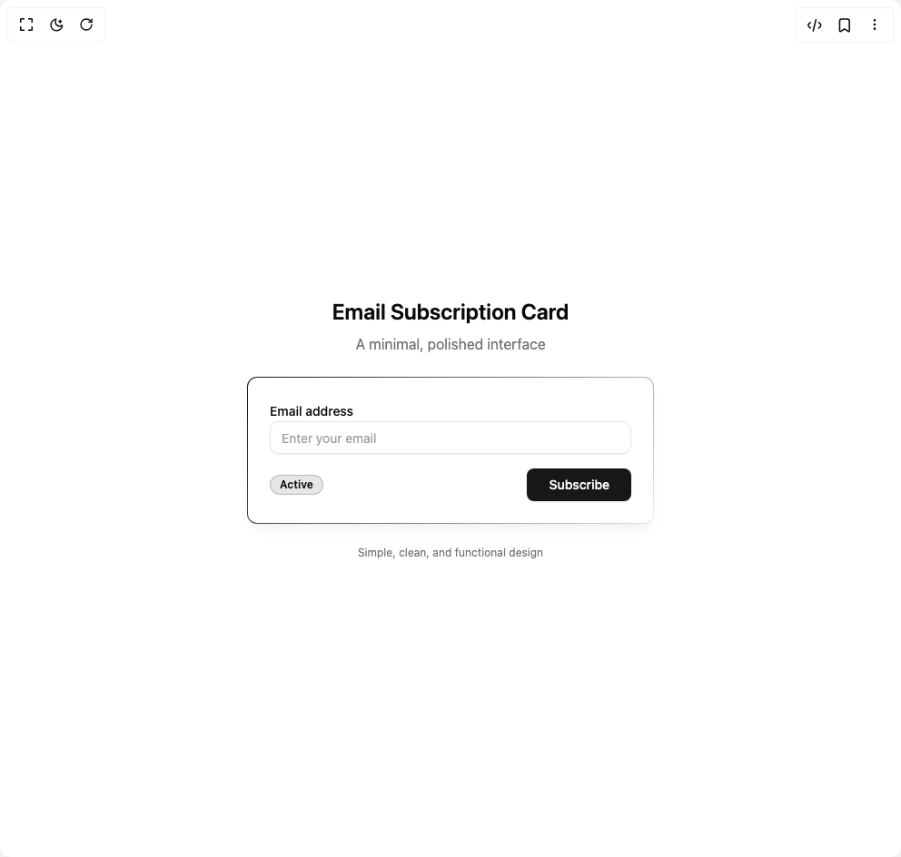

# Build Email Card in BuilderStudio

> Build this component in our Agentic IDE: [BuilderStudio](https://builderstudio.dev).
>
> Join the BuilderStudio community on [Discord](https://discord.gg/QdWeSGCqfe) and [Reddit](https://reddit.com/r/builderstudio).



## Component

- Author group: `jatin-yadav05`
- Component: `email-card`
- Variant: `default`
- Rendered HTML snapshot: [`rendered.html`](rendered.html)

## BuilderStudio prompt

You are implementing a React component based on a component reference.

## Component identity

- Author: jatin-yadav05
- Component slug: email-card
- Demo slug: default
- Title: email-card
- Description: 

## Goal

Recreate this component in a React + TypeScript + Tailwind CSS project. Preserve the visual layout, spacing, colors, border radius, shadows, interaction behavior, animation behavior, responsive behavior, and dark mode behavior shown in the rendered demo.

## Implementation requirements

- Use React and TypeScript.
- Use Tailwind CSS classes whenever possible.
- Keep the component self-contained unless the source files require helper components.
- If the source uses CSS variables, custom CSS, animations, or keyframes, include them.
- If the source uses external packages, list and use the required packages.
- Preserve accessibility attributes, button semantics, links, keyboard behavior, and ARIA attributes when visible in the source.
- Do not replace the component with a simplified placeholder.
- Return complete production-ready code.

## Dependencies

No reference metadata available.

## Rendered DOM snapshot

This is the rendered demo HTML extracted from the live preview. Use it to verify structure, class names, visible content, and layout.

```html
<div id="root"><div class="w-screen min-h-screen flex justify-center items-center"><div class="w-screen min-h-screen flex justify-center items-center"><div class="min-h-screen w-full bg-background flex items-center justify-center p-4 relative overflow-hidden"><div class="absolute inset-0 opacity-[0.02]"><div class="absolute top-1/4 left-1/4 w-32 h-32 rounded-full bg-primary/20 blur-3xl"></div><div class="absolute bottom-1/3 right-1/3 w-24 h-24 rounded-full bg-foreground/20 blur-2xl"></div></div><div class="w-full max-w-md space-y-6 relative z-10"><div class="text-center space-y-2"><h1 class="text-2xl font-semibold text-foreground">Email Subscription Card</h1><p class="text-muted-foreground">A minimal, polished interface</p></div><div class="gradient-border"><div class="rounded-lg bg-card text-card-foreground p-6 space-y-4 shadow-lg shadow-primary/5 border-0"><div class="space-y-2"><label for="email" class="text-sm font-medium text-foreground">Email address</label><input class="flex h-9 rounded-lg border border-input bg-background px-3 py-2 text-sm text-foreground shadow-sm shadow-black/5 placeholder:text-muted-foreground/70 focus-visible:border-ring focus-visible:outline-none focus-visible:ring-[3px] focus-visible:ring-ring/20 disabled:cursor-not-allowed disabled:opacity-50 w-full input-border focus:ring-2 focus:ring-primary/5 focus:border-primary/10 transition-all duration-200" id="email" placeholder="Enter your email" type="email"></div><div class="flex items-center justify-between"><div class="inline-flex items-center rounded-full border px-2.5 py-0.5 font-semibold transition-colors focus:outline-none focus:ring-2 focus:ring-ring focus:ring-offset-2 hover:bg-secondary/80 text-xs bg-foreground/10 text-foreground border-foreground/20">Active</div><button class="inline-flex items-center justify-center whitespace-nowrap text-sm font-medium ring-offset-background focus-visible:outline-none focus-visible:ring-2 focus-visible:ring-ring focus-visible:ring-offset-2 disabled:pointer-events-none disabled:opacity-50 text-primary-foreground h-9 rounded-md px-6 bg-primary hover:bg-primary/90 transition-all duration-200 shadow-sm">Subscribe</button></div></div></div><div class="text-center"><p class="text-xs text-muted-foreground">Simple, clean, and functional design</p></div></div></div></div></div></div>
```

## Reference source files

No reference source files were available.
