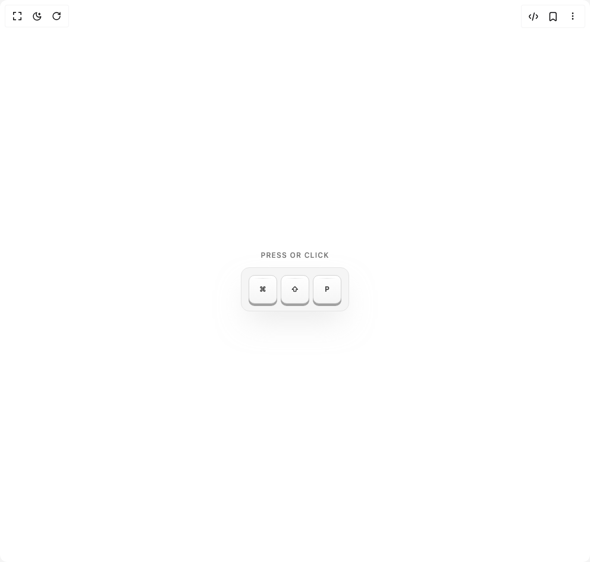

# Build Keyboard Keys in BuilderStudio

> Build this component in our Agentic IDE: [BuilderStudio](https://builderstudio.dev).
>
> Join the BuilderStudio community on [Discord](https://discord.gg/QdWeSGCqfe) and [Reddit](https://reddit.com/r/builderstudio).



## Component

- Author group: `jatin-yadav05`
- Component: `keyboard-keys`
- Variant: `default`
- Rendered HTML snapshot: [`rendered.html`](rendered.html)

## BuilderStudio prompt

You are implementing a React component based on a component reference.

## Component identity

- Author: jatin-yadav05
- Component slug: keyboard-keys
- Demo slug: default
- Title: keyboard-keys
- Description: 

## Goal

Recreate this component in a React + TypeScript + Tailwind CSS project. Preserve the visual layout, spacing, colors, border radius, shadows, interaction behavior, animation behavior, responsive behavior, and dark mode behavior shown in the rendered demo.

## Implementation requirements

- Use React and TypeScript.
- Use Tailwind CSS classes whenever possible.
- Keep the component self-contained unless the source files require helper components.
- If the source uses CSS variables, custom CSS, animations, or keyframes, include them.
- If the source uses external packages, list and use the required packages.
- Preserve accessibility attributes, button semantics, links, keyboard behavior, and ARIA attributes when visible in the source.
- Do not replace the component with a simplified placeholder.
- Return complete production-ready code.

## Dependencies

No reference metadata available.

## Rendered DOM snapshot

This is the rendered demo HTML extracted from the live preview. Use it to verify structure, class names, visible content, and layout.

```html
<div id="root"><div class="w-screen min-h-screen flex justify-center items-center"><div class="w-screen min-h-screen flex justify-center items-center"><main class="flex min-h-screen flex-col items-center justify-center gap-16 py-16"><div class="inline-flex flex-col items-center gap-3"><p class="text-xs font-medium uppercase tracking-widest text-neutral-500">Press or Click</p><div class="flex items-center gap-1.5 rounded-xl border p-3 shadow-2xl border-neutral-200 bg-neutral-100 shadow-neutral-300/50 dark:border-neutral-800 dark:bg-neutral-950 dark:shadow-black/50"><button class="w-12 group relative h-12 select-none rounded-lg transition-all duration-75 ease-out focus:outline-none translate-y-0"><span class="absolute inset-0 rounded-lg transition-all duration-75 bg-neutral-400 dark:bg-neutral-800 translate-y-1"></span><span class="absolute inset-0 flex flex-col items-center justify-center rounded-lg border transition-all duration-75 border-neutral-300 bg-gradient-to-b from-white to-neutral-100 dark:border-neutral-700 dark:from-neutral-800 dark:to-neutral-900"><span class="absolute inset-x-2 top-1 h-px rounded-full bg-gradient-to-r from-transparent to-transparent transition-opacity duration-75 via-black/10 dark:via-white/20 opacity-100"></span><span class="relative z-10 flex flex-col items-center justify-center gap-0.5"><span class="text-xs font-semibold tracking-wide transition-colors duration-75 text-neutral-700 dark:text-neutral-300">⌘</span></span></span></button><button class="w-12 group relative h-12 select-none rounded-lg transition-all duration-75 ease-out focus:outline-none translate-y-0"><span class="absolute inset-0 rounded-lg transition-all duration-75 bg-neutral-400 dark:bg-neutral-800 translate-y-1"></span><span class="absolute inset-0 flex flex-col items-center justify-center rounded-lg border transition-all duration-75 border-neutral-300 bg-gradient-to-b from-white to-neutral-100 dark:border-neutral-700 dark:from-neutral-800 dark:to-neutral-900"><span class="absolute inset-x-2 top-1 h-px rounded-full bg-gradient-to-r from-transparent to-transparent transition-opacity duration-75 via-black/10 dark:via-white/20 opacity-100"></span><span class="relative z-10 flex flex-col items-center justify-center gap-0.5"><span class="text-xs font-semibold tracking-wide transition-colors duration-75 text-neutral-700 dark:text-neutral-300">⇧</span></span></span></button><button class="w-12 group relative h-12 select-none rounded-lg transition-all duration-75 ease-out focus:outline-none translate-y-0"><span class="absolute inset-0 rounded-lg transition-all duration-75 bg-neutral-400 dark:bg-neutral-800 translate-y-1"></span><span class="absolute inset-0 flex flex-col items-center justify-center rounded-lg border transition-all duration-75 border-neutral-300 bg-gradient-to-b from-white to-neutral-100 dark:border-neutral-700 dark:from-neutral-800 dark:to-neutral-900"><span class="absolute inset-x-2 top-1 h-px rounded-full bg-gradient-to-r from-transparent to-transparent transition-opacity duration-75 via-black/10 dark:via-white/20 opacity-100"></span><span class="relative z-10 flex flex-col items-center justify-center gap-0.5"><span class="text-xs font-semibold tracking-wide transition-colors duration-75 text-neutral-700 dark:text-neutral-300">P</span></span></span></button></div></div></main></div></div></div>
```

## Reference source files

No reference source files were available.
