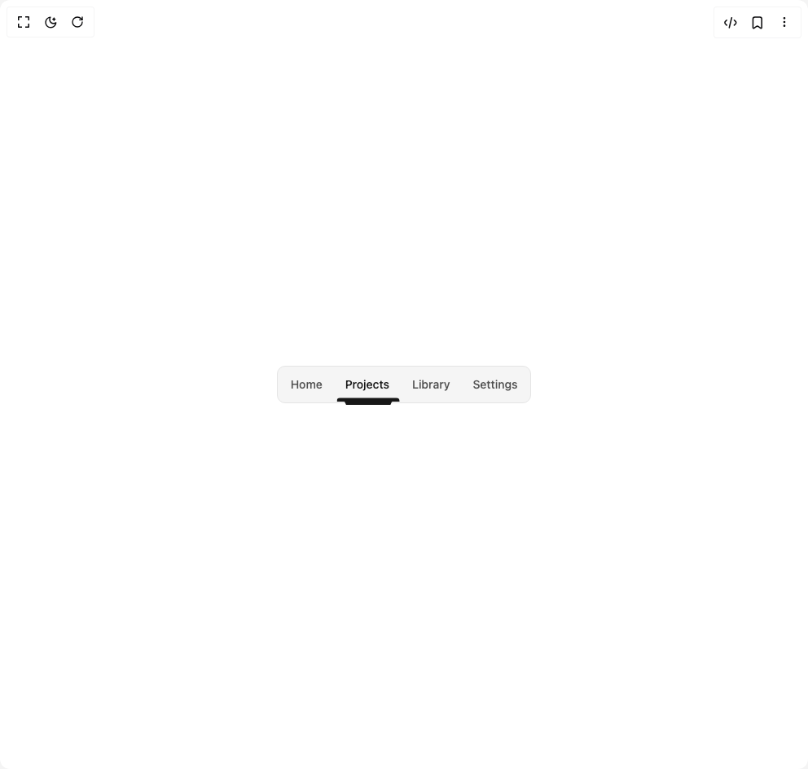

# Build Notch Nav in BuilderStudio

> Build this component in our Agentic IDE: [BuilderStudio](https://builderstudio.dev).
>
> Join the BuilderStudio community on [Discord](https://discord.gg/QdWeSGCqfe) and [Reddit](https://reddit.com/r/builderstudio).



## Component

- Author group: `jatin-yadav05`
- Component: `notch-nav`
- Variant: `default`
- Rendered HTML snapshot: [`rendered.html`](rendered.html)

## BuilderStudio prompt

You are implementing a React component based on a component reference.

## Component identity

- Author: jatin-yadav05
- Component slug: notch-nav
- Demo slug: default
- Title: notch-nav
- Description: 

## Goal

Recreate this component in a React + TypeScript + Tailwind CSS project. Preserve the visual layout, spacing, colors, border radius, shadows, interaction behavior, animation behavior, responsive behavior, and dark mode behavior shown in the rendered demo.

## Implementation requirements

- Use React and TypeScript.
- Use Tailwind CSS classes whenever possible.
- Keep the component self-contained unless the source files require helper components.
- If the source uses CSS variables, custom CSS, animations, or keyframes, include them.
- If the source uses external packages, list and use the required packages.
- Preserve accessibility attributes, button semantics, links, keyboard behavior, and ARIA attributes when visible in the source.
- Do not replace the component with a simplified placeholder.
- Return complete production-ready code.

## Dependencies

No reference metadata available.

## Rendered DOM snapshot

This is the rendered demo HTML extracted from the live preview. Use it to verify structure, class names, visible content, and layout.

```html
<div id="root"><div class="w-screen min-h-screen flex justify-center items-center"><div class="w-screen min-h-screen flex justify-center items-center"><main class="min-h-screen grid place-items-center p-6"><nav aria-label="Site" class="w-fit mx-auto"><div class="relative rounded-lg border border-border bg-secondary text-foreground"><ul role="menubar" class="flex items-center justify-center gap-1 p-1"><li role="none"><button role="menuitem" tabindex="-1" class="relative rounded-md px-3 py-2 text-sm font-medium outline-none transition-colors focus-visible:ring-2 focus-visible:ring-ring text-foreground/70 hover:text-foreground"><span class="text-pretty">Home</span></button></li><li role="none"><button role="menuitem" aria-current="page" aria-pressed="true" tabindex="0" class="relative rounded-md px-3 py-2 text-sm font-medium outline-none transition-colors focus-visible:ring-2 focus-visible:ring-ring text-primary"><span class="text-pretty">Projects</span></button></li><li role="none"><button role="menuitem" tabindex="-1" class="relative rounded-md px-3 py-2 text-sm font-medium outline-none transition-colors focus-visible:ring-2 focus-visible:ring-ring text-foreground/70 hover:text-foreground"><span class="text-pretty">Library</span></button></li><li role="none"><button role="menuitem" tabindex="-1" class="relative rounded-md px-3 py-2 text-sm font-medium outline-none transition-colors focus-visible:ring-2 focus-visible:ring-ring text-foreground/70 hover:text-foreground"><span class="text-pretty">Settings</span></button></li></ul><div aria-hidden="true" class="pointer-events-none absolute overflow-hidden rounded-sm transition-all duration-300 ease-[cubic-bezier(0.22,1,0.36,1)] opacity-100" style="transform: translate3d(72px, 0px, 0px); width: 78.2656px; bottom: -4px; height: 10px; will-change: transform, width, opacity;"><svg width="100%" height="100%" viewBox="0 0 100 20" preserveAspectRatio="none" class="block text-primary"><path d="
                  M 2 1
                  H 98
                  Q 99 1 99 2
                  V 10
                  H 88
                  Q 87.2 10 86.6 11.4
                  L 84.8 18
                  H 15.2
                  L 13.4 11.4
                  Q 12.8 10 12 10
                  H 2
                  Q 1 10 1 9
                  V 2
                  Q 1 1 2 1
                  Z
                " fill="currentColor"></path></svg></div></div></nav></main></div></div></div>
```

## Reference source files

No reference source files were available.
