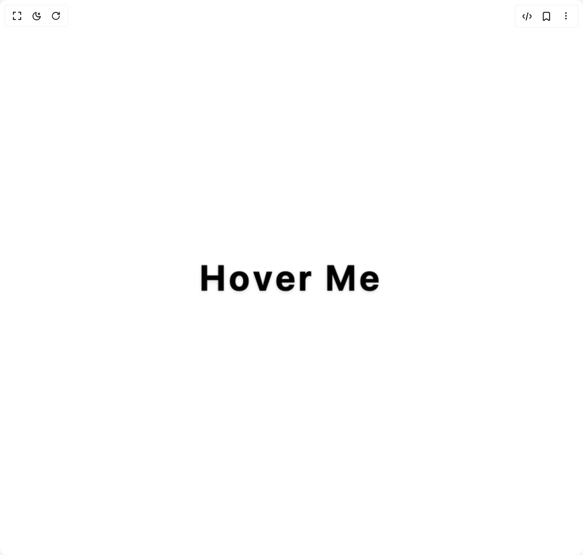

# Build Scale Letter in BuilderStudio

> Build this component in our Agentic IDE: [BuilderStudio](https://builderstudio.dev).
>
> Join the BuilderStudio community on [Discord](https://discord.gg/QdWeSGCqfe) and [Reddit](https://reddit.com/r/builderstudio).



## Component

- Author group: `jatin-yadav05`
- Component: `scale-letter`
- Variant: `default`
- Rendered HTML snapshot: [`rendered.html`](rendered.html)

## BuilderStudio prompt

You are implementing a React component based on a component reference.

## Component identity

- Author: jatin-yadav05
- Component slug: scale-letter
- Demo slug: default
- Title: scale-letter
- Description: 

## Goal

Recreate this component in a React + TypeScript + Tailwind CSS project. Preserve the visual layout, spacing, colors, border radius, shadows, interaction behavior, animation behavior, responsive behavior, and dark mode behavior shown in the rendered demo.

## Implementation requirements

- Use React and TypeScript.
- Use Tailwind CSS classes whenever possible.
- Keep the component self-contained unless the source files require helper components.
- If the source uses CSS variables, custom CSS, animations, or keyframes, include them.
- If the source uses external packages, list and use the required packages.
- Preserve accessibility attributes, button semantics, links, keyboard behavior, and ARIA attributes when visible in the source.
- Do not replace the component with a simplified placeholder.
- Return complete production-ready code.

## Dependencies

No reference metadata available.

## Rendered DOM snapshot

This is the rendered demo HTML extracted from the live preview. Use it to verify structure, class names, visible content, and layout.

```html
<div id="root"><div class="w-screen min-h-screen flex justify-center items-center"><div class="w-screen min-h-screen flex justify-center items-center"><div class="h-screen w-full flex justify-center items-center bg-gradient-to-br dark:from-black/90 dark:to-black from-white/90 to-white transition-colors duration-500"><div class="text-6xl font-medium select-none text-black dark:text-white"><span class="inline-flex"><span class="inline-block cursor-pointer relative" style="transform: perspective(1000px) translateY(0px) rotateX(0deg) scale(1) translateZ(15px); filter: brightness(1); text-shadow: var(--th-shadow, 0 2px 6px rgba(0,0,0,0.15)); transition: 0.4s cubic-bezier(0.175, 0.885, 0.32, 1.275); z-index: 5; color: var(--th-text, #222); margin-right: 0.1em;"><span class="font-bold" style="color: var(--th-text, #222);">H</span></span><span class="inline-block cursor-pointer relative" style="transform: perspective(1000px) translateY(0px) rotateX(0deg) scale(1) translateZ(15px); filter: brightness(1); text-shadow: var(--th-shadow, 0 2px 6px rgba(0,0,0,0.15)); transition: 0.4s cubic-bezier(0.175, 0.885, 0.32, 1.275); z-index: 5; color: var(--th-text, #222); margin-right: 0.1em;"><span class="font-bold" style="color: var(--th-text, #222);">o</span></span><span class="inline-block cursor-pointer relative" style="transform: perspective(1000px) translateY(0px) rotateX(0deg) scale(1) translateZ(15px); filter: brightness(1); text-shadow: var(--th-shadow, 0 2px 6px rgba(0,0,0,0.15)); transition: 0.4s cubic-bezier(0.175, 0.885, 0.32, 1.275); z-index: 5; color: var(--th-text, #222); margin-right: 0.1em;"><span class="font-bold" style="color: var(--th-text, #222);">v</span></span><span class="inline-block cursor-pointer relative" style="transform: perspective(1000px) translateY(0px) rotateX(0deg) scale(1) translateZ(15px); filter: brightness(1); text-shadow: var(--th-shadow, 0 2px 6px rgba(0,0,0,0.15)); transition: 0.4s cubic-bezier(0.175, 0.885, 0.32, 1.275); z-index: 5; color: var(--th-text, #222); margin-right: 0.1em;"><span class="font-bold" style="color: var(--th-text, #222);">e</span></span><span class="inline-block cursor-pointer relative" style="transform: perspective(1000px) translateY(0px) rotateX(0deg) scale(1) translateZ(15px); filter: brightness(1); text-shadow: var(--th-shadow, 0 2px 6px rgba(0,0,0,0.15)); transition: 0.4s cubic-bezier(0.175, 0.885, 0.32, 1.275); z-index: 5; color: var(--th-text, #222); margin-right: 0.1em;"><span class="font-bold" style="color: var(--th-text, #222);">r</span></span><span class="inline-block cursor-pointer relative" style="transform: perspective(1000px) translateY(0px) rotateX(0deg) scale(1) translateZ(15px); filter: brightness(1); text-shadow: var(--th-shadow, 0 2px 6px rgba(0,0,0,0.15)); transition: 0.4s cubic-bezier(0.175, 0.885, 0.32, 1.275); z-index: 5; color: var(--th-text, #222); margin-right: 0.1em;"><span class="font-bold" style="color: var(--th-text, #222);">&nbsp;</span></span><span class="inline-block cursor-pointer relative" style="transform: perspective(1000px) translateY(0px) rotateX(0deg) scale(1) translateZ(15px); filter: brightness(1); text-shadow: var(--th-shadow, 0 2px 6px rgba(0,0,0,0.15)); transition: 0.4s cubic-bezier(0.175, 0.885, 0.32, 1.275); z-index: 5; color: var(--th-text, #222); margin-right: 0.1em;"><span class="font-bold" style="color: var(--th-text, #222);">M</span></span><span class="inline-block cursor-pointer relative" style="transform: perspective(1000px) translateY(0px) rotateX(0deg) scale(1) translateZ(15px); filter: brightness(1); text-shadow: var(--th-shadow, 0 2px 6px rgba(0,0,0,0.15)); transition: 0.4s cubic-bezier(0.175, 0.885, 0.32, 1.275); z-index: 5; color: var(--th-text, #222); margin-right: 0.1em;"><span class="font-bold" style="color: var(--th-text, #222);">e</span></span></span></div><style>
                :root {
                    --th-text: #000; /* Dark text for light theme */
                    --th-shadow: 0 2px 6px rgba(0,0,0,0.15);
                    --th-shadow-light: 0 1px 2px rgba(0,0,0,0.08);
                }
                html.dark {
                    --th-text: #fff; /* Light text for dark theme */
                    --th-shadow: 0 2px 6px rgba(0,0,0,0.25);
                    --th-shadow-light: 0 1px 2px rgba(0,0,0,0.15);
                }
            </style></div></div></div></div>
```

## Reference source files

No reference source files were available.
