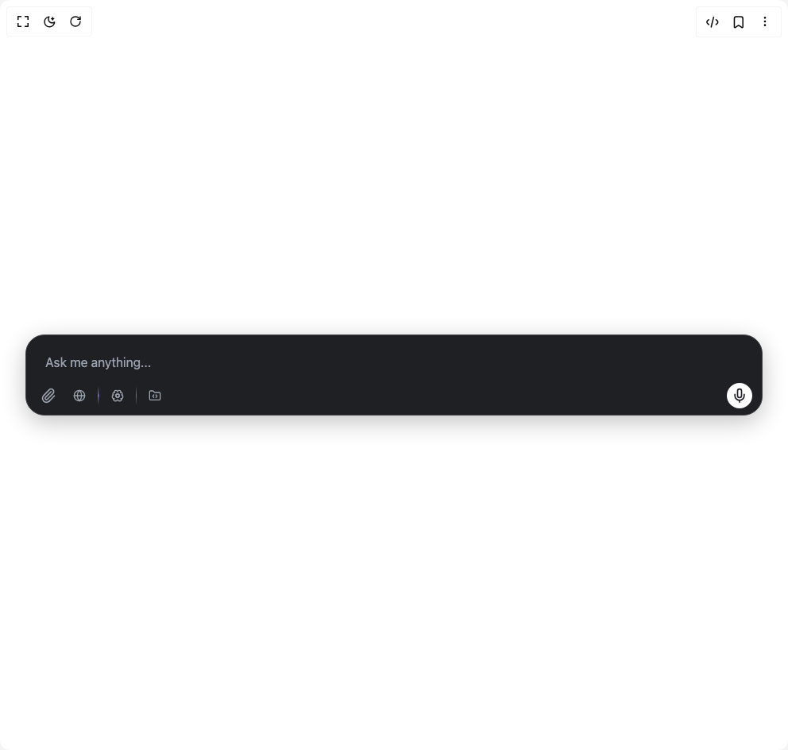

# Build Ai Prompt Box in BuilderStudio

> Build this component in our Agentic IDE: [BuilderStudio](https://builderstudio.dev).
>
> Join the BuilderStudio community on [Discord](https://discord.gg/QdWeSGCqfe) and [Reddit](https://reddit.com/r/builderstudio).



## Component

- Author group: `johuniq`
- Component: `ai-prompt-box`
- Variant: `default`
- Rendered HTML snapshot: [`rendered.html`](rendered.html)

## BuilderStudio prompt

You are implementing a React component based on a component reference.

## Component identity

- Author: johuniq
- Component slug: ai-prompt-box
- Demo slug: default
- Title: ai-prompt-box
- Description: 

## Goal

Recreate this component in a React + TypeScript + Tailwind CSS project. Preserve the visual layout, spacing, colors, border radius, shadows, interaction behavior, animation behavior, responsive behavior, and dark mode behavior shown in the rendered demo.

## Implementation requirements

- Use React and TypeScript.
- Use Tailwind CSS classes whenever possible.
- Keep the component self-contained unless the source files require helper components.
- If the source uses CSS variables, custom CSS, animations, or keyframes, include them.
- If the source uses external packages, list and use the required packages.
- Preserve accessibility attributes, button semantics, links, keyboard behavior, and ARIA attributes when visible in the source.
- Do not replace the component with a simplified placeholder.
- Return complete production-ready code.

## Dependencies

No reference metadata available.

## Rendered DOM snapshot

This is the rendered demo HTML extracted from the live preview. Use it to verify structure, class names, visible content, and layout.

```html
<div id="root"><div class="w-screen min-h-screen flex justify-center items-center"><div class="w-screen min-h-screen flex justify-center items-center"><div class="relative flex h-[300px] w-full items-center justify-center px-4 md:px-8"><div class="rounded-3xl border border-[#444444] bg-[#1F2023] px-3 pt-3 pb-2 shadow-[0_8px_30px_rgba(0,0,0,0.24)] transition-all duration-300 w-full border-[#444444] bg-[#1F2023] shadow-[0_8px_30px_rgba(0,0,0,0.24)] transition-all duration-300 ease-in-out" role="form" aria-label="Prompt Input Area"><div class="transition-all duration-300 opacity-100"><textarea class="scrollbar-thin scrollbar-thumb-[#444444] scrollbar-track-transparent hover:scrollbar-thumb-[#555555] flex min-h-[44px] w-full resize-none rounded-md border-none bg-transparent px-3 py-2.5 text-base text-gray-100 placeholder:text-gray-400 focus-visible:outline-none focus-visible:ring-0 disabled:cursor-not-allowed disabled:opacity-50 px-0 text-base text-base" rows="1" placeholder="Ask me anything..." style="height: 44px;"></textarea></div><div class="flex items-center gap-2 pt-1 flex items-center justify-between gap-2"><div class="flex items-center gap-1 transition-opacity duration-300 visible opacity-100"><button class="flex h-8 w-8 cursor-pointer items-center justify-center rounded-full text-[#9CA3AF] transition-colors hover:bg-gray-600/30 hover:text-[#D1D5DB]" data-state="closed"><svg xmlns="http://www.w3.org/2000/svg" width="24" height="24" viewBox="0 0 24 24" fill="none" stroke="currentColor" stroke-width="2" stroke-linecap="round" stroke-linejoin="round" class="lucide lucide-paperclip h-5 w-5 transition-colors" aria-hidden="true"><path d="M13.234 20.252 21 12.3"></path><path d="m16 6-8.414 8.586a2 2 0 0 0 0 2.828 2 2 0 0 0 2.828 0l8.414-8.586a4 4 0 0 0 0-5.656 4 4 0 0 0-5.656 0l-8.415 8.585a6 6 0 1 0 8.486 8.486"></path></svg><input class="hidden" accept="image/*" type="file"></button><div class="flex items-center"><button type="button" class="flex h-8 items-center gap-1 rounded-full border px-2 py-1 transition-all border-transparent bg-transparent text-[#9CA3AF] hover:text-[#D1D5DB]"><div class="flex h-5 w-5 flex-shrink-0 items-center justify-center"><div style="transform: none;"><svg xmlns="http://www.w3.org/2000/svg" width="24" height="24" viewBox="0 0 24 24" fill="none" stroke="currentColor" stroke-width="2" stroke-linecap="round" stroke-linejoin="round" class="lucide lucide-globe h-4 w-4 text-inherit" aria-hidden="true"><circle cx="12" cy="12" r="10"></circle><path d="M12 2a14.5 14.5 0 0 0 0 20 14.5 14.5 0 0 0 0-20"></path><path d="M2 12h20"></path></svg></div></div></button><div class="relative mx-1 h-6 w-[1.5px]"><div class="absolute inset-0 rounded-full bg-gradient-to-t from-transparent via-[#9b87f5]/70 to-transparent" style="clip-path: polygon(0% 0%, 100% 0%, 100% 40%, 140% 50%, 100% 60%, 100% 100%, 0% 100%, 0% 60%, -40% 50%, 0% 40%);"></div></div><button type="button" class="flex h-8 items-center gap-1 rounded-full border px-2 py-1 transition-all border-transparent bg-transparent text-[#9CA3AF] hover:text-[#D1D5DB]"><div class="flex h-5 w-5 flex-shrink-0 items-center justify-center"><div style="transform: none;"><svg xmlns="http://www.w3.org/2000/svg" width="24" height="24" viewBox="0 0 24 24" fill="none" stroke="currentColor" stroke-width="2" stroke-linecap="round" stroke-linejoin="round" class="lucide lucide-brain-cog h-4 w-4 text-inherit" aria-hidden="true"><path d="m10.852 14.772-.383.923"></path><path d="m10.852 9.228-.383-.923"></path><path d="m13.148 14.772.382.924"></path><path d="m13.531 8.305-.383.923"></path><path d="m14.772 10.852.923-.383"></path><path d="m14.772 13.148.923.383"></path><path d="M17.598 6.5A3 3 0 1 0 12 5a3 3 0 0 0-5.63-1.446 3 3 0 0 0-.368 1.571 4 4 0 0 0-2.525 5.771"></path><path d="M17.998 5.125a4 4 0 0 1 2.525 5.771"></path><path d="M19.505 10.294a4 4 0 0 1-1.5 7.706"></path><path d="M4.032 17.483A4 4 0 0 0 11.464 20c.18-.311.892-.311 1.072 0a4 4 0 0 0 7.432-2.516"></path><path d="M4.5 10.291A4 4 0 0 0 6 18"></path><path d="M6.002 5.125a3 3 0 0 0 .4 1.375"></path><path d="m9.228 10.852-.923-.383"></path><path d="m9.228 13.148-.923.383"></path><circle cx="12" cy="12" r="3"></circle></svg></div></div></button><div class="relative mx-1 h-6 w-[1.5px]"><div class="absolute inset-0 rounded-full bg-gradient-to-t from-transparent via-[#9b87f5]/70 to-transparent" style="clip-path: polygon(0% 0%, 100% 0%, 100% 40%, 140% 50%, 100% 60%, 100% 100%, 0% 100%, 0% 60%, -40% 50%, 0% 40%);"></div></div><button type="button" class="flex h-8 items-center gap-1 rounded-full border px-2 py-1 transition-all border-transparent bg-transparent text-[#9CA3AF] hover:text-[#D1D5DB]"><div class="flex h-5 w-5 flex-shrink-0 items-center justify-center"><div style="transform: none;"><svg xmlns="http://www.w3.org/2000/svg" width="24" height="24" viewBox="0 0 24 24" fill="none" stroke="currentColor" stroke-width="2" stroke-linecap="round" stroke-linejoin="round" class="lucide lucide-folder-code h-4 w-4 text-inherit" aria-hidden="true"><path d="M10 10.5 8 13l2 2.5"></path><path d="m14 10.5 2 2.5-2 2.5"></path><path d="M20 20a2 2 0 0 0 2-2V8a2 2 0 0 0-2-2h-7.9a2 2 0 0 1-1.69-.9L9.6 3.9A2 2 0 0 0 7.93 3H4a2 2 0 0 0-2 2v13a2 2 0 0 0 2 2z"></path></svg></div></div></button></div></div><button class="inline-flex items-center justify-center font-medium transition-colors focus-visible:outline-none disabled:pointer-events-none disabled:opacity-50 bg-white hover:bg-white/80 text-black h-8 w-8 rounded-full aspect-[1/1] h-8 w-8 rounded-full transition-all duration-200 bg-transparent text-[#9CA3AF] hover:bg-gray-600/30 hover:text-[#D1D5DB]" data-state="closed"><svg xmlns="http://www.w3.org/2000/svg" width="24" height="24" viewBox="0 0 24 24" fill="none" stroke="currentColor" stroke-width="2" stroke-linecap="round" stroke-linejoin="round" class="lucide lucide-mic h-5 w-5 text-[#1F2023] transition-colors" aria-hidden="true"><path d="M12 2a3 3 0 0 0-3 3v7a3 3 0 0 0 6 0V5a3 3 0 0 0-3-3Z"></path><path d="M19 10v2a7 7 0 0 1-14 0v-2"></path><line x1="12" x2="12" y1="19" y2="22"></line></svg></button></div></div></div></div></div></div>
```

## Reference source files

No reference source files were available.
