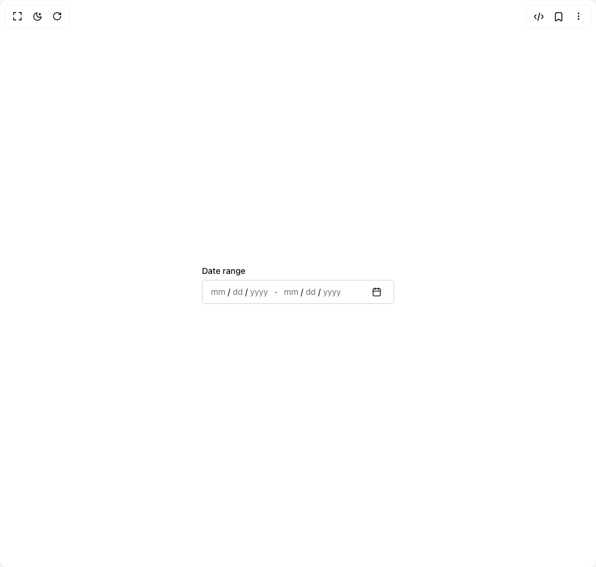

# Build Date Range Picker in BuilderStudio

> Build this component in our Agentic IDE: [BuilderStudio](https://builderstudio.dev).
>
> Join the BuilderStudio community on [Discord](https://discord.gg/QdWeSGCqfe) and [Reddit](https://reddit.com/r/builderstudio).



## Component

- Author group: `jolbol1`
- Component: `date-range-picker`
- Variant: `default`
- Rendered HTML snapshot: [`rendered.html`](rendered.html)

## BuilderStudio prompt

You are implementing a React component based on a component reference.

## Component identity

- Author: jolbol1
- Component slug: date-range-picker
- Demo slug: default
- Title: date-range-picker
- Description: 

## Goal

Recreate this component in a React + TypeScript + Tailwind CSS project. Preserve the visual layout, spacing, colors, border radius, shadows, interaction behavior, animation behavior, responsive behavior, and dark mode behavior shown in the rendered demo.

## Implementation requirements

- Use React and TypeScript.
- Use Tailwind CSS classes whenever possible.
- Keep the component self-contained unless the source files require helper components.
- If the source uses CSS variables, custom CSS, animations, or keyframes, include them.
- If the source uses external packages, list and use the required packages.
- Preserve accessibility attributes, button semantics, links, keyboard behavior, and ARIA attributes when visible in the source.
- Do not replace the component with a simplified placeholder.
- Return complete production-ready code.

## Dependencies

No reference metadata available.

## Rendered DOM snapshot

This is the rendered demo HTML extracted from the live preview. Use it to verify structure, class names, visible content, and layout.

```html
<div id="root"><div class="relative flex items-center justify-center h-screen w-full m-auto p-16 bg-background text-foreground"><div class="absolute lab-bg inset-0 size-full"><div class="absolute inset-0 bg-[radial-gradient(#00000021_1px,transparent_1px)] dark:bg-[radial-gradient(#ffffff22_1px,transparent_1px)]"></div></div><div class="flex w-full justify-center relative"><div class="min-w-[320px] space-y-1" data-rac=""><span class="text-sm font-medium leading-none data-[disabled]:cursor-not-allowed data-[disabled]:opacity-70 group-data-[invalid]:text-destructive" id="react-aria5924565261-_r_1_">Date range</span><div data-react-aria-pressable="true" id="react-aria5924565261-_r_0_" aria-labelledby="react-aria5924565261-_r_1_" role="group" class="relative flex h-10 w-full items-center overflow-hidden rounded-md border border-input bg-background px-3 py-2 text-sm ring-offset-background data-[focus-within]:outline-none data-[focus-within]:ring-2 data-[focus-within]:ring-ring data-[focus-within]:ring-offset-2 data-[disabled]:opacity-50" data-rac=""><div role="presentation" data-react-aria-pressable="true" class="text-sm" slot="start" data-rac="" style="unicode-bidi: isolate;"><span role="spinbutton" aria-valuenow="6" aria-valuetext="Empty" aria-valuemin="1" aria-valuemax="12" id="react-aria5924565261-_r_c_" aria-label="month, Start Date, " aria-labelledby="react-aria5924565261-_r_c_ react-aria5924565261-_r_1_" data-placeholder="true" contenteditable="true" spellcheck="false" autocorrect="off" enterkeyhint="next" inputmode="numeric" tabindex="0" class="type-literal:px-0 inline rounded p-0.5 caret-transparent outline-0 data-[placeholder]:text-muted-foreground data-[disabled]:cursor-not-allowed data-[disabled]:opacity-50 data-[focused]:bg-accent data-[focused]:text-accent-foreground data-[invalid]:data-[focused]:bg-destructive data-[invalid]:data-[focused]:data-[placeholder]:text-destructive-foreground data-[invalid]:data-[focused]:text-destructive-foreground data-[invalid]:data-[placeholder]:text-destructive data-[invalid]:text-destructive" data-rac="" data-type="month" style="caret-color: transparent;">mm</span><span aria-hidden="true" class="type-literal:px-0 inline rounded p-0.5 caret-transparent outline-0 data-[placeholder]:text-muted-foreground data-[disabled]:cursor-not-allowed data-[disabled]:opacity-50 data-[focused]:bg-accent data-[focused]:text-accent-foreground data-[invalid]:data-[focused]:bg-destructive data-[invalid]:data-[focused]:data-[placeholder]:text-destructive-foreground data-[invalid]:data-[focused]:text-destructive-foreground data-[invalid]:data-[placeholder]:text-destructive data-[invalid]:text-destructive" data-rac="" data-type="literal">/</span><span role="spinbutton" aria-valuenow="27" aria-valuetext="Empty" aria-valuemin="1" aria-valuemax="30" id="react-aria5924565261-_r_g_" aria-label="day, Start Date, " aria-labelledby="react-aria5924565261-_r_g_ react-aria5924565261-_r_1_" data-placeholder="true" contenteditable="true" spellcheck="false" autocorrect="off" enterkeyhint="next" inputmode="numeric" tabindex="0" class="type-literal:px-0 inline rounded p-0.5 caret-transparent outline-0 data-[placeholder]:text-muted-foreground data-[disabled]:cursor-not-allowed data-[disabled]:opacity-50 data-[focused]:bg-accent data-[focused]:text-accent-foreground data-[invalid]:data-[focused]:bg-destructive data-[invalid]:data-[focused]:data-[placeholder]:text-destructive-foreground data-[invalid]:data-[focused]:text-destructive-foreground data-[invalid]:data-[placeholder]:text-destructive data-[invalid]:text-destructive" data-rac="" data-type="day" style="caret-color: transparent;">dd</span><span aria-hidden="true" class="type-literal:px-0 inline rounded p-0.5 caret-transparent outline-0 data-[placeholder]:text-muted-foreground data-[disabled]:cursor-not-allowed data-[disabled]:opacity-50 data-[focused]:bg-accent data-[focused]:text-accent-foreground data-[invalid]:data-[focused]:bg-destructive data-[invalid]:data-[focused]:data-[placeholder]:text-destructive-foreground data-[invalid]:data-[focused]:text-destructive-foreground data-[invalid]:data-[placeholder]:text-destructive data-[invalid]:text-destructive" data-rac="" data-type="literal">/</span><span role="spinbutton" aria-valuenow="2026" aria-valuetext="Empty" aria-valuemin="1" aria-valuemax="9999" id="react-aria5924565261-_r_k_" aria-label="year, Start Date, " aria-labelledby="react-aria5924565261-_r_k_ react-aria5924565261-_r_1_" data-placeholder="true" contenteditable="true" spellcheck="false" autocorrect="off" enterkeyhint="next" inputmode="numeric" tabindex="0" class="type-literal:px-0 inline rounded p-0.5 caret-transparent outline-0 data-[placeholder]:text-muted-foreground data-[disabled]:cursor-not-allowed data-[disabled]:opacity-50 data-[focused]:bg-accent data-[focused]:text-accent-foreground data-[invalid]:data-[focused]:bg-destructive data-[invalid]:data-[focused]:data-[placeholder]:text-destructive-foreground data-[invalid]:data-[focused]:text-destructive-foreground data-[invalid]:data-[placeholder]:text-destructive data-[invalid]:text-destructive" data-rac="" data-type="year" style="caret-color: transparent;">yyyy</span></div><input hidden="" class="react-aria-Input" data-rac="" type="text" value="" title=""><span aria-hidden="true" class="px-2 text-sm text-muted-foreground">-</span><div role="presentation" data-react-aria-pressable="true" class="text-sm flex-1" slot="end" data-rac="" style="unicode-bidi: isolate;"><span role="spinbutton" aria-valuenow="6" aria-valuetext="Empty" aria-valuemin="1" aria-valuemax="12" id="react-aria5924565261-_r_r_" aria-label="month, End Date, " aria-labelledby="react-aria5924565261-_r_r_ react-aria5924565261-_r_1_" data-placeholder="true" contenteditable="true" spellcheck="false" autocorrect="off" enterkeyhint="next" inputmode="numeric" tabindex="0" class="type-literal:px-0 inline rounded p-0.5 caret-transparent outline-0 data-[placeholder]:text-muted-foreground data-[disabled]:cursor-not-allowed data-[disabled]:opacity-50 data-[focused]:bg-accent data-[focused]:text-accent-foreground data-[invalid]:data-[focused]:bg-destructive data-[invalid]:data-[focused]:data-[placeholder]:text-destructive-foreground data-[invalid]:data-[focused]:text-destructive-foreground data-[invalid]:data-[placeholder]:text-destructive data-[invalid]:text-destructive" data-rac="" data-type="month" style="caret-color: transparent;">mm</span><span aria-hidden="true" class="type-literal:px-0 inline rounded p-0.5 caret-transparent outline-0 data-[placeholder]:text-muted-foreground data-[disabled]:cursor-not-allowed data-[disabled]:opacity-50 data-[focused]:bg-accent data-[focused]:text-accent-foreground data-[invalid]:data-[focused]:bg-destructive data-[invalid]:data-[focused]:data-[placeholder]:text-destructive-foreground data-[invalid]:data-[focused]:text-destructive-foreground data-[invalid]:data-[placeholder]:text-destructive data-[invalid]:text-destructive" data-rac="" data-type="literal">/</span><span role="spinbutton" aria-valuenow="27" aria-valuetext="Empty" aria-valuemin="1" aria-valuemax="30" id="react-aria5924565261-_r_v_" aria-label="day, End Date, " aria-labelledby="react-aria5924565261-_r_v_ react-aria5924565261-_r_1_" data-placeholder="true" contenteditable="true" spellcheck="false" autocorrect="off" enterkeyhint="next" inputmode="numeric" tabindex="0" class="type-literal:px-0 inline rounded p-0.5 caret-transparent outline-0 data-[placeholder]:text-muted-foreground data-[disabled]:cursor-not-allowed data-[disabled]:opacity-50 data-[focused]:bg-accent data-[focused]:text-accent-foreground data-[invalid]:data-[focused]:bg-destructive data-[invalid]:data-[focused]:data-[placeholder]:text-destructive-foreground data-[invalid]:data-[focused]:text-destructive-foreground data-[invalid]:data-[placeholder]:text-destructive data-[invalid]:text-destructive" data-rac="" data-type="day" style="caret-color: transparent;">dd</span><span aria-hidden="true" class="type-literal:px-0 inline rounded p-0.5 caret-transparent outline-0 data-[placeholder]:text-muted-foreground data-[disabled]:cursor-not-allowed data-[disabled]:opacity-50 data-[focused]:bg-accent data-[focused]:text-accent-foreground data-[invalid]:data-[focused]:bg-destructive data-[invalid]:data-[focused]:data-[placeholder]:text-destructive-foreground data-[invalid]:data-[focused]:text-destructive-foreground data-[invalid]:data-[placeholder]:text-destructive data-[invalid]:text-destructive" data-rac="" data-type="literal">/</span><span role="spinbutton" aria-valuenow="2026" aria-valuetext="Empty" aria-valuemin="1" aria-valuemax="9999" id="react-aria5924565261-_r_13_" aria-label="year, End Date, " aria-labelledby="react-aria5924565261-_r_13_ react-aria5924565261-_r_1_" data-placeholder="true" contenteditable="true" spellcheck="false" autocorrect="off" enterkeyhint="next" inputmode="numeric" tabindex="0" class="type-literal:px-0 inline rounded p-0.5 caret-transparent outline-0 data-[placeholder]:text-muted-foreground data-[disabled]:cursor-not-allowed data-[disabled]:opacity-50 data-[focused]:bg-accent data-[focused]:text-accent-foreground data-[invalid]:data-[focused]:bg-destructive data-[invalid]:data-[focused]:data-[placeholder]:text-destructive-foreground data-[invalid]:data-[focused]:text-destructive-foreground data-[invalid]:data-[placeholder]:text-destructive data-[invalid]:text-destructive" data-rac="" data-type="year" style="caret-color: transparent;">yyyy</span></div><input hidden="" class="react-aria-Input" data-rac="" type="text" value="" title=""><button id="react-aria5924565261-_r_5_" class="inline-flex items-center justify-center whitespace-nowrap rounded-md text-sm font-medium ring-offset-background transition-colors data-[disabled]:pointer-events-none data-[disabled]:opacity-50 data-[focus-visible]:outline-none data-[focus-visible]:ring-2 data-[focus-visible]:ring-ring focus-visible:outline-none data-[hovered]:bg-accent data-[hovered]:text-accent-foreground mr-1 size-6 data-[focus-visible]:ring-offset-0" data-rac="" type="button" tabindex="0" data-react-aria-pressable="true" aria-label="Calendar" aria-labelledby="react-aria5924565261-_r_5_ react-aria5924565261-_r_1_" aria-haspopup="dialog" aria-expanded="false"><svg xmlns="http://www.w3.org/2000/svg" width="24" height="24" viewBox="0 0 24 24" fill="none" stroke="currentColor" stroke-width="2" stroke-linecap="round" stroke-linejoin="round" class="lucide lucide-calendar size-4" aria-hidden="true"><path d="M8 2v4"></path><path d="M16 2v4"></path><rect width="18" height="18" x="3" y="4" rx="2"></rect><path d="M3 10h18"></path></svg></button></div></div></div></div></div>
```

## Reference source files

No reference source files were available.
