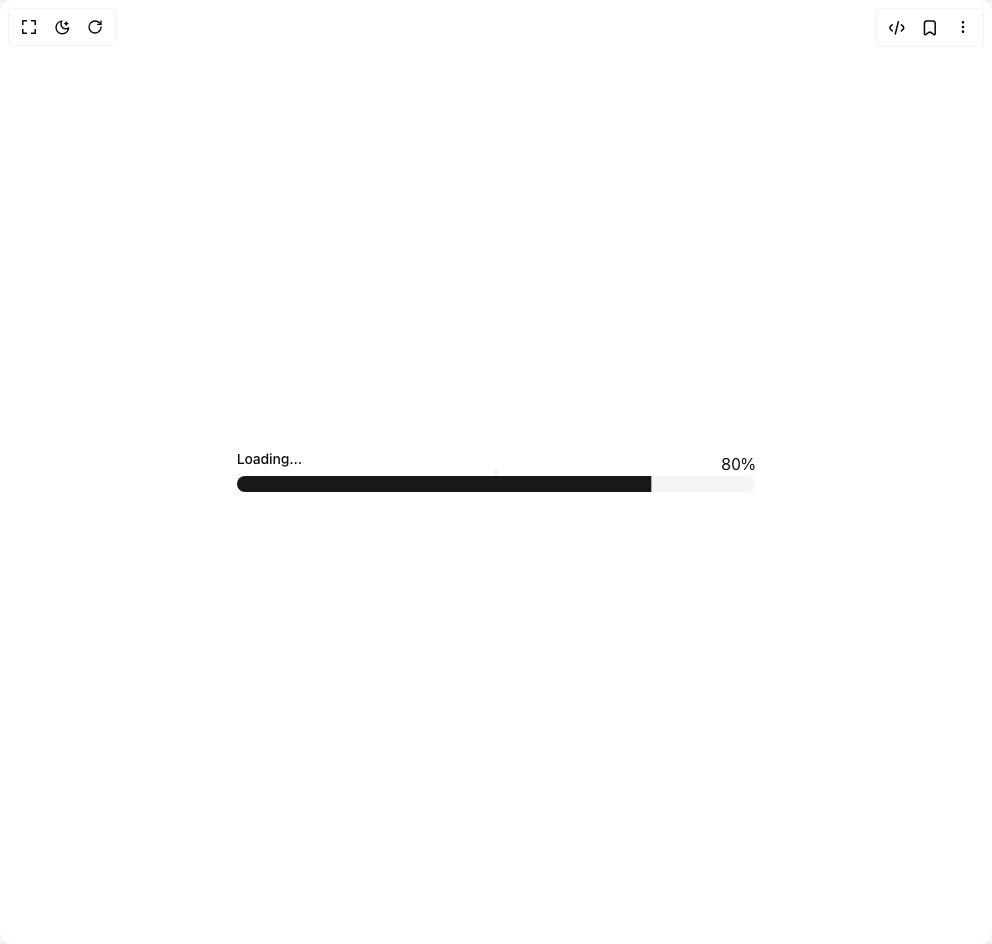

# Build Progress in BuilderStudio

> Build this component in our Agentic IDE: [BuilderStudio](https://builderstudio.dev).
>
> Join the BuilderStudio community on [Discord](https://discord.gg/QdWeSGCqfe) and [Reddit](https://reddit.com/r/builderstudio).



## Component

- Author group: `jolbol1`
- Component: `progress`
- Variant: `default`
- Rendered HTML snapshot: [`rendered.html`](rendered.html)

## BuilderStudio prompt

You are implementing a React component based on a component reference.

## Component identity

- Author: jolbol1
- Component slug: progress
- Demo slug: default
- Title: progress
- Description: 

## Goal

Recreate this component in a React + TypeScript + Tailwind CSS project. Preserve the visual layout, spacing, colors, border radius, shadows, interaction behavior, animation behavior, responsive behavior, and dark mode behavior shown in the rendered demo.

## Implementation requirements

- Use React and TypeScript.
- Use Tailwind CSS classes whenever possible.
- Keep the component self-contained unless the source files require helper components.
- If the source uses CSS variables, custom CSS, animations, or keyframes, include them.
- If the source uses external packages, list and use the required packages.
- Preserve accessibility attributes, button semantics, links, keyboard behavior, and ARIA attributes when visible in the source.
- Do not replace the component with a simplified placeholder.
- Return complete production-ready code.

## Dependencies

No reference metadata available.

## Rendered DOM snapshot

This is the rendered demo HTML extracted from the live preview. Use it to verify structure, class names, visible content, and layout.

```html
<div id="root"><div class="relative flex items-center justify-center h-screen w-full m-auto p-16 bg-background text-foreground"><div class="absolute lab-bg inset-0 size-full"><div class="absolute inset-0 bg-[radial-gradient(#00000021_1px,transparent_1px)] dark:bg-[radial-gradient(#ffffff22_1px,transparent_1px)]"></div></div><div class="flex w-full justify-center relative"><div class="w-3/5" data-rac="" id="react-aria9107692040-«r0»" aria-labelledby="react-aria9107692040-«r1»" aria-valuenow="80" aria-valuemin="0" aria-valuemax="100" aria-valuetext="80%" role="progressbar"><div class="flex w-full justify-between"><span class="text-sm font-medium leading-none data-[disabled]:cursor-not-allowed data-[disabled]:opacity-70 group-data-[invalid]:text-destructive" id="react-aria9107692040-«r1»">Loading...</span><span class="value">80%</span></div><div class="relative h-4 w-full overflow-hidden rounded-full bg-secondary"><div class="size-full flex-1 bg-primary transition-all" style="transform: translateX(-20%);"></div></div></div></div></div></div>
```

## Reference source files

No reference source files were available.
