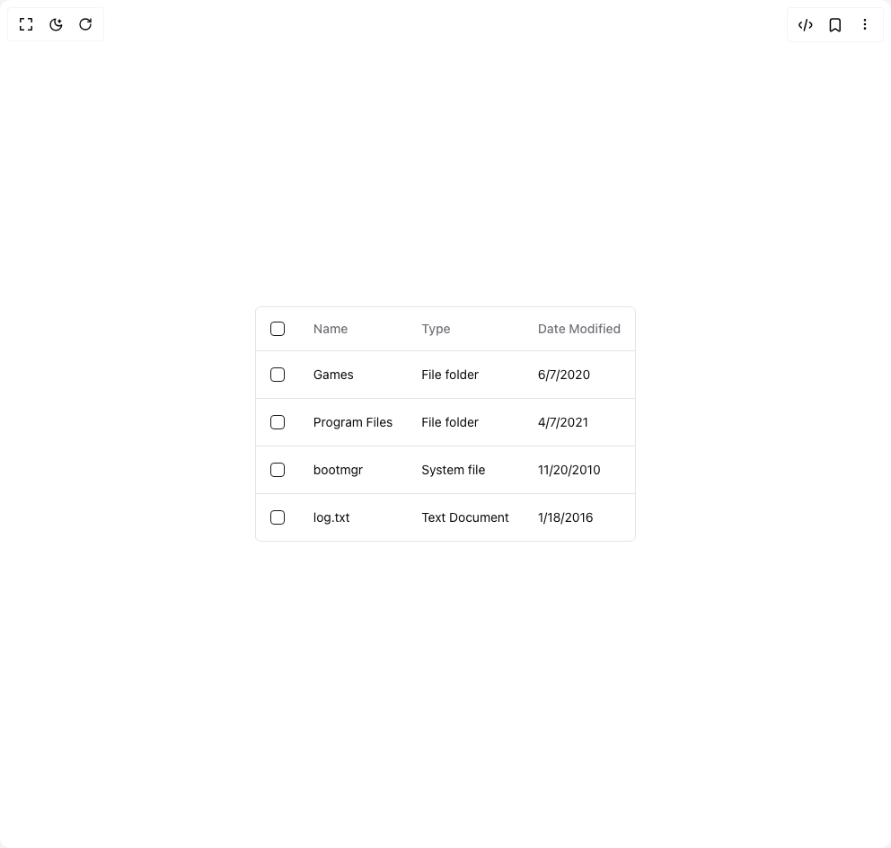

# Build Table in BuilderStudio

> Build this component in our Agentic IDE: [BuilderStudio](https://builderstudio.dev).
>
> Join the BuilderStudio community on [Discord](https://discord.gg/QdWeSGCqfe) and [Reddit](https://reddit.com/r/builderstudio).



## Component

- Author group: `jolbol1`
- Component: `table`
- Variant: `default`
- Rendered HTML snapshot: [`rendered.html`](rendered.html)

## BuilderStudio prompt

You are implementing a React component based on a component reference.

## Component identity

- Author: jolbol1
- Component slug: table
- Demo slug: default
- Title: table
- Description: 

## Goal

Recreate this component in a React + TypeScript + Tailwind CSS project. Preserve the visual layout, spacing, colors, border radius, shadows, interaction behavior, animation behavior, responsive behavior, and dark mode behavior shown in the rendered demo.

## Implementation requirements

- Use React and TypeScript.
- Use Tailwind CSS classes whenever possible.
- Keep the component self-contained unless the source files require helper components.
- If the source uses CSS variables, custom CSS, animations, or keyframes, include them.
- If the source uses external packages, list and use the required packages.
- Preserve accessibility attributes, button semantics, links, keyboard behavior, and ARIA attributes when visible in the source.
- Do not replace the component with a simplified placeholder.
- Return complete production-ready code.

## Dependencies

No reference metadata available.

## Rendered DOM snapshot

This is the rendered demo HTML extracted from the live preview. Use it to verify structure, class names, visible content, and layout.

```html
<div id="root"><div class="relative flex items-center justify-center h-screen w-full m-auto p-16 bg-background text-foreground"><div class="absolute lab-bg inset-0 size-full"><div class="absolute inset-0 bg-[radial-gradient(#00000021_1px,transparent_1px)] dark:bg-[radial-gradient(#ffffff22_1px,transparent_1px)]"></div></div><div class="flex w-full justify-center relative"><div class="relative max-w-[600px] overflow-auto rounded-md border bg-background"><template data-react-aria-hidden="true"></template><span data-focus-scope-start="true" hidden=""></span><table class="w-full caption-bottom text-sm -outline-offset-2 data-[focus-visible]:outline-ring" data-rac="" aria-label="Files" id="react-aria4593252274-_r_0_" role="grid" aria-multiselectable="true" tabindex="0" aria-describedby="" data-collection="react-aria4593252274-_r_1_"><thead role="rowgroup" class="[&amp;_tr]:border-b" data-rac=""><tr role="row"><th tabindex="-1" data-collection="react-aria4593252274-_r_1_" data-key="react-aria-1" data-react-aria-pressable="true" id="react-aria4593252274-_r_0_-react-aria-1" role="columnheader" aria-colindex="1" class="h-12 text-left align-middle font-medium text-muted-foreground -outline-offset-2 data-[focus-visible]:outline-ring" data-rac=""><div class="flex items-center"><div role="presentation" tabindex="-1" class="flex h-10 flex-1 items-center gap-1 overflow-hidden rounded-md px-4 focus-visible:outline-none data-[focus-visible]:-outline-offset-2 data-[focus-visible]:outline-ring [&amp;:has([slot=selection])]:pr-0" data-rac=""><span class="truncate"><label data-react-aria-pressable="true" class="group/checkbox flex items-center gap-x-2 data-[disabled]:cursor-not-allowed data-[disabled]:opacity-70" data-rac="" slot="selection"><span style="border: 0px; clip: rect(0px, 0px, 0px, 0px); clip-path: inset(50%); height: 1px; margin: -1px; overflow: hidden; padding: 0px; position: absolute; width: 1px; white-space: nowrap;"><input aria-label="Select All" data-react-aria-pressable="true" tabindex="0" type="checkbox" title=""></span><div class="flex size-4 shrink-0 items-center justify-center rounded-sm border border-primary text-current ring-offset-background group-data-[focus-visible]/checkbox:outline-none group-data-[focus-visible]/checkbox:ring-2 group-data-[focus-visible]/checkbox:ring-ring group-data-[focus-visible]/checkbox:ring-offset-2 group-data-[indeterminate]/checkbox:bg-primary group-data-[selected]/checkbox:bg-primary group-data-[indeterminate]/checkbox:text-primary-foreground group-data-[selected]/checkbox:text-primary-foreground group-data-[disabled]/checkbox:cursor-not-allowed group-data-[disabled]/checkbox:opacity-50 group-data-[invalid]/checkbox:border-destructive group-data-[invalid]/checkbox:group-data-[selected]/checkbox:bg-destructive group-data-[invalid]/checkbox:group-data-[selected]/checkbox:text-destructive-foreground focus:outline-none focus-visible:outline-none"></div></label></span></div></div></th><th tabindex="-1" data-collection="react-aria4593252274-_r_1_" data-key="react-aria-2" data-react-aria-pressable="true" id="react-aria4593252274-_r_0_-react-aria-2" role="columnheader" aria-colindex="2" class="h-12 text-left align-middle font-medium text-muted-foreground -outline-offset-2 data-[focus-visible]:outline-ring" data-rac=""><div class="flex items-center"><div role="presentation" tabindex="-1" class="flex h-10 flex-1 items-center gap-1 overflow-hidden rounded-md px-4 focus-visible:outline-none data-[focus-visible]:-outline-offset-2 data-[focus-visible]:outline-ring [&amp;:has([slot=selection])]:pr-0" data-rac=""><span class="truncate">Name</span></div></div></th><th tabindex="-1" data-collection="react-aria4593252274-_r_1_" data-key="react-aria-3" data-react-aria-pressable="true" id="react-aria4593252274-_r_0_-react-aria-3" role="columnheader" aria-colindex="3" class="h-12 text-left align-middle font-medium text-muted-foreground -outline-offset-2 data-[focus-visible]:outline-ring" data-rac=""><div class="flex items-center"><div role="presentation" tabindex="-1" class="flex h-10 flex-1 items-center gap-1 overflow-hidden rounded-md px-4 focus-visible:outline-none data-[focus-visible]:-outline-offset-2 data-[focus-visible]:outline-ring [&amp;:has([slot=selection])]:pr-0" data-rac=""><span class="truncate">Type</span></div></div></th><th tabindex="-1" data-collection="react-aria4593252274-_r_1_" data-key="react-aria-4" data-react-aria-pressable="true" id="react-aria4593252274-_r_0_-react-aria-4" role="columnheader" aria-colindex="4" class="h-12 text-left align-middle font-medium text-muted-foreground -outline-offset-2 data-[focus-visible]:outline-ring" data-rac=""><div class="flex items-center"><div role="presentation" tabindex="-1" class="flex h-10 flex-1 items-center gap-1 overflow-hidden rounded-md px-4 focus-visible:outline-none data-[focus-visible]:-outline-offset-2 data-[focus-visible]:outline-ring [&amp;:has([slot=selection])]:pr-0" data-rac=""><span class="truncate">Date Modified</span></div></div></th></tr></thead><tbody class="-outline-offset-2 data-[empty]:h-24 data-[empty]:text-center data-[focus-visible]:outline-ring [&amp;_tr:last-child]:border-0" data-rac="" role="rowgroup"><tr class="border-b -outline-offset-2 transition-colors data-[hovered]:bg-muted/50 data-[selected]:bg-muted data-[focus-visible]:outline-ring" data-rac="" role="row" aria-selected="false" tabindex="-1" data-collection="react-aria4593252274-_r_1_" data-key="react-aria-10" data-react-aria-pressable="true" id="react-aria4593252274-_r_7_" aria-labelledby="react-aria4593252274-_r_0_-react-aria-10-react-aria-2" data-selection-mode="multiple"><td class="p-4 align-middle -outline-offset-2 data-[focus-visible]:outline-ring [&amp;:has([role=checkbox])]:pr-0" data-rac="" tabindex="-1" data-collection="react-aria4593252274-_r_1_" data-key="react-aria-6" id="react-aria4593252274-_r_9_" role="gridcell"><label data-react-aria-pressable="true" class="group/checkbox flex items-center gap-x-2 data-[disabled]:cursor-not-allowed data-[disabled]:opacity-70" data-rac="" slot="selection"><span style="border: 0px; clip: rect(0px, 0px, 0px, 0px); clip-path: inset(50%); height: 1px; margin: -1px; overflow: hidden; padding: 0px; position: absolute; width: 1px; white-space: nowrap;"><input id="react-aria4593252274-_r_8_" aria-label="Select" aria-labelledby="react-aria4593252274-_r_8_ react-aria4593252274-_r_0_-react-aria-10-react-aria-2" data-react-aria-pressable="true" tabindex="0" type="checkbox" title=""></span><div class="flex size-4 shrink-0 items-center justify-center rounded-sm border border-primary text-current ring-offset-background group-data-[focus-visible]/checkbox:outline-none group-data-[focus-visible]/checkbox:ring-2 group-data-[focus-visible]/checkbox:ring-ring group-data-[focus-visible]/checkbox:ring-offset-2 group-data-[indeterminate]/checkbox:bg-primary group-data-[selected]/checkbox:bg-primary group-data-[indeterminate]/checkbox:text-primary-foreground group-data-[selected]/checkbox:text-primary-foreground group-data-[disabled]/checkbox:cursor-not-allowed group-data-[disabled]/checkbox:opacity-50 group-data-[invalid]/checkbox:border-destructive group-data-[invalid]/checkbox:group-data-[selected]/checkbox:bg-destructive group-data-[invalid]/checkbox:group-data-[selected]/checkbox:text-destructive-foreground focus:outline-none focus-visible:outline-none"></div></label></td><td class="p-4 align-middle -outline-offset-2 data-[focus-visible]:outline-ring [&amp;:has([role=checkbox])]:pr-0" data-rac="" tabindex="-1" data-collection="react-aria4593252274-_r_1_" data-key="react-aria-7" id="react-aria4593252274-_r_0_-react-aria-10-react-aria-2" role="rowheader">Games</td><td class="p-4 align-middle -outline-offset-2 data-[focus-visible]:outline-ring [&amp;:has([role=checkbox])]:pr-0" data-rac="" tabindex="-1" data-collection="react-aria4593252274-_r_1_" data-key="react-aria-8" id="react-aria4593252274-_r_b_" role="gridcell">File folder</td><td class="p-4 align-middle -outline-offset-2 data-[focus-visible]:outline-ring [&amp;:has([role=checkbox])]:pr-0" data-rac="" tabindex="-1" data-collection="react-aria4593252274-_r_1_" data-key="react-aria-9" id="react-aria4593252274-_r_c_" role="gridcell">6/7/2020</td></tr><tr class="border-b -outline-offset-2 transition-colors data-[hovered]:bg-muted/50 data-[selected]:bg-muted data-[focus-visible]:outline-ring" data-rac="" role="row" aria-selected="false" tabindex="-1" data-collection="react-aria4593252274-_r_1_" data-key="react-aria-15" data-react-aria-pressable="true" id="react-aria4593252274-_r_d_" aria-labelledby="react-aria4593252274-_r_0_-react-aria-15-react-aria-2" data-selection-mode="multiple"><td class="p-4 align-middle -outline-offset-2 data-[focus-visible]:outline-ring [&amp;:has([role=checkbox])]:pr-0" data-rac="" tabindex="-1" data-collection="react-aria4593252274-_r_1_" data-key="react-aria-11" id="react-aria4593252274-_r_f_" role="gridcell"><label data-react-aria-pressable="true" class="group/checkbox flex items-center gap-x-2 data-[disabled]:cursor-not-allowed data-[disabled]:opacity-70" data-rac="" slot="selection"><span style="border: 0px; clip: rect(0px, 0px, 0px, 0px); clip-path: inset(50%); height: 1px; margin: -1px; overflow: hidden; padding: 0px; position: absolute; width: 1px; white-space: nowrap;"><input id="react-aria4593252274-_r_e_" aria-label="Select" aria-labelledby="react-aria4593252274-_r_e_ react-aria4593252274-_r_0_-react-aria-15-react-aria-2" data-react-aria-pressable="true" tabindex="0" type="checkbox" title=""></span><div class="flex size-4 shrink-0 items-center justify-center rounded-sm border border-primary text-current ring-offset-background group-data-[focus-visible]/checkbox:outline-none group-data-[focus-visible]/checkbox:ring-2 group-data-[focus-visible]/checkbox:ring-ring group-data-[focus-visible]/checkbox:ring-offset-2 group-data-[indeterminate]/checkbox:bg-primary group-data-[selected]/checkbox:bg-primary group-data-[indeterminate]/checkbox:text-primary-foreground group-data-[selected]/checkbox:text-primary-foreground group-data-[disabled]/checkbox:cursor-not-allowed group-data-[disabled]/checkbox:opacity-50 group-data-[invalid]/checkbox:border-destructive group-data-[invalid]/checkbox:group-data-[selected]/checkbox:bg-destructive group-data-[invalid]/checkbox:group-data-[selected]/checkbox:text-destructive-foreground focus:outline-none focus-visible:outline-none"></div></label></td><td class="p-4 align-middle -outline-offset-2 data-[focus-visible]:outline-ring [&amp;:has([role=checkbox])]:pr-0" data-rac="" tabindex="-1" data-collection="react-aria4593252274-_r_1_" data-key="react-aria-12" id="react-aria4593252274-_r_0_-react-aria-15-react-aria-2" role="rowheader">Program Files</td><td class="p-4 align-middle -outline-offset-2 data-[focus-visible]:outline-ring [&amp;:has([role=checkbox])]:pr-0" data-rac="" tabindex="-1" data-collection="react-aria4593252274-_r_1_" data-key="react-aria-13" id="react-aria4593252274-_r_h_" role="gridcell">File folder</td><td class="p-4 align-middle -outline-offset-2 data-[focus-visible]:outline-ring [&amp;:has([role=checkbox])]:pr-0" data-rac="" tabindex="-1" data-collection="react-aria4593252274-_r_1_" data-key="react-aria-14" id="react-aria4593252274-_r_i_" role="gridcell">4/7/2021</td></tr><tr class="border-b -outline-offset-2 transition-colors data-[hovered]:bg-muted/50 data-[selected]:bg-muted data-[focus-visible]:outline-ring" data-rac="" role="row" aria-selected="false" tabindex="-1" data-collection="react-aria4593252274-_r_1_" data-key="react-aria-20" data-react-aria-pressable="true" id="react-aria4593252274-_r_j_" aria-labelledby="react-aria4593252274-_r_0_-react-aria-20-react-aria-2" data-selection-mode="multiple"><td class="p-4 align-middle -outline-offset-2 data-[focus-visible]:outline-ring [&amp;:has([role=checkbox])]:pr-0" data-rac="" tabindex="-1" data-collection="react-aria4593252274-_r_1_" data-key="react-aria-16" id="react-aria4593252274-_r_l_" role="gridcell"><label data-react-aria-pressable="true" class="group/checkbox flex items-center gap-x-2 data-[disabled]:cursor-not-allowed data-[disabled]:opacity-70" data-rac="" slot="selection"><span style="border: 0px; clip: rect(0px, 0px, 0px, 0px); clip-path: inset(50%); height: 1px; margin: -1px; overflow: hidden; padding: 0px; position: absolute; width: 1px; white-space: nowrap;"><input id="react-aria4593252274-_r_k_" aria-label="Select" aria-labelledby="react-aria4593252274-_r_k_ react-aria4593252274-_r_0_-react-aria-20-react-aria-2" data-react-aria-pressable="true" tabindex="0" type="checkbox" title=""></span><div class="flex size-4 shrink-0 items-center justify-center rounded-sm border border-primary text-current ring-offset-background group-data-[focus-visible]/checkbox:outline-none group-data-[focus-visible]/checkbox:ring-2 group-data-[focus-visible]/checkbox:ring-ring group-data-[focus-visible]/checkbox:ring-offset-2 group-data-[indeterminate]/checkbox:bg-primary group-data-[selected]/checkbox:bg-primary group-data-[indeterminate]/checkbox:text-primary-foreground group-data-[selected]/checkbox:text-primary-foreground group-data-[disabled]/checkbox:cursor-not-allowed group-data-[disabled]/checkbox:opacity-50 group-data-[invalid]/checkbox:border-destructive group-data-[invalid]/checkbox:group-data-[selected]/checkbox:bg-destructive group-data-[invalid]/checkbox:group-data-[selected]/checkbox:text-destructive-foreground focus:outline-none focus-visible:outline-none"></div></label></td><td class="p-4 align-middle -outline-offset-2 data-[focus-visible]:outline-ring [&amp;:has([role=checkbox])]:pr-0" data-rac="" tabindex="-1" data-collection="react-aria4593252274-_r_1_" data-key="react-aria-17" id="react-aria4593252274-_r_0_-react-aria-20-react-aria-2" role="rowheader">bootmgr</td><td class="p-4 align-middle -outline-offset-2 data-[focus-visible]:outline-ring [&amp;:has([role=checkbox])]:pr-0" data-rac="" tabindex="-1" data-collection="react-aria4593252274-_r_1_" data-key="react-aria-18" id="react-aria4593252274-_r_n_" role="gridcell">System file</td><td class="p-4 align-middle -outline-offset-2 data-[focus-visible]:outline-ring [&amp;:has([role=checkbox])]:pr-0" data-rac="" tabindex="-1" data-collection="react-aria4593252274-_r_1_" data-key="react-aria-19" id="react-aria4593252274-_r_o_" role="gridcell">11/20/2010</td></tr><tr class="border-b -outline-offset-2 transition-colors data-[hovered]:bg-muted/50 data-[selected]:bg-muted data-[focus-visible]:outline-ring" data-rac="" role="row" aria-selected="false" tabindex="-1" data-collection="react-aria4593252274-_r_1_" data-key="react-aria-25" data-react-aria-pressable="true" id="react-aria4593252274-_r_p_" aria-labelledby="react-aria4593252274-_r_0_-react-aria-25-react-aria-2" data-selection-mode="multiple"><td class="p-4 align-middle -outline-offset-2 data-[focus-visible]:outline-ring [&amp;:has([role=checkbox])]:pr-0" data-rac="" tabindex="-1" data-collection="react-aria4593252274-_r_1_" data-key="react-aria-21" id="react-aria4593252274-_r_r_" role="gridcell"><label data-react-aria-pressable="true" class="group/checkbox flex items-center gap-x-2 data-[disabled]:cursor-not-allowed data-[disabled]:opacity-70" data-rac="" slot="selection"><span style="border: 0px; clip: rect(0px, 0px, 0px, 0px); clip-path: inset(50%); height: 1px; margin: -1px; overflow: hidden; padding: 0px; position: absolute; width: 1px; white-space: nowrap;"><input id="react-aria4593252274-_r_q_" aria-label="Select" aria-labelledby="react-aria4593252274-_r_q_ react-aria4593252274-_r_0_-react-aria-25-react-aria-2" data-react-aria-pressable="true" tabindex="0" type="checkbox" title=""></span><div class="flex size-4 shrink-0 items-center justify-center rounded-sm border border-primary text-current ring-offset-background group-data-[focus-visible]/checkbox:outline-none group-data-[focus-visible]/checkbox:ring-2 group-data-[focus-visible]/checkbox:ring-ring group-data-[focus-visible]/checkbox:ring-offset-2 group-data-[indeterminate]/checkbox:bg-primary group-data-[selected]/checkbox:bg-primary group-data-[indeterminate]/checkbox:text-primary-foreground group-data-[selected]/checkbox:text-primary-foreground group-data-[disabled]/checkbox:cursor-not-allowed group-data-[disabled]/checkbox:opacity-50 group-data-[invalid]/checkbox:border-destructive group-data-[invalid]/checkbox:group-data-[selected]/checkbox:bg-destructive group-data-[invalid]/checkbox:group-data-[selected]/checkbox:text-destructive-foreground focus:outline-none focus-visible:outline-none"></div></label></td><td class="p-4 align-middle -outline-offset-2 data-[focus-visible]:outline-ring [&amp;:has([role=checkbox])]:pr-0" data-rac="" tabindex="-1" data-collection="react-aria4593252274-_r_1_" data-key="react-aria-22" id="react-aria4593252274-_r_0_-react-aria-25-react-aria-2" role="rowheader">log.txt</td><td class="p-4 align-middle -outline-offset-2 data-[focus-visible]:outline-ring [&amp;:has([role=checkbox])]:pr-0" data-rac="" tabindex="-1" data-collection="react-aria4593252274-_r_1_" data-key="react-aria-23" id="react-aria4593252274-_r_t_" role="gridcell">Text Document</td><td class="p-4 align-middle -outline-offset-2 data-[focus-visible]:outline-ring [&amp;:has([role=checkbox])]:pr-0" data-rac="" tabindex="-1" data-collection="react-aria4593252274-_r_1_" data-key="react-aria-24" id="react-aria4593252274-_r_u_" role="gridcell">1/18/2016</td></tr></tbody></table><span data-focus-scope-end="true" hidden=""></span></div></div></div></div>
```

## Reference source files

No reference source files were available.
