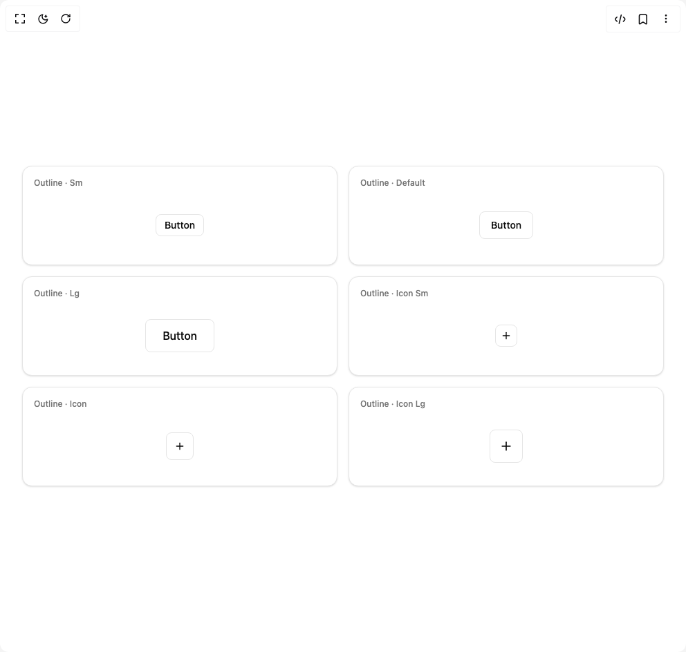

# Build Interfaces Button in BuilderStudio

> Build this component in our Agentic IDE: [BuilderStudio](https://builderstudio.dev).
>
> Join the BuilderStudio community on [Discord](https://discord.gg/QdWeSGCqfe) and [Reddit](https://reddit.com/r/builderstudio).



## Component

- Author group: `jshguo`
- Component: `interfaces-button`
- Variant: `outline`
- Rendered HTML snapshot: [`rendered.html`](rendered.html)

## BuilderStudio prompt

You are implementing a React component based on a component reference.

## Component identity

- Author: jshguo
- Component slug: interfaces-button
- Demo slug: outline
- Title: interfaces-button
- Description: 

## Goal

Recreate this component in a React + TypeScript + Tailwind CSS project. Preserve the visual layout, spacing, colors, border radius, shadows, interaction behavior, animation behavior, responsive behavior, and dark mode behavior shown in the rendered demo.

## Implementation requirements

- Use React and TypeScript.
- Use Tailwind CSS classes whenever possible.
- Keep the component self-contained unless the source files require helper components.
- If the source uses CSS variables, custom CSS, animations, or keyframes, include them.
- If the source uses external packages, list and use the required packages.
- Preserve accessibility attributes, button semantics, links, keyboard behavior, and ARIA attributes when visible in the source.
- Do not replace the component with a simplified placeholder.
- Return complete production-ready code.

## Dependencies

No reference metadata available.

## Rendered DOM snapshot

This is the rendered demo HTML extracted from the live preview. Use it to verify structure, class names, visible content, and layout.

```html
<div id="root"><div class="w-screen min-h-screen flex justify-center items-center"><div class="fixed top-4 left-4 z-10"><select class="appearance-none h-8 max-w-[200px] text-sm leading-tight rounded-lg pl-3 pr-7 py-0 border bg-background focus:outline-none focus:ring-0"><option value="outline.tsx_ButtonOutlineDemo">outline.tsx</option></select><div class="absolute top-1/2 transform -translate-y-1/2 right-2 pointer-events-none"><svg class="w-4 h-4 fill-current" viewBox="0 0 20 20"><path d="M5.516 7.548c.436-.446 1.043-.48 1.576 0L10 10.405l2.908-2.857c.533-.48 1.14-.446 1.576 0 .436.445.408 1.197 0 1.615l-3.734 3.705c-.533.534-1.39.534-1.923 0l-3.734-3.705c-.408-.418-.436-1.17 0-1.615z"></path></svg></div></div><div class="w-screen min-h-screen flex justify-center items-center"><div class="flex w-full min-h-screen items-center justify-center overflow-hidden bg-background p-8"><div class="grid w-full max-w-5xl gap-4 sm:grid-cols-2 lg:grid-cols-3"><div class="flex min-h-36 flex-col rounded-xl border bg-card p-4 shadow-sm"><p class="text-xs font-medium text-muted-foreground">Outline · Sm</p><div class="flex flex-1 items-center justify-center pt-3"><button data-slot="button" class="inline-flex items-center justify-center gap-2 whitespace-nowrap text-sm font-medium transition-all disabled:pointer-events-none disabled:opacity-50 [&amp;_svg]:pointer-events-none shrink-0 [&amp;_svg]:shrink-0 outline-none focus-visible:border-ring focus-visible:ring-ring/50 focus-visible:ring-[3px] aria-invalid:ring-destructive/25 dark:aria-invalid:ring-destructive/50 aria-invalid:border-destructive cursor-pointer border bg-background hover:bg-accent h-8 rounded-md px-3 py-2">Button</button></div></div><div class="flex min-h-36 flex-col rounded-xl border bg-card p-4 shadow-sm"><p class="text-xs font-medium text-muted-foreground">Outline · Default</p><div class="flex flex-1 items-center justify-center pt-3"><button data-slot="button" class="inline-flex items-center justify-center gap-2 whitespace-nowrap rounded-md text-sm font-medium transition-all disabled:pointer-events-none disabled:opacity-50 [&amp;_svg]:pointer-events-none shrink-0 [&amp;_svg]:shrink-0 outline-none focus-visible:border-ring focus-visible:ring-ring/50 focus-visible:ring-[3px] aria-invalid:ring-destructive/25 dark:aria-invalid:ring-destructive/50 aria-invalid:border-destructive cursor-pointer border bg-background hover:bg-accent h-10 px-4 py-2">Button</button></div></div><div class="flex min-h-36 flex-col rounded-xl border bg-card p-4 shadow-sm"><p class="text-xs font-medium text-muted-foreground">Outline · Lg</p><div class="flex flex-1 items-center justify-center pt-3"><button data-slot="button" class="inline-flex items-center justify-center gap-2 whitespace-nowrap font-medium transition-all disabled:pointer-events-none disabled:opacity-50 [&amp;_svg]:pointer-events-none shrink-0 [&amp;_svg]:shrink-0 outline-none focus-visible:border-ring focus-visible:ring-ring/50 focus-visible:ring-[3px] aria-invalid:ring-destructive/25 dark:aria-invalid:ring-destructive/50 aria-invalid:border-destructive cursor-pointer border bg-background hover:bg-accent h-12 rounded-md px-6 py-4 text-base">Button</button></div></div><div class="flex min-h-36 flex-col rounded-xl border bg-card p-4 shadow-sm"><p class="text-xs font-medium text-muted-foreground">Outline · Icon Sm</p><div class="flex flex-1 items-center justify-center pt-3"><button data-slot="button" class="inline-flex items-center justify-center gap-2 whitespace-nowrap rounded-md text-sm font-medium transition-all disabled:pointer-events-none disabled:opacity-50 [&amp;_svg]:pointer-events-none shrink-0 [&amp;_svg]:shrink-0 outline-none focus-visible:border-ring focus-visible:ring-ring/50 focus-visible:ring-[3px] aria-invalid:ring-destructive/25 dark:aria-invalid:ring-destructive/50 aria-invalid:border-destructive cursor-pointer border bg-background hover:bg-accent size-8" aria-label="outline · icon sm"><svg xmlns="http://www.w3.org/2000/svg" width="24" height="24" viewBox="0 0 24 24" fill="none" stroke="currentColor" stroke-width="2" stroke-linecap="round" stroke-linejoin="round" class="lucide lucide-plus size-4" aria-hidden="true"><path d="M5 12h14"></path><path d="M12 5v14"></path></svg></button></div></div><div class="flex min-h-36 flex-col rounded-xl border bg-card p-4 shadow-sm"><p class="text-xs font-medium text-muted-foreground">Outline · Icon</p><div class="flex flex-1 items-center justify-center pt-3"><button data-slot="button" class="inline-flex items-center justify-center gap-2 whitespace-nowrap rounded-md text-sm font-medium transition-all disabled:pointer-events-none disabled:opacity-50 [&amp;_svg]:pointer-events-none shrink-0 [&amp;_svg]:shrink-0 outline-none focus-visible:border-ring focus-visible:ring-ring/50 focus-visible:ring-[3px] aria-invalid:ring-destructive/25 dark:aria-invalid:ring-destructive/50 aria-invalid:border-destructive cursor-pointer border bg-background hover:bg-accent size-10" aria-label="outline · icon"><svg xmlns="http://www.w3.org/2000/svg" width="24" height="24" viewBox="0 0 24 24" fill="none" stroke="currentColor" stroke-width="2" stroke-linecap="round" stroke-linejoin="round" class="lucide lucide-plus size-4" aria-hidden="true"><path d="M5 12h14"></path><path d="M12 5v14"></path></svg></button></div></div><div class="flex min-h-36 flex-col rounded-xl border bg-card p-4 shadow-sm"><p class="text-xs font-medium text-muted-foreground">Outline · Icon Lg</p><div class="flex flex-1 items-center justify-center pt-3"><button data-slot="button" class="inline-flex items-center justify-center gap-2 whitespace-nowrap rounded-md text-sm font-medium transition-all disabled:pointer-events-none disabled:opacity-50 [&amp;_svg]:pointer-events-none shrink-0 [&amp;_svg]:shrink-0 outline-none focus-visible:border-ring focus-visible:ring-ring/50 focus-visible:ring-[3px] aria-invalid:ring-destructive/25 dark:aria-invalid:ring-destructive/50 aria-invalid:border-destructive cursor-pointer border bg-background hover:bg-accent size-12 [&amp;_svg]:size-5" aria-label="outline · icon lg"><svg xmlns="http://www.w3.org/2000/svg" width="24" height="24" viewBox="0 0 24 24" fill="none" stroke="currentColor" stroke-width="2" stroke-linecap="round" stroke-linejoin="round" class="lucide lucide-plus size-4" aria-hidden="true"><path d="M5 12h14"></path><path d="M12 5v14"></path></svg></button></div></div></div></div></div></div></div>
```

## Reference source files

No reference source files were available.
