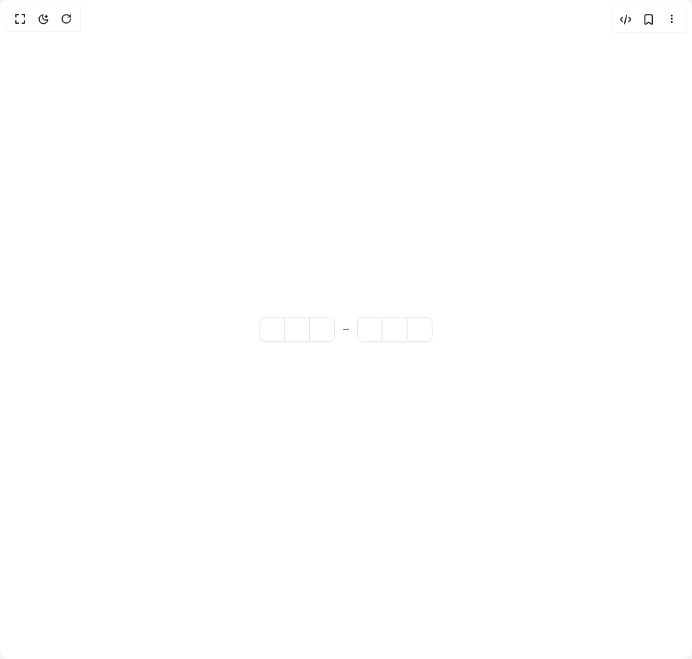

# Build Interfaces Input Otp in BuilderStudio

> Build this component in our Agentic IDE: [BuilderStudio](https://builderstudio.dev).
>
> Join the BuilderStudio community on [Discord](https://discord.gg/QdWeSGCqfe) and [Reddit](https://reddit.com/r/builderstudio).



## Component

- Author group: `jshguo`
- Component: `interfaces-input-otp`
- Variant: `alphanumeric`
- Rendered HTML snapshot: [`rendered.html`](rendered.html)

## BuilderStudio prompt

You are implementing a React component based on a component reference.

## Component identity

- Author: jshguo
- Component slug: interfaces-input-otp
- Demo slug: alphanumeric
- Title: interfaces-input-otp
- Description: 

## Goal

Recreate this component in a React + TypeScript + Tailwind CSS project. Preserve the visual layout, spacing, colors, border radius, shadows, interaction behavior, animation behavior, responsive behavior, and dark mode behavior shown in the rendered demo.

## Implementation requirements

- Use React and TypeScript.
- Use Tailwind CSS classes whenever possible.
- Keep the component self-contained unless the source files require helper components.
- If the source uses CSS variables, custom CSS, animations, or keyframes, include them.
- If the source uses external packages, list and use the required packages.
- Preserve accessibility attributes, button semantics, links, keyboard behavior, and ARIA attributes when visible in the source.
- Do not replace the component with a simplified placeholder.
- Return complete production-ready code.

## Dependencies

No reference metadata available.

## Rendered DOM snapshot

This is the rendered demo HTML extracted from the live preview. Use it to verify structure, class names, visible content, and layout.

```html
<div id="root"><div class="w-screen min-h-screen flex justify-center items-center"><div class="fixed top-4 left-4 z-10"><select class="appearance-none h-8 max-w-[200px] text-sm leading-tight rounded-lg pl-3 pr-7 py-0 border bg-background focus:outline-none focus:ring-0"><option value="alphanumeric.tsx_InputOTPAlphanumericDemo$1">alphanumeric.tsx</option><option value="default.tsx_InputOTPAlphanumericDemo">default.tsx</option></select><div class="absolute top-1/2 transform -translate-y-1/2 right-2 pointer-events-none"><svg class="w-4 h-4 fill-current" viewBox="0 0 20 20"><path d="M5.516 7.548c.436-.446 1.043-.48 1.576 0L10 10.405l2.908-2.857c.533-.48 1.14-.446 1.576 0 .436.445.408 1.197 0 1.615l-3.734 3.705c-.533.534-1.39.534-1.923 0l-3.734-3.705c-.408-.418-.436-1.17 0-1.615z"></path></svg></div></div><div class="w-screen min-h-screen flex justify-center items-center"><div class="flex min-h-screen w-full items-center justify-center overflow-hidden bg-background p-8"><noscript></noscript><div data-input-otp-container="true" class="flex items-center gap-2 has-disabled:opacity-50" style="position: relative; cursor: text; user-select: none; pointer-events: none; --root-height: 36px;"><div data-slot="input-otp-group" class="flex items-center"><div data-slot="input-otp-slot" data-active="false" class="data-[active=true]:border-ring data-[active=true]:ring-ring/50 data-[active=true]:aria-invalid:ring-destructive/20 dark:data-[active=true]:aria-invalid:ring-destructive/40 aria-invalid:border-destructive data-[active=true]:aria-invalid:border-destructive dark:bg-input/30 border-input relative flex h-9 w-9 items-center justify-center border-y border-r text-sm shadow-xs transition-all outline-none first:rounded-l-md first:border-l last:rounded-r-md data-[active=true]:z-10 data-[active=true]:ring-[3px]"></div><div data-slot="input-otp-slot" data-active="false" class="data-[active=true]:border-ring data-[active=true]:ring-ring/50 data-[active=true]:aria-invalid:ring-destructive/20 dark:data-[active=true]:aria-invalid:ring-destructive/40 aria-invalid:border-destructive data-[active=true]:aria-invalid:border-destructive dark:bg-input/30 border-input relative flex h-9 w-9 items-center justify-center border-y border-r text-sm shadow-xs transition-all outline-none first:rounded-l-md first:border-l last:rounded-r-md data-[active=true]:z-10 data-[active=true]:ring-[3px]"></div><div data-slot="input-otp-slot" data-active="false" class="data-[active=true]:border-ring data-[active=true]:ring-ring/50 data-[active=true]:aria-invalid:ring-destructive/20 dark:data-[active=true]:aria-invalid:ring-destructive/40 aria-invalid:border-destructive data-[active=true]:aria-invalid:border-destructive dark:bg-input/30 border-input relative flex h-9 w-9 items-center justify-center border-y border-r text-sm shadow-xs transition-all outline-none first:rounded-l-md first:border-l last:rounded-r-md data-[active=true]:z-10 data-[active=true]:ring-[3px]"></div></div><div data-slot="input-otp-separator" role="separator"><svg focusable="false" preserveAspectRatio="xMidYMid meet" fill="currentColor" width="16" height="16" viewBox="0 0 32 32" aria-hidden="true" xmlns="http://www.w3.org/2000/svg"><path d="M8 15H24V17H8z"></path></svg></div><div data-slot="input-otp-group" class="flex items-center"><div data-slot="input-otp-slot" data-active="false" class="data-[active=true]:border-ring data-[active=true]:ring-ring/50 data-[active=true]:aria-invalid:ring-destructive/20 dark:data-[active=true]:aria-invalid:ring-destructive/40 aria-invalid:border-destructive data-[active=true]:aria-invalid:border-destructive dark:bg-input/30 border-input relative flex h-9 w-9 items-center justify-center border-y border-r text-sm shadow-xs transition-all outline-none first:rounded-l-md first:border-l last:rounded-r-md data-[active=true]:z-10 data-[active=true]:ring-[3px]"></div><div data-slot="input-otp-slot" data-active="false" class="data-[active=true]:border-ring data-[active=true]:ring-ring/50 data-[active=true]:aria-invalid:ring-destructive/20 dark:data-[active=true]:aria-invalid:ring-destructive/40 aria-invalid:border-destructive data-[active=true]:aria-invalid:border-destructive dark:bg-input/30 border-input relative flex h-9 w-9 items-center justify-center border-y border-r text-sm shadow-xs transition-all outline-none first:rounded-l-md first:border-l last:rounded-r-md data-[active=true]:z-10 data-[active=true]:ring-[3px]"></div><div data-slot="input-otp-slot" data-active="false" class="data-[active=true]:border-ring data-[active=true]:ring-ring/50 data-[active=true]:aria-invalid:ring-destructive/20 dark:data-[active=true]:aria-invalid:ring-destructive/40 aria-invalid:border-destructive data-[active=true]:aria-invalid:border-destructive dark:bg-input/30 border-input relative flex h-9 w-9 items-center justify-center border-y border-r text-sm shadow-xs transition-all outline-none first:rounded-l-md first:border-l last:rounded-r-md data-[active=true]:z-10 data-[active=true]:ring-[3px]"></div></div><div style="position: absolute; inset: 0px; pointer-events: none;"><input autocomplete="one-time-code" data-slot="input-otp" class="disabled:cursor-not-allowed" data-input-otp="true" data-input-otp-placeholder-shown="true" inputmode="numeric" pattern="^[a-zA-Z0-9]+$" maxlength="6" value="" data-input-otp-mss="0" data-input-otp-mse="0" style="position: absolute; inset: 0px; width: 100%; height: 100%; display: flex; text-align: left; opacity: 1; color: transparent; pointer-events: all; background: transparent; caret-color: transparent; border: 0px solid transparent; outline: transparent solid 0px; box-shadow: none; line-height: 1; letter-spacing: -0.5em; font-size: var(--root-height); font-family: monospace; font-variant-numeric: tabular-nums;"></div></div></div></div></div></div>
```

## Reference source files

No reference source files were available.
