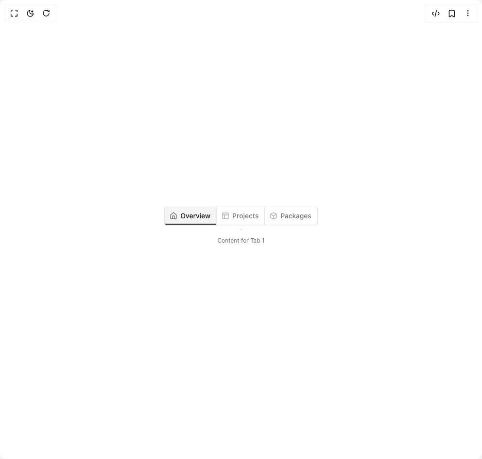

# Build Tabs In Cell For Navigation in BuilderStudio

> Build this component in our Agentic IDE: [BuilderStudio](https://builderstudio.dev).
>
> Join the BuilderStudio community on [Discord](https://discord.gg/QdWeSGCqfe) and [Reddit](https://reddit.com/r/builderstudio).



## Component

- Author group: `k3menn`
- Component: `tabs-in-cell-for-navigation`
- Variant: `default`
- Rendered HTML snapshot: [`rendered.html`](rendered.html)

## BuilderStudio prompt

You are implementing a React component based on a component reference.

## Component identity

- Author: k3menn
- Component slug: tabs-in-cell-for-navigation
- Demo slug: default
- Title: tabs-in-cell-for-navigation
- Description: 

## Goal

Recreate this component in a React + TypeScript + Tailwind CSS project. Preserve the visual layout, spacing, colors, border radius, shadows, interaction behavior, animation behavior, responsive behavior, and dark mode behavior shown in the rendered demo.

## Implementation requirements

- Use React and TypeScript.
- Use Tailwind CSS classes whenever possible.
- Keep the component self-contained unless the source files require helper components.
- If the source uses CSS variables, custom CSS, animations, or keyframes, include them.
- If the source uses external packages, list and use the required packages.
- Preserve accessibility attributes, button semantics, links, keyboard behavior, and ARIA attributes when visible in the source.
- Do not replace the component with a simplified placeholder.
- Return complete production-ready code.

## Dependencies

No reference metadata available.

## Rendered DOM snapshot

This is the rendered demo HTML extracted from the live preview. Use it to verify structure, class names, visible content, and layout.

```html
<div id="root"><div class="relative flex items-center justify-center h-screen w-full m-auto p-16 bg-background text-foreground"><div class="absolute lab-bg inset-0 size-full"><div class="absolute inset-0 bg-[radial-gradient(#00000021_1px,transparent_1px)] dark:bg-[radial-gradient(#ffffff22_1px,transparent_1px)]"></div></div><div class="flex w-full justify-center relative"><div class="block"><div dir="ltr" data-orientation="horizontal"><div dir="ltr" class="relative overflow-hidden" style="position: relative; --radix-scroll-area-corner-width: 0px; --radix-scroll-area-corner-height: 0px;"><style>[data-radix-scroll-area-viewport]{scrollbar-width:none;-ms-overflow-style:none;-webkit-overflow-scrolling:touch;}[data-radix-scroll-area-viewport]::-webkit-scrollbar{display:none}</style><div data-radix-scroll-area-viewport="" class="h-full w-full rounded-[inherit]" style="overflow: scroll;"><div style="min-width: 100%; display: table;"><div role="tablist" aria-orientation="horizontal" class="inline-flex items-center justify-center rounded-md text-muted-foreground mb-3 h-auto -space-x-px bg-background p-0 shadow-sm shadow-black/5 rtl:space-x-reverse" tabindex="0" data-orientation="horizontal" style="outline: none;"><button type="button" role="tab" aria-selected="true" aria-controls="radix-«r0»-content-tab-1" data-state="active" id="radix-«r0»-trigger-tab-1" class="inline-flex items-center justify-center whitespace-nowrap px-3 text-sm font-medium ring-offset-background transition-all focus-visible:outline-none focus-visible:ring-2 focus-visible:ring-ring focus-visible:ring-offset-2 disabled:pointer-events-none disabled:opacity-50 data-[state=active]:text-foreground data-[state=active]:shadow-sm relative overflow-hidden rounded-none border border-border py-2 after:pointer-events-none after:absolute after:inset-x-0 after:bottom-0 after:h-0.5 first:rounded-s last:rounded-e data-[state=active]:bg-muted data-[state=active]:after:bg-primary" tabindex="-1" data-orientation="horizontal" data-radix-collection-item=""><svg xmlns="http://www.w3.org/2000/svg" width="16" height="16" viewBox="0 0 24 24" fill="none" stroke="currentColor" stroke-width="2" stroke-linecap="round" stroke-linejoin="round" class="lucide lucide-house -ms-0.5 me-1.5 opacity-60" aria-hidden="true"><path d="M15 21v-8a1 1 0 0 0-1-1h-4a1 1 0 0 0-1 1v8"></path><path d="M3 10a2 2 0 0 1 .709-1.528l7-6a2 2 0 0 1 2.582 0l7 6A2 2 0 0 1 21 10v9a2 2 0 0 1-2 2H5a2 2 0 0 1-2-2z"></path></svg>Overview</button><button type="button" role="tab" aria-selected="false" aria-controls="radix-«r0»-content-tab-2" data-state="inactive" id="radix-«r0»-trigger-tab-2" class="inline-flex items-center justify-center whitespace-nowrap px-3 text-sm font-medium ring-offset-background transition-all focus-visible:outline-none focus-visible:ring-2 focus-visible:ring-ring focus-visible:ring-offset-2 disabled:pointer-events-none disabled:opacity-50 data-[state=active]:text-foreground data-[state=active]:shadow-sm relative overflow-hidden rounded-none border border-border py-2 after:pointer-events-none after:absolute after:inset-x-0 after:bottom-0 after:h-0.5 first:rounded-s last:rounded-e data-[state=active]:bg-muted data-[state=active]:after:bg-primary" tabindex="-1" data-orientation="horizontal" data-radix-collection-item=""><svg xmlns="http://www.w3.org/2000/svg" width="16" height="16" viewBox="0 0 24 24" fill="none" stroke="currentColor" stroke-width="2" stroke-linecap="round" stroke-linejoin="round" class="lucide lucide-panels-top-left -ms-0.5 me-1.5 opacity-60" aria-hidden="true"><rect width="18" height="18" x="3" y="3" rx="2"></rect><path d="M3 9h18"></path><path d="M9 21V9"></path></svg>Projects</button><button type="button" role="tab" aria-selected="false" aria-controls="radix-«r0»-content-tab-3" data-state="inactive" id="radix-«r0»-trigger-tab-3" class="inline-flex items-center justify-center whitespace-nowrap px-3 text-sm font-medium ring-offset-background transition-all focus-visible:outline-none focus-visible:ring-2 focus-visible:ring-ring focus-visible:ring-offset-2 disabled:pointer-events-none disabled:opacity-50 data-[state=active]:text-foreground data-[state=active]:shadow-sm relative overflow-hidden rounded-none border border-border py-2 after:pointer-events-none after:absolute after:inset-x-0 after:bottom-0 after:h-0.5 first:rounded-s last:rounded-e data-[state=active]:bg-muted data-[state=active]:after:bg-primary" tabindex="-1" data-orientation="horizontal" data-radix-collection-item=""><svg xmlns="http://www.w3.org/2000/svg" width="16" height="16" viewBox="0 0 24 24" fill="none" stroke="currentColor" stroke-width="2" stroke-linecap="round" stroke-linejoin="round" class="lucide lucide-box -ms-0.5 me-1.5 opacity-60" aria-hidden="true"><path d="M21 8a2 2 0 0 0-1-1.73l-7-4a2 2 0 0 0-2 0l-7 4A2 2 0 0 0 3 8v8a2 2 0 0 0 1 1.73l7 4a2 2 0 0 0 2 0l7-4A2 2 0 0 0 21 16Z"></path><path d="m3.3 7 8.7 5 8.7-5"></path><path d="M12 22V12"></path></svg>Packages</button></div></div></div></div><div data-state="active" data-orientation="horizontal" role="tabpanel" aria-labelledby="radix-«r0»-trigger-tab-1" id="radix-«r0»-content-tab-1" tabindex="0" class="mt-2 ring-offset-background focus-visible:outline-none focus-visible:ring-2 focus-visible:ring-ring focus-visible:ring-offset-2" style="animation-duration: 0s;"><p class="p-4 pt-1 text-center text-xs text-muted-foreground">Content for Tab 1</p></div><div data-state="inactive" data-orientation="horizontal" role="tabpanel" aria-labelledby="radix-«r0»-trigger-tab-2" hidden="" id="radix-«r0»-content-tab-2" tabindex="0" class="mt-2 ring-offset-background focus-visible:outline-none focus-visible:ring-2 focus-visible:ring-ring focus-visible:ring-offset-2"></div><div data-state="inactive" data-orientation="horizontal" role="tabpanel" aria-labelledby="radix-«r0»-trigger-tab-3" hidden="" id="radix-«r0»-content-tab-3" tabindex="0" class="mt-2 ring-offset-background focus-visible:outline-none focus-visible:ring-2 focus-visible:ring-ring focus-visible:ring-offset-2"></div></div></div></div></div></div>
```

## Reference source files

No reference source files were available.
