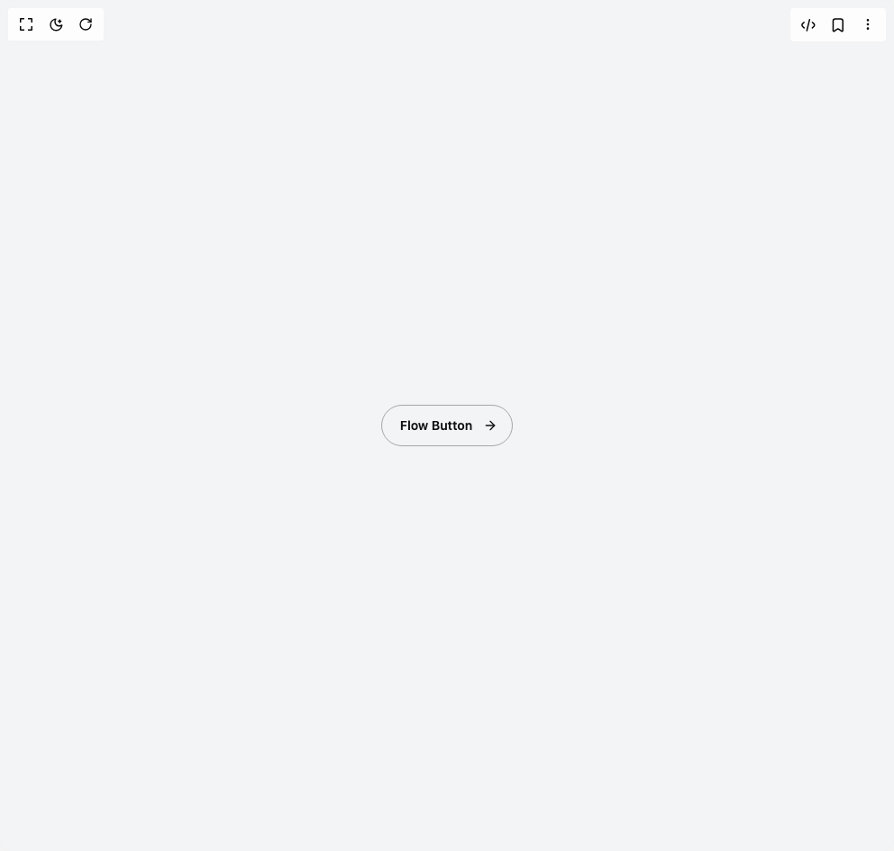

# Build Flow Button in BuilderStudio

> Build this component in our Agentic IDE: [BuilderStudio](https://builderstudio.dev).
>
> Join the BuilderStudio community on [Discord](https://discord.gg/QdWeSGCqfe) and [Reddit](https://reddit.com/r/builderstudio).



## Component

- Author group: `kain0127`
- Component: `flow-button`
- Variant: `default`
- Rendered HTML snapshot: [`rendered.html`](rendered.html)

## BuilderStudio prompt

You are implementing a React component based on a component reference.

## Component identity

- Author: Kain0127
- Component slug: flow-button
- Demo slug: default
- Title: flow-button
- Description: 

## Goal

Recreate this component in a React + TypeScript + Tailwind CSS project. Preserve the visual layout, spacing, colors, border radius, shadows, interaction behavior, animation behavior, responsive behavior, and dark mode behavior shown in the rendered demo.

## Implementation requirements

- Use React and TypeScript.
- Use Tailwind CSS classes whenever possible.
- Keep the component self-contained unless the source files require helper components.
- If the source uses CSS variables, custom CSS, animations, or keyframes, include them.
- If the source uses external packages, list and use the required packages.
- Preserve accessibility attributes, button semantics, links, keyboard behavior, and ARIA attributes when visible in the source.
- Do not replace the component with a simplified placeholder.
- Return complete production-ready code.

## Dependencies

No reference metadata available.

## Rendered DOM snapshot

This is the rendered demo HTML extracted from the live preview. Use it to verify structure, class names, visible content, and layout.

```html
<div id="root"><div class="flex min-h-screen items-center justify-center bg-gray-100 p-4"><button class="group relative flex items-center gap-1 overflow-hidden rounded-[100px] border-[1.5px] border-[#333333]/40 bg-transparent px-8 py-3 text-sm font-semibold text-[#111111] cursor-pointer transition-all duration-[600ms] ease-[cubic-bezier(0.23,1,0.32,1)] hover:border-transparent hover:text-white hover:rounded-[12px] active:scale-[0.95]"><svg xmlns="http://www.w3.org/2000/svg" width="24" height="24" viewBox="0 0 24 24" fill="none" stroke="currentColor" stroke-width="2" stroke-linecap="round" stroke-linejoin="round" class="lucide lucide-arrow-right absolute w-4 h-4 left-[-25%] stroke-[#111111] fill-none z-[9] group-hover:left-4 group-hover:stroke-white transition-all duration-[800ms] ease-[cubic-bezier(0.34,1.56,0.64,1)]" aria-hidden="true"><path d="M5 12h14"></path><path d="m12 5 7 7-7 7"></path></svg><span class="relative z-[1] -translate-x-3 group-hover:translate-x-3 transition-all duration-[800ms] ease-out">Flow Button</span><span class="absolute top-1/2 left-1/2 -translate-x-1/2 -translate-y-1/2 w-4 h-4 bg-[#111111] rounded-[50%] opacity-0 group-hover:w-[220px] group-hover:h-[220px] group-hover:opacity-100 transition-all duration-[800ms] ease-[cubic-bezier(0.19,1,0.22,1)]"></span><svg xmlns="http://www.w3.org/2000/svg" width="24" height="24" viewBox="0 0 24 24" fill="none" stroke="currentColor" stroke-width="2" stroke-linecap="round" stroke-linejoin="round" class="lucide lucide-arrow-right absolute w-4 h-4 right-4 stroke-[#111111] fill-none z-[9] group-hover:right-[-25%] group-hover:stroke-white transition-all duration-[800ms] ease-[cubic-bezier(0.34,1.56,0.64,1)]" aria-hidden="true"><path d="M5 12h14"></path><path d="m12 5 7 7-7 7"></path></svg></button></div></div>
```

## Reference source files

No reference source files were available.
