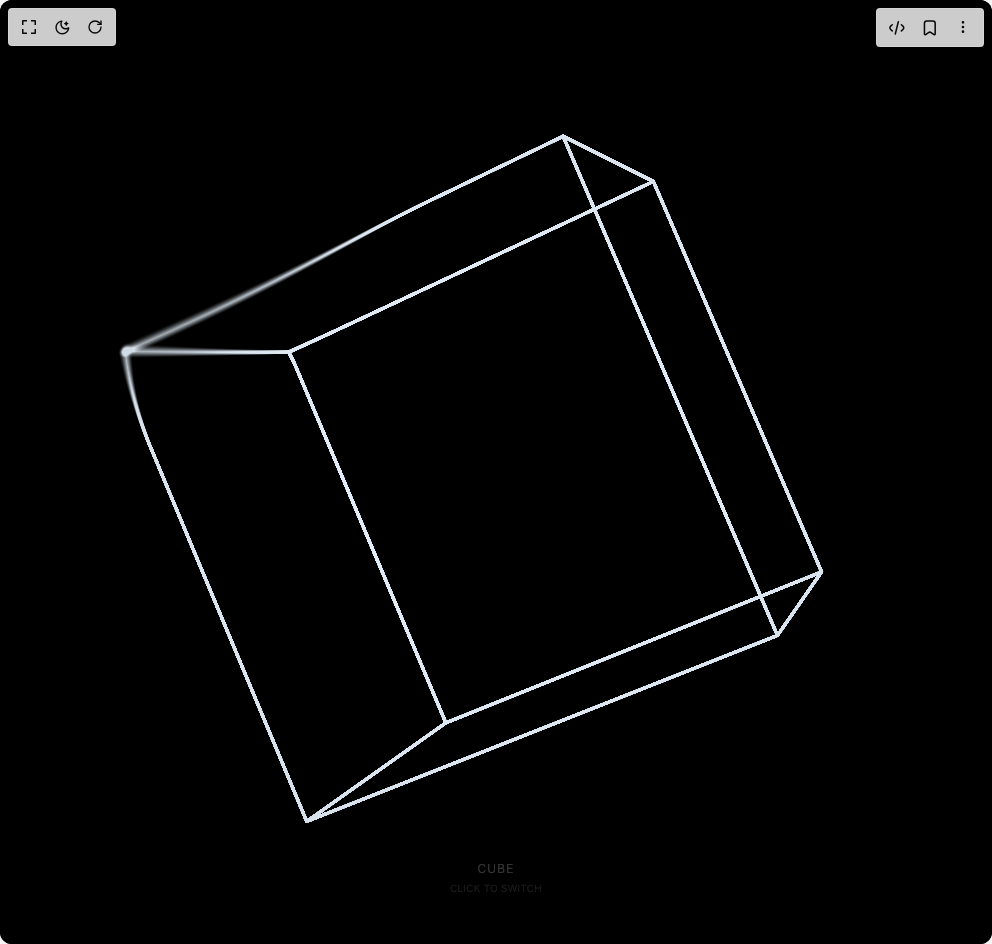

# Build Geometric Blur Mesh in BuilderStudio

> Build this component in our Agentic IDE: [BuilderStudio](https://builderstudio.dev).
>
> Join the BuilderStudio community on [Discord](https://discord.gg/QdWeSGCqfe) and [Reddit](https://reddit.com/r/builderstudio).



## Component

- Author group: `kain0127`
- Component: `geometric-blur-mesh`
- Variant: `default`
- Rendered HTML snapshot: [`rendered.html`](rendered.html)

## BuilderStudio prompt

You are implementing a React component based on a component reference.

## Component identity

- Author: Kain0127
- Component slug: geometric-blur-mesh
- Demo slug: default
- Title: geometric-blur-mesh
- Description: 

## Goal

Recreate this component in a React + TypeScript + Tailwind CSS project. Preserve the visual layout, spacing, colors, border radius, shadows, interaction behavior, animation behavior, responsive behavior, and dark mode behavior shown in the rendered demo.

## Implementation requirements

- Use React and TypeScript.
- Use Tailwind CSS classes whenever possible.
- Keep the component self-contained unless the source files require helper components.
- If the source uses CSS variables, custom CSS, animations, or keyframes, include them.
- If the source uses external packages, list and use the required packages.
- Preserve accessibility attributes, button semantics, links, keyboard behavior, and ARIA attributes when visible in the source.
- Do not replace the component with a simplified placeholder.
- Return complete production-ready code.

## Dependencies

No reference metadata available.

## Rendered DOM snapshot

This is the rendered demo HTML extracted from the live preview. Use it to verify structure, class names, visible content, and layout.

```html
<div id="root"><div class="w-screen min-h-screen flex justify-center items-center"><div class="w-screen min-h-screen flex justify-center items-center"><div class="relative w-full h-screen bg-black cursor-pointer overflow-hidden"><canvas class="w-full h-full" width="992" height="944" style="width: 992px; height: 944px;"></canvas><div class="absolute bottom-12 left-1/2 transform -translate-x-1/2 pointer-events-none text-center"><div class="text-white/20 text-xs font-light tracking-widest">CUBE</div><div class="text-white/10 text-[10px] font-light mt-1 tracking-wide">CLICK TO SWITCH</div></div></div></div></div></div>
```

## Reference source files

No reference source files were available.
