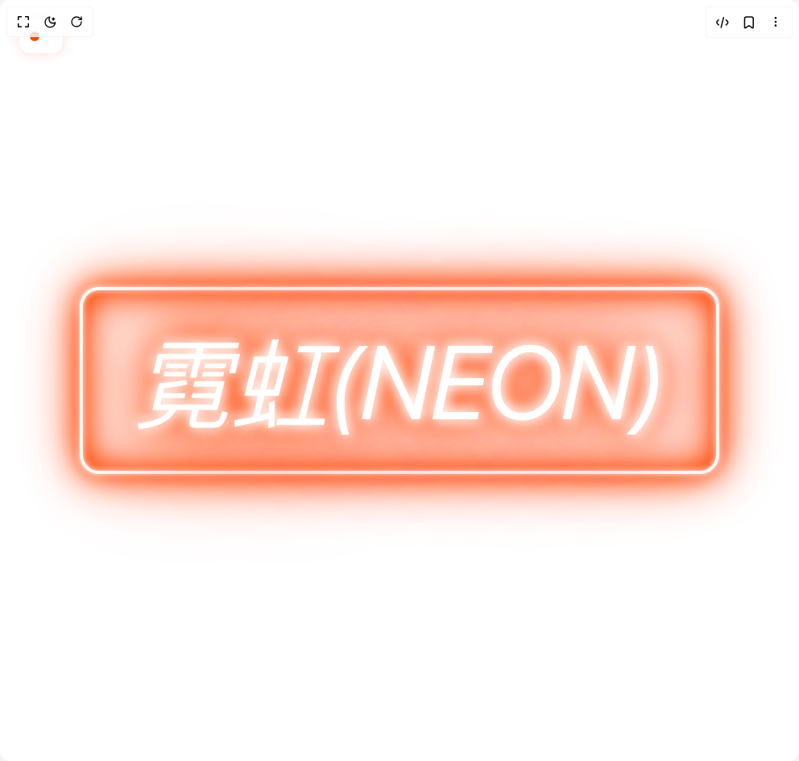

# Build Neon Lighting in BuilderStudio

> Build this component in our Agentic IDE: [BuilderStudio](https://builderstudio.dev).
>
> Join the BuilderStudio community on [Discord](https://discord.gg/QdWeSGCqfe) and [Reddit](https://reddit.com/r/builderstudio).



## Component

- Author group: `kain0127`
- Component: `neon-lighting`
- Variant: `default`
- Rendered HTML snapshot: [`rendered.html`](rendered.html)

## BuilderStudio prompt

You are implementing a React component based on a component reference.

## Component identity

- Author: Kain0127
- Component slug: neon-lighting
- Demo slug: default
- Title: neon-lighting
- Description: 

## Goal

Recreate this component in a React + TypeScript + Tailwind CSS project. Preserve the visual layout, spacing, colors, border radius, shadows, interaction behavior, animation behavior, responsive behavior, and dark mode behavior shown in the rendered demo.

## Implementation requirements

- Use React and TypeScript.
- Use Tailwind CSS classes whenever possible.
- Keep the component self-contained unless the source files require helper components.
- If the source uses CSS variables, custom CSS, animations, or keyframes, include them.
- If the source uses external packages, list and use the required packages.
- Preserve accessibility attributes, button semantics, links, keyboard behavior, and ARIA attributes when visible in the source.
- Do not replace the component with a simplified placeholder.
- Return complete production-ready code.

## Dependencies

No reference metadata available.

## Rendered DOM snapshot

This is the rendered demo HTML extracted from the live preview. Use it to verify structure, class names, visible content, and layout.

```html
<div id="root"><div class="w-screen min-h-screen flex justify-center items-center"><div class="w-screen min-h-screen flex justify-center items-center"><div class="fixed top-6 left-6 z-10 mb-6"><button class="bg-background/80 backdrop-blur-sm p-3 rounded-xl border border-white/20 hover:border-white/30 transition-all
  duration-200 mb-2" style="box-shadow: rgba(255, 69, 0, 0.19) 0px 0px 15px;"><div class="flex items-center gap-2"><div class="w-3 h-3 rounded-full" style="background-color: rgb(255, 69, 0);"></div><span class="text-white/80 text-xs font-light">+</span></div></button><div class="bg-background/80 backdrop-blur-sm rounded-2xl border border-white/20 transition-all duration-300 overflow-hidden p-0 opacity-0 max-h-0 w-0"><h3 class="text-white/90 text-xs font-light mb-3 tracking-wide">Gas Type</h3><div class="grid grid-cols-2 gap-1.5 mb-4">  <button class="px-3 py-1.5 text-xs rounded-lg border transition-all duration-200 text-left border-white/40 text-white bg-white/5" style="box-shadow: rgba(255, 69, 0, 0.25) 0px 0px 20px;"><span class="font-light truncate">Classic Neon</span></button><button class="px-3 py-1.5 text-xs rounded-lg border transition-all duration-200 text-left border-white/10 text-white/60 hover:border-white/20 hover:text-white/80 hover:bg-white/5"><span class="font-light truncate">Argon Blue</span></button><button class="px-3 py-1.5 text-xs rounded-lg border transition-all duration-200 text-left border-white/10 text-white/60 hover:border-white/20 hover:text-white/80 hover:bg-white/5"><span class="font-light truncate">Mercury Green</span></button><button class="px-3 py-1.5 text-xs rounded-lg border transition-all duration-200 text-left border-white/10 text-white/60 hover:border-white/20 hover:text-white/80 hover:bg-white/5"><span class="font-light truncate">Helium Yellow</span></button><button class="px-3 py-1.5 text-xs rounded-lg border transition-all duration-200 text-left border-white/10 text-white/60 hover:border-white/20 hover:text-white/80 hover:bg-white/5"><span class="font-light truncate">Krypton Purple</span></button><button class="px-3 py-1.5 text-xs rounded-lg border transition-all duration-200 text-left border-white/10 text-white/60 hover:border-white/20 hover:text-white/80 hover:bg-white/5"><span class="font-light truncate">Xenon Blue</span></button><button class="px-3 py-1.5 text-xs rounded-lg border transition-all duration-200 text-left border-white/10 text-white/60 hover:border-white/20 hover:text-white/80 hover:bg-white/5"><span class="font-light truncate">Hydrogen Red</span></button><button class="px-3 py-1.5 text-xs rounded-lg border transition-all duration-200 text-left border-white/10 text-white/60 hover:border-white/20 hover:text-white/80 hover:bg-white/5"><span class="font-light truncate">Phosphor Pink</span></button><button class="px-3 py-1.5 text-xs rounded-lg border transition-all duration-200 text-left border-white/10 text-white/60 hover:border-white/20 hover:text-white/80 hover:bg-white/5"><span class="font-light truncate">Phosphor Cyan</span></button><button class="px-3 py-1.5 text-xs rounded-lg border transition-all duration-200 text-left border-white/10 text-white/60 hover:border-white/20 hover:text-white/80 hover:bg-white/5"><span class="font-light truncate">Phosphor White</span></button><button class="px-3 py-1.5 text-xs rounded-lg border transition-all duration-200 text-left border-white/10 text-white/60 hover:border-white/20 hover:text-white/80 hover:bg-white/5"><span class="font-light truncate">Gradient Neon</span></button><button class="px-3 py-1.5 text-xs rounded-lg border transition-all duration-200 text-left border-white/10 text-white/60 hover:border-white/20 hover:text-white/80 hover:bg-white/5"><span class="font-light truncate">Dual Color</span></button><button class="px-3 py-1.5 text-xs rounded-lg border transition-all duration-200 text-left border-white/10 text-white/60 hover:border-white/20 hover:text-white/80 hover:bg-white/5"><span class="font-light truncate">Rainbow</span></button></div><div class="space-y-3 pt-3 border-t border-white/20"><div class="flex items-center justify-between"><label class="text-white/90 text-sm font-light tracking-wide">Intensity</label><span class="text-white/70 text-sm font-mono bg-white/10 px-2 py-1 rounded">1.0</span></div><input min="0.3" max="2" step="0.1" class="w-full h-2 bg-white/20 rounded-lg appearance-none cursor-pointer slider mb-2" type="range" value="1" style="background: linear-gradient(to right, rgb(255, 69, 0) 0%, rgb(255, 69, 0) 41.1765%, rgba(255, 255, 255, 0.2) 41.1765%, rgba(255, 255, 255, 0.2) 100%);"></div></div></div><div class="min-h-screen bg-background flex items-center justify-center font-mono" style="--neon-text-color: #ff4500; --neon-border-color: #ff4500; --neon-intensity: 1;"><h1 contenteditable="true" spellcheck="false" class="neon-text text-white text-8xl md:text-9xl font-light italic uppercase px-16 py-12 border-4 border-white rounded-3xl 
  focus:outline-none select-all" style="animation: 1.5s ease 0s infinite alternate none running flicker;">霓虹(NEON)</h1></div></div></div></div>
```

## Reference source files

No reference source files were available.
