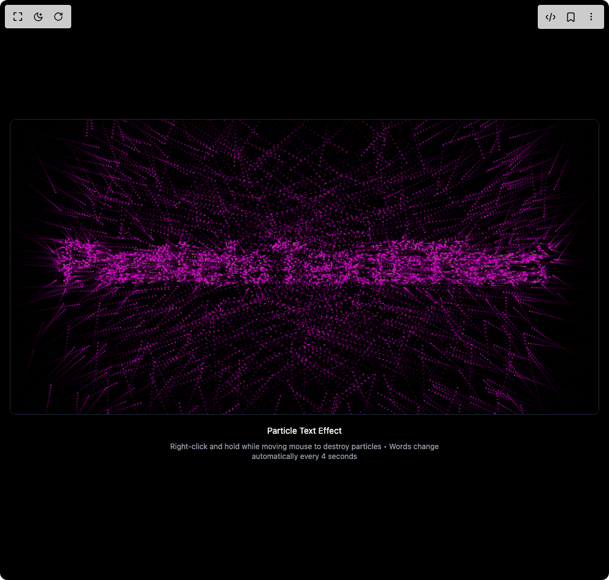

# Build Particle Text Effect in BuilderStudio

> Build this component in our Agentic IDE: [BuilderStudio](https://builderstudio.dev).
>
> Join the BuilderStudio community on [Discord](https://discord.gg/QdWeSGCqfe) and [Reddit](https://reddit.com/r/builderstudio).



## Component

- Author group: `kain0127`
- Component: `particle-text-effect`
- Variant: `default`
- Rendered HTML snapshot: [`rendered.html`](rendered.html)

## BuilderStudio prompt

You are implementing a React component based on a component reference.

## Component identity

- Author: Kain0127
- Component slug: particle-text-effect
- Demo slug: default
- Title: particle-text-effect
- Description: 

## Goal

Recreate this component in a React + TypeScript + Tailwind CSS project. Preserve the visual layout, spacing, colors, border radius, shadows, interaction behavior, animation behavior, responsive behavior, and dark mode behavior shown in the rendered demo.

## Implementation requirements

- Use React and TypeScript.
- Use Tailwind CSS classes whenever possible.
- Keep the component self-contained unless the source files require helper components.
- If the source uses CSS variables, custom CSS, animations, or keyframes, include them.
- If the source uses external packages, list and use the required packages.
- Preserve accessibility attributes, button semantics, links, keyboard behavior, and ARIA attributes when visible in the source.
- Do not replace the component with a simplified placeholder.
- Return complete production-ready code.

## Dependencies

No reference metadata available.

## Rendered DOM snapshot

This is the rendered demo HTML extracted from the live preview. Use it to verify structure, class names, visible content, and layout.

```html
<div id="root"><div class="w-screen min-h-screen flex justify-center items-center"><div class="w-screen min-h-screen flex justify-center items-center"><div class="flex flex-col items-center justify-center min-h-screen bg-black p-4"><canvas class="border border-gray-800 rounded-lg shadow-2xl" width="1000" height="500" style="max-width: 100%; height: auto;"></canvas><div class="mt-4 text-white text-sm text-center max-w-md"><p class="mb-2">Particle Text Effect</p><p class="text-gray-400 text-xs">Right-click and hold while moving mouse to destroy particles • Words change automatically every 4 seconds</p></div></div></div></div></div>
```

## Reference source files

No reference source files were available.
