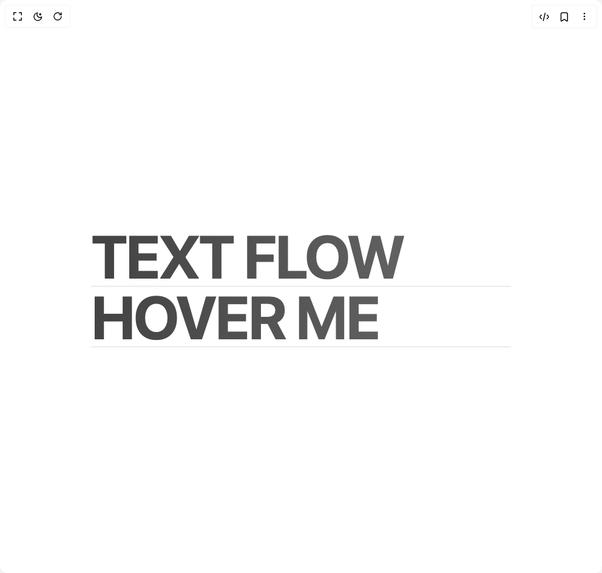

# Build Text Glitch Effect in BuilderStudio

> Build this component in our Agentic IDE: [BuilderStudio](https://builderstudio.dev).
>
> Join the BuilderStudio community on [Discord](https://discord.gg/QdWeSGCqfe) and [Reddit](https://reddit.com/r/builderstudio).



## Component

- Author group: `kain0127`
- Component: `text-glitch-effect`
- Variant: `default`
- Rendered HTML snapshot: [`rendered.html`](rendered.html)

## BuilderStudio prompt

You are implementing a React component based on a component reference.

## Component identity

- Author: Kain0127
- Component slug: text-glitch-effect
- Demo slug: default
- Title: text-glitch-effect
- Description: 

## Goal

Recreate this component in a React + TypeScript + Tailwind CSS project. Preserve the visual layout, spacing, colors, border radius, shadows, interaction behavior, animation behavior, responsive behavior, and dark mode behavior shown in the rendered demo.

## Implementation requirements

- Use React and TypeScript.
- Use Tailwind CSS classes whenever possible.
- Keep the component self-contained unless the source files require helper components.
- If the source uses CSS variables, custom CSS, animations, or keyframes, include them.
- If the source uses external packages, list and use the required packages.
- Preserve accessibility attributes, button semantics, links, keyboard behavior, and ARIA attributes when visible in the source.
- Do not replace the component with a simplified placeholder.
- Return complete production-ready code.

## Dependencies

No reference metadata available.

## Rendered DOM snapshot

This is the rendered demo HTML extracted from the live preview. Use it to verify structure, class names, visible content, and layout.

```html
<div id="root"><div class="w-screen min-h-screen flex justify-center items-center"><div class="w-screen min-h-screen flex justify-center items-center"><main class="h-screen overflow-hidden"><div class="container"><h1 class="
        text-[10vw] font-bold leading-none tracking-tight m-0 
        text-neutral-600/20
        bg-gradient-to-r from-neutral-700 to-neutral-500 bg-clip-text bg-no-repeat
        border-b border-neutral-600/20
        flex flex-col items-start justify-center relative
        transition-all duration-500 ease-out
        cursor-pointer
        overflow-hidden
        
      " style="background-size: 100%; background-clip: text; width: 100%; max-width: 100vw; word-break: break-word; white-space: nowrap; translate: none; rotate: none; scale: none; opacity: 1; transform: translate(0px, 0px);">TEXT FLOW<span class="
          absolute w-full h-full 
          text-black font-bold
          flex flex-col justify-center
          transition-all duration-400 ease-out
          pointer-events-none
          overflow-hidden
        " style="clip-path: polygon(0px 50%, 100% 50%, 100% 50%, 0px 50%); transform-origin: center center; background-color: rgb(255, 255, 2); max-width: 100%; white-space: nowrap;">DYNAMIC TEXT</span></h1><h1 class="
        text-[10vw] font-bold leading-none tracking-tight m-0 
        text-neutral-600/20
        bg-gradient-to-r from-neutral-700 to-neutral-500 bg-clip-text bg-no-repeat
        border-b border-neutral-600/20
        flex flex-col items-start justify-center relative
        transition-all duration-500 ease-out
        cursor-pointer
        overflow-hidden
        
      " style="background-size: 100%; background-clip: text; width: 100%; max-width: 100vw; word-break: break-word; white-space: nowrap; translate: none; rotate: none; scale: none; opacity: 1; transform: translate(0px, 0px);">HOVER ME<span class="
          absolute w-full h-full 
          text-black font-bold
          flex flex-col justify-center
          transition-all duration-400 ease-out
          pointer-events-none
          overflow-hidden
        " style="clip-path: polygon(0px 50%, 100% 50%, 100% 50%, 0px 50%); transform-origin: center center; background-color: rgb(255, 255, 2); max-width: 100%; white-space: nowrap;"><a href="https://lab.xubh.top/" target="_blank" rel="noreferrer" class="no-underline text-inherit">FIND ME</a></span></h1></div></main></div></div></div>
```

## Reference source files

No reference source files were available.
