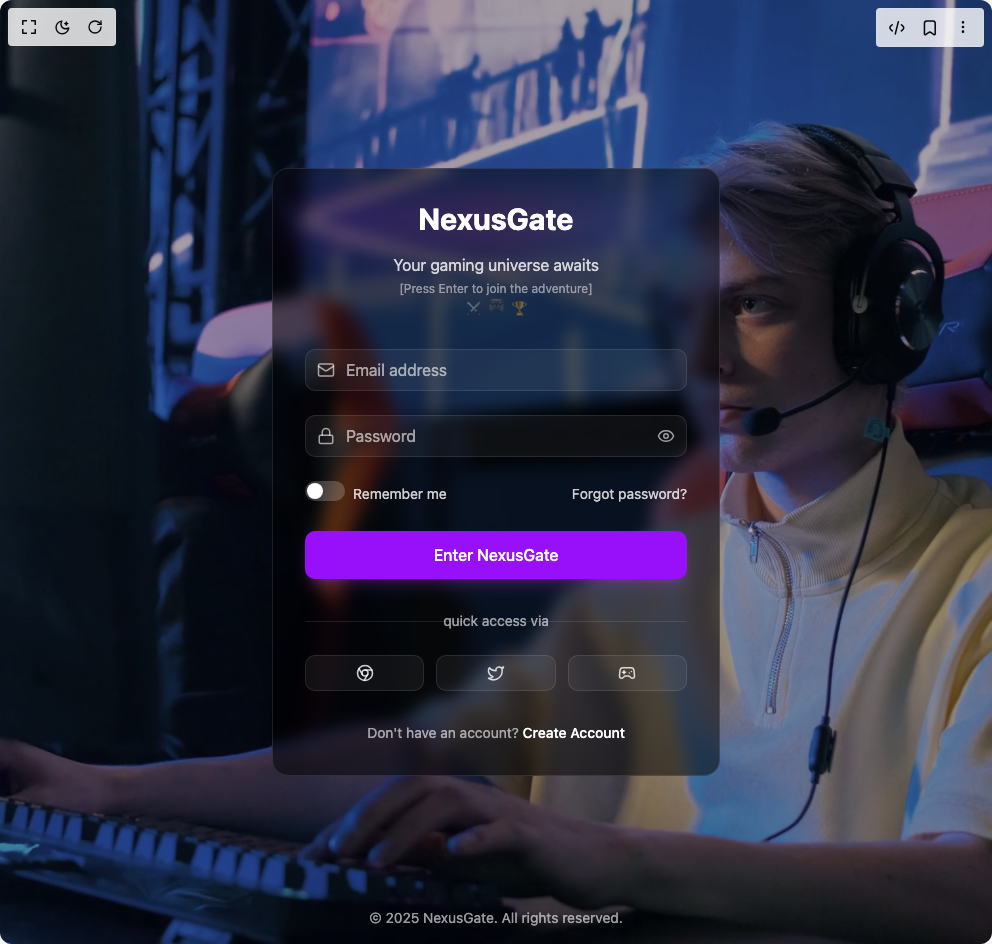

# Build Gaming Login in BuilderStudio

> Build this component in our Agentic IDE: [BuilderStudio](https://builderstudio.dev).
>
> Join the BuilderStudio community on [Discord](https://discord.gg/QdWeSGCqfe) and [Reddit](https://reddit.com/r/builderstudio).



## Component

- Author group: `kamalesh`
- Component: `gaming-login`
- Variant: `default`
- Rendered HTML snapshot: [`rendered.html`](rendered.html)

## BuilderStudio prompt

You are implementing a React component based on a component reference.

## Component identity

- Author: Kamalesh
- Component slug: gaming-login
- Demo slug: default
- Title: gaming-login
- Description: 

## Goal

Recreate this component in a React + TypeScript + Tailwind CSS project. Preserve the visual layout, spacing, colors, border radius, shadows, interaction behavior, animation behavior, responsive behavior, and dark mode behavior shown in the rendered demo.

## Implementation requirements

- Use React and TypeScript.
- Use Tailwind CSS classes whenever possible.
- Keep the component self-contained unless the source files require helper components.
- If the source uses CSS variables, custom CSS, animations, or keyframes, include them.
- If the source uses external packages, list and use the required packages.
- Preserve accessibility attributes, button semantics, links, keyboard behavior, and ARIA attributes when visible in the source.
- Do not replace the component with a simplified placeholder.
- Return complete production-ready code.

## Dependencies

No reference metadata available.

## Rendered DOM snapshot

This is the rendered demo HTML extracted from the live preview. Use it to verify structure, class names, visible content, and layout.

```html
<div id="root"><div class="relative min-h-screen w-full flex items-center justify-center px-4 py-12"><div class="absolute inset-0 w-full h-full overflow-hidden"><div class="absolute inset-0 bg-black/30 z-10"></div><video class="absolute inset-0 min-w-full min-h-full object-cover w-auto h-auto" autoplay="" loop="" playsinline=""><source src="https://videos.pexels.com/video-files/8128311/8128311-uhd_2560_1440_25fps.mp4" type="video/mp4">Your browser does not support the video tag.</video></div><div class="relative z-20 w-full max-w-md animate-fadeIn"><div class="p-8 rounded-2xl backdrop-blur-sm bg-black/50 border border-white/10"><div class="mb-8 text-center"><h2 class="text-3xl font-bold mb-2 relative group"><span class="absolute -inset-1 bg-gradient-to-r from-purple-600/30 via-pink-500/30 to-blue-500/30 blur-xl opacity-75 group-hover:opacity-100 transition-all duration-500 animate-pulse"></span><span class="relative inline-block text-3xl font-bold mb-2 text-white">NexusGate</span><span class="absolute -inset-0.5 bg-gradient-to-r from-purple-500/20 to-pink-500/20 blur-sm opacity-0 group-hover:opacity-100 transition-all duration-300"></span></h2><p class="text-white/80 flex flex-col items-center space-y-1"><span class="relative group cursor-default"><span class="absolute -inset-1 bg-gradient-to-r from-purple-600/20 to-pink-600/20 blur-sm opacity-0 group-hover:opacity-100 transition-opacity duration-500"></span><span class="relative inline-block animate-pulse">Your gaming universe awaits</span></span><span class="text-xs text-white/50 animate-pulse">[Press Enter to join the adventure]</span><div class="flex space-x-2 text-xs text-white/40"><span class="animate-pulse">⚔️</span><span class="animate-bounce">🎮</span><span class="animate-pulse">🏆</span></div></p></div><form class="space-y-6"><div class="relative"><div class="absolute left-3 top-1/2 -translate-y-1/2"><svg xmlns="http://www.w3.org/2000/svg" width="18" height="18" viewBox="0 0 24 24" fill="none" stroke="currentColor" stroke-width="2" stroke-linecap="round" stroke-linejoin="round" class="lucide lucide-mail text-white/60" aria-hidden="true"><rect width="20" height="16" x="2" y="4" rx="2"></rect><path d="m22 7-8.97 5.7a1.94 1.94 0 0 1-2.06 0L2 7"></path></svg></div><input placeholder="Email address" required="" class="w-full pl-10 pr-3 py-2 bg-white/5 border border-white/10 rounded-lg text-white placeholder-white/60 focus:outline-none focus:border-purple-500/50 transition-colors" type="email" value=""></div><div class="relative"><div class="relative"><div class="absolute left-3 top-1/2 -translate-y-1/2"><svg xmlns="http://www.w3.org/2000/svg" width="18" height="18" viewBox="0 0 24 24" fill="none" stroke="currentColor" stroke-width="2" stroke-linecap="round" stroke-linejoin="round" class="lucide lucide-lock text-white/60" aria-hidden="true"><rect width="18" height="11" x="3" y="11" rx="2" ry="2"></rect><path d="M7 11V7a5 5 0 0 1 10 0v4"></path></svg></div><input placeholder="Password" required="" class="w-full pl-10 pr-3 py-2 bg-white/5 border border-white/10 rounded-lg text-white placeholder-white/60 focus:outline-none focus:border-purple-500/50 transition-colors" type="password" value=""></div><button type="button" class="absolute right-3 top-1/2 -translate-y-1/2 text-white/60 hover:text-white focus:outline-none transition-colors" aria-label="Show password"><svg xmlns="http://www.w3.org/2000/svg" width="18" height="18" viewBox="0 0 24 24" fill="none" stroke="currentColor" stroke-width="2" stroke-linecap="round" stroke-linejoin="round" class="lucide lucide-eye" aria-hidden="true"><path d="M2.062 12.348a1 1 0 0 1 0-.696 10.75 10.75 0 0 1 19.876 0 1 1 0 0 1 0 .696 10.75 10.75 0 0 1-19.876 0"></path><circle cx="12" cy="12" r="3"></circle></svg></button></div><div class="flex items-center justify-between"><div class="flex items-center space-x-2"><div class="cursor-pointer"><div class="relative inline-block w-10 h-5 cursor-pointer"><input id="remember-me" class="sr-only" type="checkbox"><div class="absolute inset-0 rounded-full transition-colors duration-200 ease-in-out bg-white/20"><div class="absolute left-0.5 top-0.5 w-4 h-4 rounded-full bg-white transition-transform duration-200 ease-in-out "></div></div></div></div><label for="remember-me" class="text-sm text-white/80 cursor-pointer hover:text-white transition-colors">Remember me</label></div><a href="#" class="text-sm text-white/80 hover:text-white transition-colors">Forgot password?</a></div><button type="submit" class="w-full py-3 rounded-lg bg-purple-600 hover:bg-purple-700 text-white font-medium transition-all duration-200 ease-in-out transform hover:-translate-y-1 focus:outline-none focus:ring-2 focus:ring-purple-500 focus:ring-opacity-50 disabled:opacity-70 disabled:cursor-not-allowed disabled:transform-none shadow-lg shadow-purple-500/20 hover:shadow-purple-500/40">Enter NexusGate</button></form><div class="mt-8"><div class="relative flex items-center justify-center"><div class="border-t border-white/10 absolute w-full"></div><div class="bg-transparent px-4 relative text-white/60 text-sm">quick access via</div></div><div class="mt-6 grid grid-cols-3 gap-3"><button class="flex items-center justify-center p-2 bg-white/5 border border-white/10 rounded-lg text-white/80 hover:bg-white/10 hover:text-white transition-colors"><svg xmlns="http://www.w3.org/2000/svg" width="18" height="18" viewBox="0 0 24 24" fill="none" stroke="currentColor" stroke-width="2" stroke-linecap="round" stroke-linejoin="round" class="lucide lucide-chrome" aria-hidden="true"><circle cx="12" cy="12" r="10"></circle><circle cx="12" cy="12" r="4"></circle><line x1="21.17" x2="12" y1="8" y2="8"></line><line x1="3.95" x2="8.54" y1="6.06" y2="14"></line><line x1="10.88" x2="15.46" y1="21.94" y2="14"></line></svg></button><button class="flex items-center justify-center p-2 bg-white/5 border border-white/10 rounded-lg text-white/80 hover:bg-white/10 hover:text-white transition-colors"><svg xmlns="http://www.w3.org/2000/svg" width="18" height="18" viewBox="0 0 24 24" fill="none" stroke="currentColor" stroke-width="2" stroke-linecap="round" stroke-linejoin="round" class="lucide lucide-twitter" aria-hidden="true"><path d="M22 4s-.7 2.1-2 3.4c1.6 10-9.4 17.3-18 11.6 2.2.1 4.4-.6 6-2C3 15.5.5 9.6 3 5c2.2 2.6 5.6 4.1 9 4-.9-4.2 4-6.6 7-3.8 1.1 0 3-1.2 3-1.2z"></path></svg></button><button class="flex items-center justify-center p-2 bg-white/5 border border-white/10 rounded-lg text-white/80 hover:bg-white/10 hover:text-white transition-colors"><svg xmlns="http://www.w3.org/2000/svg" width="18" height="18" viewBox="0 0 24 24" fill="none" stroke="currentColor" stroke-width="2" stroke-linecap="round" stroke-linejoin="round" class="lucide lucide-gamepad2 lucide-gamepad-2" aria-hidden="true"><line x1="6" x2="10" y1="11" y2="11"></line><line x1="8" x2="8" y1="9" y2="13"></line><line x1="15" x2="15.01" y1="12" y2="12"></line><line x1="18" x2="18.01" y1="10" y2="10"></line><path d="M17.32 5H6.68a4 4 0 0 0-3.978 3.59c-.006.052-.01.101-.017.152C2.604 9.416 2 14.456 2 16a3 3 0 0 0 3 3c1 0 1.5-.5 2-1l1.414-1.414A2 2 0 0 1 9.828 16h4.344a2 2 0 0 1 1.414.586L17 18c.5.5 1 1 2 1a3 3 0 0 0 3-3c0-1.545-.604-6.584-.685-7.258-.007-.05-.011-.1-.017-.151A4 4 0 0 0 17.32 5z"></path></svg></button></div></div><p class="mt-8 text-center text-sm text-white/60">Don't have an account? <a href="#" class="font-medium text-white hover:text-purple-300 transition-colors">Create Account</a></p></div></div><footer class="absolute bottom-4 left-0 right-0 text-center text-white/60 text-sm z-20">© 2025 NexusGate. All rights reserved.</footer></div></div>
```

## Reference source files

No reference source files were available.
