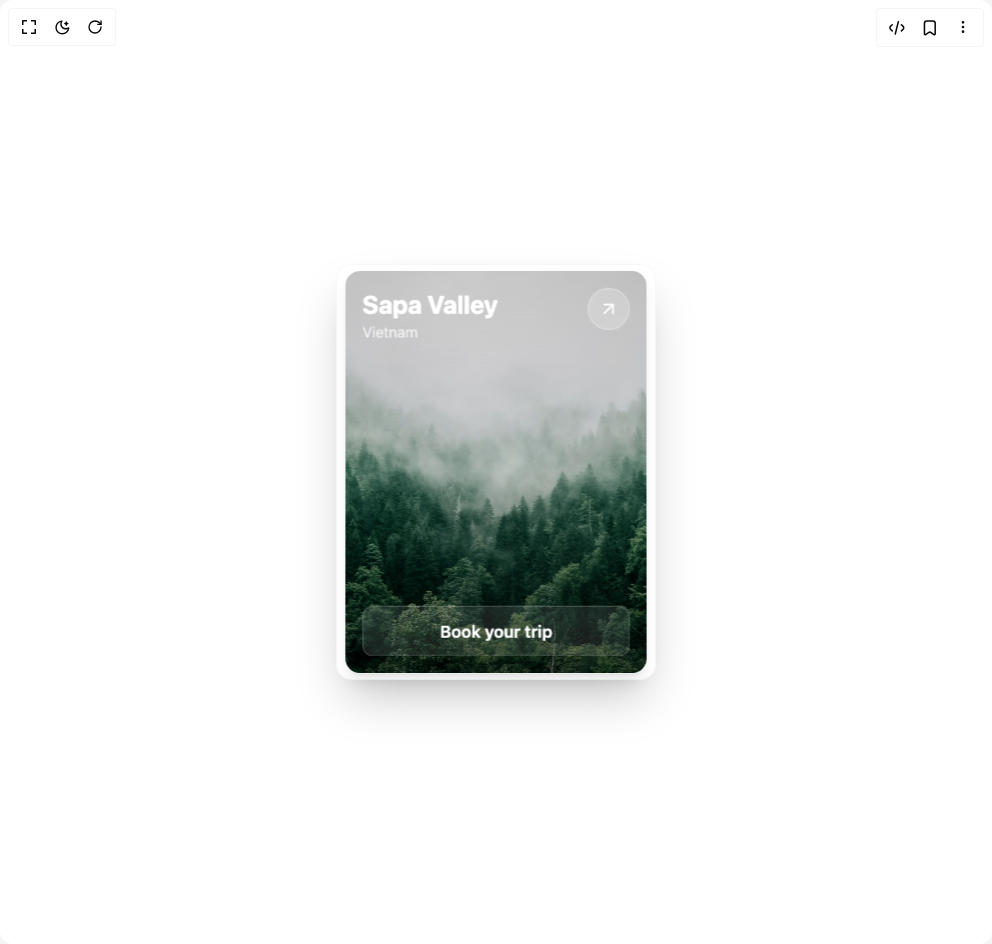

# Build 3d Card in BuilderStudio

> Build this component in our Agentic IDE: [BuilderStudio](https://builderstudio.dev).
>
> Join the BuilderStudio community on [Discord](https://discord.gg/QdWeSGCqfe) and [Reddit](https://reddit.com/r/builderstudio).



## Component

- Author group: `kavikatiyar`
- Component: `3d-card`
- Variant: `default`
- Rendered HTML snapshot: [`rendered.html`](rendered.html)

## BuilderStudio prompt

You are implementing a React component based on a component reference.

## Component identity

- Author: kavikatiyar
- Component slug: 3d-card
- Demo slug: default
- Title: 3d-card
- Description: 

## Goal

Recreate this component in a React + TypeScript + Tailwind CSS project. Preserve the visual layout, spacing, colors, border radius, shadows, interaction behavior, animation behavior, responsive behavior, and dark mode behavior shown in the rendered demo.

## Implementation requirements

- Use React and TypeScript.
- Use Tailwind CSS classes whenever possible.
- Keep the component self-contained unless the source files require helper components.
- If the source uses CSS variables, custom CSS, animations, or keyframes, include them.
- If the source uses external packages, list and use the required packages.
- Preserve accessibility attributes, button semantics, links, keyboard behavior, and ARIA attributes when visible in the source.
- Do not replace the component with a simplified placeholder.
- Return complete production-ready code.

## Dependencies

No reference metadata available.

## Rendered DOM snapshot

This is the rendered demo HTML extracted from the live preview. Use it to verify structure, class names, visible content, and layout.

```html
<div id="root"><div class="w-screen min-h-screen flex justify-center items-center"><div class="w-screen min-h-screen flex justify-center items-center"><div class="flex min-h-[30rem] w-full items-center justify-center bg-background p-8"><div style="perspective: 1000px;"><div class="relative h-[26rem] w-80 rounded-2xl bg-transparent shadow-2xl border border-border/30" style="transform-style: preserve-3d; transform: none;"><div class="absolute inset-4 grid h-[calc(100%-2rem)] w-[calc(100%-2rem)] grid-rows-[1fr_auto] rounded-xl shadow-lg" style="transform: translateZ(50px); transform-style: preserve-3d;"><div class="absolute inset-0 h-full w-full rounded-xl bg-gradient-to-b from-black/20 via-transparent to-black/60"></div><div class="relative flex flex-col justify-between rounded-xl p-4 text-white"><div class="flex items-start justify-between"><div><h2 class="text-2xl font-bold" style="transform: translateZ(50px);">Sapa Valley</h2><p class="text-sm font-light text-white/80" style="transform: translateZ(40px);">Vietnam</p></div><a href="https://en.wikipedia.org/wiki/Sa_Pa" target="_blank" rel="noopener noreferrer" aria-label="Learn more about Sapa Valley" class="flex h-10 w-10 items-center justify-center rounded-full bg-white/20 backdrop-blur-sm ring-1 ring-inset ring-white/30 transition-colors hover:bg-white/30" tabindex="0" style="transform: translateZ(60px);"><svg xmlns="http://www.w3.org/2000/svg" width="24" height="24" viewBox="0 0 24 24" fill="none" stroke="currentColor" stroke-width="2" stroke-linecap="round" stroke-linejoin="round" class="lucide lucide-arrow-up-right h-5 w-5 text-white" aria-hidden="true"><path d="M7 7h10v10"></path><path d="M7 17 17 7"></path></svg></a></div><button class="w-full rounded-lg py-3 text-center font-semibold text-white transition-colors bg-white/10 backdrop-blur-md ring-1 ring-inset ring-white/20 hover:bg-white/20" tabindex="0" style="transform: translateZ(40px);">Book your trip</button></div></div></div></div></div></div></div></div>
```

## Reference source files

No reference source files were available.
