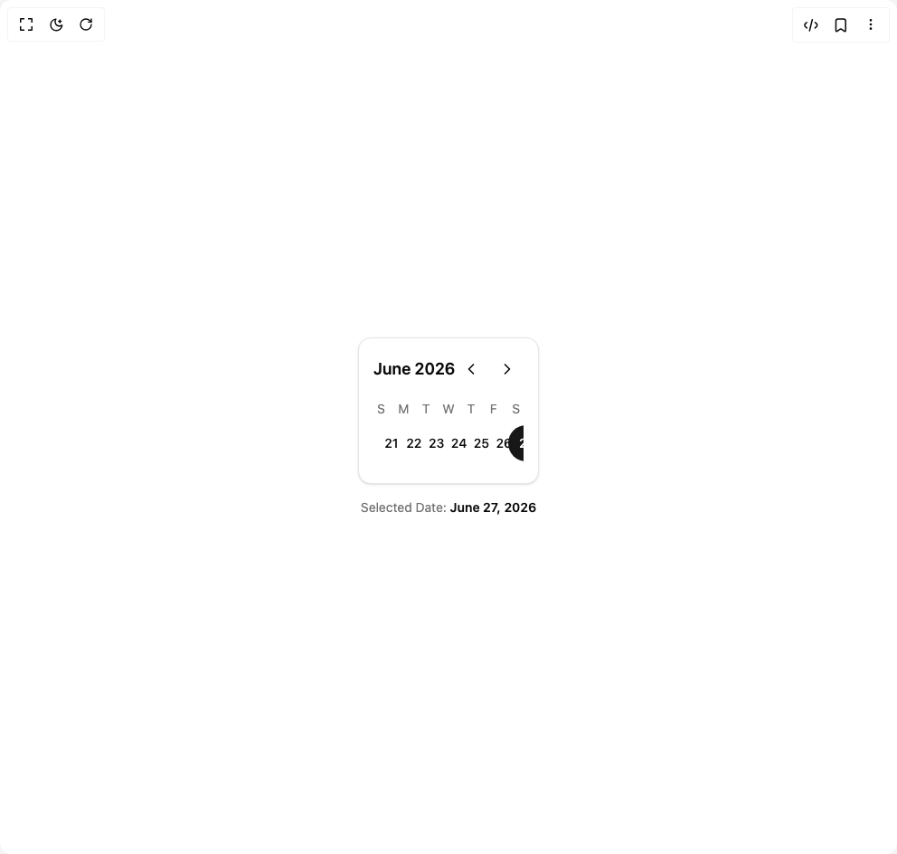

# Build Date Picker in BuilderStudio

> Build this component in our Agentic IDE: [BuilderStudio](https://builderstudio.dev).
>
> Join the BuilderStudio community on [Discord](https://discord.gg/QdWeSGCqfe) and [Reddit](https://reddit.com/r/builderstudio).



## Component

- Author group: `kavikatiyar`
- Component: `date-picker`
- Variant: `default`
- Rendered HTML snapshot: [`rendered.html`](rendered.html)

## BuilderStudio prompt

You are implementing a React component based on a component reference.

## Component identity

- Author: kavikatiyar
- Component slug: date-picker
- Demo slug: default
- Title: date-picker
- Description: 

## Goal

Recreate this component in a React + TypeScript + Tailwind CSS project. Preserve the visual layout, spacing, colors, border radius, shadows, interaction behavior, animation behavior, responsive behavior, and dark mode behavior shown in the rendered demo.

## Implementation requirements

- Use React and TypeScript.
- Use Tailwind CSS classes whenever possible.
- Keep the component self-contained unless the source files require helper components.
- If the source uses CSS variables, custom CSS, animations, or keyframes, include them.
- If the source uses external packages, list and use the required packages.
- Preserve accessibility attributes, button semantics, links, keyboard behavior, and ARIA attributes when visible in the source.
- Do not replace the component with a simplified placeholder.
- Return complete production-ready code.

## Dependencies

No reference metadata available.

## Rendered DOM snapshot

This is the rendered demo HTML extracted from the live preview. Use it to verify structure, class names, visible content, and layout.

```html
<div id="root"><div class="w-screen min-h-screen flex justify-center items-center"><div class="w-screen min-h-screen flex justify-center items-center"><div class="flex flex-col items-center justify-center space-y-4 p-4 min-h-[400px]"><div class="w-full max-w-sm rounded-xl border bg-card p-4 text-card-foreground shadow-sm"><div class="flex items-center justify-between mb-4"><p class="font-semibold text-lg">June 2026</p><div class="flex items-center space-x-1"><button class="inline-flex items-center justify-center whitespace-nowrap rounded-lg text-sm font-medium transition-colors outline-offset-2 focus-visible:outline-2 focus-visible:outline-ring/70 disabled:pointer-events-none disabled:opacity-50 [&amp;_svg]:pointer-events-none [&amp;_svg]:shrink-0 hover:bg-accent hover:text-accent-foreground h-9 w-9" aria-label="Previous week"><svg xmlns="http://www.w3.org/2000/svg" width="24" height="24" viewBox="0 0 24 24" fill="none" stroke="currentColor" stroke-width="2" stroke-linecap="round" stroke-linejoin="round" class="lucide lucide-chevron-left h-5 w-5" aria-hidden="true"><path d="m15 18-6-6 6-6"></path></svg></button><button class="inline-flex items-center justify-center whitespace-nowrap rounded-lg text-sm font-medium transition-colors outline-offset-2 focus-visible:outline-2 focus-visible:outline-ring/70 disabled:pointer-events-none disabled:opacity-50 [&amp;_svg]:pointer-events-none [&amp;_svg]:shrink-0 hover:bg-accent hover:text-accent-foreground h-9 w-9" aria-label="Next week"><svg xmlns="http://www.w3.org/2000/svg" width="24" height="24" viewBox="0 0 24 24" fill="none" stroke="currentColor" stroke-width="2" stroke-linecap="round" stroke-linejoin="round" class="lucide lucide-chevron-right h-5 w-5" aria-hidden="true"><path d="m9 18 6-6-6-6"></path></svg></button></div></div><div class="relative overflow-hidden h-[76px]"><div class="grid grid-cols-7 gap-2 absolute w-full" style="opacity: 1; transform: none;"><div class="text-center text-sm text-muted-foreground">S</div><div class="text-center text-sm text-muted-foreground">M</div><div class="text-center text-sm text-muted-foreground">T</div><div class="text-center text-sm text-muted-foreground">W</div><div class="text-center text-sm text-muted-foreground">T</div><div class="text-center text-sm text-muted-foreground">F</div><div class="text-center text-sm text-muted-foreground">S</div><button class="flex items-center justify-center h-10 w-10 rounded-full text-sm font-medium transition-colors focus-visible:outline-none focus-visible:ring-2 focus-visible:ring-ring focus-visible:ring-offset-2 hover:bg-accent hover:text-accent-foreground" aria-pressed="false">21</button><button class="flex items-center justify-center h-10 w-10 rounded-full text-sm font-medium transition-colors focus-visible:outline-none focus-visible:ring-2 focus-visible:ring-ring focus-visible:ring-offset-2 hover:bg-accent hover:text-accent-foreground" aria-pressed="false">22</button><button class="flex items-center justify-center h-10 w-10 rounded-full text-sm font-medium transition-colors focus-visible:outline-none focus-visible:ring-2 focus-visible:ring-ring focus-visible:ring-offset-2 hover:bg-accent hover:text-accent-foreground" aria-pressed="false">23</button><button class="flex items-center justify-center h-10 w-10 rounded-full text-sm font-medium transition-colors focus-visible:outline-none focus-visible:ring-2 focus-visible:ring-ring focus-visible:ring-offset-2 hover:bg-accent hover:text-accent-foreground" aria-pressed="false">24</button><button class="flex items-center justify-center h-10 w-10 rounded-full text-sm font-medium transition-colors focus-visible:outline-none focus-visible:ring-2 focus-visible:ring-ring focus-visible:ring-offset-2 hover:bg-accent hover:text-accent-foreground" aria-pressed="false">25</button><button class="flex items-center justify-center h-10 w-10 rounded-full text-sm font-medium transition-colors focus-visible:outline-none focus-visible:ring-2 focus-visible:ring-ring focus-visible:ring-offset-2 hover:bg-accent hover:text-accent-foreground" aria-pressed="false">26</button><button class="flex items-center justify-center h-10 w-10 rounded-full text-sm font-medium transition-colors focus-visible:outline-none focus-visible:ring-2 focus-visible:ring-ring focus-visible:ring-offset-2 hover:text-accent-foreground bg-primary text-primary-foreground hover:bg-primary/90" aria-pressed="true">27</button></div></div></div><p class="text-sm text-muted-foreground">Selected Date: <span class="font-semibold text-foreground">June 27, 2026</span></p></div></div></div></div>
```

## Reference source files

No reference source files were available.
