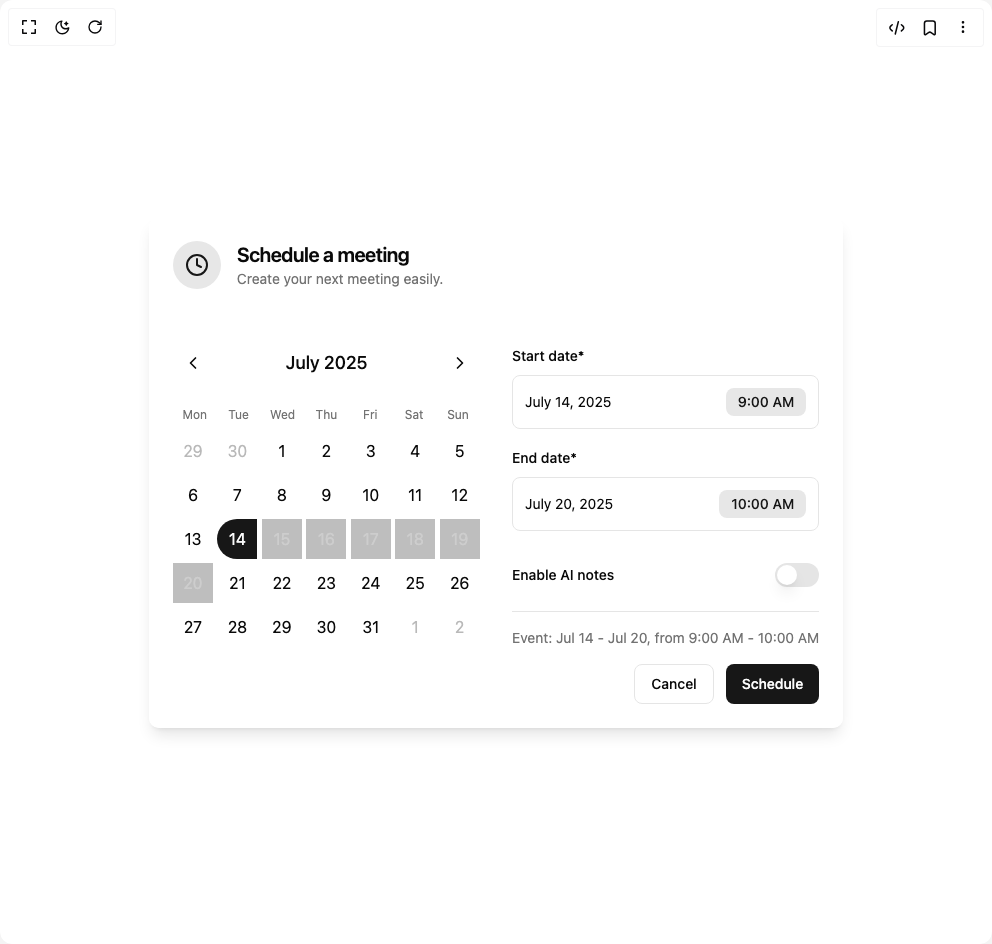

# Build Meeting Scheduler in BuilderStudio

> Build this component in our Agentic IDE: [BuilderStudio](https://builderstudio.dev).
>
> Join the BuilderStudio community on [Discord](https://discord.gg/QdWeSGCqfe) and [Reddit](https://reddit.com/r/builderstudio).



## Component

- Author group: `kavikatiyar`
- Component: `meeting-scheduler`
- Variant: `default`
- Rendered HTML snapshot: [`rendered.html`](rendered.html)

## BuilderStudio prompt

You are implementing a React component based on a component reference.

## Component identity

- Author: kavikatiyar
- Component slug: meeting-scheduler
- Demo slug: default
- Title: meeting-scheduler
- Description: 

## Goal

Recreate this component in a React + TypeScript + Tailwind CSS project. Preserve the visual layout, spacing, colors, border radius, shadows, interaction behavior, animation behavior, responsive behavior, and dark mode behavior shown in the rendered demo.

## Implementation requirements

- Use React and TypeScript.
- Use Tailwind CSS classes whenever possible.
- Keep the component self-contained unless the source files require helper components.
- If the source uses CSS variables, custom CSS, animations, or keyframes, include them.
- If the source uses external packages, list and use the required packages.
- Preserve accessibility attributes, button semantics, links, keyboard behavior, and ARIA attributes when visible in the source.
- Do not replace the component with a simplified placeholder.
- Return complete production-ready code.

## Dependencies

No reference metadata available.

## Rendered DOM snapshot

This is the rendered demo HTML extracted from the live preview. Use it to verify structure, class names, visible content, and layout.

```html
<div id="root"><div class="w-screen min-h-screen flex justify-center items-center"><div class="w-screen min-h-screen flex justify-center items-center"><div class="flex items-center justify-center min-h-screen bg-background p-4"><div class="rounded-lg border text-card-foreground w-full max-w-4xl mx-auto overflow-hidden shadow-lg border-none bg-card/80 backdrop-blur-sm"><div style="opacity: 1; transform: none;"><div class="space-y-1.5 p-6 flex flex-row items-start gap-4"><div class="p-3 rounded-full bg-primary/10 text-primary"><svg xmlns="http://www.w3.org/2000/svg" width="24" height="24" viewBox="0 0 24 24" fill="none" stroke="currentColor" stroke-width="2" stroke-linecap="round" stroke-linejoin="round" class="lucide lucide-clock w-6 h-6" aria-hidden="true"><circle cx="12" cy="12" r="10"></circle><polyline points="12 6 12 12 16 14"></polyline></svg></div><div><h3 class="tracking-tight text-xl font-semibold">Schedule a meeting</h3><p class="text-sm text-muted-foreground">Create your next meeting easily.</p></div></div><div class="grid grid-cols-1 md:grid-cols-2 gap-8 p-6"><div class="flex flex-col"><div class="flex items-center justify-between mb-4"><button class="inline-flex items-center justify-center whitespace-nowrap rounded-md text-sm font-medium ring-offset-background transition-colors focus-visible:outline-none focus-visible:ring-2 focus-visible:ring-ring focus-visible:ring-offset-2 disabled:pointer-events-none disabled:opacity-50 hover:bg-accent hover:text-accent-foreground h-10 w-10" aria-label="Previous month"><svg xmlns="http://www.w3.org/2000/svg" width="24" height="24" viewBox="0 0 24 24" fill="none" stroke="currentColor" stroke-width="2" stroke-linecap="round" stroke-linejoin="round" class="lucide lucide-chevron-left w-5 h-5" aria-hidden="true"><path d="m15 18-6-6 6-6"></path></svg></button><h3 class="text-lg font-medium text-center" style="opacity: 1; transform: none;">July 2025</h3><button class="inline-flex items-center justify-center whitespace-nowrap rounded-md text-sm font-medium ring-offset-background transition-colors focus-visible:outline-none focus-visible:ring-2 focus-visible:ring-ring focus-visible:ring-offset-2 disabled:pointer-events-none disabled:opacity-50 hover:bg-accent hover:text-accent-foreground h-10 w-10" aria-label="Next month"><svg xmlns="http://www.w3.org/2000/svg" width="24" height="24" viewBox="0 0 24 24" fill="none" stroke="currentColor" stroke-width="2" stroke-linecap="round" stroke-linejoin="round" class="lucide lucide-chevron-right w-5 h-5" aria-hidden="true"><path d="m9 18 6-6-6-6"></path></svg></button></div><div class="grid grid-cols-7 text-center text-xs text-muted-foreground"><div class="py-2">Mon</div><div class="py-2">Tue</div><div class="py-2">Wed</div><div class="py-2">Thu</div><div class="py-2">Fri</div><div class="py-2">Sat</div><div class="py-2">Sun</div></div><div class="grid grid-cols-7 gap-1"><button class="relative h-10 w-10 rounded-full flex items-center justify-center transition-colors duration-200 text-muted-foreground/50" tabindex="0">29</button><button class="relative h-10 w-10 rounded-full flex items-center justify-center transition-colors duration-200 text-muted-foreground/50" tabindex="0">30</button><button class="relative h-10 w-10 rounded-full flex items-center justify-center transition-colors duration-200" tabindex="0">1</button><button class="relative h-10 w-10 rounded-full flex items-center justify-center transition-colors duration-200" tabindex="0">2</button><button class="relative h-10 w-10 rounded-full flex items-center justify-center transition-colors duration-200" tabindex="0">3</button><button class="relative h-10 w-10 rounded-full flex items-center justify-center transition-colors duration-200" tabindex="0">4</button><button class="relative h-10 w-10 rounded-full flex items-center justify-center transition-colors duration-200" tabindex="0">5</button><button class="relative h-10 w-10 rounded-full flex items-center justify-center transition-colors duration-200" tabindex="0">6</button><button class="relative h-10 w-10 rounded-full flex items-center justify-center transition-colors duration-200" tabindex="0">7</button><button class="relative h-10 w-10 rounded-full flex items-center justify-center transition-colors duration-200" tabindex="0">8</button><button class="relative h-10 w-10 rounded-full flex items-center justify-center transition-colors duration-200" tabindex="0">9</button><button class="relative h-10 w-10 rounded-full flex items-center justify-center transition-colors duration-200" tabindex="0">10</button><button class="relative h-10 w-10 rounded-full flex items-center justify-center transition-colors duration-200" tabindex="0">11</button><button class="relative h-10 w-10 rounded-full flex items-center justify-center transition-colors duration-200" tabindex="0">12</button><button class="relative h-10 w-10 rounded-full flex items-center justify-center transition-colors duration-200" tabindex="0">13</button><button class="relative h-10 w-10 rounded-full flex items-center justify-center transition-colors duration-200 bg-primary text-primary-foreground rounded-r-none" tabindex="0">14</button><button class="relative h-10 w-10 flex items-center justify-center transition-colors duration-200 bg-primary/10 text-primary-foreground rounded-none" tabindex="0">15<div class="absolute inset-0 bg-primary/20"></div></button><button class="relative h-10 w-10 flex items-center justify-center transition-colors duration-200 bg-primary/10 text-primary-foreground rounded-none" tabindex="0">16<div class="absolute inset-0 bg-primary/20"></div></button><button class="relative h-10 w-10 flex items-center justify-center transition-colors duration-200 bg-primary/10 text-primary-foreground rounded-none" tabindex="0">17<div class="absolute inset-0 bg-primary/20"></div></button><button class="relative h-10 w-10 flex items-center justify-center transition-colors duration-200 bg-primary/10 text-primary-foreground rounded-none" tabindex="0">18<div class="absolute inset-0 bg-primary/20"></div></button><button class="relative h-10 w-10 flex items-center justify-center transition-colors duration-200 bg-primary/10 text-primary-foreground rounded-none" tabindex="0">19<div class="absolute inset-0 bg-primary/20"></div></button><button class="relative h-10 w-10 flex items-center justify-center transition-colors duration-200 bg-primary/10 text-primary-foreground rounded-none rounded-l-none" tabindex="0">20<div class="absolute inset-0 bg-primary/20"></div></button><button class="relative h-10 w-10 rounded-full flex items-center justify-center transition-colors duration-200" tabindex="0">21</button><button class="relative h-10 w-10 rounded-full flex items-center justify-center transition-colors duration-200" tabindex="0">22</button><button class="relative h-10 w-10 rounded-full flex items-center justify-center transition-colors duration-200" tabindex="0">23</button><button class="relative h-10 w-10 rounded-full flex items-center justify-center transition-colors duration-200" tabindex="0">24</button><button class="relative h-10 w-10 rounded-full flex items-center justify-center transition-colors duration-200" tabindex="0">25</button><button class="relative h-10 w-10 rounded-full flex items-center justify-center transition-colors duration-200" tabindex="0">26</button><button class="relative h-10 w-10 rounded-full flex items-center justify-center transition-colors duration-200" tabindex="0">27</button><button class="relative h-10 w-10 rounded-full flex items-center justify-center transition-colors duration-200" tabindex="0">28</button><button class="relative h-10 w-10 rounded-full flex items-center justify-center transition-colors duration-200" tabindex="0">29</button><button class="relative h-10 w-10 rounded-full flex items-center justify-center transition-colors duration-200" tabindex="0">30</button><button class="relative h-10 w-10 rounded-full flex items-center justify-center transition-colors duration-200" tabindex="0">31</button><button class="relative h-10 w-10 rounded-full flex items-center justify-center transition-colors duration-200 text-muted-foreground/50" tabindex="0">1</button><button class="relative h-10 w-10 rounded-full flex items-center justify-center transition-colors duration-200 text-muted-foreground/50" tabindex="0">2</button></div></div><div class="flex flex-col justify-between space-y-6"><div class="space-y-4"><div><label class="text-foreground peer-disabled:cursor-not-allowed peer-disabled:opacity-70 text-sm font-medium" for="start-date">Start date*</label><div class="flex items-center mt-2 p-3 rounded-md border bg-background"><span class="text-sm flex-grow">July 14, 2025</span><span class="text-sm text-primary font-medium bg-primary/10 px-3 py-1 rounded-md">9:00 AM</span></div></div><div><label class="text-foreground peer-disabled:cursor-not-allowed peer-disabled:opacity-70 text-sm font-medium" for="end-date">End date*</label><div class="flex items-center mt-2 p-3 rounded-md border bg-background"><span class="text-sm flex-grow">July 20, 2025</span><span class="text-sm text-primary font-medium bg-primary/10 px-3 py-1 rounded-md">10:00 AM</span></div></div><div class="flex items-center justify-between pt-4"><label class="text-sm leading-4 text-foreground peer-disabled:cursor-not-allowed peer-disabled:opacity-70 font-medium" for="ai-notes">Enable AI notes</label><button type="button" role="switch" aria-checked="false" data-state="unchecked" value="on" class="peer inline-flex h-6 w-11 shrink-0 cursor-pointer items-center rounded-full border-2 border-transparent transition-colors focus-visible:outline-none focus-visible:ring-2 focus-visible:ring-ring focus-visible:ring-offset-2 focus-visible:ring-offset-background disabled:cursor-not-allowed disabled:opacity-50 data-[state=checked]:bg-primary data-[state=unchecked]:bg-input" id="ai-notes"><span data-state="unchecked" class="pointer-events-none block h-5 w-5 rounded-full bg-background shadow-lg ring-0 transition-transform data-[state=checked]:translate-x-5 data-[state=unchecked]:translate-x-0"></span></button></div></div><div class="pt-4 border-t"><p class="text-sm text-muted-foreground mb-4">Event: Jul 14 - Jul 20, from 9:00 AM - 10:00 AM</p><div class="flex justify-end gap-3"><button class="inline-flex items-center justify-center whitespace-nowrap rounded-md text-sm font-medium ring-offset-background transition-colors focus-visible:outline-none focus-visible:ring-2 focus-visible:ring-ring focus-visible:ring-offset-2 disabled:pointer-events-none disabled:opacity-50 border border-input bg-background hover:bg-accent hover:text-accent-foreground h-10 px-4 py-2">Cancel</button><button class="inline-flex items-center justify-center whitespace-nowrap rounded-md text-sm font-medium ring-offset-background transition-colors focus-visible:outline-none focus-visible:ring-2 focus-visible:ring-ring focus-visible:ring-offset-2 disabled:pointer-events-none disabled:opacity-50 bg-primary text-primary-foreground hover:bg-primary/90 h-10 px-4 py-2">Schedule</button></div></div></div></div></div></div></div></div></div></div>
```

## Reference source files

No reference source files were available.
