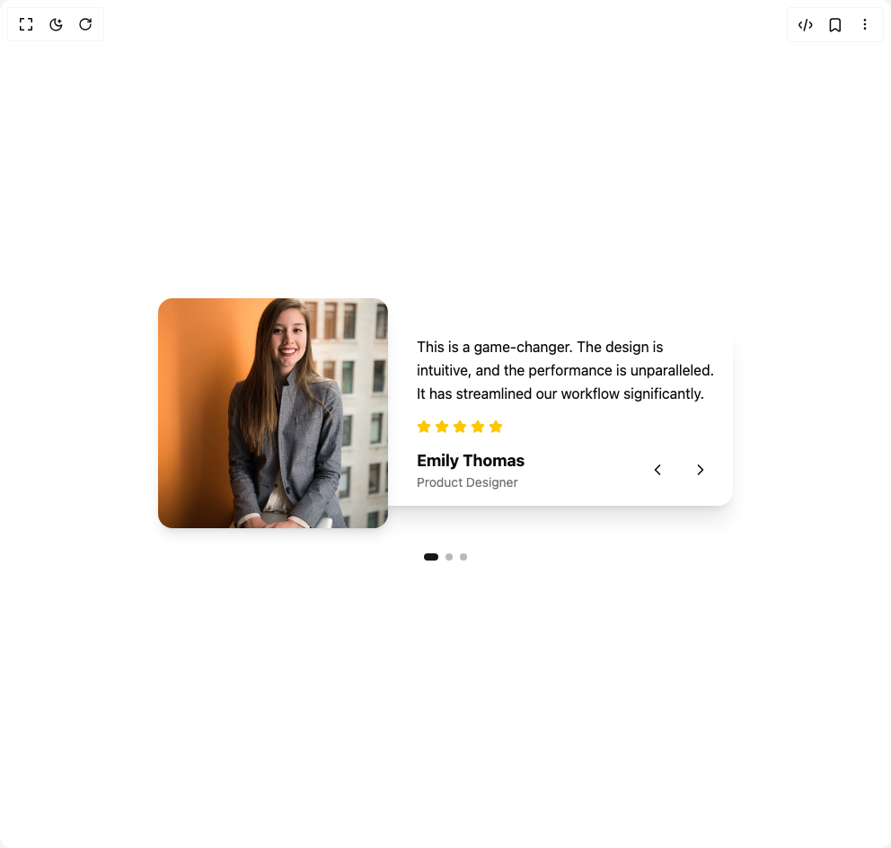

# Build Testimonial Slider in BuilderStudio

> Build this component in our Agentic IDE: [BuilderStudio](https://builderstudio.dev).
>
> Join the BuilderStudio community on [Discord](https://discord.gg/QdWeSGCqfe) and [Reddit](https://reddit.com/r/builderstudio).



## Component

- Author group: `kavikatiyar`
- Component: `testimonial-slider`
- Variant: `default`
- Rendered HTML snapshot: [`rendered.html`](rendered.html)

## BuilderStudio prompt

You are implementing a React component based on a component reference.

## Component identity

- Author: kavikatiyar
- Component slug: testimonial-slider
- Demo slug: default
- Title: testimonial-slider
- Description: 

## Goal

Recreate this component in a React + TypeScript + Tailwind CSS project. Preserve the visual layout, spacing, colors, border radius, shadows, interaction behavior, animation behavior, responsive behavior, and dark mode behavior shown in the rendered demo.

## Implementation requirements

- Use React and TypeScript.
- Use Tailwind CSS classes whenever possible.
- Keep the component self-contained unless the source files require helper components.
- If the source uses CSS variables, custom CSS, animations, or keyframes, include them.
- If the source uses external packages, list and use the required packages.
- Preserve accessibility attributes, button semantics, links, keyboard behavior, and ARIA attributes when visible in the source.
- Do not replace the component with a simplified placeholder.
- Return complete production-ready code.

## Dependencies

No reference metadata available.

## Rendered DOM snapshot

This is the rendered demo HTML extracted from the live preview. Use it to verify structure, class names, visible content, and layout.

```html
<div id="root"><div class="w-screen min-h-screen flex justify-center items-center"><div class="w-screen min-h-screen flex justify-center items-center"><div class="flex items-center justify-center w-full min-h-[450px] bg-background p-4"><div class="relative w-full max-w-2xl mx-auto overflow-hidden"><div class="relative min-h-[350px] md:min-h-[280px] flex items-center justify-center"><div class="absolute w-full h-full" style="opacity: 1; transform: none;"><div class="flex flex-col md:flex-row items-center justify-center w-full h-full p-4"><div class="relative w-48 h-48 md:w-64 md:h-64 flex-shrink-0 mb-4 md:mb-0 md:mr-[-4rem] z-10"></div><div class="relative w-full bg-card text-card-foreground rounded-2xl shadow-xl pt-8 md:pt-4 pl-4 md:pl-24 pr-4 pb-4"><svg xmlns="http://www.w3.org/2000/svg" width="24" height="24" viewBox="0 0 24 24" fill="none" stroke="currentColor" stroke-width="2" stroke-linecap="round" stroke-linejoin="round" class="lucide lucide-quote absolute top-4 left-4 h-8 w-8 text-primary/20" aria-hidden="true"><path d="M16 3a2 2 0 0 0-2 2v6a2 2 0 0 0 2 2 1 1 0 0 1 1 1v1a2 2 0 0 1-2 2 1 1 0 0 0-1 1v2a1 1 0 0 0 1 1 6 6 0 0 0 6-6V5a2 2 0 0 0-2-2z"></path><path d="M5 3a2 2 0 0 0-2 2v6a2 2 0 0 0 2 2 1 1 0 0 1 1 1v1a2 2 0 0 1-2 2 1 1 0 0 0-1 1v2a1 1 0 0 0 1 1 6 6 0 0 0 6-6V5a2 2 0 0 0-2-2z"></path></svg><blockquote class="text-sm md:text-base mb-4 leading-relaxed">This is a game-changer. The design is intuitive, and the performance is unparalleled. It has streamlined our workflow significantly.</blockquote><div class="flex items-center gap-1 mb-4"><svg xmlns="http://www.w3.org/2000/svg" width="24" height="24" viewBox="0 0 24 24" fill="none" stroke="currentColor" stroke-width="2" stroke-linecap="round" stroke-linejoin="round" class="lucide lucide-star h-4 w-4 text-yellow-400 fill-yellow-400" aria-hidden="true"><path d="M11.525 2.295a.53.53 0 0 1 .95 0l2.31 4.679a2.123 2.123 0 0 0 1.595 1.16l5.166.756a.53.53 0 0 1 .294.904l-3.736 3.638a2.123 2.123 0 0 0-.611 1.878l.882 5.14a.53.53 0 0 1-.771.56l-4.618-2.428a2.122 2.122 0 0 0-1.973 0L6.396 21.01a.53.53 0 0 1-.77-.56l.881-5.139a2.122 2.122 0 0 0-.611-1.879L2.16 9.795a.53.53 0 0 1 .294-.906l5.165-.755a2.122 2.122 0 0 0 1.597-1.16z"></path></svg><svg xmlns="http://www.w3.org/2000/svg" width="24" height="24" viewBox="0 0 24 24" fill="none" stroke="currentColor" stroke-width="2" stroke-linecap="round" stroke-linejoin="round" class="lucide lucide-star h-4 w-4 text-yellow-400 fill-yellow-400" aria-hidden="true"><path d="M11.525 2.295a.53.53 0 0 1 .95 0l2.31 4.679a2.123 2.123 0 0 0 1.595 1.16l5.166.756a.53.53 0 0 1 .294.904l-3.736 3.638a2.123 2.123 0 0 0-.611 1.878l.882 5.14a.53.53 0 0 1-.771.56l-4.618-2.428a2.122 2.122 0 0 0-1.973 0L6.396 21.01a.53.53 0 0 1-.77-.56l.881-5.139a2.122 2.122 0 0 0-.611-1.879L2.16 9.795a.53.53 0 0 1 .294-.906l5.165-.755a2.122 2.122 0 0 0 1.597-1.16z"></path></svg><svg xmlns="http://www.w3.org/2000/svg" width="24" height="24" viewBox="0 0 24 24" fill="none" stroke="currentColor" stroke-width="2" stroke-linecap="round" stroke-linejoin="round" class="lucide lucide-star h-4 w-4 text-yellow-400 fill-yellow-400" aria-hidden="true"><path d="M11.525 2.295a.53.53 0 0 1 .95 0l2.31 4.679a2.123 2.123 0 0 0 1.595 1.16l5.166.756a.53.53 0 0 1 .294.904l-3.736 3.638a2.123 2.123 0 0 0-.611 1.878l.882 5.14a.53.53 0 0 1-.771.56l-4.618-2.428a2.122 2.122 0 0 0-1.973 0L6.396 21.01a.53.53 0 0 1-.77-.56l.881-5.139a2.122 2.122 0 0 0-.611-1.879L2.16 9.795a.53.53 0 0 1 .294-.906l5.165-.755a2.122 2.122 0 0 0 1.597-1.16z"></path></svg><svg xmlns="http://www.w3.org/2000/svg" width="24" height="24" viewBox="0 0 24 24" fill="none" stroke="currentColor" stroke-width="2" stroke-linecap="round" stroke-linejoin="round" class="lucide lucide-star h-4 w-4 text-yellow-400 fill-yellow-400" aria-hidden="true"><path d="M11.525 2.295a.53.53 0 0 1 .95 0l2.31 4.679a2.123 2.123 0 0 0 1.595 1.16l5.166.756a.53.53 0 0 1 .294.904l-3.736 3.638a2.123 2.123 0 0 0-.611 1.878l.882 5.14a.53.53 0 0 1-.771.56l-4.618-2.428a2.122 2.122 0 0 0-1.973 0L6.396 21.01a.53.53 0 0 1-.77-.56l.881-5.139a2.122 2.122 0 0 0-.611-1.879L2.16 9.795a.53.53 0 0 1 .294-.906l5.165-.755a2.122 2.122 0 0 0 1.597-1.16z"></path></svg><svg xmlns="http://www.w3.org/2000/svg" width="24" height="24" viewBox="0 0 24 24" fill="none" stroke="currentColor" stroke-width="2" stroke-linecap="round" stroke-linejoin="round" class="lucide lucide-star h-4 w-4 text-yellow-400 fill-yellow-400" aria-hidden="true"><path d="M11.525 2.295a.53.53 0 0 1 .95 0l2.31 4.679a2.123 2.123 0 0 0 1.595 1.16l5.166.756a.53.53 0 0 1 .294.904l-3.736 3.638a2.123 2.123 0 0 0-.611 1.878l.882 5.14a.53.53 0 0 1-.771.56l-4.618-2.428a2.122 2.122 0 0 0-1.973 0L6.396 21.01a.53.53 0 0 1-.77-.56l.881-5.139a2.122 2.122 0 0 0-.611-1.879L2.16 9.795a.53.53 0 0 1 .294-.906l5.165-.755a2.122 2.122 0 0 0 1.597-1.16z"></path></svg></div><div class="flex items-center justify-between"><div class="pr-12"><p class="font-bold text-lg text-foreground">Emily Thomas</p><p class="text-sm text-muted-foreground">Product Designer</p></div><div class="flex items-center gap-2"><button class="inline-flex items-center justify-center rounded-full h-10 w-10 bg-background/80 hover:bg-muted transition-colors focus:outline-none focus:ring-2 focus:ring-ring focus:ring-offset-2" aria-label="Previous testimonial"><svg xmlns="http://www.w3.org/2000/svg" width="24" height="24" viewBox="0 0 24 24" fill="none" stroke="currentColor" stroke-width="2" stroke-linecap="round" stroke-linejoin="round" class="lucide lucide-chevron-left h-5 w-5" aria-hidden="true"><path d="m15 18-6-6 6-6"></path></svg></button><button class="inline-flex items-center justify-center rounded-full h-10 w-10 bg-background/80 hover:bg-muted transition-colors focus:outline-none focus:ring-2 focus:ring-ring focus:ring-offset-2" aria-label="Next testimonial"><svg xmlns="http://www.w3.org/2000/svg" width="24" height="24" viewBox="0 0 24 24" fill="none" stroke="currentColor" stroke-width="2" stroke-linecap="round" stroke-linejoin="round" class="lucide lucide-chevron-right h-5 w-5" aria-hidden="true"><path d="m9 18 6-6-6-6"></path></svg></button></div></div></div></div></div></div><div class="flex justify-center gap-2 mt-4"><button class="h-2 rounded-full transition-all duration-300 w-4 bg-primary" aria-label="Go to testimonial 1"></button><button class="h-2 w-2 rounded-full transition-all duration-300 bg-muted-foreground/50" aria-label="Go to testimonial 2"></button><button class="h-2 w-2 rounded-full transition-all duration-300 bg-muted-foreground/50" aria-label="Go to testimonial 3"></button></div></div></div></div></div></div>
```

## Reference source files

No reference source files were available.
