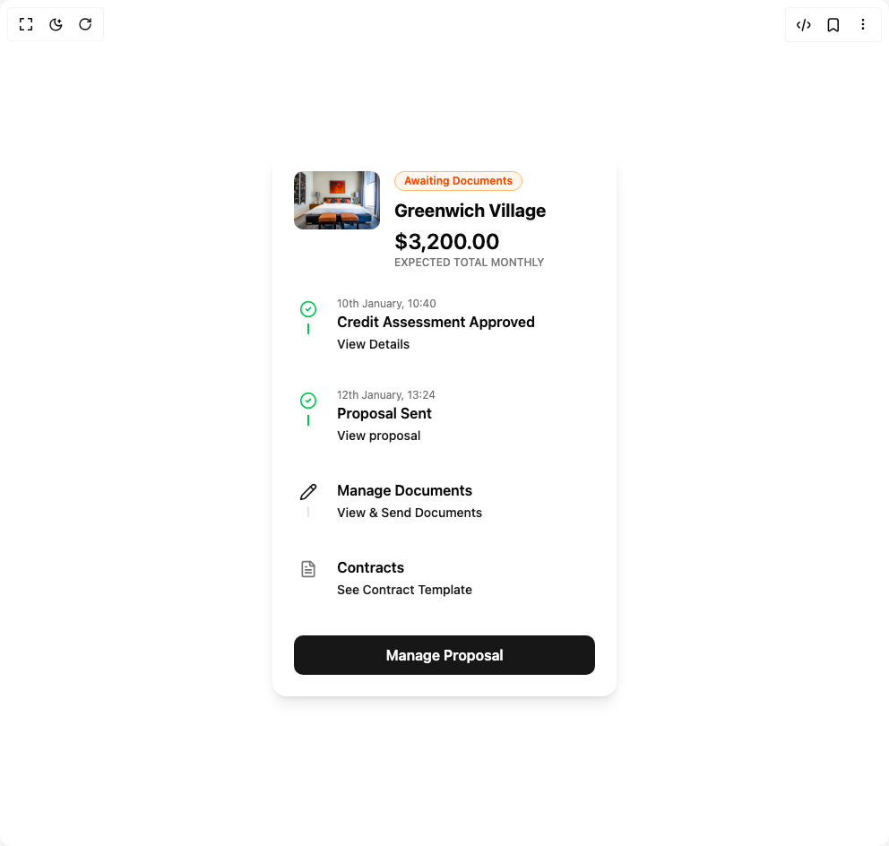

# Build Tracker Card 1 in BuilderStudio

> Build this component in our Agentic IDE: [BuilderStudio](https://builderstudio.dev).
>
> Join the BuilderStudio community on [Discord](https://discord.gg/QdWeSGCqfe) and [Reddit](https://reddit.com/r/builderstudio).



## Component

- Author group: `kavikatiyar`
- Component: `tracker-card-1`
- Variant: `default`
- Rendered HTML snapshot: [`rendered.html`](rendered.html)

## BuilderStudio prompt

You are implementing a React component based on a component reference.

## Component identity

- Author: kavikatiyar
- Component slug: tracker-card-1
- Demo slug: default
- Title: tracker-card-1
- Description: 

## Goal

Recreate this component in a React + TypeScript + Tailwind CSS project. Preserve the visual layout, spacing, colors, border radius, shadows, interaction behavior, animation behavior, responsive behavior, and dark mode behavior shown in the rendered demo.

## Implementation requirements

- Use React and TypeScript.
- Use Tailwind CSS classes whenever possible.
- Keep the component self-contained unless the source files require helper components.
- If the source uses CSS variables, custom CSS, animations, or keyframes, include them.
- If the source uses external packages, list and use the required packages.
- Preserve accessibility attributes, button semantics, links, keyboard behavior, and ARIA attributes when visible in the source.
- Do not replace the component with a simplified placeholder.
- Return complete production-ready code.

## Dependencies

No reference metadata available.

## Rendered DOM snapshot

This is the rendered demo HTML extracted from the live preview. Use it to verify structure, class names, visible content, and layout.

```html
<div id="root"><div class="w-screen min-h-screen flex justify-center items-center"><div class="w-screen min-h-screen flex justify-center items-center"><div class="flex h-full w-full items-center justify-center bg-background p-4"><div class="border text-card-foreground w-full max-w-sm overflow-hidden rounded-2xl border-none bg-card shadow-lg"><div class="flex flex-col space-y-1.5 p-0"><div class="flex items-start gap-4 p-6"><div class="relative h-24 w-24 flex-shrink-0"></div><div class="flex flex-col"><div class="inline-flex items-center rounded-full border px-2.5 py-0.5 text-xs font-semibold transition-colors focus:outline-none focus:ring-2 focus:ring-ring focus:ring-offset-2 mb-2 w-fit border-orange-300 bg-orange-50 text-orange-600">Awaiting Documents</div><h2 class="text-xl font-bold text-card-foreground">Greenwich Village</h2><p class="mt-1 text-2xl font-semibold text-card-foreground">$3,200.00</p><p class="text-xs font-medium uppercase text-muted-foreground">Expected Total Monthly</p></div></div></div><div class="p-6 pt-0 space-y-4 px-6 pb-6"><ul class="relative space-y-2" style="opacity: 1;"><li class="flex items-start gap-4" style="opacity: 1; transform: none;"><div class="relative flex flex-col items-center"><div class="z-10 mt-1 flex h-8 w-8 items-center justify-center rounded-full bg-background"><svg xmlns="http://www.w3.org/2000/svg" width="24" height="24" viewBox="0 0 24 24" fill="none" stroke="currentColor" stroke-width="2" stroke-linecap="round" stroke-linejoin="round" class="lucide lucide-circle-check h-5 w-5 text-green-500" aria-hidden="true"><circle cx="12" cy="12" r="10"></circle><path d="m9 12 2 2 4-4"></path></svg></div><div class="absolute top-9 h-[calc(100%-1.5rem)] w-0.5 bg-green-500"></div></div><div class="flex-1 pb-6 pt-1.5"><p class="text-xs text-muted-foreground">10th January, 10:40</p><p class="font-semibold text-card-foreground">Credit Assessment Approved</p><a href="#" class="text-sm font-medium text-primary hover:underline">View Details</a></div></li><li class="flex items-start gap-4" style="opacity: 1; transform: none;"><div class="relative flex flex-col items-center"><div class="z-10 mt-1 flex h-8 w-8 items-center justify-center rounded-full bg-background"><svg xmlns="http://www.w3.org/2000/svg" width="24" height="24" viewBox="0 0 24 24" fill="none" stroke="currentColor" stroke-width="2" stroke-linecap="round" stroke-linejoin="round" class="lucide lucide-circle-check h-5 w-5 text-green-500" aria-hidden="true"><circle cx="12" cy="12" r="10"></circle><path d="m9 12 2 2 4-4"></path></svg></div><div class="absolute top-9 h-[calc(100%-1.5rem)] w-0.5 bg-green-500"></div></div><div class="flex-1 pb-6 pt-1.5"><p class="text-xs text-muted-foreground">12th January, 13:24</p><p class="font-semibold text-card-foreground">Proposal Sent</p><a href="#" class="text-sm font-medium text-primary hover:underline">View proposal</a></div></li><li class="flex items-start gap-4" style="opacity: 1; transform: none;"><div class="relative flex flex-col items-center"><div class="z-10 mt-1 flex h-8 w-8 items-center justify-center rounded-full bg-background"><svg xmlns="http://www.w3.org/2000/svg" width="24" height="24" viewBox="0 0 24 24" fill="none" stroke="currentColor" stroke-width="2" stroke-linecap="round" stroke-linejoin="round" class="lucide lucide-pencil h-5 w-5 text-primary" aria-hidden="true"><path d="M21.174 6.812a1 1 0 0 0-3.986-3.987L3.842 16.174a2 2 0 0 0-.5.83l-1.321 4.352a.5.5 0 0 0 .623.622l4.353-1.32a2 2 0 0 0 .83-.497z"></path><path d="m15 5 4 4"></path></svg></div><div class="absolute top-9 h-[calc(100%-1.5rem)] w-0.5 bg-border"></div></div><div class="flex-1 pb-6 pt-1.5"><p class="font-semibold text-card-foreground">Manage Documents</p><a href="#" class="text-sm font-medium text-primary hover:underline">View &amp; Send Documents</a></div></li><li class="flex items-start gap-4" style="opacity: 1; transform: none;"><div class="relative flex flex-col items-center"><div class="z-10 mt-1 flex h-8 w-8 items-center justify-center rounded-full bg-background"><svg xmlns="http://www.w3.org/2000/svg" width="24" height="24" viewBox="0 0 24 24" fill="none" stroke="currentColor" stroke-width="2" stroke-linecap="round" stroke-linejoin="round" class="lucide lucide-file-text h-5 w-5 text-muted-foreground" aria-hidden="true"><path d="M15 2H6a2 2 0 0 0-2 2v16a2 2 0 0 0 2 2h12a2 2 0 0 0 2-2V7Z"></path><path d="M14 2v4a2 2 0 0 0 2 2h4"></path><path d="M10 9H8"></path><path d="M16 13H8"></path><path d="M16 17H8"></path></svg></div></div><div class="flex-1 pb-6 pt-1.5"><p class="font-semibold text-card-foreground">Contracts</p><a href="#" class="text-sm font-medium text-primary hover:underline">See Contract Template</a></div></li></ul><button class="inline-flex items-center justify-center whitespace-nowrap ring-offset-background transition-colors focus-visible:outline-none focus-visible:ring-2 focus-visible:ring-ring focus-visible:ring-offset-2 disabled:pointer-events-none disabled:opacity-50 bg-primary text-primary-foreground hover:bg-primary/90 h-11 px-8 w-full rounded-lg text-base font-semibold">Manage Proposal</button></div></div></div></div></div></div>
```

## Reference source files

No reference source files were available.
