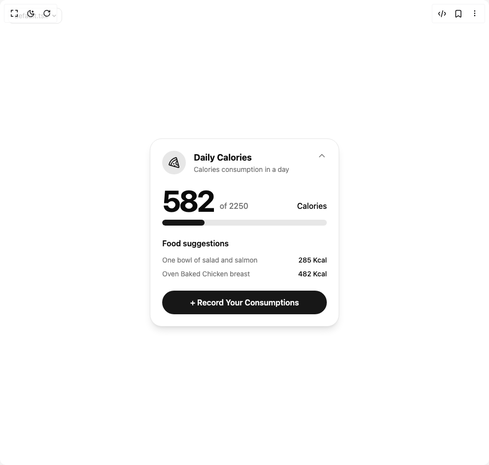

# Build Tracker Card in BuilderStudio

> Build this component in our Agentic IDE: [BuilderStudio](https://builderstudio.dev).
>
> Join the BuilderStudio community on [Discord](https://discord.gg/QdWeSGCqfe) and [Reddit](https://reddit.com/r/builderstudio).



## Component

- Author group: `kavikatiyar`
- Component: `tracker-card`
- Variant: `default`
- Rendered HTML snapshot: [`rendered.html`](rendered.html)

## BuilderStudio prompt

You are implementing a React component based on a component reference.

## Component identity

- Author: kavikatiyar
- Component slug: tracker-card
- Demo slug: default
- Title: tracker-card
- Description: 

## Goal

Recreate this component in a React + TypeScript + Tailwind CSS project. Preserve the visual layout, spacing, colors, border radius, shadows, interaction behavior, animation behavior, responsive behavior, and dark mode behavior shown in the rendered demo.

## Implementation requirements

- Use React and TypeScript.
- Use Tailwind CSS classes whenever possible.
- Keep the component self-contained unless the source files require helper components.
- If the source uses CSS variables, custom CSS, animations, or keyframes, include them.
- If the source uses external packages, list and use the required packages.
- Preserve accessibility attributes, button semantics, links, keyboard behavior, and ARIA attributes when visible in the source.
- Do not replace the component with a simplified placeholder.
- Return complete production-ready code.

## Dependencies

No reference metadata available.

## Rendered DOM snapshot

This is the rendered demo HTML extracted from the live preview. Use it to verify structure, class names, visible content, and layout.

```html
<div id="root"><div class="w-screen min-h-screen flex justify-center items-center"><div class="fixed top-4 left-4 z-10"><select class="appearance-none h-8 max-w-[200px] text-sm leading-tight rounded-lg pl-3 pr-7 py-0 border bg-background focus:outline-none focus:ring-0"><option value="default.tsx_CalorieTrackerDemo">default.tsx</option></select><div class="absolute top-1/2 transform -translate-y-1/2 right-2 pointer-events-none"><svg class="w-4 h-4 fill-current" viewBox="0 0 20 20"><path d="M5.516 7.548c.436-.446 1.043-.48 1.576 0L10 10.405l2.908-2.857c.533-.48 1.14-.446 1.576 0 .436.445.408 1.197 0 1.615l-3.734 3.705c-.533.534-1.39.534-1.923 0l-3.734-3.705c-.408-.418-.436-1.17 0-1.615z"></path></svg></div></div><div class="w-screen min-h-screen flex justify-center items-center"><div class="flex h-full w-full items-center justify-center bg-background p-4"><div class="w-full max-w-sm rounded-3xl bg-card p-6 text-card-foreground shadow-lg flex flex-col gap-6 border"><header class="flex items-start justify-between"><div class="flex items-center gap-4"><div class="grid h-12 w-12 place-items-center rounded-full bg-primary/10 text-primary"><svg xmlns="http://www.w3.org/2000/svg" width="24" height="24" viewBox="0 0 24 24" fill="none" stroke="currentColor" stroke-width="2" stroke-linecap="round" stroke-linejoin="round" class="lucide lucide-pizza h-6 w-6" aria-hidden="true"><path d="m12 14-1 1"></path><path d="m13.75 18.25-1.25 1.42"></path><path d="M17.775 5.654a15.68 15.68 0 0 0-12.121 12.12"></path><path d="M18.8 9.3a1 1 0 0 0 2.1 7.7"></path><path d="M21.964 20.732a1 1 0 0 1-1.232 1.232l-18-5a1 1 0 0 1-.695-1.232A19.68 19.68 0 0 1 15.732 2.037a1 1 0 0 1 1.232.695z"></path></svg></div><div><h2 class="font-bold text-lg">Daily Calories</h2><p class="text-sm text-muted-foreground">Calories consumption in a day</p></div></div><button class="text-muted-foreground"><svg xmlns="http://www.w3.org/2000/svg" width="24" height="24" viewBox="0 0 24 24" fill="none" stroke="currentColor" stroke-width="2" stroke-linecap="round" stroke-linejoin="round" class="lucide lucide-chevron-up h-5 w-5" aria-hidden="true"><path d="m18 15-6-6-6 6"></path></svg></button></header><div class="flex flex-col gap-2"><div class="flex items-end gap-3"><p class="text-6xl font-bold tracking-tighter">582</p><p class="mb-2 text-muted-foreground font-medium">of 2250</p><p class="mb-2 ml-auto font-medium">Calories</p></div><div class="h-3 w-full overflow-hidden rounded-full bg-primary/10"><div class="h-full rounded-full bg-primary" style="width: 25.8667%;"></div></div></div><div class="flex flex-col gap-3"><h3 class="font-semibold">Food suggestions</h3><ul class="flex flex-col gap-2"><li class="flex justify-between text-sm"><p class="text-muted-foreground">One bowl of salad and salmon</p><p class="font-medium">285 Kcal</p></li><li class="flex justify-between text-sm"><p class="text-muted-foreground">Oven Baked Chicken breast</p><p class="font-medium">482 Kcal</p></li></ul></div><button class="inline-flex items-center justify-center whitespace-nowrap ring-offset-background transition-colors focus-visible:outline-none focus-visible:ring-2 focus-visible:ring-ring focus-visible:ring-offset-2 disabled:pointer-events-none disabled:opacity-50 bg-primary text-primary-foreground hover:bg-primary/90 h-10 px-4 w-full rounded-full py-6 text-base font-semibold">+ Record Your Consumptions</button></div></div></div></div></div>
```

## Reference source files

No reference source files were available.
