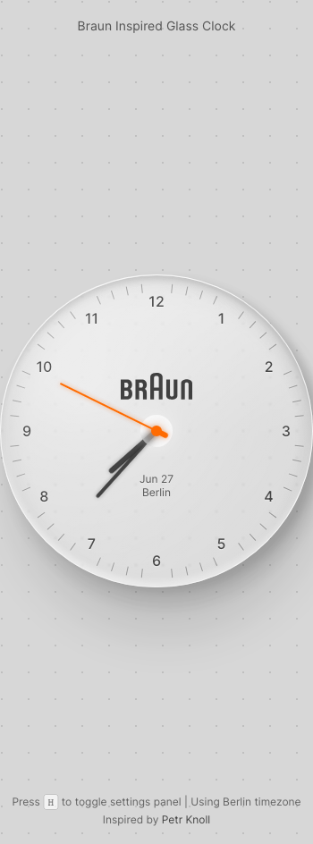

# Build Glass Clock in BuilderStudio

> Build this component in our Agentic IDE: [BuilderStudio](https://builderstudio.dev).
>
> Join the BuilderStudio community on [Discord](https://discord.gg/QdWeSGCqfe) and [Reddit](https://reddit.com/r/builderstudio).



## Component

- Author group: `kedhar`
- Component: `glass-clock`
- Variant: `default`
- Rendered HTML snapshot: [`rendered.html`](rendered.html)

## BuilderStudio prompt

You are implementing a React component based on a component reference.

## Component identity

- Author: kedhar
- Component slug: glass-clock
- Demo slug: default
- Title: glass-clock
- Description: 

## Goal

Recreate this component in a React + TypeScript + Tailwind CSS project. Preserve the visual layout, spacing, colors, border radius, shadows, interaction behavior, animation behavior, responsive behavior, and dark mode behavior shown in the rendered demo.

## Implementation requirements

- Use React and TypeScript.
- Use Tailwind CSS classes whenever possible.
- Keep the component self-contained unless the source files require helper components.
- If the source uses CSS variables, custom CSS, animations, or keyframes, include them.
- If the source uses external packages, list and use the required packages.
- Preserve accessibility attributes, button semantics, links, keyboard behavior, and ARIA attributes when visible in the source.
- Do not replace the component with a simplified placeholder.
- Return complete production-ready code.

## Dependencies

No reference metadata available.

## Rendered DOM snapshot

This is the rendered demo HTML extracted from the live preview. Use it to verify structure, class names, visible content, and layout.

```html
<div id="root"><div class="w-screen min-h-screen flex justify-center items-center"><div class="w-screen min-h-screen flex justify-center items-center"><div class="glass-clock-page"><div class="inspiration">Braun Inspired Glass Clock</div><div class="keyboard-info">Press <kbd>H</kbd> to toggle settings panel | Using Berlin timezone</div><svg width="100%" height="100%" xmlns="http://www.w3.org/2000/svg" style="position: absolute; width: 100%; height: 100%; z-index: 0;"><defs><pattern id="dottedGrid" width="30" height="30" patternUnits="userSpaceOnUse"><circle cx="2" cy="2" r="1" fill="rgba(0,0,0,0.15)"></circle></pattern></defs><rect width="100%" height="100%" fill="url(#dottedGrid)"></rect></svg><div class="glass-clock-container"><div class="glass-effect-wrapper"><div class="glass-effect-shadow" style="opacity: var(--outer-shadow-opacity);"></div><div class="glass-clock-face"><div class="glass-glossy-overlay" id="glass-glossy-overlay" style="background: linear-gradient(135deg, rgba(255, 255, 255, 0.9) 0%, rgba(255, 255, 255, 0.7) 15%, rgba(255, 255, 255, 0.5) 25%, rgba(255, 255, 255, 0.3) 50%, rgba(255, 255, 255, 0.2) 75%, rgba(255, 255, 255, 0.1) 100%); filter: blur(10px);"></div><div class="glass-edge-highlight"></div><div class="glass-edge-highlight-outer"></div><div class="glass-edge-shadow"></div><div class="glass-dark-edge"></div><div class="glass-reflection"></div><div class="glass-reflection-overlay" id="glass-reflection-overlay" style="transform: rotate(-15deg); filter: blur(10px);"></div><div class="clock-hour-marks"><div class="clock-number" style="left: 160px; top: 20px;">12</div><div class="minute-marker" style="transform: rotate(6deg);"></div><div class="minute-marker" style="transform: rotate(12deg);"></div><div class="minute-marker" style="transform: rotate(18deg);"></div><div class="minute-marker" style="transform: rotate(24deg);"></div><div class="clock-number" style="left: 232.5px; top: 39.4263px;">1</div><div class="minute-marker" style="transform: rotate(36deg);"></div><div class="minute-marker" style="transform: rotate(42deg);"></div><div class="minute-marker" style="transform: rotate(48deg);"></div><div class="minute-marker" style="transform: rotate(54deg);"></div><div class="clock-number" style="left: 285.574px; top: 92.5px;">2</div><div class="minute-marker" style="transform: rotate(66deg);"></div><div class="minute-marker" style="transform: rotate(72deg);"></div><div class="minute-marker" style="transform: rotate(78deg);"></div><div class="minute-marker" style="transform: rotate(84deg);"></div><div class="clock-number" style="left: 305px; top: 165px;">3</div><div class="minute-marker" style="transform: rotate(96deg);"></div><div class="minute-marker" style="transform: rotate(102deg);"></div><div class="minute-marker" style="transform: rotate(108deg);"></div><div class="minute-marker" style="transform: rotate(114deg);"></div><div class="clock-number" style="left: 285.574px; top: 237.5px;">4</div><div class="minute-marker" style="transform: rotate(126deg);"></div><div class="minute-marker" style="transform: rotate(132deg);"></div><div class="minute-marker" style="transform: rotate(138deg);"></div><div class="minute-marker" style="transform: rotate(144deg);"></div><div class="clock-number" style="left: 232.5px; top: 290.574px;">5</div><div class="minute-marker" style="transform: rotate(156deg);"></div><div class="minute-marker" style="transform: rotate(162deg);"></div><div class="minute-marker" style="transform: rotate(168deg);"></div><div class="minute-marker" style="transform: rotate(174deg);"></div><div class="clock-number" style="left: 160px; top: 310px;">6</div><div class="minute-marker" style="transform: rotate(186deg);"></div><div class="minute-marker" style="transform: rotate(192deg);"></div><div class="minute-marker" style="transform: rotate(198deg);"></div><div class="minute-marker" style="transform: rotate(204deg);"></div><div class="clock-number" style="left: 87.5px; top: 290.574px;">7</div><div class="minute-marker" style="transform: rotate(216deg);"></div><div class="minute-marker" style="transform: rotate(222deg);"></div><div class="minute-marker" style="transform: rotate(228deg);"></div><div class="minute-marker" style="transform: rotate(234deg);"></div><div class="clock-number" style="left: 34.4263px; top: 237.5px;">8</div><div class="minute-marker" style="transform: rotate(246deg);"></div><div class="minute-marker" style="transform: rotate(252deg);"></div><div class="minute-marker" style="transform: rotate(258deg);"></div><div class="minute-marker" style="transform: rotate(264deg);"></div><div class="clock-number" style="left: 15px; top: 165px;">9</div><div class="minute-marker" style="transform: rotate(276deg);"></div><div class="minute-marker" style="transform: rotate(282deg);"></div><div class="minute-marker" style="transform: rotate(288deg);"></div><div class="minute-marker" style="transform: rotate(294deg);"></div><div class="clock-number" style="left: 34.4263px; top: 92.5px;">10</div><div class="minute-marker" style="transform: rotate(306deg);"></div><div class="minute-marker" style="transform: rotate(312deg);"></div><div class="minute-marker" style="transform: rotate(318deg);"></div><div class="minute-marker" style="transform: rotate(324deg);"></div><div class="clock-number" style="left: 87.5px; top: 39.4263px;">11</div><div class="minute-marker" style="transform: rotate(336deg);"></div><div class="minute-marker" style="transform: rotate(342deg);"></div><div class="minute-marker" style="transform: rotate(348deg);"></div><div class="minute-marker" style="transform: rotate(354deg);"></div></div><div class="hour-hand clock-hand" style="transform: rotate(228.5deg);"></div><div class="minute-hand clock-hand" style="transform: rotate(222deg);"></div><div class="second-hand-container" style="transition: none; transform: rotate(295.926deg);"><div class="second-hand"></div><div class="second-hand-counterweight"></div></div><div class="second-hand-shadow" style="transition: none; transform: rotate(296.426deg);"></div><div class="clock-center-dot"></div><div class="clock-center-blur"></div><div class="clock-logo"></div><div class="clock-date">Jun 27</div><div class="clock-timezone">Berlin</div></div></div></div><div class="attribution">Inspired by <a href="https://codepen.io/Petr-Knoll/pen/QwWLZdx" target="_blank" rel="noreferrer">Petr Knoll</a></div><div class="tweakpane-container"><div class="tp-rotv tp-cntv tp-rotv-expanded tp-rotv-cpl"><button class="tp-rotv_b"><div class="tp-rotv_t">Clock Settings</div><div class="tp-rotv_m"></div></button><div class="tp-rotv_i"></div><div class="tp-rotv_c" style="height: auto;"><div class="tp-fldv tp-cntv tp-fldv-expanded tp-fldv-cpl tp-v-fst tp-v-vfst"><button class="tp-fldv_b"><div class="tp-fldv_t">Visibility</div><div class="tp-fldv_m"></div></button><div class="tp-fldv_i"></div><div class="tp-fldv_c" style="height: auto;"><div class="tp-lblv tp-v-fst tp-v-vfst"><div class="tp-lblv_l">Minute Markers</div><div class="tp-lblv_v"><div class="tp-sldtxtv"><div class="tp-sldtxtv_s"><div class="tp-sldv"><div class="tp-sldv_t" tabindex="0"><div class="tp-sldv_k" style="width: 100%;"></div></div></div></div><div class="tp-sldtxtv_t"><div class="tp-txtv tp-txtv-num"><input class="tp-txtv_i" type="text"><div class="tp-txtv_k"><svg class="tp-txtv_g"><path class="tp-txtv_gb"></path><path class="tp-txtv_gh"></path></svg><div class="tp-ttv"></div></div></div></div></div></div></div><div class="tp-lblv"><div class="tp-lblv_l">Reflection</div><div class="tp-lblv_v"><div class="tp-sldtxtv"><div class="tp-sldtxtv_s"><div class="tp-sldv"><div class="tp-sldv_t" tabindex="0"><div class="tp-sldv_k" style="width: 50%;"></div></div></div></div><div class="tp-sldtxtv_t"><div class="tp-txtv tp-txtv-num"><input class="tp-txtv_i" type="text"><div class="tp-txtv_k"><svg class="tp-txtv_g"><path class="tp-txtv_gb"></path><path class="tp-txtv_gh"></path></svg><div class="tp-ttv"></div></div></div></div></div></div></div><div class="tp-lblv"><div class="tp-lblv_l">Glossy Effect</div><div class="tp-lblv_v"><div class="tp-sldtxtv"><div class="tp-sldtxtv_s"><div class="tp-sldv"><div class="tp-sldv_t" tabindex="0"><div class="tp-sldv_k" style="width: 30%;"></div></div></div></div><div class="tp-sldtxtv_t"><div class="tp-txtv tp-txtv-num"><input class="tp-txtv_i" type="text"><div class="tp-txtv_k"><svg class="tp-txtv_g"><path class="tp-txtv_gb"></path><path class="tp-txtv_gh"></path></svg><div class="tp-ttv"></div></div></div></div></div></div></div><div class="tp-lblv tp-v-lst"><div class="tp-lblv_l">Show Numbers</div><div class="tp-lblv_v"><div class="tp-ckbv"><label class="tp-ckbv_l"><input class="tp-ckbv_i" type="checkbox"><div class="tp-ckbv_w"><svg><path d="M2 8l4 4l8 -8"></path></svg></div></label></div></div></div></div></div><div class="tp-fldv tp-cntv tp-fldv-expanded tp-fldv-cpl"><button class="tp-fldv_b"><div class="tp-fldv_t">Shadows</div><div class="tp-fldv_m"></div></button><div class="tp-fldv_i"></div><div class="tp-fldv_c" style="height: auto;"><div class="tp-lblv tp-v-fst"><div class="tp-lblv_l">Inner Shadow</div><div class="tp-lblv_v"><div class="tp-sldtxtv"><div class="tp-sldtxtv_s"><div class="tp-sldv"><div class="tp-sldv_t" tabindex="0"><div class="tp-sldv_k" style="width: 15%;"></div></div></div></div><div class="tp-sldtxtv_t"><div class="tp-txtv tp-txtv-num"><input class="tp-txtv_i" type="text"><div class="tp-txtv_k"><svg class="tp-txtv_g"><path class="tp-txtv_gb"></path><path class="tp-txtv_gh"></path></svg><div class="tp-ttv"></div></div></div></div></div></div></div><div class="tp-lblv"><div class="tp-lblv_l">Shadow Layer 1</div><div class="tp-lblv_v"><div class="tp-sldtxtv"><div class="tp-sldtxtv_s"><div class="tp-sldv"><div class="tp-sldv_t" tabindex="0"><div class="tp-sldv_k" style="width: 20%;"></div></div></div></div><div class="tp-sldtxtv_t"><div class="tp-txtv tp-txtv-num"><input class="tp-txtv_i" type="text"><div class="tp-txtv_k"><svg class="tp-txtv_g"><path class="tp-txtv_gb"></path><path class="tp-txtv_gh"></path></svg><div class="tp-ttv"></div></div></div></div></div></div></div><div class="tp-lblv"><div class="tp-lblv_l">Shadow Layer 2</div><div class="tp-lblv_v"><div class="tp-sldtxtv"><div class="tp-sldtxtv_s"><div class="tp-sldv"><div class="tp-sldv_t" tabindex="0"><div class="tp-sldv_k" style="width: 20%;"></div></div></div></div><div class="tp-sldtxtv_t"><div class="tp-txtv tp-txtv-num"><input class="tp-txtv_i" type="text"><div class="tp-txtv_k"><svg class="tp-txtv_g"><path class="tp-txtv_gb"></path><path class="tp-txtv_gh"></path></svg><div class="tp-ttv"></div></div></div></div></div></div></div><div class="tp-lblv tp-v-lst"><div class="tp-lblv_l">Shadow Layer 3</div><div class="tp-lblv_v"><div class="tp-sldtxtv"><div class="tp-sldtxtv_s"><div class="tp-sldv"><div class="tp-sldv_t" tabindex="0"><div class="tp-sldv_k" style="width: 20%;"></div></div></div></div><div class="tp-sldtxtv_t"><div class="tp-txtv tp-txtv-num"><input class="tp-txtv_i" type="text"><div class="tp-txtv_k"><svg class="tp-txtv_g"><path class="tp-txtv_gb"></path><path class="tp-txtv_gh"></path></svg><div class="tp-ttv"></div></div></div></div></div></div></div></div></div><div class="tp-fldv tp-cntv tp-fldv-expanded tp-fldv-cpl"><button class="tp-fldv_b"><div class="tp-fldv_t">Colors</div><div class="tp-fldv_m"></div></button><div class="tp-fldv_i"></div><div class="tp-fldv_c" style="height: auto;"><div class="tp-lblv tp-v-fst"><div class="tp-lblv_l">Hour Numbers</div><div class="tp-lblv_v"><div class="tp-colv tp-colv-cpl"><div class="tp-colv_h"><div class="tp-colv_s"><div class="tp-colswv"><div class="tp-colswv_sw" style="background-color: rgba(50, 50, 50, 0.898);"></div><button class="tp-colswv_b"></button></div></div><div class="tp-colv_t"><div class="tp-txtv"><input class="tp-txtv_i" type="text"></div></div></div><div class="tp-popv"><div class="tp-colpv"><div class="tp-colpv_hsv"><div class="tp-colpv_sv"><div class="tp-svpv" tabindex="0"><canvas height="64" width="64" class="tp-svpv_c"></canvas><div class="tp-svpv_m" style="left: 0%; top: 80.3922%;"></div></div></div><div class="tp-colpv_h"><div class="tp-hplv" tabindex="0"><div class="tp-hplv_c"></div><div class="tp-hplv_m" style="background-color: rgb(255, 0, 0); left: 0%;"></div></div></div></div><div class="tp-colpv_rgb"><div class="tp-coltxtv"><div class="tp-coltxtv_m"><select class="tp-coltxtv_ms"><option value="rgb">RGB</option><option value="hsl">HSL</option><option value="hsv">HSV</option><option value="hex">HEX</option></select><div class="tp-coltxtv_mm"><svg><path d="M5 7h6l-3 3 z"></path></svg></div></div><div class="tp-coltxtv_w"><div class="tp-coltxtv_c"><div class="tp-txtv tp-txtv-num tp-txtv-fst"><input class="tp-txtv_i" type="text"><div class="tp-txtv_k"><svg class="tp-txtv_g"><path class="tp-txtv_gb"></path><path class="tp-txtv_gh"></path></svg><div class="tp-ttv"></div></div></div></div><div class="tp-coltxtv_c"><div class="tp-txtv tp-txtv-num tp-txtv-mid"><input class="tp-txtv_i" type="text"><div class="tp-txtv_k"><svg class="tp-txtv_g"><path class="tp-txtv_gb"></path><path class="tp-txtv_gh"></path></svg><div class="tp-ttv"></div></div></div></div><div class="tp-coltxtv_c"><div class="tp-txtv tp-txtv-num tp-txtv-lst"><input class="tp-txtv_i" type="text"><div class="tp-txtv_k"><svg class="tp-txtv_g"><path class="tp-txtv_gb"></path><path class="tp-txtv_gh"></path></svg><div class="tp-ttv"></div></div></div></div></div></div></div><div class="tp-colpv_a"><div class="tp-colpv_ap"><div class="tp-aplv" tabindex="0"><div class="tp-aplv_b"><div class="tp-aplv_c" style="background: linear-gradient(to right, rgba(50, 50, 50, 0), rgb(50, 50, 50));"></div></div><div class="tp-aplv_m" style="left: 90%;"><div class="tp-aplv_p" style="background-color: rgba(50, 50, 50, 0.9);"></div></div></div></div><div class="tp-colpv_at"><div class="tp-txtv tp-txtv-num"><input class="tp-txtv_i" type="text"><div class="tp-txtv_k"><svg class="tp-txtv_g"><path class="tp-txtv_gb"></path><path class="tp-txtv_gh"></path></svg><div class="tp-ttv"></div></div></div></div></div></div></div></div></div></div><div class="tp-lblv"><div class="tp-lblv_l">Minute Markers</div><div class="tp-lblv_v"><div class="tp-colv tp-colv-cpl"><div class="tp-colv_h"><div class="tp-colv_s"><div class="tp-colswv"><div class="tp-colswv_sw" style="background-color: rgba(80, 80, 80, 0.498);"></div><button class="tp-colswv_b"></button></div></div><div class="tp-colv_t"><div class="tp-txtv"><input class="tp-txtv_i" type="text"></div></div></div><div class="tp-popv"><div class="tp-colpv"><div class="tp-colpv_hsv"><div class="tp-colpv_sv"><div class="tp-svpv" tabindex="0"><canvas height="64" width="64" class="tp-svpv_c"></canvas><div class="tp-svpv_m" style="left: 0%; top: 68.6275%;"></div></div></div><div class="tp-colpv_h"><div class="tp-hplv" tabindex="0"><div class="tp-hplv_c"></div><div class="tp-hplv_m" style="background-color: rgb(255, 0, 0); left: 0%;"></div></div></div></div><div class="tp-colpv_rgb"><div class="tp-coltxtv"><div class="tp-coltxtv_m"><select class="tp-coltxtv_ms"><option value="rgb">RGB</option><option value="hsl">HSL</option><option value="hsv">HSV</option><option value="hex">HEX</option></select><div class="tp-coltxtv_mm"><svg><path d="M5 7h6l-3 3 z"></path></svg></div></div><div class="tp-coltxtv_w"><div class="tp-coltxtv_c"><div class="tp-txtv tp-txtv-num tp-txtv-fst"><input class="tp-txtv_i" type="text"><div class="tp-txtv_k"><svg class="tp-txtv_g"><path class="tp-txtv_gb"></path><path class="tp-txtv_gh"></path></svg><div class="tp-ttv"></div></div></div></div><div class="tp-coltxtv_c"><div class="tp-txtv tp-txtv-num tp-txtv-mid"><input class="tp-txtv_i" type="text"><div class="tp-txtv_k"><svg class="tp-txtv_g"><path class="tp-txtv_gb"></path><path class="tp-txtv_gh"></path></svg><div class="tp-ttv"></div></div></div></div><div class="tp-coltxtv_c"><div class="tp-txtv tp-txtv-num tp-txtv-lst"><input class="tp-txtv_i" type="text"><div class="tp-txtv_k"><svg class="tp-txtv_g"><path class="tp-txtv_gb"></path><path class="tp-txtv_gh"></path></svg><div class="tp-ttv"></div></div></div></div></div></div></div><div class="tp-colpv_a"><div class="tp-colpv_ap"><div class="tp-aplv" tabindex="0"><div class="tp-aplv_b"><div class="tp-aplv_c" style="background: linear-gradient(to right, rgba(80, 80, 80, 0), rgb(80, 80, 80));"></div></div><div class="tp-aplv_m" style="left: 50%;"><div class="tp-aplv_p" style="background-color: rgba(80, 80, 80, 0.5);"></div></div></div></div><div class="tp-colpv_at"><div class="tp-txtv tp-txtv-num"><input class="tp-txtv_i" type="text"><div class="tp-txtv_k"><svg class="tp-txtv_g"><path class="tp-txtv_gb"></path><path class="tp-txtv_gh"></path></svg><div class="tp-ttv"></div></div></div></div></div></div></div></div></div></div><div class="tp-lblv"><div class="tp-lblv_l">Hour/Minute Hands</div><div class="tp-lblv_v"><div class="tp-colv tp-colv-cpl"><div class="tp-colv_h"><div class="tp-colv_s"><div class="tp-colswv"><div class="tp-colswv_sw" style="background-color: rgba(50, 50, 50, 0.898);"></div><button class="tp-colswv_b"></button></div></div><div class="tp-colv_t"><div class="tp-txtv"><input class="tp-txtv_i" type="text"></div></div></div><div class="tp-popv"><div class="tp-colpv"><div class="tp-colpv_hsv"><div class="tp-colpv_sv"><div class="tp-svpv" tabindex="0"><canvas height="64" width="64" class="tp-svpv_c"></canvas><div class="tp-svpv_m" style="left: 0%; top: 80.3922%;"></div></div></div><div class="tp-colpv_h"><div class="tp-hplv" tabindex="0"><div class="tp-hplv_c"></div><div class="tp-hplv_m" style="background-color: rgb(255, 0, 0); left: 0%;"></div></div></div></div><div class="tp-colpv_rgb"><div class="tp-coltxtv"><div class="tp-coltxtv_m"><select class="tp-coltxtv_ms"><option value="rgb">RGB</option><option value="hsl">HSL</option><option value="hsv">HSV</option><option value="hex">HEX</option></select><div class="tp-coltxtv_mm"><svg><path d="M5 7h6l-3 3 z"></path></svg></div></div><div class="tp-coltxtv_w"><div class="tp-coltxtv_c"><div class="tp-txtv tp-txtv-num tp-txtv-fst"><input class="tp-txtv_i" type="text"><div class="tp-txtv_k"><svg class="tp-txtv_g"><path class="tp-txtv_gb"></path><path class="tp-txtv_gh"></path></svg><div class="tp-ttv"></div></div></div></div><div class="tp-coltxtv_c"><div class="tp-txtv tp-txtv-num tp-txtv-mid"><input class="tp-txtv_i" type="text"><div class="tp-txtv_k"><svg class="tp-txtv_g"><path class="tp-txtv_gb"></path><path class="tp-txtv_gh"></path></svg><div class="tp-ttv"></div></div></div></div><div class="tp-coltxtv_c"><div class="tp-txtv tp-txtv-num tp-txtv-lst"><input class="tp-txtv_i" type="text"><div class="tp-txtv_k"><svg class="tp-txtv_g"><path class="tp-txtv_gb"></path><path class="tp-txtv_gh"></path></svg><div class="tp-ttv"></div></div></div></div></div></div></div><div class="tp-colpv_a"><div class="tp-colpv_ap"><div class="tp-aplv" tabindex="0"><div class="tp-aplv_b"><div class="tp-aplv_c" style="background: linear-gradient(to right, rgba(50, 50, 50, 0), rgb(50, 50, 50));"></div></div><div class="tp-aplv_m" style="left: 90%;"><div class="tp-aplv_p" style="background-color: rgba(50, 50, 50, 0.9);"></div></div></div></div><div class="tp-colpv_at"><div class="tp-txtv tp-txtv-num"><input class="tp-txtv_i" type="text"><div class="tp-txtv_k"><svg class="tp-txtv_g"><path class="tp-txtv_gb"></path><path class="tp-txtv_gh"></path></svg><div class="tp-ttv"></div></div></div></div></div></div></div></div></div></div><div class="tp-lblv tp-v-lst"><div class="tp-lblv_l">Second Hand</div><div class="tp-lblv_v"><div class="tp-colv tp-colv-cpl"><div class="tp-colv_h"><div class="tp-colv_s"><div class="tp-colswv"><div class="tp-colswv_sw" style="background-color: rgb(255, 107, 0);"></div><button class="tp-colswv_b"></button></div></div><div class="tp-colv_t"><div class="tp-txtv"><input class="tp-txtv_i" type="text"></div></div></div><div class="tp-popv"><div class="tp-colpv"><div class="tp-colpv_hsv"><div class="tp-colpv_sv"><div class="tp-svpv" tabindex="0"><canvas height="64" width="64" class="tp-svpv_c"></canvas><div class="tp-svpv_m" style="left: 100%; top: 0%;"></div></div></div><div class="tp-colpv_h"><div class="tp-hplv" tabindex="0"><div class="tp-hplv_c"></div><div class="tp-hplv_m" style="background-color: rgb(255, 107, 0); left: 6.99346%;"></div></div></div></div><div class="tp-colpv_rgb"><div class="tp-coltxtv"><div class="tp-coltxtv_m"><select class="tp-coltxtv_ms"><option value="rgb">RGB</option><option value="hsl">HSL</option><option value="hsv">HSV</option><option value="hex">HEX</option></select><div class="tp-coltxtv_mm"><svg><path d="M5 7h6l-3 3 z"></path></svg></div></div><div class="tp-coltxtv_w"><div class="tp-coltxtv_c"><div class="tp-txtv tp-txtv-num tp-txtv-fst"><input class="tp-txtv_i" type="text"><div class="tp-txtv_k"><svg class="tp-txtv_g"><path class="tp-txtv_gb"></path><path class="tp-txtv_gh"></path></svg><div class="tp-ttv"></div></div></div></div><div class="tp-coltxtv_c"><div class="tp-txtv tp-txtv-num tp-txtv-mid"><input class="tp-txtv_i" type="text"><div class="tp-txtv_k"><svg class="tp-txtv_g"><path class="tp-txtv_gb"></path><path class="tp-txtv_gh"></path></svg><div class="tp-ttv"></div></div></div></div><div class="tp-coltxtv_c"><div class="tp-txtv tp-txtv-num tp-txtv-lst"><input class="tp-txtv_i" type="text"><div class="tp-txtv_k"><svg class="tp-txtv_g"><path class="tp-txtv_gb"></path><path class="tp-txtv_gh"></path></svg><div class="tp-ttv"></div></div></div></div></div></div></div><div class="tp-colpv_a"><div class="tp-colpv_ap"><div class="tp-aplv" tabindex="0"><div class="tp-aplv_b"><div class="tp-aplv_c" style="background: linear-gradient(to right, rgba(255, 107, 0, 0), rgb(255, 107, 0));"></div></div><div class="tp-aplv_m" style="left: 100%;"><div class="tp-aplv_p" style="background-color: rgb(255, 107, 0);"></div></div></div></div><div class="tp-colpv_at"><div class="tp-txtv tp-txtv-num"><input class="tp-txtv_i" type="text"><div class="tp-txtv_k"><svg class="tp-txtv_g"><path class="tp-txtv_gb"></path><path class="tp-txtv_gh"></path></svg><div class="tp-ttv"></div></div></div></div></div></div></div></div></div></div></div></div><div class="tp-fldv tp-cntv tp-fldv-expanded tp-fldv-cpl"><button class="tp-fldv_b"><div class="tp-fldv_t">Effects</div><div class="tp-fldv_m"></div></button><div class="tp-fldv_i"></div><div class="tp-fldv_c" style="height: auto;"><div class="tp-lblv tp-v-fst"><div class="tp-lblv_l">Seconds Mode</div><div class="tp-lblv_v"><div class="tp-lstv"><select class="tp-lstv_s"><option>Smooth Movement</option><option>Tick Every Second</option><option>Half-Second Ticks</option><option>High-Frequency Sweep</option></select><div class="tp-lstv_m"><svg><path d="M5 7h6l-3 3 z"></path></svg></div></div></div></div><div class="tp-lblv"><div class="tp-lblv_l">Light Angle</div><div class="tp-lblv_v"><div class="tp-sldtxtv"><div class="tp-sldtxtv_s"><div class="tp-sldv"><div class="tp-sldv_t" tabindex="0"><div class="tp-sldv_k" style="width: 37.5%;"></div></div></div></div><div class="tp-sldtxtv_t"><div class="tp-txtv tp-txtv-num"><input class="tp-txtv_i" type="text"><div class="tp-txtv_k"><svg class="tp-txtv_g"><path class="tp-txtv_gb"></path><path class="tp-txtv_gh"></path></svg><div class="tp-ttv"></div></div></div></div></div></div></div><div class="tp-lblv tp-v-lst"><div class="tp-lblv_l">Dark Edge Angle</div><div class="tp-lblv_v"><div class="tp-sldtxtv"><div class="tp-sldtxtv_s"><div class="tp-sldv"><div class="tp-sldv_t" tabindex="0"><div class="tp-sldv_k" style="width: 87.5%;"></div></div></div></div><div class="tp-sldtxtv_t"><div class="tp-txtv tp-txtv-num"><input class="tp-txtv_i" type="text"><div class="tp-txtv_k"><svg class="tp-txtv_g"><path class="tp-txtv_gb"></path><path class="tp-txtv_gh"></path></svg><div class="tp-ttv"></div></div></div></div></div></div></div></div></div><div class="tp-lblv tp-lblv-nol tp-v-lst tp-v-vlst"><div class="tp-lblv_l"></div><div class="tp-lblv_v"><div class="tp-btnv"><button class="tp-btnv_b"><div class="tp-btnv_t">Reset All Settings</div></button></div></div></div></div></div></div></div></div></div></div>
```

## Reference source files

No reference source files were available.
