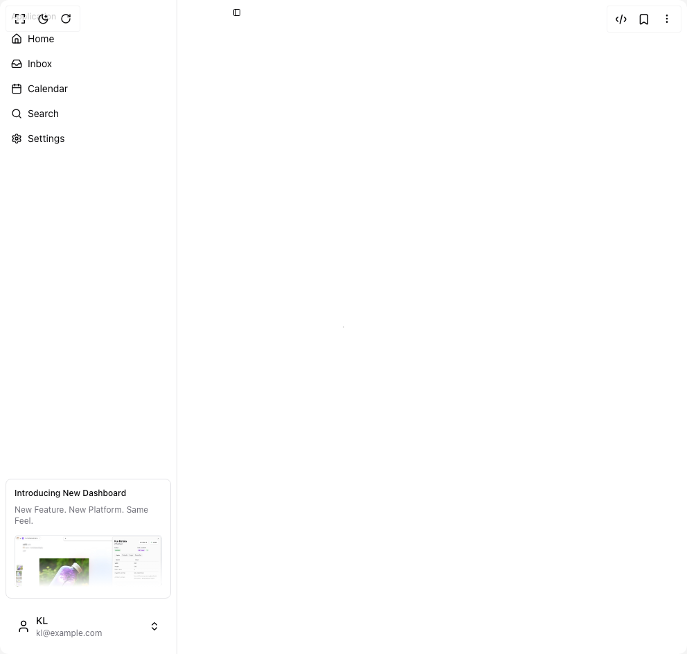
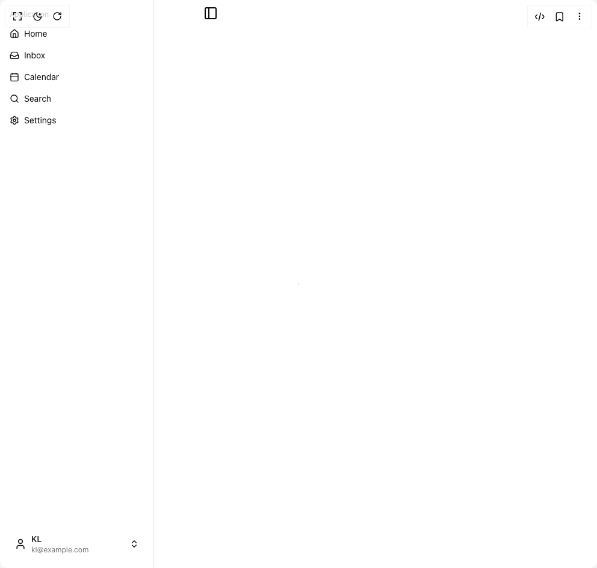
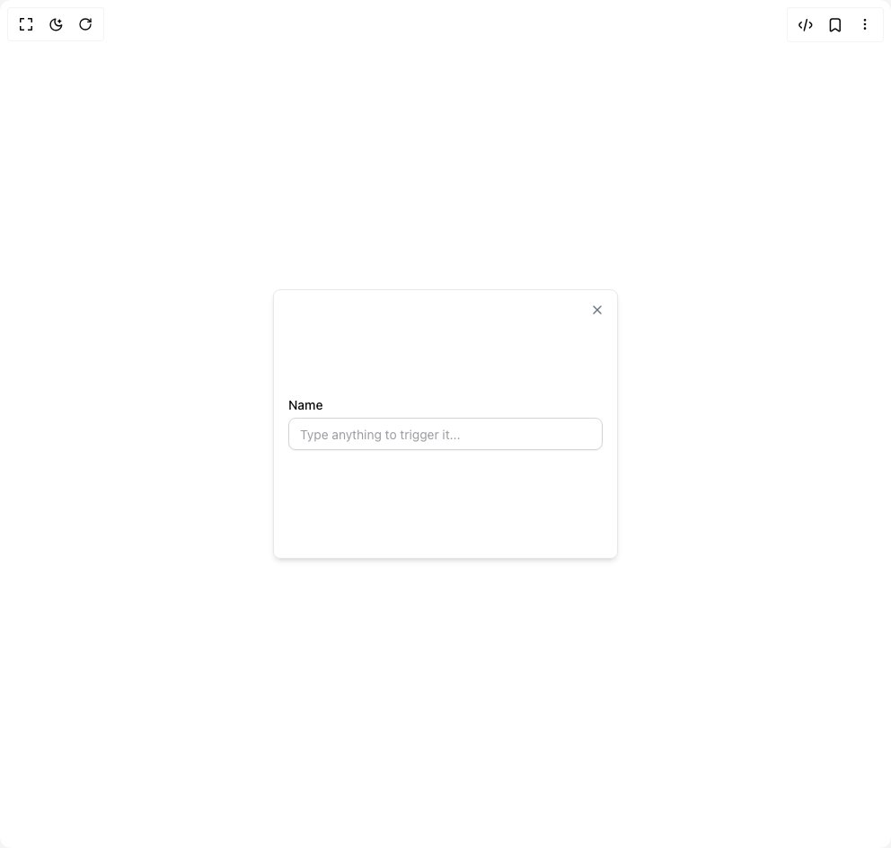

# Kl Ui Components

4 components are available in this author group.

> Build any component in [BuilderStudio](https://builderstudio.dev), then share improvements with the community on [Discord](https://discord.gg/QdWeSGCqfe) or [Reddit](https://reddit.com/r/builderstudio).

| Preview | Component | Variant |
| --- | --- | --- |
|  | [Info Card](info-card/simple/README.md) | `simple` |
|  | [Info Card](info-card/with-images/README.md) | `with-images` |
|  | [Info Card](info-card/with-video/README.md) | `with-video` |
|  | [Unsave Popup](unsave-popup/default/README.md) | `default` |
