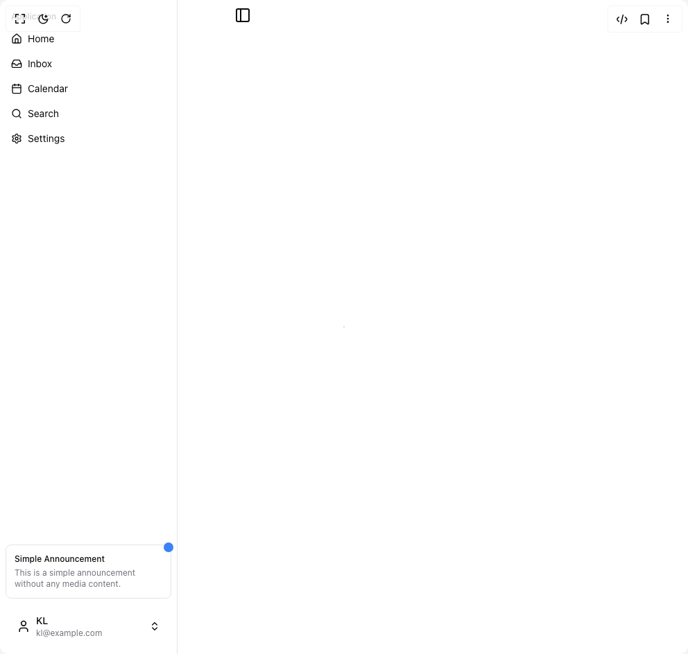

# Build Info Card in BuilderStudio

> Build this component in our Agentic IDE: [BuilderStudio](https://builderstudio.dev).
>
> Join the BuilderStudio community on [Discord](https://discord.gg/QdWeSGCqfe) and [Reddit](https://reddit.com/r/builderstudio).



## Component

- Author group: `kl-ui`
- Component: `info-card`
- Variant: `simple`
- Rendered HTML snapshot: [`rendered.html`](rendered.html)

## BuilderStudio prompt

You are implementing a React component based on a component reference.

## Component identity

- Author: KL-ui
- Component slug: info-card
- Demo slug: simple
- Title: info-card
- Description: 

## Goal

Recreate this component in a React + TypeScript + Tailwind CSS project. Preserve the visual layout, spacing, colors, border radius, shadows, interaction behavior, animation behavior, responsive behavior, and dark mode behavior shown in the rendered demo.

## Implementation requirements

- Use React and TypeScript.
- Use Tailwind CSS classes whenever possible.
- Keep the component self-contained unless the source files require helper components.
- If the source uses CSS variables, custom CSS, animations, or keyframes, include them.
- If the source uses external packages, list and use the required packages.
- Preserve accessibility attributes, button semantics, links, keyboard behavior, and ARIA attributes when visible in the source.
- Do not replace the component with a simplified placeholder.
- Return complete production-ready code.

## Dependencies

No reference metadata available.

## Rendered DOM snapshot

This is the rendered demo HTML extracted from the live preview. Use it to verify structure, class names, visible content, and layout.

```html
<div id="root"><div class="relative flex items-center justify-center h-screen w-full m-auto p-16 bg-background text-foreground"><div class="absolute lab-bg inset-0 size-full"><div class="absolute inset-0 bg-[radial-gradient(#00000021_1px,transparent_1px)] dark:bg-[radial-gradient(#ffffff22_1px,transparent_1px)]"></div></div><div class="flex w-full justify-center relative"><div class="group/sidebar-wrapper flex min-h-svh w-full has-[[data-variant=inset]]:bg-sidebar" style="--sidebar-width: 16rem; --sidebar-width-icon: 3rem;"><div class="group peer hidden md:block text-sidebar-foreground" data-state="expanded" data-collapsible="" data-variant="sidebar" data-side="left"><div class="duration-200 relative h-svh w-[--sidebar-width] bg-transparent transition-[width] ease-linear group-data-[collapsible=offcanvas]:w-0 group-data-[side=right]:rotate-180 group-data-[collapsible=icon]:w-[--sidebar-width-icon]"></div><div class="duration-200 fixed inset-y-0 z-10 hidden h-svh w-[--sidebar-width] transition-[left,right,width] ease-linear md:flex left-0 group-data-[collapsible=offcanvas]:left-[calc(var(--sidebar-width)*-1)] group-data-[collapsible=icon]:w-[--sidebar-width-icon] group-data-[side=left]:border-r group-data-[side=right]:border-l"><div data-sidebar="sidebar" class="flex h-full w-full flex-col bg-sidebar group-data-[variant=floating]:rounded-lg group-data-[variant=floating]:border group-data-[variant=floating]:border-sidebar-border group-data-[variant=floating]:shadow"><div data-sidebar="content" class="flex min-h-0 flex-1 flex-col gap-2 overflow-auto group-data-[collapsible=icon]:overflow-hidden"><div data-sidebar="group" class="relative flex w-full min-w-0 flex-col p-2"><div data-sidebar="group-label" class="duration-200 flex h-8 shrink-0 items-center rounded-md px-2 text-xs font-medium text-sidebar-foreground/70 outline-none ring-sidebar-ring transition-[margin,opacity] ease-linear focus-visible:ring-2 [&amp;&gt;svg]:size-4 [&amp;&gt;svg]:shrink-0 group-data-[collapsible=icon]:-mt-8 group-data-[collapsible=icon]:opacity-0">Application</div><div data-sidebar="group-content" class="w-full text-sm"><ul data-sidebar="menu" class="flex w-full min-w-0 flex-col gap-1"><li data-sidebar="menu-item" class="group/menu-item relative"><a href="#" data-sidebar="menu-button" data-size="default" data-active="false" class="peer/menu-button flex w-full items-center gap-2 overflow-hidden rounded-md p-2 text-left outline-none ring-sidebar-ring transition-[width,height,padding] focus-visible:ring-2 active:bg-sidebar-accent active:text-sidebar-accent-foreground disabled:pointer-events-none disabled:opacity-50 group-has-[[data-sidebar=menu-action]]/menu-item:pr-8 aria-disabled:pointer-events-none aria-disabled:opacity-50 data-[active=true]:bg-sidebar-accent data-[active=true]:font-medium data-[active=true]:text-sidebar-accent-foreground data-[state=open]:hover:bg-sidebar-accent data-[state=open]:hover:text-sidebar-accent-foreground group-data-[collapsible=icon]:!size-8 group-data-[collapsible=icon]:!p-2 [&amp;&gt;span:last-child]:truncate [&amp;&gt;svg]:size-4 [&amp;&gt;svg]:shrink-0 hover:bg-sidebar-accent hover:text-sidebar-accent-foreground h-8 text-sm"><svg xmlns="http://www.w3.org/2000/svg" width="24" height="24" viewBox="0 0 24 24" fill="none" stroke="currentColor" stroke-width="2" stroke-linecap="round" stroke-linejoin="round" class="lucide lucide-house" aria-hidden="true"><path d="M15 21v-8a1 1 0 0 0-1-1h-4a1 1 0 0 0-1 1v8"></path><path d="M3 10a2 2 0 0 1 .709-1.528l7-6a2 2 0 0 1 2.582 0l7 6A2 2 0 0 1 21 10v9a2 2 0 0 1-2 2H5a2 2 0 0 1-2-2z"></path></svg><span>Home</span></a></li><li data-sidebar="menu-item" class="group/menu-item relative"><a href="#" data-sidebar="menu-button" data-size="default" data-active="false" class="peer/menu-button flex w-full items-center gap-2 overflow-hidden rounded-md p-2 text-left outline-none ring-sidebar-ring transition-[width,height,padding] focus-visible:ring-2 active:bg-sidebar-accent active:text-sidebar-accent-foreground disabled:pointer-events-none disabled:opacity-50 group-has-[[data-sidebar=menu-action]]/menu-item:pr-8 aria-disabled:pointer-events-none aria-disabled:opacity-50 data-[active=true]:bg-sidebar-accent data-[active=true]:font-medium data-[active=true]:text-sidebar-accent-foreground data-[state=open]:hover:bg-sidebar-accent data-[state=open]:hover:text-sidebar-accent-foreground group-data-[collapsible=icon]:!size-8 group-data-[collapsible=icon]:!p-2 [&amp;&gt;span:last-child]:truncate [&amp;&gt;svg]:size-4 [&amp;&gt;svg]:shrink-0 hover:bg-sidebar-accent hover:text-sidebar-accent-foreground h-8 text-sm"><svg xmlns="http://www.w3.org/2000/svg" width="24" height="24" viewBox="0 0 24 24" fill="none" stroke="currentColor" stroke-width="2" stroke-linecap="round" stroke-linejoin="round" class="lucide lucide-inbox" aria-hidden="true"><polyline points="22 12 16 12 14 15 10 15 8 12 2 12"></polyline><path d="M5.45 5.11 2 12v6a2 2 0 0 0 2 2h16a2 2 0 0 0 2-2v-6l-3.45-6.89A2 2 0 0 0 16.76 4H7.24a2 2 0 0 0-1.79 1.11z"></path></svg><span>Inbox</span></a></li><li data-sidebar="menu-item" class="group/menu-item relative"><a href="#" data-sidebar="menu-button" data-size="default" data-active="false" class="peer/menu-button flex w-full items-center gap-2 overflow-hidden rounded-md p-2 text-left outline-none ring-sidebar-ring transition-[width,height,padding] focus-visible:ring-2 active:bg-sidebar-accent active:text-sidebar-accent-foreground disabled:pointer-events-none disabled:opacity-50 group-has-[[data-sidebar=menu-action]]/menu-item:pr-8 aria-disabled:pointer-events-none aria-disabled:opacity-50 data-[active=true]:bg-sidebar-accent data-[active=true]:font-medium data-[active=true]:text-sidebar-accent-foreground data-[state=open]:hover:bg-sidebar-accent data-[state=open]:hover:text-sidebar-accent-foreground group-data-[collapsible=icon]:!size-8 group-data-[collapsible=icon]:!p-2 [&amp;&gt;span:last-child]:truncate [&amp;&gt;svg]:size-4 [&amp;&gt;svg]:shrink-0 hover:bg-sidebar-accent hover:text-sidebar-accent-foreground h-8 text-sm"><svg xmlns="http://www.w3.org/2000/svg" width="24" height="24" viewBox="0 0 24 24" fill="none" stroke="currentColor" stroke-width="2" stroke-linecap="round" stroke-linejoin="round" class="lucide lucide-calendar" aria-hidden="true"><path d="M8 2v4"></path><path d="M16 2v4"></path><rect width="18" height="18" x="3" y="4" rx="2"></rect><path d="M3 10h18"></path></svg><span>Calendar</span></a></li><li data-sidebar="menu-item" class="group/menu-item relative"><a href="#" data-sidebar="menu-button" data-size="default" data-active="false" class="peer/menu-button flex w-full items-center gap-2 overflow-hidden rounded-md p-2 text-left outline-none ring-sidebar-ring transition-[width,height,padding] focus-visible:ring-2 active:bg-sidebar-accent active:text-sidebar-accent-foreground disabled:pointer-events-none disabled:opacity-50 group-has-[[data-sidebar=menu-action]]/menu-item:pr-8 aria-disabled:pointer-events-none aria-disabled:opacity-50 data-[active=true]:bg-sidebar-accent data-[active=true]:font-medium data-[active=true]:text-sidebar-accent-foreground data-[state=open]:hover:bg-sidebar-accent data-[state=open]:hover:text-sidebar-accent-foreground group-data-[collapsible=icon]:!size-8 group-data-[collapsible=icon]:!p-2 [&amp;&gt;span:last-child]:truncate [&amp;&gt;svg]:size-4 [&amp;&gt;svg]:shrink-0 hover:bg-sidebar-accent hover:text-sidebar-accent-foreground h-8 text-sm"><svg xmlns="http://www.w3.org/2000/svg" width="24" height="24" viewBox="0 0 24 24" fill="none" stroke="currentColor" stroke-width="2" stroke-linecap="round" stroke-linejoin="round" class="lucide lucide-search" aria-hidden="true"><path d="m21 21-4.34-4.34"></path><circle cx="11" cy="11" r="8"></circle></svg><span>Search</span></a></li><li data-sidebar="menu-item" class="group/menu-item relative"><a href="#" data-sidebar="menu-button" data-size="default" data-active="false" class="peer/menu-button flex w-full items-center gap-2 overflow-hidden rounded-md p-2 text-left outline-none ring-sidebar-ring transition-[width,height,padding] focus-visible:ring-2 active:bg-sidebar-accent active:text-sidebar-accent-foreground disabled:pointer-events-none disabled:opacity-50 group-has-[[data-sidebar=menu-action]]/menu-item:pr-8 aria-disabled:pointer-events-none aria-disabled:opacity-50 data-[active=true]:bg-sidebar-accent data-[active=true]:font-medium data-[active=true]:text-sidebar-accent-foreground data-[state=open]:hover:bg-sidebar-accent data-[state=open]:hover:text-sidebar-accent-foreground group-data-[collapsible=icon]:!size-8 group-data-[collapsible=icon]:!p-2 [&amp;&gt;span:last-child]:truncate [&amp;&gt;svg]:size-4 [&amp;&gt;svg]:shrink-0 hover:bg-sidebar-accent hover:text-sidebar-accent-foreground h-8 text-sm"><svg xmlns="http://www.w3.org/2000/svg" width="24" height="24" viewBox="0 0 24 24" fill="none" stroke="currentColor" stroke-width="2" stroke-linecap="round" stroke-linejoin="round" class="lucide lucide-settings" aria-hidden="true"><path d="M9.671 4.136a2.34 2.34 0 0 1 4.659 0 2.34 2.34 0 0 0 3.319 1.915 2.34 2.34 0 0 1 2.33 4.033 2.34 2.34 0 0 0 0 3.831 2.34 2.34 0 0 1-2.33 4.033 2.34 2.34 0 0 0-3.319 1.915 2.34 2.34 0 0 1-4.659 0 2.34 2.34 0 0 0-3.32-1.915 2.34 2.34 0 0 1-2.33-4.033 2.34 2.34 0 0 0 0-3.831A2.34 2.34 0 0 1 6.35 6.051a2.34 2.34 0 0 0 3.319-1.915"></path><circle cx="12" cy="12" r="3"></circle></svg><span>Settings</span></a></li></ul></div></div></div><div data-sidebar="footer" class="flex flex-col gap-2 p-2"><div class="group rounded-lg border bg-white p-3" style="opacity: 1; transform: none;"><div class="flex flex-col gap-1 text-xs"><div class="relative"><div class="absolute -top-4 -right-4 w-[14px] h-[14px] bg-blue-500 rounded-full animate-ping"></div><div class="absolute -top-4 -right-4 w-[14px] h-[14px] bg-blue-500 rounded-full"></div><div class="font-medium mb-1">Simple Announcement</div><div class="text-muted-foreground leading-4">This is a simple announcement without any media content.</div><div class="flex justify-between text-xs text-muted-foreground" style="opacity: 0; height: 0px;"><div class="cursor-pointer">Dismiss</div><div class=""><a href="#" class="flex flex-row items-center gap-1 underline">Read more <svg xmlns="http://www.w3.org/2000/svg" width="12" height="12" viewBox="0 0 24 24" fill="none" stroke="currentColor" stroke-width="2" stroke-linecap="round" stroke-linejoin="round" class="lucide lucide-external-link" aria-hidden="true"><path d="M15 3h6v6"></path><path d="M10 14 21 3"></path><path d="M18 13v6a2 2 0 0 1-2 2H5a2 2 0 0 1-2-2V8a2 2 0 0 1 2-2h6"></path></svg></a></div></div></div></div></div><div data-sidebar="group" class="relative flex w-full min-w-0 flex-col p-2"><button data-sidebar="menu-button" data-size="default" data-active="false" class="peer/menu-button flex items-center overflow-hidden rounded-md p-2 text-left outline-none ring-sidebar-ring transition-[width,height,padding] focus-visible:ring-2 active:bg-sidebar-accent active:text-sidebar-accent-foreground disabled:pointer-events-none disabled:opacity-50 group-has-[[data-sidebar=menu-action]]/menu-item:pr-8 aria-disabled:pointer-events-none aria-disabled:opacity-50 data-[active=true]:bg-sidebar-accent data-[active=true]:font-medium data-[active=true]:text-sidebar-accent-foreground data-[state=open]:hover:bg-sidebar-accent data-[state=open]:hover:text-sidebar-accent-foreground group-data-[collapsible=icon]:!size-8 group-data-[collapsible=icon]:!p-2 [&amp;&gt;span:last-child]:truncate [&amp;&gt;svg]:size-4 [&amp;&gt;svg]:shrink-0 hover:bg-sidebar-accent hover:text-sidebar-accent-foreground text-sm w-full justify-between gap-3 h-12"><div class="flex items-center gap-2"><svg xmlns="http://www.w3.org/2000/svg" width="24" height="24" viewBox="0 0 24 24" fill="none" stroke="currentColor" stroke-width="2" stroke-linecap="round" stroke-linejoin="round" class="lucide lucide-user h-5 w-5 rounded-md" aria-hidden="true"><path d="M19 21v-2a4 4 0 0 0-4-4H9a4 4 0 0 0-4 4v2"></path><circle cx="12" cy="7" r="4"></circle></svg><div class="flex flex-col items-start"><span class="text-sm font-medium">KL</span><span class="text-xs text-muted-foreground">kl@example.com</span></div></div><svg xmlns="http://www.w3.org/2000/svg" width="24" height="24" viewBox="0 0 24 24" fill="none" stroke="currentColor" stroke-width="2" stroke-linecap="round" stroke-linejoin="round" class="lucide lucide-chevrons-up-down h-5 w-5 rounded-md" aria-hidden="true"><path d="m7 15 5 5 5-5"></path><path d="m7 9 5-5 5 5"></path></svg></button></div></div></div></div></div><div class="px-4 py-2"><button class="inline-flex items-center justify-center whitespace-nowrap rounded-md text-sm font-medium ring-offset-background transition-colors focus-visible:outline-none focus-visible:ring-2 focus-visible:ring-ring focus-visible:ring-offset-2 disabled:pointer-events-none disabled:opacity-50 hover:bg-accent hover:text-accent-foreground h-7 w-7" data-sidebar="trigger"><svg xmlns="http://www.w3.org/2000/svg" width="24" height="24" viewBox="0 0 24 24" fill="none" stroke="currentColor" stroke-width="2" stroke-linecap="round" stroke-linejoin="round" class="lucide lucide-panel-left" aria-hidden="true"><rect width="18" height="18" x="3" y="3" rx="2"></rect><path d="M9 3v18"></path></svg><span class="sr-only">Toggle Sidebar</span></button></div></div></div></div></div>
```

## Reference source files

No reference source files were available.
