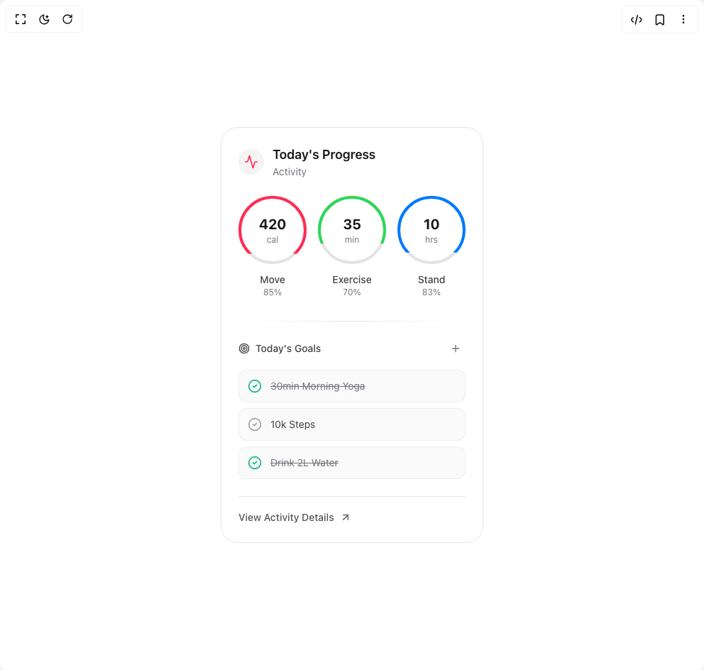

# Build Activity Card in BuilderStudio

> Build this component in our Agentic IDE: [BuilderStudio](https://builderstudio.dev).
>
> Join the BuilderStudio community on [Discord](https://discord.gg/QdWeSGCqfe) and [Reddit](https://reddit.com/r/builderstudio).



## Component

- Author group: `kokonutd`
- Component: `activity-card`
- Variant: `default`
- Rendered HTML snapshot: [`rendered.html`](rendered.html)

## BuilderStudio prompt

You are implementing a React component based on a component reference.

## Component identity

- Author: kokonutd
- Component slug: activity-card
- Demo slug: default
- Title: activity-card
- Description: 

## Goal

Recreate this component in a React + TypeScript + Tailwind CSS project. Preserve the visual layout, spacing, colors, border radius, shadows, interaction behavior, animation behavior, responsive behavior, and dark mode behavior shown in the rendered demo.

## Implementation requirements

- Use React and TypeScript.
- Use Tailwind CSS classes whenever possible.
- Keep the component self-contained unless the source files require helper components.
- If the source uses CSS variables, custom CSS, animations, or keyframes, include them.
- If the source uses external packages, list and use the required packages.
- Preserve accessibility attributes, button semantics, links, keyboard behavior, and ARIA attributes when visible in the source.
- Do not replace the component with a simplified placeholder.
- Return complete production-ready code.

## Dependencies

No reference metadata available.

## Rendered DOM snapshot

This is the rendered demo HTML extracted from the live preview. Use it to verify structure, class names, visible content, and layout.

```html
<div id="root"><div class="relative flex items-center justify-center h-screen w-full m-auto p-16 bg-background text-foreground"><div class="absolute lab-bg inset-0 size-full"><div class="absolute inset-0 bg-[radial-gradient(#00000021_1px,transparent_1px)] dark:bg-[radial-gradient(#ffffff22_1px,transparent_1px)]"></div></div><div class="flex w-full justify-center relative"><div class="p-8"><div class="max-w-md mx-auto"><div class="relative h-full rounded-3xl p-6 bg-white dark:bg-black/5 border border-zinc-200 dark:border-zinc-800 hover:border-zinc-300 dark:hover:border-zinc-700 transition-all duration-300"><div class="flex items-center gap-3 mb-6"><div class="p-2 rounded-full bg-zinc-100 dark:bg-zinc-800/50"><svg xmlns="http://www.w3.org/2000/svg" width="24" height="24" viewBox="0 0 24 24" fill="none" stroke="currentColor" stroke-width="2" stroke-linecap="round" stroke-linejoin="round" class="lucide lucide-activity w-5 h-5 text-[#FF2D55]" aria-hidden="true"><path d="M22 12h-2.48a2 2 0 0 0-1.93 1.46l-2.35 8.36a.25.25 0 0 1-.48 0L9.24 2.18a.25.25 0 0 0-.48 0l-2.35 8.36A2 2 0 0 1 4.49 12H2"></path></svg></div><div><h3 class="text-lg font-semibold text-zinc-900 dark:text-white">Today's Progress</h3><p class="text-sm text-zinc-500 dark:text-zinc-400">Activity</p></div></div><div class="grid grid-cols-3 gap-4"><div class="relative flex flex-col items-center"><div class="relative w-24 h-24"><div class="absolute inset-0 rounded-full border-4 border-zinc-200 dark:border-zinc-800/50"></div><div class="absolute inset-0 rounded-full border-4 transition-all duration-500" style="border-color: rgb(255, 45, 85); clip-path: polygon(0px 0px, 100% 0px, 100% 85%, 0px 85%);"></div><div class="absolute inset-0 flex flex-col items-center justify-center"><span class="text-xl font-bold text-zinc-900 dark:text-white">420</span><span class="text-xs text-zinc-500 dark:text-zinc-400">cal</span></div></div><span class="mt-3 text-sm font-medium text-zinc-700 dark:text-zinc-300">Move</span><span class="text-xs text-zinc-500">85%</span></div><div class="relative flex flex-col items-center"><div class="relative w-24 h-24"><div class="absolute inset-0 rounded-full border-4 border-zinc-200 dark:border-zinc-800/50"></div><div class="absolute inset-0 rounded-full border-4 transition-all duration-500" style="border-color: rgb(44, 215, 88); clip-path: polygon(0px 0px, 100% 0px, 100% 70%, 0px 70%);"></div><div class="absolute inset-0 flex flex-col items-center justify-center"><span class="text-xl font-bold text-zinc-900 dark:text-white">35</span><span class="text-xs text-zinc-500 dark:text-zinc-400">min</span></div></div><span class="mt-3 text-sm font-medium text-zinc-700 dark:text-zinc-300">Exercise</span><span class="text-xs text-zinc-500">70%</span></div><div class="relative flex flex-col items-center"><div class="relative w-24 h-24"><div class="absolute inset-0 rounded-full border-4 border-zinc-200 dark:border-zinc-800/50"></div><div class="absolute inset-0 rounded-full border-4 transition-all duration-500" style="border-color: rgb(0, 122, 255); clip-path: polygon(0px 0px, 100% 0px, 100% 83%, 0px 83%);"></div><div class="absolute inset-0 flex flex-col items-center justify-center"><span class="text-xl font-bold text-zinc-900 dark:text-white">10</span><span class="text-xs text-zinc-500 dark:text-zinc-400">hrs</span></div></div><span class="mt-3 text-sm font-medium text-zinc-700 dark:text-zinc-300">Stand</span><span class="text-xs text-zinc-500">83%</span></div></div><div class="mt-8 space-y-6"><div class="h-px bg-gradient-to-r from-transparent via-zinc-200 dark:via-zinc-800 to-transparent"></div><div class="space-y-4"><div class="flex items-center justify-between"><h4 class="flex items-center gap-2 text-sm font-medium text-zinc-700 dark:text-zinc-300"><svg xmlns="http://www.w3.org/2000/svg" width="24" height="24" viewBox="0 0 24 24" fill="none" stroke="currentColor" stroke-width="2" stroke-linecap="round" stroke-linejoin="round" class="lucide lucide-target w-4 h-4" aria-hidden="true"><circle cx="12" cy="12" r="10"></circle><circle cx="12" cy="12" r="6"></circle><circle cx="12" cy="12" r="2"></circle></svg>Today's Goals</h4><button type="button" class="p-1.5 rounded-full hover:bg-zinc-100 dark:hover:bg-zinc-800 transition-colors"><svg xmlns="http://www.w3.org/2000/svg" width="24" height="24" viewBox="0 0 24 24" fill="none" stroke="currentColor" stroke-width="2" stroke-linecap="round" stroke-linejoin="round" class="lucide lucide-plus w-4 h-4 text-zinc-500 dark:text-zinc-400" aria-hidden="true"><path d="M5 12h14"></path><path d="M12 5v14"></path></svg></button></div><div class="space-y-2"><button class="w-full flex items-center gap-3 p-3 rounded-xl bg-zinc-50 dark:bg-zinc-900/50 border border-zinc-200/50 dark:border-zinc-800/50 hover:border-zinc-300/50 dark:hover:border-zinc-700/50 transition-all"><svg xmlns="http://www.w3.org/2000/svg" width="24" height="24" viewBox="0 0 24 24" fill="none" stroke="currentColor" stroke-width="2" stroke-linecap="round" stroke-linejoin="round" class="lucide lucide-circle-check w-5 h-5 text-emerald-500" aria-hidden="true"><circle cx="12" cy="12" r="10"></circle><path d="m9 12 2 2 4-4"></path></svg><span class="text-sm text-left text-zinc-500 dark:text-zinc-400 line-through">30min Morning Yoga</span></button><button class="w-full flex items-center gap-3 p-3 rounded-xl bg-zinc-50 dark:bg-zinc-900/50 border border-zinc-200/50 dark:border-zinc-800/50 hover:border-zinc-300/50 dark:hover:border-zinc-700/50 transition-all"><svg xmlns="http://www.w3.org/2000/svg" width="24" height="24" viewBox="0 0 24 24" fill="none" stroke="currentColor" stroke-width="2" stroke-linecap="round" stroke-linejoin="round" class="lucide lucide-circle-check w-5 h-5 text-zinc-400 dark:text-zinc-600" aria-hidden="true"><circle cx="12" cy="12" r="10"></circle><path d="m9 12 2 2 4-4"></path></svg><span class="text-sm text-left text-zinc-700 dark:text-zinc-300">10k Steps</span></button><button class="w-full flex items-center gap-3 p-3 rounded-xl bg-zinc-50 dark:bg-zinc-900/50 border border-zinc-200/50 dark:border-zinc-800/50 hover:border-zinc-300/50 dark:hover:border-zinc-700/50 transition-all"><svg xmlns="http://www.w3.org/2000/svg" width="24" height="24" viewBox="0 0 24 24" fill="none" stroke="currentColor" stroke-width="2" stroke-linecap="round" stroke-linejoin="round" class="lucide lucide-circle-check w-5 h-5 text-emerald-500" aria-hidden="true"><circle cx="12" cy="12" r="10"></circle><path d="m9 12 2 2 4-4"></path></svg><span class="text-sm text-left text-zinc-500 dark:text-zinc-400 line-through">Drink 2L Water</span></button></div></div><div class="pt-4 border-t border-zinc-200 dark:border-zinc-800"><button class="inline-flex items-center gap-2 text-sm font-medium
              text-zinc-600 hover:text-zinc-900 
              dark:text-zinc-400 dark:hover:text-white
              transition-colors duration-200">View Activity Details<svg xmlns="http://www.w3.org/2000/svg" width="24" height="24" viewBox="0 0 24 24" fill="none" stroke="currentColor" stroke-width="2" stroke-linecap="round" stroke-linejoin="round" class="lucide lucide-arrow-up-right w-4 h-4" aria-hidden="true"><path d="M7 7h10v10"></path><path d="M7 17 17 7"></path></svg></button></div></div></div></div></div></div></div></div>
```

## Reference source files

No reference source files were available.
