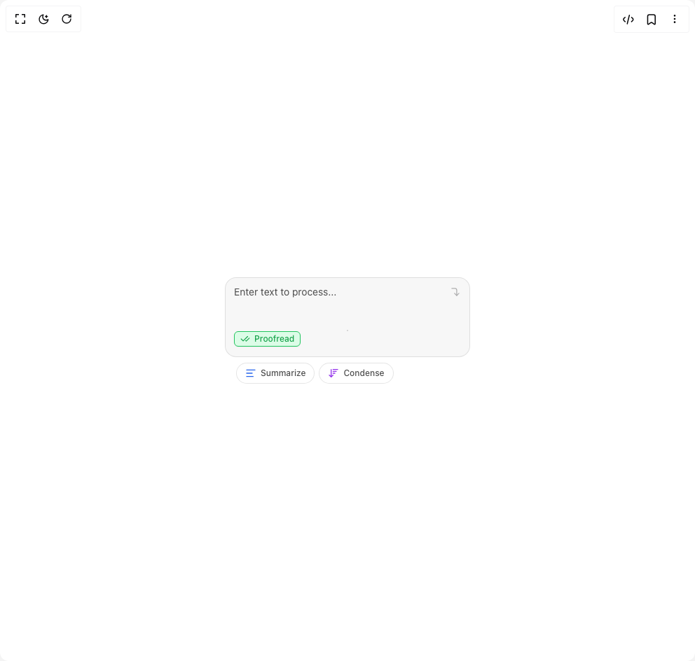

# Build Ai Input With Suggestions in BuilderStudio

> Build this component in our Agentic IDE: [BuilderStudio](https://builderstudio.dev).
>
> Join the BuilderStudio community on [Discord](https://discord.gg/QdWeSGCqfe) and [Reddit](https://reddit.com/r/builderstudio).



## Component

- Author group: `kokonutd`
- Component: `ai-input-with-suggestions`
- Variant: `default`
- Rendered HTML snapshot: [`rendered.html`](rendered.html)

## BuilderStudio prompt

You are implementing a React component based on a component reference.

## Component identity

- Author: kokonutd
- Component slug: ai-input-with-suggestions
- Demo slug: default
- Title: ai-input-with-suggestions
- Description: 

## Goal

Recreate this component in a React + TypeScript + Tailwind CSS project. Preserve the visual layout, spacing, colors, border radius, shadows, interaction behavior, animation behavior, responsive behavior, and dark mode behavior shown in the rendered demo.

## Implementation requirements

- Use React and TypeScript.
- Use Tailwind CSS classes whenever possible.
- Keep the component self-contained unless the source files require helper components.
- If the source uses CSS variables, custom CSS, animations, or keyframes, include them.
- If the source uses external packages, list and use the required packages.
- Preserve accessibility attributes, button semantics, links, keyboard behavior, and ARIA attributes when visible in the source.
- Do not replace the component with a simplified placeholder.
- Return complete production-ready code.

## Dependencies

No reference metadata available.

## Rendered DOM snapshot

This is the rendered demo HTML extracted from the live preview. Use it to verify structure, class names, visible content, and layout.

```html
<div id="root"><div class="relative flex items-center justify-center h-screen w-full m-auto p-16 bg-background text-foreground"><div class="absolute lab-bg inset-0 size-full"><div class="absolute inset-0 bg-[radial-gradient(#00000021_1px,transparent_1px)] dark:bg-[radial-gradient(#ffffff22_1px,transparent_1px)]"></div></div><div class="flex w-full justify-center relative"><div class="space-y-8 min-w-[350px]"><div><div class="w-full py-4"><div class="relative max-w-xl w-full mx-auto"><div class="relative border border-black/10 dark:border-white/10 focus-within:border-black/20 dark:focus-within:border-white/20 rounded-2xl bg-black/[0.03] dark:bg-white/[0.03]"><div class="flex flex-col"><div class="overflow-y-auto" style="max-height: 152px;"><textarea class="flex border border-input px-3 py-2 text-sm ring-offset-background focus-visible:outline-none focus-visible:ring-ring disabled:cursor-not-allowed disabled:opacity-50 max-w-xl w-full rounded-2xl pr-10 pt-3 pb-3 placeholder:text-black/70 dark:placeholder:text-white/70 border-none focus:ring text-black dark:text-white resize-none text-wrap bg-transparent focus-visible:ring-0 focus-visible:ring-offset-0 leading-[1.2] min-h-[64px]" id="ai-input-with-actions" placeholder="Enter text to process..." style="height: 64px;"></textarea></div><div class="h-12 bg-transparent"><div class="absolute left-3 bottom-3 z-10"><button type="button" class="inline-flex items-center gap-1.5 border shadow-sm rounded-md px-2 py-0.5 text-xs font-medium animate-fadeIn hover:bg-black/5 dark:hover:bg-white/5 transition-colors duration-200 bg-green-100 border-green-500"><svg xmlns="http://www.w3.org/2000/svg" width="24" height="24" viewBox="0 0 24 24" fill="none" stroke="currentColor" stroke-width="2" stroke-linecap="round" stroke-linejoin="round" class="lucide lucide-check-check w-3.5 h-3.5 text-green-600" aria-hidden="true"><path d="M18 6 7 17l-5-5"></path><path d="m22 10-7.5 7.5L13 16"></path></svg><span class="text-green-600">Proofread</span></button></div></div></div><svg xmlns="http://www.w3.org/2000/svg" width="24" height="24" viewBox="0 0 24 24" fill="none" stroke="currentColor" stroke-width="2" stroke-linecap="round" stroke-linejoin="round" class="lucide lucide-corner-right-down absolute right-3 top-3 w-4 h-4 transition-all duration-200 dark:text-white opacity-30 scale-95" aria-hidden="true"><path d="m10 15 5 5 5-5"></path><path d="M4 4h7a4 4 0 0 1 4 4v12"></path></svg></div></div><div class="flex flex-wrap gap-1.5 mt-2 max-w-xl mx-auto justify-start px-4"><button type="button" class="px-3 py-1.5 text-xs font-medium rounded-full border transition-all duration-200 border-black/10 dark:border-white/10 bg-white dark:bg-gray-900 hover:bg-black/5 dark:hover:bg-white/5 flex-shrink-0"><div class="flex items-center gap-1.5"><svg xmlns="http://www.w3.org/2000/svg" width="24" height="24" viewBox="0 0 24 24" fill="none" stroke="currentColor" stroke-width="2" stroke-linecap="round" stroke-linejoin="round" class="lucide lucide-text-align-start h-4 w-4 text-blue-600" aria-hidden="true"><path d="M21 5H3"></path><path d="M15 12H3"></path><path d="M17 19H3"></path></svg><span class="text-black/70 dark:text-white/70 whitespace-nowrap">Summarize</span></div></button><button type="button" class="px-3 py-1.5 text-xs font-medium rounded-full border transition-all duration-200 border-black/10 dark:border-white/10 bg-white dark:bg-gray-900 hover:bg-black/5 dark:hover:bg-white/5 flex-shrink-0"><div class="flex items-center gap-1.5"><svg xmlns="http://www.w3.org/2000/svg" width="24" height="24" viewBox="0 0 24 24" fill="none" stroke="currentColor" stroke-width="2" stroke-linecap="round" stroke-linejoin="round" class="lucide lucide-arrow-down-wide-narrow h-4 w-4 text-purple-600" aria-hidden="true"><path d="m3 16 4 4 4-4"></path><path d="M7 20V4"></path><path d="M11 4h10"></path><path d="M11 8h7"></path><path d="M11 12h4"></path></svg><span class="text-black/70 dark:text-white/70 whitespace-nowrap">Condense</span></div></button></div></div></div></div></div></div></div>
```

## Reference source files

No reference source files were available.
