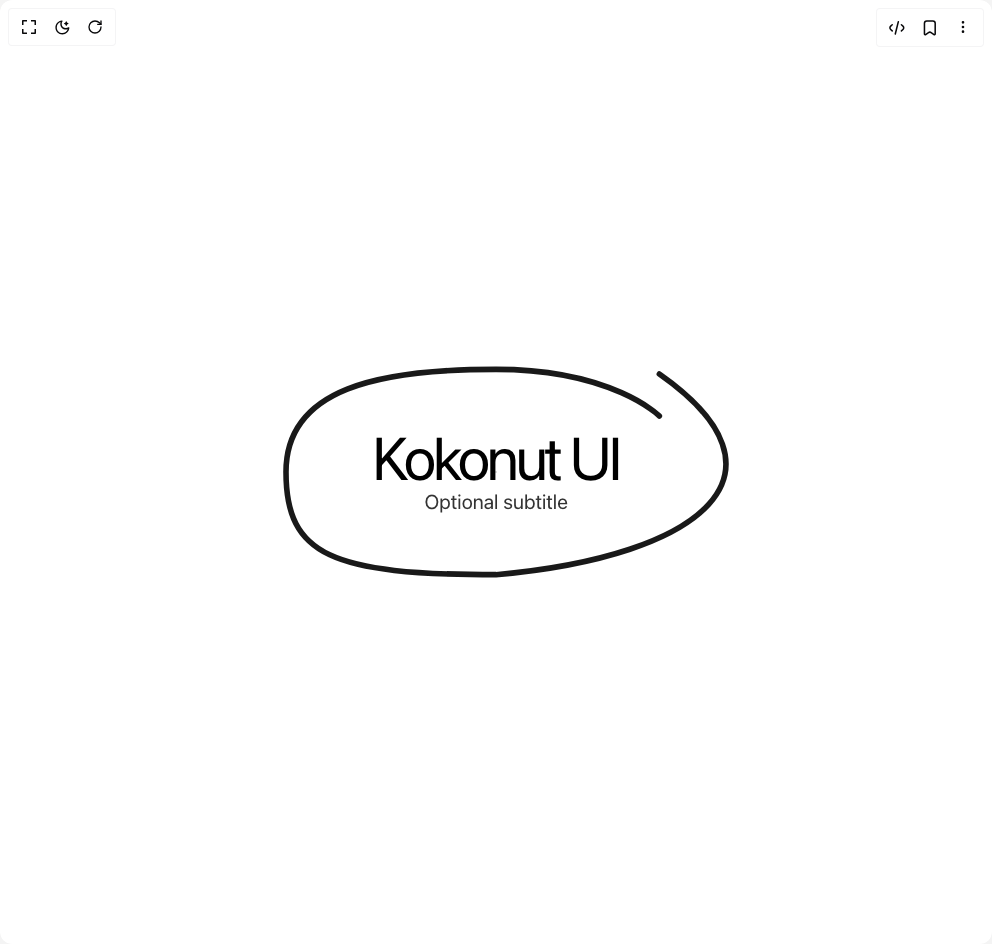

# Build Hand Writing Text in BuilderStudio

> Build this component in our Agentic IDE: [BuilderStudio](https://builderstudio.dev).
>
> Join the BuilderStudio community on [Discord](https://discord.gg/QdWeSGCqfe) and [Reddit](https://reddit.com/r/builderstudio).



## Component

- Author group: `kokonutd`
- Component: `hand-writing-text`
- Variant: `default`
- Rendered HTML snapshot: [`rendered.html`](rendered.html)

## BuilderStudio prompt

You are implementing a React component based on a component reference.

## Component identity

- Author: kokonutd
- Component slug: hand-writing-text
- Demo slug: default
- Title: hand-writing-text
- Description: 

## Goal

Recreate this component in a React + TypeScript + Tailwind CSS project. Preserve the visual layout, spacing, colors, border radius, shadows, interaction behavior, animation behavior, responsive behavior, and dark mode behavior shown in the rendered demo.

## Implementation requirements

- Use React and TypeScript.
- Use Tailwind CSS classes whenever possible.
- Keep the component self-contained unless the source files require helper components.
- If the source uses CSS variables, custom CSS, animations, or keyframes, include them.
- If the source uses external packages, list and use the required packages.
- Preserve accessibility attributes, button semantics, links, keyboard behavior, and ARIA attributes when visible in the source.
- Do not replace the component with a simplified placeholder.
- Return complete production-ready code.

## Dependencies

No reference metadata available.

## Rendered DOM snapshot

This is the rendered demo HTML extracted from the live preview. Use it to verify structure, class names, visible content, and layout.

```html
<div id="root"><div class="relative flex items-center justify-center h-screen w-full m-auto p-16 bg-background text-foreground"><div class="absolute lab-bg inset-0 size-full"><div class="absolute inset-0 bg-[radial-gradient(#00000021_1px,transparent_1px)] dark:bg-[radial-gradient(#ffffff22_1px,transparent_1px)]"></div></div><div class="flex w-full justify-center relative"><div class="relative w-full max-w-4xl mx-auto py-24"><div class="absolute inset-0"><svg width="100%" height="100%" viewBox="0 0 1200 600" class="w-full h-full"><title>KokonutUI</title><path d="M 950 90 
                           C 1250 300, 1050 480, 600 520
                           C 250 520, 150 480, 150 300
                           C 150 120, 350 80, 600 80
                           C 850 80, 950 180, 950 180" fill="none" stroke-width="12" stroke="currentColor" stroke-linecap="round" stroke-linejoin="round" class="text-black dark:text-white opacity-90" opacity="1" pathLength="1" stroke-dashoffset="0px" stroke-dasharray="1px 1px"></path></svg></div><div class="relative text-center z-10 flex flex-col items-center justify-center"><h1 class="text-4xl md:text-6xl text-black dark:text-white tracking-tighter flex items-center gap-2" style="opacity: 1; transform: none;">Kokonut UI</h1><p class="text-xl text-black/80 dark:text-white/80" style="opacity: 1;">Optional subtitle</p></div></div></div></div></div>
```

## Reference source files

No reference source files were available.
